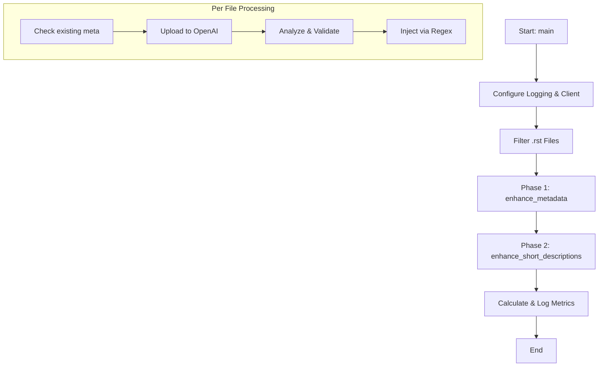
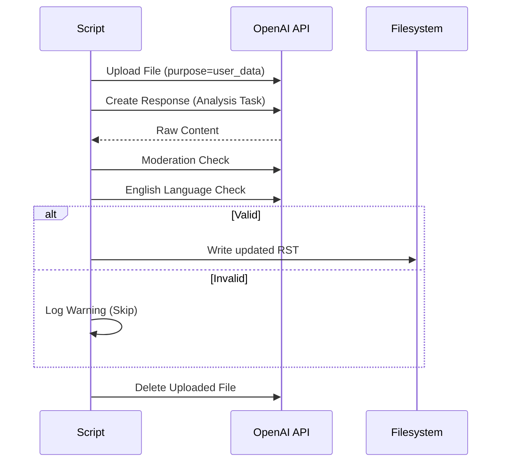

# Topic Enhancement Tools

This directory contains a suite of AI-powered tools designed to automatically enhance the ROS 2 documentation (`.rst` files) with high-quality metadata and descriptive content.

## Overview

The primary tool, `enhance_topics.py`, uses OpenAI's latest models to analyse technical articles and inject:
1.  **SEO Metadata**: `description` and `keywords` fields within a `.. meta::` directive.
2.  **Short Descriptions**: A concise summary paragraph injected into the custom `.. short-description::` directive, using Retrieval-Augmented Generation (RAG) to match the project's style.

## Orchestration Logic

The execution follows a top-to-bottom flow through several key layers:

### 1. Entry Point: `main()`
The execution starts in the `main()` function, which handles the high-level setup:
- **Logging**: Configures standard logging and silences noisy HTTP libraries (`httpx`, `httpcore`).
- **Argument Parsing**: Collects file paths from the command line and filters for `.rst` files.
- **Client Setup**: Initialises the `OpenAI` client by loading the API key from environment variables or a `.env` file.
- **Orchestration**: Executes the two main enhancement phases: `enhance_metadata()` and `enhance_short_descriptions()`.
- **Metrics**: Calculates and logs a summary of how many files were processed, how many had valid results, and how many were actually updated.

### 2. Phase 1: Metadata Enhancement (`enhance_metadata`)
This phase focuses on the `.. meta::` block:
- **Task Definition**: Creates two `EnhancementTask` objects—one for `description` and one for `keywords`.
- **Skip Logic**: Each task includes a `should_skip` check that reads the file content to see if these metadata fields already exist.
- **Analysis**: Calls `analyze_files()`, which uploads the file to OpenAI and runs the analysis.
- **Application**: Calls `update_meta_files()`, which uses the `MetadataApplyHook` to merge the new metadata into the existing (or new) `.. meta::` block in the RST file.

### 3. Phase 2: Short Description Enhancement (`enhance_short_descriptions`)
This phase uses Retrieval-Augmented Generation (RAG):
- **Vector Store Setup**: Uploads a set of "gold standard" example RST files to an OpenAI Vector Store. This allows the model to "search" for examples of good short descriptions to match the project's style.
- **Task Definition**: Creates a task for `short-description`.
- **Skip Logic**: Skips if the file already contains a `.. short-description::` directive.
- **Analysis**: Calls `analyze_files()`, where the analysis function (`analyze_with_responses`) includes the `vector_store_id` to enable the file search capability.
- **Application**: Uses the `ShortDescriptionApplyHook` to inject the generated text into the file.
- **Cleanup**: A `finally` block ensures the temporary vector store and hosted files are deleted from OpenAI.

### 4. Core Processing Engines

#### `analyze_files`
This is the central engine for interacting with the AI:
1. **File Upload**: Uploads the target RST file to OpenAI's Files API.
2. **Task Execution**: For every task that isn't skipped:
   - Calls the task's `analyze` function (wrapped in `tenacity` retries).
   - **Validation**: If a result is returned, it runs `validate_content()`, which performs a **Moderation check** (safety) and a **Language check** (ensuring the LLM actually returned English).
3. **Storage**: Valid results are stored in an `EnhanceData` object.
4. **Cleanup**: Deletes the uploaded file from OpenAI.

#### `update_enhanced_files`
This handles the file I/O and content modification:
1. **Hook Application**: Passes the file content and the AI results to an `ApplyHook` (either `MetadataApplyHook` or `ShortDescriptionApplyHook`).
2. **Regex Injection**: The hooks use utility functions (from `rst_utils.py`) to perform precise regex-based injection of the new content.
3. **Persistence**: If the content has changed, it overwrites the file and marks it as "updated" in the metrics.

### 5. Key Abstractions
- **`EnhancementTask`**: Bundles the "what" (key), "when to skip" (logic), and "how to analyze" (API call).
- **`ApplyHook`**: A strategy pattern for defining how different types of AI results should be written back to the RST format.
- **`EnhanceData`**: A state-tracking object that carries results and metrics through the various stages of the pipeline.

## Workflow Diagrams

### High-Level Orchestration


### Analysis & Validation Loop


## User Guide

### Prerequisites
1.  **API Key**: Ensure you have an `OPENAI_API_KEY` set in your environment or in a `.env` file in the repository root.
2.  **Dependencies**: Install the required Python packages:
    ```bash
    pip install -r requirements.txt -c constraints.txt
    ```

### Running via Makefile (Recommended)
The simplest way to process your recent changes is via the `Makefile`. This command automatically identifies files that have been modified or staged in Git and runs the enhancement script on them.

```bash
make enhance-topics
```

### Running Directly
You can call the script directly to process specific files or directories:

```bash
# Process a single file
python scripts/enhance_topics.py source/path/to/article.rst

# Process multiple files
python scripts/enhance_topics.py file1.rst file2.rst
```

### Configuration
Tuning constants, such as the model version (`gpt-5.4-nano`), timeouts, and prompt strings, are centrally managed in `scripts/config.py`.
