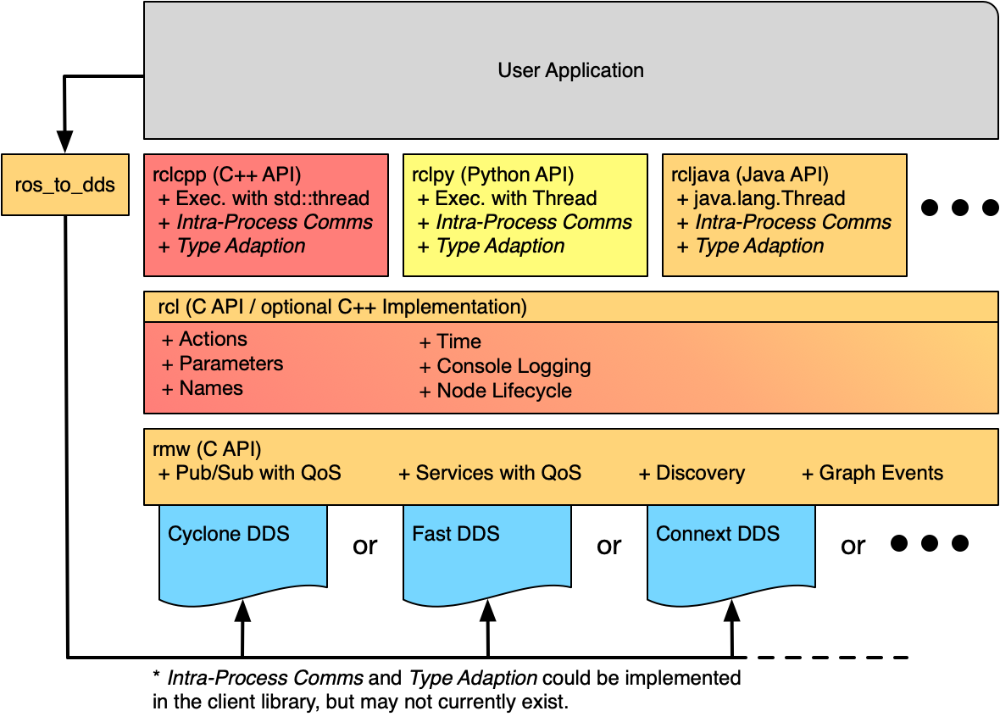
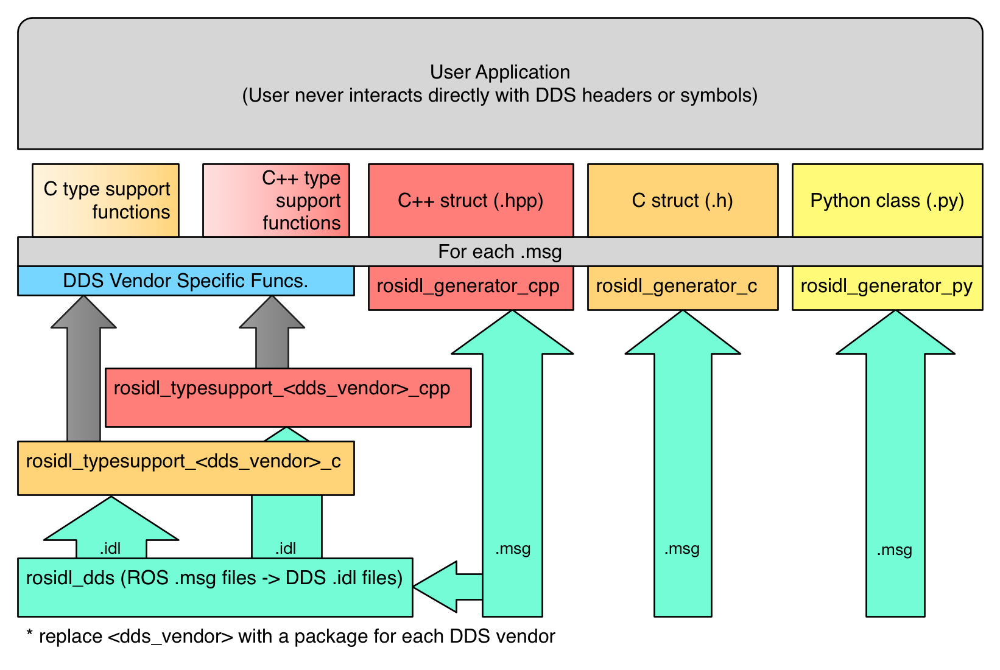
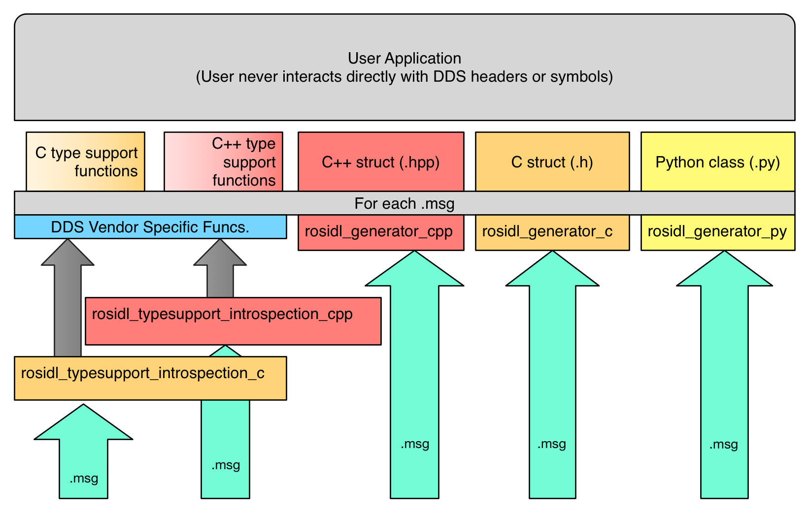

About internal ROS 2 interfaces
===============================

.. include:: ../../global_substitutions.txt

The internal ROS interfaces are public C |APIs| that are intended for use by developers who are creating |client libraries| or adding a new underlying middleware, but are not intended for use by typical ROS users.
The ROS |client libraries| provide the user facing |APIs| that most ROS users are familiar with, and may come in a variety of programming languages.

Internal API Architecture Overview
~~~~~~~~~~~~~~~~~~~~~~~~~~~~~~~~~~

There are two main internal interfaces:

- the ROS middleware interface (``rmw`` |API|)
- the ROS client library interface (``rcl`` |API|)

The ``rmw`` |API| is the interface between the ROS 2 software stack and the underlying middleware implementation.
The underlying middleware used for ROS 2 is either a DDS or RTPS implementation, and is responsible for discovery, publish and subscribe mechanics, request-reply mechanics for services, and serialization of message types.

The ``rcl`` |API| is a slightly higher level |API| which is used to implement the |client libraries| and does not touch the middleware implementation directly, but rather does so through the ROS middleware interface (``rmw`` |API|) abstraction.

As the diagram shows, these |APIs| are stacked such that the typical ROS user will use the |client library| |API|, e.g. ``rclcpp``, to implement their code (executable or library).
The implementation of the |client libraries|, e.g. ``rclcpp``, use the ``rcl`` interface which provides access to the ROS graph and graph events.
The ``rcl`` implementation in turn uses the ``rmw`` |API| to access the ROS graph.
The purpose of the ``rcl`` implementation is to provide a common implementation for more complex ROS concepts and utilities that may be used by various |client libraries|, while remaining agnostic to the underlying middleware being used.
The purpose of the ``rmw`` interface is to capture the absolute minimum middleware functionality needed to support ROS's client libraries.
Finally, the implementation of the ``rmw`` |API| is provided by a middleware implementation specific |package|, e.g. ``rmw_fastrtps_cpp``, the library of which is compiled against vendor specific DDS interfaces and types.

In the diagram above there is also a box labeled ``ros_to_dds``, and the purpose of this box is to represent a category of possible packages which allow the user to access DDS vendor specific objects and settings using the ROS equivalents.
One of the goals of this abstraction interface is to completely insulate the ROS user space code from the middleware being used, so that changing DDS vendors or even middleware technology has a minimal impact on the users code.
However, we recognize that on occasion it is useful to reach into the implementation and manually adjust settings despite the consequences that might have.
By requiring the use of one of these packages in order to access the underlying DDS vendor's objects, we can avoid exposing vendor specific symbols and headers in the normal interface.
It also makes it easy to see what code is potentially violating the vendor portability by inspecting the package's dependencies to see if one of these ``ros_to_dds`` packages are being used.

.. _Type Specific Interfaces:

Type Specific Interfaces
~~~~~~~~~~~~~~~~~~~~~~~~

All along the way there are some parts of the |APIs| that are necessarily specific to the message types being exchanged, e.g. publishing a message or subscribing to a topic, and therefore require generated code for each message type.
The following diagram layouts the path from user defined ``rosidl`` files, e.g. ``.msg`` files, to the type specific code used by the user and system to perform type specific functions:

   Figure: flow chart of "static" type support generation, from ``rosidl`` files to user facing code.

The right hand side of the diagram shows how the ``.msg`` files are passed directly to language specific code generators, e.g. ``rosidl_generator_cpp`` or ``rosidl_generator_py``.
These generators are responsible for creating the code that the user will include (or import) and use as the in-memory representation of the messages that were defined in the ``.msg`` files.
For example, consider the message ``std_msgs/String``, a user might use this file in C++ with the statement ``#include <std_msgs/msg/string.hpp>``, or they might use the statement ``from std_msgs.msg import String`` in Python.
These statements work because of the files generated by these language specific (but middleware agnostic) generator packages.

Separately, the ``.msg`` files are used to generate type support code for each type.
In this context, type support means: meta data or functions that are specific to a given type and that are used by the system to perform particular tasks for the given type.
The type support for a given message might include things like a list of the names and types for each field in the message.
It might also contain a reference to code that can perform particular tasks for that type, e.g. publish a message.

Static Type Support
^^^^^^^^^^^^^^^^^^^

When the type support references code to do particular functions for a specific message type, that code sometimes needs to do middleware specific work.
For example, consider the type specific publish function, when using "vendor A" the function will need to call some of "vendor A"'s |API|, but when using "vendor B" it will need to call "vendor B"'s |API|.
To allow for middleware vendor specific code, the user defined ``.msg`` files may result in the generation of vendor specific code.
This vendor specific code is still hidden from the user through the type support abstraction, which is similar to how the "Private Implementation" (or Pimpl) pattern works.

Static Type Support with DDS
^^^^^^^^^^^^^^^^^^^^^^^^^^^^

For middleware vendors based on DDS, and specifically those which generate code based on the OMG IDL files (``.idl`` files), the user defined ``rosidl`` files (``.msg`` files) are converted into equivalent OMG IDL files (``.idl`` files).
From these OMG IDL files, vendor specific code is created and then used within the type specific functions which are referenced by the type support for a given type.
The above diagram shows this on the left hand side, where the ``.msg`` files are consumed by the ``rosidl_dds`` package to produce ``.idl`` files, and then those ``.idl`` files are given to language specific and DDS vendor specific type support generation packages.

For example, consider the Fast DDS implementation, which has a package called ``rosidl_typesupport_fastrtps_cpp``.
This package is responsible for generating code to handle things like converting a C++ message object into a serialized octet buffer to be written over the network.
This code, while specific to Fast DDS, is still not exposed to the user because of the abstraction in the type support code.

Dynamic Type Support
^^^^^^^^^^^^^^^^^^^^

Another way to implement type support is to have generic functions for things like publishing to a topic, rather than generating a version of the function for each message type.
In order to accomplish this, this generic function needs some meta information about the message type being published, things like a list of field names and types in the order in which they appear in the message type.
Then to publish a message, you call a generic publish function and pass a message to be published along with a structure which contains the necessary meta data about the message type.
This is referred to as "dynamic" type support, as opposed to "static" type support which requires generated versions of a function for each type.

   Figure: flow chart of "dynamic" type support generation, from ``rosidl`` files to user facing code.

The above diagram shows the flow from user defined ``rosidl`` files to generated user facing code.
It is very similar to the diagram for static type support, and differs only in how the type support is generated which is represented by the left hand side of the diagram.
In dynamic type support the ``.msg`` files are converted directly into user facing code.

This code is also middleware agnostic, because it only contains meta information about the messages.
The function to actually do the work, e.g. publishing to a topic, is generic to the message type and will make any necessary calls to the middleware specific |APIs|.
Note that rather than dds vendor specific packages providing the type support code, which is the case in static type support, this method has middleware agnostic package for each language, e.g. ``rosidl_typesupport_introspection_c`` and ``rosidl_typesupport_introspection_cpp``.
The ``introspection`` part of the package name refers to the ability to introspect any message instance with the generated meta data for the message type.
This is the fundamental capability that allows for generic implementations of functions like "publish to a topic".

This approach has the advantage that all generated code is middleware agnostic, which means it can be reused for different middleware implementations, so long as they allow for dynamic type support.
It also results in less generated code, which reduces compile time and code size.

However, dynamic type support requires that the underlying middleware support a similar form of dynamic type support.
In the case of DDS the DDS-XTypes standard allows for publishing of messages using meta information rather than generated code.
DDS-XTypes, or something like it, is required in the underlying middleware in order to support dynamic type support.
Also, this approach to type support is normally slower than the static type support alternative.
The type specific generated code in static type support can be written to be more efficient as it does not need to iterate over the message type's meta data to perform things like serialization.

The ``rcl`` Repository
~~~~~~~~~~~~~~~~~~~~~~

The ROS Client Library interface (``rcl`` |API|) can be used by |client libraries| (e.g. ``rclc``, ``rclcpp``, ``rclpy``, etc.) in order to avoid duplicating logic and features.
By reusing the ``rcl`` |API|, client libraries can be smaller and more consistent with each other.
Some parts of the client library are intentionally left out of the ``rcl`` |API| because the language idiomatic method should be used to implement those parts of the system.
A good example of this is the execution model, which ``rcl`` does not address at all.
Instead the client library should provide a language idiomatic solution like ``pthreads`` in C, ``std::thread`` in C++11, and ``threading.Thread`` in Python.
Generally the ``rcl`` interface provides functions that are not specific to a language pattern and are not specific to a particular message type.

The ``rcl`` |API| is located in the `ros2/rcl <https://github.com/ros2/rcl>`_ repository on |GitHub|_ and contains the interface as C headers.
The ``rcl`` C implementation is provided by the ``rcl`` |package| in the same repository.
This implementation avoids direct contact with the middleware by instead using the ``rmw`` and ``rosidl`` |APIs|.

For a complete definition of the ``rcl`` |API|, see `the rcl docs <http://docs.ros.org/en/{DISTRO}/p/rcl/>`_.

The ``rmw`` Repository
~~~~~~~~~~~~~~~~~~~~~~

The ROS middleware interface (``rmw`` |API|) is the minimal set of primitive middleware capabilities needed to build ROS on top.
Providers of different middleware implementations must implement this interface in order to support the entire ROS stack on top.
Currently all of the middleware implementations are for different DDS vendors.

The ``rmw`` |API| is located in the `ros2/rmw <https://github.com/ros2/rmw>`_ repository.
The ``rmw`` |package| contains the C headers which define the interface, the implementation of which is provided by the various |packages| of rmw implementations for different DDS vendors.

For a definition of the ``rmw`` |API|, see `the rmw docs <http://docs.ros.org/en/{DISTRO}/p/rmw/>`_.

The ``rosidl`` Repository
~~~~~~~~~~~~~~~~~~~~~~~~~

The ``rosidl`` |API| consists of a few message related static functions and types along with a definition of what code should be generated by messages in different languages.
The generated message code specified in the |API| will be language specific, but may or may not reuse generated code for other languages.
The generated message code specified in the |API| contains things like the message data structure, functions for construction, destruction, etc.
The |API| will also implement a way to get the type support structure for the message type, which is used when publishing or subscribing to a topic of that message type.

There are several repositories that play a role in the ``rosidl`` |API| and implementation.

The ``rosidl`` repository, located on |GitHub|_ at `ros2/rosidl <https://github.com/ros2/rosidl>`_, defines the message IDL syntax, i.e. syntax of ``.msg`` files, ``.srv`` files, etc., and contains |packages| for parsing the files, for providing CMake infrastructure to generate code from the messages, for generating implementation agnostic code (headers and source files), and for establishing the default set of generators.
The repository contains these |packages|:

-  ``rosidl_cmake``: provides CMake functions and modules for generating code from ``rosidl`` files, e.g. ``.msg`` files, ``.srv`` files, etc.
-  ``rosidl_default_generators``: defines the list of default generators which ensures that they are installed as dependencies, but other injected generators can also be used.
-  ``rosidl_generator_c``: provides tools to generate C header files (``.h``) for ``rosidl`` files.
-  ``rosidl_generator_cpp``: provides tools to generate C++ header files (``.hpp``) for ``rosidl`` files.
-  ``rosidl_generator_py``: provides tools to generate Python modules for ``rosidl`` files.
-  ``rosidl_parser``: provides Python |API| for parsing ``rosidl`` files.

Generators for other languages, e.g. ``rosidl_generator_java``, are hosted externally (in different repositories) but would use the same mechanism that the above generators use to "register" themselves as a ``rosidl`` generator.

In addition to the aforementioned |packages| for parsing and generating headers for the ``rosidl`` files, the ``rosidl`` repository also contains |packages| concerned with "type support" for the message types defined in the files.
Type support refers to the ability to interpret and manipulate the information represented by ROS message instances of particular types (publishing the messages, for example).
Type support can either be provided by code that is generated at compile time or it can be done programmatically based on the contents of the ``rosidl`` file, e.g. the ``.msg`` or ``.srv`` file, and the data received, by introspecting the data.
In the case of the latter, where type support is done through runtime interpretation of the messages, the message code generated by ROS 2 can be agnostic to the rmw implementation.
The packages that provide this type support through introspection of the data are:

-  ``rosidl_typesupport_introspection_c``: provides tools for generating C code for supporting ``rosidl`` message data types.
-  ``rosidl_typesupport_introspection_cpp``: provides tools for generating C++ code for supporting ``rosidl`` message data types.

In the case where type support is to be generated at compile time instead of being generated programmatically, a package specific to the rmw implementation will need to be used.
This is because typically a particular rmw implementation will require data to be stored and manipulated in a manner that is specific to the DDS vendor in order for the DDS implementation to make use of it.
See the :ref:`Type Specific Interfaces` section above for more details.

For more information on what exactly is in the ``rosidl`` |API| (static and generated) see this page:

.. warning::

    TODO: link to definition of ``rosidl`` |APIs|

The ``rcutils`` Repository
~~~~~~~~~~~~~~~~~~~~~~~~~~

ROS 2 C Utilities (``rcutils``) is a C |API| composed of macros, functions, and data structures used throughout the ROS 2 codebase.
These are mainly used for error handling, commandline argument parsing, and logging which are not specific to the client or middleware layers and can be shared by both.

The ``rcutils`` |API| and implementation are located in the `ros2/rcutils <https://github.com/ros2/rcutils>`_ repository on |GitHub|_ which contains the interface as C headers.

For a complete definition of the ``rcutils`` |API|, see `the rcutils docs <https://docs.ros.org/en/{DISTRO}/p/rcutils/>`_.
