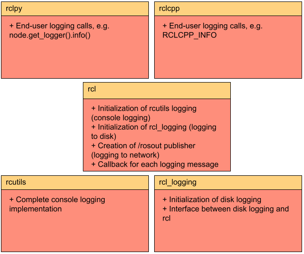

.. redirect-from::

    Logging

About logging and logger configuration
======================================

.. contents:: Table of Contents
   :depth: 2
   :local:

Overview
--------

The logging subsystem in ROS 2 aims to deliver logging messages to a variety of targets, including:

* To the console (if one is attached)
* To log files on disk (if local storage is available)
* To the ``/rosout`` topic on the ROS 2 network

By default, log messages in ROS 2 nodes will go out to the console (on stderr), to log files on disk, and to the ``/rosout`` topic on the ROS 2 network.
All of the targets can be individually enabled or disabled on a per-node basis.

The rest of this document will go over some of the ideas behind the logging subsystem.

Severity level
--------------

Log messages have a severity level associated with them: ``DEBUG``, ``INFO``, ``WARN``, ``ERROR`` or ``FATAL``, in ascending order.

A logger will only process log messages with severity at or higher than a specified level chosen for the logger.

Each node has a logger associated with it that automatically includes the node's name and namespace.
If the node's name is externally remapped to something other than what is defined in the source code, it will be reflected in the logger name.
Non-node loggers can also be created that use a specific name.

Logger names represent a hierarchy.
If the level of a logger named "abc.def" is unset, it will defer to the level of its parent named "abc", and if that level is also unset, the default logger level will be used.
When the level of logger "abc" is changed, all of its descendants (e.g. "abc.def", "abc.ghi.jkl") will have their level impacted unless their level has been explicitly set.

APIs
----

These are the APIs that end users of the ROS 2 logging infrastructure should use, split up by client library.

.. tabs::

  .. group-tab:: C++

    * ``RCLCPP_{DEBUG,INFO,WARN,ERROR,FATAL}`` - output the given printf-style message every time this line is hit
    * ``RCLCPP_{DEBUG,INFO,WARN,ERROR,FATAL}_ONCE`` - output the given printf-style message only the first time this line is hit
    * ``RCLCPP_{DEBUG,INFO,WARN,ERROR,FATAL}_EXPRESSION`` - output the given printf-style message only if the given expression is true
    * ``RCLCPP_{DEBUG,INFO,WARN,ERROR,FATAL}_FUNCTION`` - output the given printf-style message only if the given function returns true
    * ``RCLCPP_{DEBUG,INFO,WARN,ERROR,FATAL}_SKIPFIRST`` - output the given printf-style message all but the first time this line is hit
    * ``RCLCPP_{DEBUG,INFO,WARN,ERROR,FATAL}_THROTTLE`` - output the given printf-style message no more than the given rate in integer milliseconds
    * ``RCLCPP_{DEBUG,INFO,WARN,ERROR,FATAL}_SKIPFIRST_THROTTLE`` - output the given printf-style message no more than the given rate in integer milliseconds, but skip the first
    * ``RCLCPP_{DEBUG,INFO,WARN,ERROR,FATAL}_STREAM`` - output the given C++ stream-style message every time this line is hit
    * ``RCLCPP_{DEBUG,INFO,WARN,ERROR,FATAL}_STREAM_ONCE`` - output the given C++ stream-style message only the first time this line is hit
    * ``RCLCPP_{DEBUG,INFO,WARN,ERROR,FATAL}_STREAM_EXPRESSION`` - output the given C++ stream-style message only if the given expression is true
    * ``RCLCPP_{DEBUG,INFO,WARN,ERROR,FATAL}_STREAM_FUNCTION`` - output the given C++ stream-style message only if the given function returns true
    * ``RCLCPP_{DEBUG,INFO,WARN,ERROR,FATAL}_STREAM_SKIPFIRST`` - output the given C++ stream-style message all but the first time this line is hit
    * ``RCLCPP_{DEBUG,INFO,WARN,ERROR,FATAL}_STREAM_THROTTLE`` - output the given C++ stream-style message no more than the given rate in integer milliseconds
    * ``RCLCPP_{DEBUG,INFO,WARN,ERROR,FATAL}_STREAM_SKIPFIRST_THROTTLE`` - output the given C++ stream-style message no more than the given rate in integer milliseconds, but skip the first

    Each of the above APIs takes an ``rclcpp::Logger`` object as the first argument.
    This can be pulled from the node API by calling ``node->get_logger()`` (recommended), or by constructing a stand-alone ``rclcpp::Logger`` object.

    * ``rcutils_logging_set_logger_level`` - Set the logging level for a particular logger name to the given severity level
    * ``rcutils_logging_get_logger_effective_level`` - Given a logger name, return the logger level (which may be unset)

  .. group-tab:: Python

    * ``logger.{debug,info,warning,error,fatal}`` - output the given Python string to the logging infrastructure.  The calls accept the following keyword args to control behavior:

      * ``throttle_duration_sec`` - if not None, the duration of the throttle interval in floating-point seconds
      * ``skip_first`` - if True, output the message all but the first time this line is hit
      * ``once`` - if True, only output the message the first time this line is hit

    * ``rclpy.logging.set_logger_level`` - Set the logging level for a particular logger name to the given severity level
    * ``rclpy.logging.get_logger_effective_level`` - Given a logger name, return the logger level (which may be unset)

Configuration
-------------

Since ``rclcpp`` and ``rclpy`` use the same underlying logging infrastructure, the configuration options are the same.

Environment variables
^^^^^^^^^^^^^^^^^^^^^

The following environment variables control some aspects of the ROS 2 loggers.
For each of the environment settings, note that this is a process-wide setting, so it applies to all nodes in that process.

* ``ROS_LOG_DIR`` - Control the logging directory that is used for writing logging messages to disk (if that is enabled).  If non-empty, use the exact directory as specified in this variable.  If empty, use the contents of the ``ROS_HOME`` environment variable to construct a path of the form ``$ROS_HOME/.log``.  In all cases, the ``~`` character is expanded to the user's HOME directory.
* ``ROS_HOME`` - Control the home directory that is used for various ROS files, including logging and config files.  In the context of logging, this variable is used to construct a path to a directory for log files.  If non-empty, use the contents of this variable for the ROS_HOME path.  In all cases, the ``~`` character is expanded to the users's HOME directory.
* ``RCUTILS_LOGGING_USE_STDOUT`` - Control what stream output messages go to.  If this is unset or 0, use stderr.  If this is 1, use stdout.
* ``RCUTILS_LOGGING_BUFFERED_STREAM`` - Control whether the logging stream (as configured in ``RCUTILS_LOGGING_USE_STDOUT``) should be line buffered or unbuffered.  If this is unset, use the default of the stream (generally line buffered for stdout, and unbuffered for stderr).  If this is 0, force the stream to be unbuffered.  If this is 1, force the stream to be line buffered.
* ``RCUTILS_COLORIZED_OUTPUT`` - Control whether colors are used when outputting messages.  If unset, automatically determine based on the platform and whether the console is a TTY.  If 0, force disable using colors for output.  If 1, force enable using colors for output.
* ``RCUTILS_CONSOLE_OUTPUT_FORMAT`` - Control the fields that are output for each log message.  The available fields are:

  * ``{severity}`` - The severity level.
  * ``{name}`` - The name of the logger (may be empty).
  * ``{message}`` - The log message (may be empty).
  * ``{function_name}`` - The function name this was called from (may be empty).
  * ``{file_name}`` - The file name this was called from (may be empty).
  * ``{time}`` - The time in seconds since the epoch.
  * ``{time_as_nanoseconds}`` - The time in nanoseconds since the epoch.
  * ``{line_number}`` - The line number this was called from (may be empty).

  If no format is given, a default of ``[{severity}] [{time}] [{name}]: {message}`` is used.

Node creation
^^^^^^^^^^^^^

When initializing a ROS 2 node, it is possible to control some aspects of the behavior via node options.
Since these are per-node options, they can be set differently for different nodes even when the nodes are composed into a single process.

* ``log_levels`` - The log level to use for a component within this particular node.  This can be set with the following: ``ros2 run demo_nodes_cpp talker --ros-args --log-level talker:=DEBUG``
* ``external_log_config_file`` - The external file to use to configure the backend logger.  If it is NULL, the default configuration will be used.  Note that the format of this file is backend-specific (and is currently unimplemented for the default backend logger of spdlog).  This can be set with the following: ``ros2 run demo_nodes_cpp talker --ros-args --log-config-file log-config.txt``
* ``log_stdout_disabled`` - Whether to disable writing log messages to the console.  This can be done with the following: ``ros2 run demo_nodes_cpp talker --ros-args --disable-stdout-logs``
* ``log_rosout_disabled`` - Whether to disable writing log messages out to ``/rosout``.  This can significantly save on network bandwidth, but external observers will not be able to monitor logging.  This can be done with the following: ``ros2 run demo_nodes_cpp talker --ros-args --disable-rosout-logs``
* ``log_ext_lib_disabled`` - Whether to completely disable the use of an external logger.  This may be faster in some cases, but means that logs will not be written to disk.  This can be done with the following: ``ros2 run demo_nodes_cpp talker --ros-args --disable-external-lib-logs``

Logging subsystem design
------------------------

The image below shows the five main pieces to the logging subsystem and how they interact.

rcutils
^^^^^^^

``rcutils`` has a logging implementation that can format log messages according to a certain format (see ``Configuration`` above), and output those log messages to a console.
``rcutils`` implements a complete logging solution, but allows higher-level components to insert themselves into the logging infrastructure in a dependency-injection model.
This will become more evident when we talk about the ``rcl`` layer below.

Note that this is a *per-process* logging implementation, so anything that is configured at this level will affect the entire process, not just individual nodes.

rcl_logging_spdlog
^^^^^^^^^^^^^^^^^^

``rcl_logging_spdlog`` implements the ``rcl_logging_interface`` API, and thus provides external logging services to the ``rcl`` layer.
In particular, the ``rcl_logging_spdlog`` implementation takes formatted log messages and writes them out to log files on disk using the ``spdlog`` library, typically within ``~/.ros/log`` (though this is configurable; see ``Configuration`` above).

rcl
^^^

The logging subsystem in ``rcl`` uses ``rcutils`` and ``rcl_logging_spdlog`` to provide the bulk of the ROS 2 logging services.
When log messages come in, ``rcl`` decides where to send them.
There are 3 main places that logging messages can be delivered; an individual node may have any combination of them enabled:

* To the console via the ``rcutils`` layer
* To disk via the ``rcl_logging_spdlog`` layer
* To the ``/rosout`` topic on the ROS 2 network via the RMW layer

rclcpp
^^^^^^

This is the main ROS 2 C++ API which sits atop the ``rcl`` API.
In the context of logging, ``rclcpp`` provides the ``RCLCPP_`` logging macros; see ``APIs`` above for a complete list.
When one of the ``RCLCPP_`` macros runs, it checks the current severity level of the node against the severity level of the macro.
If the severity level of the macro is greater than or equal to the node severity level, the message will be formatted and output to all of the places that are currently configured.
Note that ``rclcpp`` uses a global mutex for log calls, so all logging calls within the same process end up being single-threaded.

rclpy
^^^^^

This is the main ROS 2 Python API which sits atop the ``rcl`` API.
In the context of logging, ``rclpy`` provides the ``logger.debug``-style functions; see ``APIs`` above for a complete list.
When one of the ``logger.debug`` functions runs, it checks the current severity level of the node against the severity level of the macro.
If the severity level of the macro is greater than or equal to the node severity level, the message will be formatted and output to all of the places that are currently configured.

Logging usage
-------------

.. tabs::

  .. group-tab:: C++

    * See the `rclcpp logging demo <https://github.com/ros2/demos/tree/{REPOS_FILE_BRANCH}/logging_demo>`_ for some simple examples.
    * See the :doc:`logging demo <../Tutorials/Demos/Logging-and-logger-configuration>` for example usage.
    * See the `rclcpp documentation <https://docs.ros2.org/latest/api/rclcpp/logging_8hpp.html>`__ for an extensive list of functionality.

  .. group-tab:: Python

    * See the `rclpy examples <https://github.com/ros2/examples/blob/{REPOS_FILE_BRANCH}/rclpy/services/minimal_client/examples_rclpy_minimal_client/client.py>`__ for example usage of a node's logger.
    * See the `rclpy tests <https://github.com/ros2/rclpy/blob/{REPOS_FILE_BRANCH}/rclpy/test/test_logging.py>`__ for example usage of keyword arguments (e.g. ``skip_first``, ``once``).
