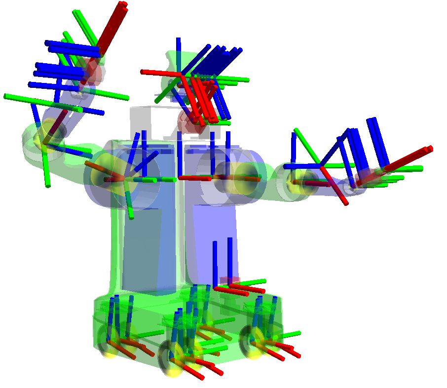

.. _AboutTf2:

About tf2
=========

.. contents:: Table of Contents
   :depth: 2
   :local:

Overview
--------

tf2 is the transform library, which lets the user keep track of multiple coordinate frames over time.
tf2 maintains the relationship between coordinate frames in a tree structure buffered in time and lets the user transform points, vectors, etc. between any two coordinate frames at any desired point in time.

Properties of tf2
-----------------

A robotic system typically has many 3D coordinate frames that change over time, such as a world frame, base frame, gripper frame, head frame, etc.
tf2 keeps track of all these frames over time, and allows you to ask questions like:

* Where was the head frame relative to the world frame 5 seconds ago?
* What is the pose of the object in my gripper relative to my base?
* What is the current pose of the base frame in the map frame?

tf2 can operate in a distributed system.
This means all the information about the coordinate frames of a robot is available to all ROS 2 components on any computer in the system.
tf2 can have every component in your distributed system build its own transform information database or have a central node that gathers and stores all transform information.

Tutorials
---------

We created a set of :ref:`tutorials <Tf2Main>` that walks you through using tf2, step by step.
You can get started on the :ref:`introduction to tf2 <IntroToTf2>` tutorial.
For a complete list of all tf2 and tf2-related tutorials check out the :ref:`tutorials <Tf2Main>` page.

There are essentially two main tasks that any user would use tf2 for, listening for transforms and broadcasting transforms.

If you want to use tf2 to transform between coordinate frames, your nodes will need to listen for transforms.
What you will do is to receive and buffer all coordinate frames that are broadcasted in the system, and query for specific transforms between frames.
Check out the writing a tf2 listener tutorial :ref:`(Python) <WritingATf2ListenerPy>` :ref:`(C++) <WritingATf2ListenerCpp>` to learn more.

To extend the capabilities of a robot you will need to start broadcasting transforms.
Broadcasting transforms means to send out the relative pose of coordinate frames to the rest of the system.
A system can have many broadcasters that each provide information about a different part of the robot.
Check out the writing a tf2 broadcaster tutorial :ref:`(Python) <WritingATf2BroadcasterPy>` :ref:`(C++) <WritingATf2BroadcasterCpp>` to learn more.

In addition to that, tf2 can broadcast static transforms that do not change over time.
This mainly saves storage and lookup time, though the publishing overhead is also improved.
You should note that static transforms are published once and assumed to be not changing and therefore no time history stored.
If you want to define static transforms in your tf2 tree, take a look at the writing static tf2 broadcaster :ref:`(Python) <WritingATf2StaticBroadcasterPy>` :ref:`(C++) <WritingATf2StaticBroadcasterCpp>` tutorial.

You can also learn how to add fixed and dynamic frames to your tf2 tree in adding a frame :ref:`(Python) <AddingAFramePy>` :ref:`(C++) <AddingAFrameCpp>` tutorial.

Once you are finished with the basic tutorials, you can move on to learn about tf2 and time.
The tf2 and time tutorial :ref:`(Python) <LearningAboutTf2AndTimePy>` :ref:`(C++) <LearningAboutTf2AndTimeCpp>` teaches the basic principles of tf2 and time.
The advanced tutorial about tf2 and time :ref:`(Python) <TimeTravelWithTf2Py>` :ref:`(C++) <TimeTravelWithTf2Cpp>` teaches the principles of time traveling with tf2.

Paper
-----

There is a paper on tf2 presented at TePRA 2013: `tf: The transform library <https://ieeexplore.ieee.org/abstract/document/6556373>`_.
