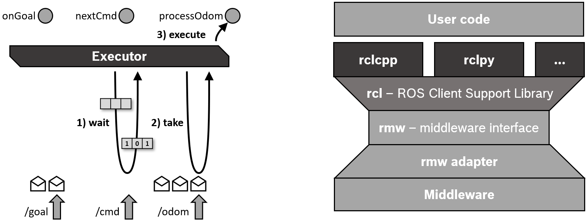
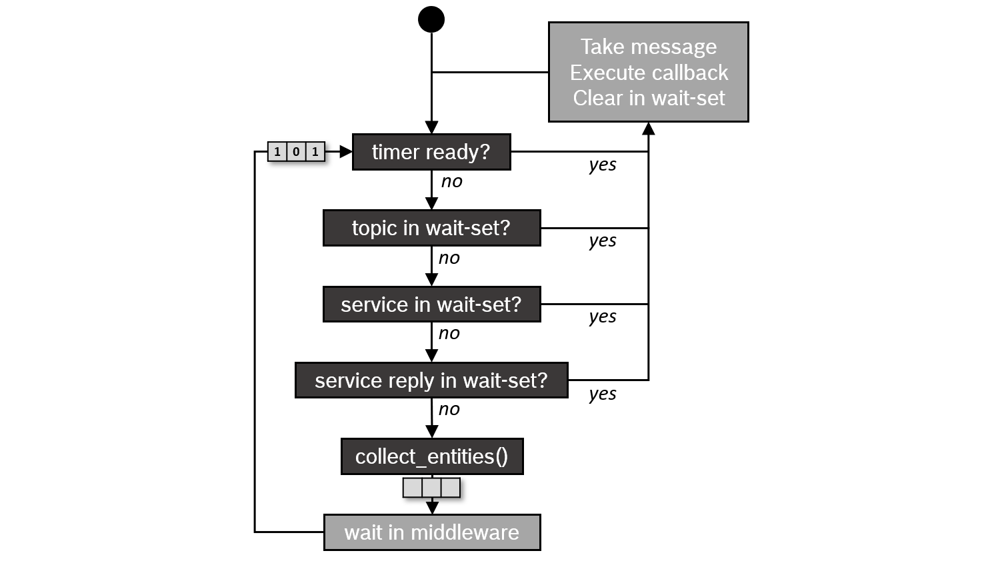

.. redirect-from::

   Concepts/About-Executors

Executors
=========

.. contents:: Table of Contents
   :local:

Overview
--------

Execution management in ROS 2 is handled by Executors.
An Executor uses one or more threads of the underlying operating system to invoke the callbacks of subscriptions, timers, service servers, action servers, etc. on incoming messages and events.
The explicit Executor class (in `executor.hpp <https://github.com/ros2/rclcpp/blob/{REPOS_FILE_BRANCH}/rclcpp/include/rclcpp/executor.hpp>`_ in rclcpp, in `executors.py <https://github.com/ros2/rclpy/blob/{REPOS_FILE_BRANCH}/rclpy/rclpy/executors.py>`_ in rclpy, or in `executor.h <https://github.com/ros2/rclc/blob/master/rclc/include/rclc/executor.h>`_ in rclc) provides more control over execution management than the spin mechanism in ROS 1, although the basic API is very similar.

In the following, we focus on the C++ Client Library *rclcpp*.

Basic use
---------

In the simplest case, the main thread is used for processing the incoming messages and events of a Node by calling ``rclcpp::spin(..)`` as follows:

.. code-block:: cpp

   int main(int argc, char* argv[])
   {
      // Some initialization.
      rclcpp::init(argc, argv);
      ...

      // Instantiate a node.
      rclcpp::Node::SharedPtr node = ...

      // Run the executor.
      rclcpp::spin(node);

      // Shutdown and exit.
      ...
      return 0;
   }

The call to ``spin(node)`` basically expands to an instantiation and invocation of the Single-Threaded Executor, which is the simplest Executor:

.. code-block:: cpp

   rclcpp::executors::SingleThreadedExecutor executor;
   executor.add_node(node);
   executor.spin();

By invoking ``spin()`` of the Executor instance, the current thread starts querying the rcl and middleware layers for incoming messages and other events and calls the corresponding callback functions until the node shuts down.
In order not to counteract the QoS settings of the middleware, an incoming message is not stored in a queue on the Client Library layer but kept in the middleware until it is taken for processing by a callback function.
(This is a crucial difference to ROS 1.)
A *wait set* is used to inform the Executor about available messages on the middleware layer, with one binary flag per queue.
The *wait set* is also used to detect when timers expire.

The Single-Threaded Executor is also used by the container process for :doc:`components <./About-Composition>`, i.e. in all cases where nodes are created and executed without an explicit main function.

Types of Executors
------------------

Currently, rclcpp provides three Executor types, derived from a shared parent class:

.. graphviz::

   digraph Flatland {

      Executor -> SingleThreadedExecutor [dir = back, arrowtail = empty];
      Executor -> MultiThreadedExecutor [dir = back, arrowtail = empty];
      Executor -> StaticSingleThreadedExecutor [dir = back, arrowtail = empty];
      Executor  [shape=polygon,sides=4];
      SingleThreadedExecutor  [shape=polygon,sides=4];
      MultiThreadedExecutor  [shape=polygon,sides=4];
      StaticSingleThreadedExecutor  [shape=polygon,sides=4];

      }

The *Multi-Threaded Executor* creates a configurable number of threads to allow for processing multiple messages or events in parallel.
The *Static Single-Threaded Executor* optimizes the runtime costs for scanning the structure of a node in terms of subscriptions, timers, service servers, action servers, etc.
It performs this scan only once when the node is added, while the other two executors regularly scan for such changes.
Therefore, the Static Single-Threaded Executor should be used only with nodes that create all subscriptions, timers, etc. during initialization.

All three executors can be used with multiple nodes by calling ``add_node(..)`` for each node.

.. code-block:: cpp

   rclcpp::Node::SharedPtr node1 = ...
   rclcpp::Node::SharedPtr node2 = ...
   rclcpp::Node::SharedPtr node3 = ...

   rclcpp::executors::StaticSingleThreadedExecutor executor;
   executor.add_node(node1);
   executor.add_node(node2);
   executor.add_node(node3);
   executor.spin();

In the above example, the one thread of a Static Single-Threaded Executor is used to serve three nodes together.
In case of a Multi-Threaded Executor, the actual parallelism depends on the callback groups.

Callback groups
---------------

ROS 2 allows organizing the callbacks of a node in groups.
In rclcpp, such a *callback group* can be created by the ``create_callback_group`` function of the Node class.
In rclpy, the same is done by calling the constructor of the specific callback group type.
The callback group must be stored throughout execution of the node (eg. as a class member), or otherwise the executor won't be able to trigger the callbacks.
Then, this callback group can be specified when creating a subscription, timer, etc. - for example by the subscription options:

.. tabs::

   .. group-tab:: C++

      .. code-block:: cpp

        my_callback_group = create_callback_group(rclcpp::CallbackGroupType::MutuallyExclusive);

        rclcpp::SubscriptionOptions options;
        options.callback_group = my_callback_group;

        my_subscription = create_subscription<Int32>("/topic", rclcpp::SensorDataQoS(),
                                                     callback, options);
   .. group-tab:: Python

      .. code-block:: python

        my_callback_group = MutuallyExclusiveCallbackGroup()
        my_subscription = self.create_subscription(Int32, "/topic", self.callback, qos_profile=1,
                                                   callback_group=my_callback_group)

All subscriptions, timers, etc. that are created without the indication of a callback group are assigned to the *default callback group*.
The default callback group can be queried via ``NodeBaseInterface::get_default_callback_group()`` in rclcpp
and by ``Node.default_callback_group`` in rclpy.

There are two types of callback groups, where the type has to be specified at instantiation time:

* *Mutually exclusive:* Callbacks of this group must not be executed in parallel.
* *Reentrant:* Callbacks of this group may be executed in parallel.

Callbacks of different callback groups may always be executed in parallel.
The Multi-Threaded Executor uses its threads as a pool to process as many callbacks as possible in parallel according to these conditions.
For tips on how to use callback groups efficiently, see :doc:`Using Callback Groups <../../How-To-Guides/Using-callback-groups>`.

The Executor base class in rclcpp also has the function ``add_callback_group(..)``, which allows distributing callback groups to different Executors.
By configuring the underlying threads using the operating system scheduler, specific callbacks can be prioritized over other callbacks.
For example, the subscriptions and timers of a control loop can be prioritized over all other subscriptions and standard services of a node.
The `examples_rclcpp_cbg_executor package <https://github.com/ros2/examples/tree/{REPOS_FILE_BRANCH}/rclcpp/executors/cbg_executor>`_ provides a demo of this mechanism.

Scheduling semantics
--------------------

If the processing time of the callbacks is shorter than the period with which messages and events occur, the Executor basically processes them in FIFO order.
However, if the processing time of some callbacks is longer, messages and events will be queued on the lower layers of the stack.
The wait set mechanism reports only very little information about these queues to the Executor.
In detail, it only reports whether there are any messages for a certain topic or not.
The Executor uses this information to process the messages (including services and actions) in a round-robin fashion - but not in FIFO order.
The following flow diagram visualizes this scheduling semantics.

This semantics was first described in a `paper by Casini et al. at ECRTS 2019 <https://drops.dagstuhl.de/opus/volltexte/2019/10743/pdf/LIPIcs-ECRTS-2019-6.pdf>`_.
(Note: The paper also explains that timer events are prioritized over all other messages. `This prioritization was removed in Eloquent. <https://github.com/ros2/rclcpp/pull/841>`_)

Outlook
-------

While the three Executors of rclcpp work well for most applications, there are some issues that make them not suitable for real-time applications, which require well-defined execution times, determinism, and custom control over the execution order.
Here is a summary of some of these issues:

1. Complex and mixed scheduling semantics.
   Ideally you want well defined scheduling semantics to perform a formal timing analysis.
2. Callbacks may suffer from priority inversion.
   Higher priority callbacks may be blocked by lower priority callbacks.
3. No explicit control over the callbacks execution order.
4. No built-in control over triggering for specific topics.

Additionally, the executor overhead in terms of CPU and memory usage is considerable.
The Static Single-Threaded Executor reduces this overhead greatly but it might not be enough for some applications.

These issues have been partially addressed by the following developments:

* `rclcpp WaitSet <https://github.com/ros2/rclcpp/blob/{REPOS_FILE_BRANCH}/rclcpp/include/rclcpp/wait_set.hpp>`_: The ``WaitSet`` class of rclcpp allows waiting directly on subscriptions, timers, service servers, action servers, etc. instead of using an Executor.
  It can be used to implement deterministic, user-defined processing sequences, possibly processing multiple messages from different subscriptions together.
  The `examples_rclcpp_wait_set package <https://github.com/ros2/examples/tree/{REPOS_FILE_BRANCH}/rclcpp/wait_set>`_ provides several examples for the use of this user-level wait set mechanism.
* `rclc Executor <https://github.com/ros2/rclc/blob/master/rclc/include/rclc/executor.h>`_: This Executor from the C Client Library *rclc*, developed for micro-ROS, gives the user fine-grained control over the execution order of callbacks and allows for custom trigger conditions to activate callbacks.
  Furthermore, it implements ideas of the Logical Execution Time (LET) semantics.

Further information
-------------------

* Michael Pöhnl et al.: `"ROS 2 Executor: How to make it efficient, real-time and deterministic?" <https://www.apex.ai/roscon-21>`_. Workshop at ROS World 2021. Virtual event. 19 October 2021.
* Ralph Lange: `"Advanced Execution Management with ROS 2" <https://www.youtube.com/watch?v=Sz-nllmtcc8&t=109s>`_. ROS Industrial Conference. Virtual event. 16 December 2020.
* Daniel Casini, Tobias Blass, Ingo Lütkebohle, and Björn Brandenburg: `“Response-Time Analysis of ROS 2 Processing Chains under Reservation-Based Scheduling” <https://drops.dagstuhl.de/opus/volltexte/2019/10743/pdf/LIPIcs-ECRTS-2019-6.pdf>`_, Proc. of 31st ECRTS 2019, Stuttgart, Germany, July 2019.
