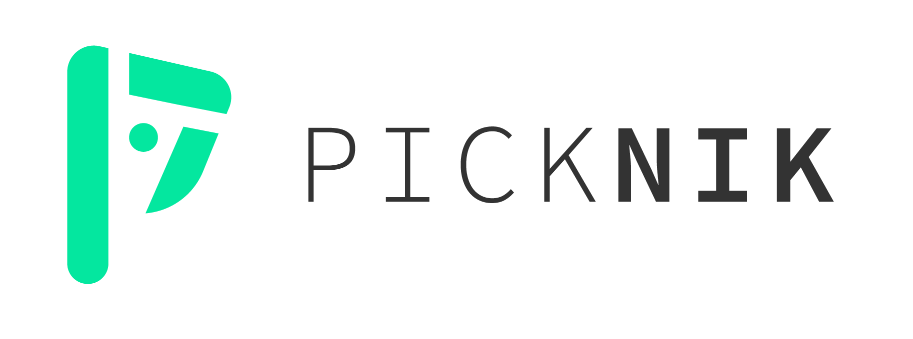
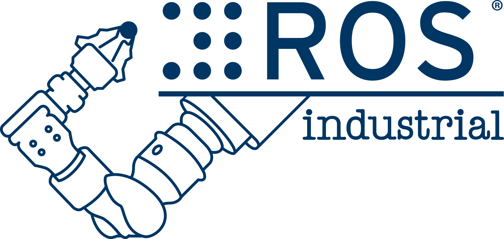

.. _Governance:

Project Governance
==================

.. contents:: Table of Contents
   :depth: 1
   :local:

Technical Steering Committee (TSC)
----------------------------------
Since the beginning of ROS, the project has been overseen and prioritized primarily by one organization, first Willow Garage and now Open Robotics.
That approach has worked well enough, as evidenced by the widespread adoption of ROS around the world.

But with ROS 2, we want to broaden participation to accelerate ROS 2 delivery, starting with these areas: determining the roadmap, developing core tools and libraries, and establishing working groups to focus on important topics.
To that end, we've established a Technical Steering Committee (TSC).
As described in the :ref:`charter <ROS2TSCCharter>`, the TSC comprises representatives of organizations that are contributing to the development of ROS 2, and it has the responsibility to set the technical direction for the project.

Packages relevant to this ROS 2 TSC are listed in `REP 2005 <https://www.ros.org/reps/rep-2005.html>`_.

Meeting notes can be found on `ROS Discourse <https://discourse.ros.org/tag/tsc>`_.

The current members of the ROS 2 TSC are (20 as of 2021-09-13):

.. |amazon| image:: Governance/amazon.svg
.. |apex| image:: Governance/apex.png
.. |bosch| image:: Governance/bosch_75h.jpg
.. |canonical| image:: Governance/ubuntu.svg
.. |eprosima| image:: Governance/eprosima.svg
.. |gvsc| image:: Governance/gvsc.png
.. |intel| image:: Governance/intel.svg

.. |lge| image:: Governance/lge.svg
.. |microsoft| image:: Governance/microsoft.svg
.. |openrobotics| image:: Governance/openrobotics-logo-stacked.png

.. |robotis| image:: Governance/robotis.png

.. |rover| image:: Governance/rover.png
.. |samsung| image:: Governance/samsung.svg

.. |tri| image:: Governance/tri_logo_landscape-web.svg
.. |windriver| image:: Governance/windriver.png

.. raw:: html

    <!--
    The CSS and HTML below generate the list of TSC members.
    It is currently using raw HTML because there was no way that I could see to make the
    ReStructured Text "list-tables" directive make the logos a consistent size.
    -->
    
    <table class="tscclass">
      <tbody>
        <tr class="tscclass">
          <td class="tscclass" align="center">

</td>
          <td class="tscclass" align="center">
ADLINK Technology: Joe Speed
</td>
        </tr>
        <tr class="tscclass">
          <td class="tscclass" align="center">

</td>
          <td class="tscclass" align="center">
Amazon: Aaron Blasdel
</td>
        </tr>
        <tr class="tscclass">
          <td class="tscclass" align="center">

</td>
          <td class="tscclass" align="center">
Apex.AI: Lyle Johnson
</td>
        </tr>
        <tr class="tscclass">
          <td class="tscclass" align="center">

</td>
          <td class="tscclass" align="center">
Bosch: Ralph Lange
</td>
        </tr>
        <tr class="tscclass">
          <td class="tscclass" align="center">

</td>
          <td class="tscclass" align="center">
Canonical: Sid Faber
</td>
        </tr>
        <tr class="tscclass">
          <td class="tscclass" align="center">

</td>
          <td class="tscclass" align="center">
eProsima: Jaime Martin Losa
</td>
        </tr>
        <tr class="tscclass">
          <td class="tscclass" align="center">

</td>
          <td class="tscclass" align="center">
GVSC: Jerry Towler (SwRI)
</td>
        </tr>
        <tr class="tscclass">
          <td class="tscclass" align="center">

</td>
          <td class="tscclass" align="center">
Intel: Harold Yang
</td>
        </tr>
        <tr class="tscclass">
          <td class="tscclass" align="center">

</td>
          <td class="tscclass" align="center">
iRobot: Alberto Soragna
</td>
        </tr>
        <tr class="tscclass">
          <td class="tscclass" align="center">

</td>
          <td class="tscclass" align="center">
LG Electronics: Herb Kuta
</td>
        </tr>
        <tr class="tscclass">
          <td class="tscclass" align="center">

</td>
          <td class="tscclass" align="center">
Microsoft: Lou Amadio
</td>
        </tr>
        <tr class="tscclass">
          <td class="tscclass" align="center">

</td>
          <td class="tscclass" align="center">
Open Robotics: Chris Lalancette
</td>
        </tr>
        <tr class="tscclass">
          <td class="tscclass" align="center">

</td>
          <td class="tscclass" align="center">
PickNik: Dave Coleman
</td>
        </tr>
        <tr class="tscclass">
          <td class="tscclass" align="center">

</td>
          <td class="tscclass" align="center">
ROBOTIS: Will Son
</td>
        </tr>
        <tr class="tscclass">
          <td class="tscclass" align="center">

</td>
          <td class="tscclass" align="center">
ROS-Industrial: Matt Robinson
</td>
        </tr>
        <tr class="tscclass">
          <td class="tscclass" align="center">

</td>
          <td class="tscclass" align="center">
Rover Robotics: Nick Fragale
</td>
        </tr>
        <tr class="tscclass">
          <td class="tscclass" align="center">

</td>
          <td class="tscclass" align="center">
Samsung: Steven Macenski
</td>
        </tr>
        <tr class="tscclass">
          <td class="tscclass" align="center">

</td>
          <td class="tscclass" align="center">
Sony: Tomoya Fujita
</td>
        </tr>
        <tr class="tscclass">
          <td class="tscclass" align="center">

</td>
          <td class="tscclass" align="center">
Toyota Research Institute: Ian McMahon
</td>
        </tr>
        <tr class="tscclass">
          <td class="tscclass" align="center">

</td>
          <td class="tscclass" align="center">
Wind River: Andrei Kholodnyi
</td>
        </tr>
      </tbody>
    </table>
     

If you are interested in joining the ROS 2 TSC, please inquire via info@openrobotics.org.

.. toctree::
   :maxdepth: 1

   Governance/ROS2-TSC-Charter
   Governance/ROS2-TSC-Intake-process
   Governance/How-To-Start-A-Community-Working-Group

Working Groups (WGs)
--------------------

As described in its :ref:`charter <ROS2TSCCharter>`, the TSC establishes working groups (WGs) to discuss and make progress on specific topics.

The current WGs are (11 as of 2021-01-12):

Control
^^^^^^^

* Lead(s): Bence Magyar, Karsten Knese
* Resources:

 * Meeting invite group `ros-control-working-group-invites@googlegroups.com <https://groups.google.com/forum/#!forum/ros-control-working-group-invites>`_
 * Discourse tag: `wg-ros2-control <https://discourse.ros.org/tags/wg-ros2-control>`_

Edge AI
^^^^^^^

* Lead(s): Joe Speed
* Resources:

 * Meeting invite group `ros-edge-ai-working-group-invites <https://groups.google.com/forum/#!forum/ros-edge-ai-working-group-invites>`_
 * Discourse tag: `wg-edgeai <https://discourse.ros.org/tag/wg-edgeai>`_

Embedded Systems
^^^^^^^^^^^^^^^^

* Lead(s): Maria Merlan, Pablo Garrido
* Resources:

 * `2019-07-29 meeting notes <https://discourse.ros.org/uploads/short-url/z1caIm7m5IVP4cPJUwg3Chq36wO.pdf>`__
 * `2019-01-15 meeting notes <https://discourse.ros.org/t/ros2-embedded-sig-meeting-2/7243/5>`__
 * Meeting invite group `ros-embedded-working-group-invites@googlegroups.com <https://groups.google.com/forum/#!forum/ros-embedded-working-group-invites>`_
 * Discourse tag: `wg-embedded <https://discourse.ros.org/tags/wg-embedded>`_

Middleware
^^^^^^^^^^

* Lead(s): William Woodall
* Resources:

 * Meeting invite group `ros-middleware-working-group-invites@googlegroups.com <https://groups.google.com/forum/#!forum/ros-middleware-working-group-invites>`_
 * Discourse tag: `wg-middleware <https://discourse.ros.org/tags/wg-middleware>`_

Navigation
^^^^^^^^^^

* Lead(s): Steve Macenski
* Resources:

 * `2019-03-17 meeting notes <https://discourse.ros.org/t/ros2-navigation-wg-thursday-3-00-pm-pacific-gmt-7-00/7586/9>`__

 * Meeting invite group `ros-navigation-working-group-invites@googlegroups.com <https://groups.google.com/forum/#!forum/ros-navigation-working-group-invites>`_
 * Discourse tag: `wg-navigation <https://discourse.ros.org/tags/wg-navigation>`_
 * Discourse Channel: `Navigation Stack <https://discourse.ros.org/c/navigation/44>`_

Manipulation
^^^^^^^^^^^^

* Lead(s): Dave Coleman, Mark Moll
* Resources:

 * `About our working group meetings <https://discourse.ros.org/t/moveit-maintainer-meeting-all-invited-july-25th/9899>`__

 * Meeting invite group `ros-manipulation-working-group-invites@googlegroups.com <https://groups.google.com/forum/#!forum/ros-manipulation-working-group-invites>`_
 * Discourse tag: `wg-moveit <https://discourse.ros.org/tags/wg-moveit>`_
 * Discourse Channel: `MoveIt <https://discourse.ros.org/c/moveit>`_

Real-time
^^^^^^^^^

* Lead(s): Andrei Kholodnyi, Carlos San Vicente
* Resources:

 * `Working group website <https://real-time-working-group.readthedocs.io/>`__
 * `Working Group Community <https://github.com/ros-realtime/community>`__
 * Meeting invite group `ros-real-time-working-group-invites@googlegroups.com <https://groups.google.com/forum/#!forum/ros-real-time-working-group-invites>`_
 * Discourse tag: `wg-real-time <https://discourse.ros.org/tags/wg-real-time>`_
 * Matrix chat `+ros-realtime:matrix.org <https://matrix.to/#/+ros-realtime:matrix.org>`_

Rust
^^^^

* Lead(s): Ruffin White, Geoffrey Biggs
* Resources:

 * `Working group Community <https://github.com/ros2-rust/rust-wg>`__
 * Meeting invite group `ros-rust-working-group-invites@googlegroups.com <https://groups.google.com/forum/#!forum/ros-rust-working-group-invites>`_
 * Discourse tag: `wg-rust <https://discourse.ros.org/tags/wg-rust>`_
 * Matrix chat `+rosorg-rust:matrix.org <https://matrix.to/#/+rosorg-rust:matrix.org>`_

Safety
^^^^^^

* Lead(s): Geoffrey Biggs
* Resources:

 * `Working group website <http://ros-safety.github.io/safety_working_group/>`__
 * `Working group Community <https://github.com/ros-safety/safety_working_group>`__
 * Meeting invite group `ros-safety-working-group-invites@googlegroups.com <https://groups.google.com/forum/#!forum/ros-safety-working-group-invites>`_
 * Discourse tag: `wg-safety-critical <https://discourse.ros.org/tags/wg-safety-critical>`_

Security
^^^^^^^^

* Lead(s): Sid Faber
* Resources:

 * `ROS 2 Security Working Group Community <https://github.com/ros-security/community>`__
 * Meeting invite group `ros-security-working-group-invites@googlegroups.com <https://groups.google.com/forum/#!forum/ros-security-working-group-invites>`_
 * Discourse tag: `wg-security <https://discourse.ros.org/tags/wg-security>`_
 * Matrix chat `+rosorg-security:matrix.org <https://matrix.to/#/+rosorg-security:matrix.org>`_

Tooling
^^^^^^^

* Lead(s): Emerson Knapp
* Resources:

 * `Charter <https://github.com/ros-tooling/community>`__
 * `Meeting Notes <https://docs.google.com/document/d/1UXWaEkT6ji0Z0uTtJJSni5Y6fiopM9qOOzv4ldeNaAM/edit>`__
 * Meeting invite group `ros-tooling-working-group-invites@googlegroups.com <https://groups.google.com/forum/#!forum/ros-tooling-working-group-invites>`_
 * Discourse tag: `wg-tooling <https://discourse.ros.org/tags/wg-tooling>`_
 * Matrix chat `+ros-tooling:matrix.org <https://matrix.to/#/+ros-tooling:matrix.org>`_

WebTools
^^^^^^^^

* Lead(s): Emerson Knapp
* Resources:

 * `Charter <https://github.com/RobotWebTools/community>`__
 * `Meeting Notes <https://docs.google.com/document/d/1esrRj2x80TSCEHOwuh-cT_bQvAqqvloQAQr8mPMzcTc/edit>`__
 * `Video Recordings <https://www.youtube.com/playlist?list=PLpUh4ScdBhSMb98_C0q_zIT8GNMehYBd>`__
 * `Google Group <https://groups.google.com/g/ros-webtools-working-group>`__
 * Discourse tag: `wg-webtools <https://discourse.ros.org/tags/wg-webtools>`__

Community Working Groups
------------------------

The ROS 2 TSC is interested in encouraging and promoting working groups outside its direct purview.
To provide extra visibility the TSC maintains a list of the community driven working groups here as well as working with the community to provide them with the same infrastructure.

Hardware Acceleration
^^^^^^^^^^^^^^^^^^^^^

* Lead(s): Víctor Mayoral Vilches
* Resources:

 * Meeting invite group `ROS 2 Hardware Acceleration WG Google Group <https://groups.google.com/g/ros-2-hardware-acceleration-wg>`_
 * Discourse tag: `wg-acceleration <https://discourse.ros.org/tag/wg-acceleration>`_
 * Github organization: `ros-acceleration <https://github.com/ros-acceleration>`_

If you'd like to join an existing ROS 2 WG, please contact the appropriate group lead(s) directly.
If you'd like to create a new WG, please inquire via info@openrobotics.org.

Working Group Policies

 * Meetings should be posted to the Google calendar as well as announced on Discourse.
 * Meetings should have notes and be posted to Discourse using appropriate working group tag.
 * For attending the groups meetings please join the associated google group to get invites automatically.

Upcoming ROS Events
-------------------

Upcoming Working group meetings can be found in this `Google Calendar <https://calendar.google.com/calendar/embed?src=agf3kajirket8khktupm9go748%40group.calendar.google.com&ctz=America%2FLos_Angeles>`_.
It can be accessed via `iCal <https://calendar.google.com/calendar/ical/agf3kajirket8khktupm9go748%40group.calendar.google.com/public/basic.ics>`_.

.. raw:: html

    <iframe src="https://calendar.google.com/calendar/embed?src=agf3kajirket8khktupm9go748%40group.calendar.google.com" style="border: 0" width="800" height="600" frameborder="0" scrolling="no"></iframe>

If you have an individual event or series of events that you'd like to post please contact info@openrobotics.org
