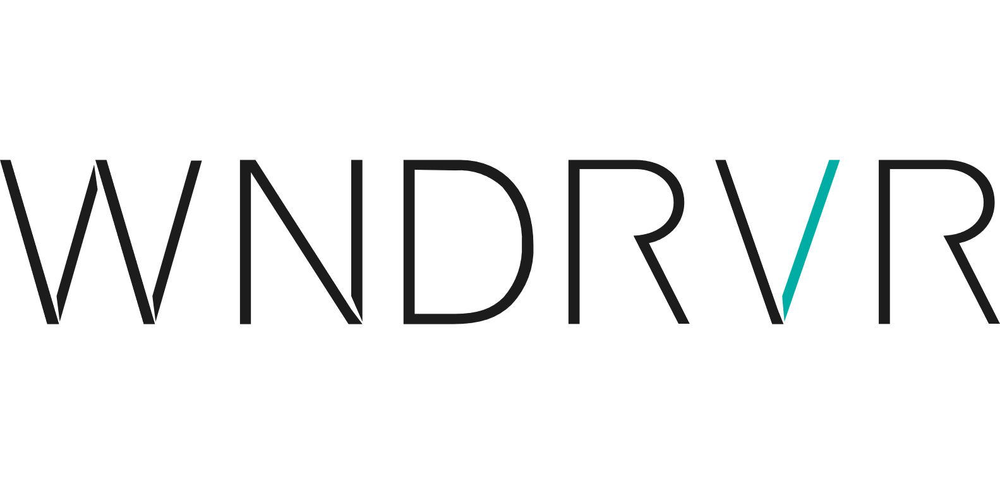

.. _Governance:

Project Governance
==================

Technical Steering Committee (TSC)
----------------------------------
Since the beginning of ROS, the project has been overseen and prioritized primarily by one organization, first Willow Garage and now Open Robotics.
That approach has worked well enough, as evidenced by the widespread adoption of ROS around the world.

But with ROS 2, we want to broaden participation to accelerate ROS 2 delivery, starting with these areas: determining the roadmap, developing core tools and libraries, and establishing working groups to focus on important topics.
To that end, we've established a Technical Steering Committee (TSC).
As described in the :download:`charter <Governance/ros2-tsc-charter.pdf>`, the TSC comprises representatives of organizations that are contributing to the development of ROS 2, and it has the responsibility to set the technical direction for the project.

Packages relevant to this ROS 2 TSC are listed in `REP 2005 <https://www.ros.org/reps/rep-2005.html>`_.

Meeting notes can be found on `ROS Discourse <https://discourse.ros.org/tag/tsc>`_.

The current members of the ROS 2 TSC are (18 as of 2020-11-16):

.. |adlink| image:: Governance/adlink.svg
   :alt: ADLINK Technology logo
   :height: 35px
   :target: https://www.adlinktech.com

.. |bosch| image:: Governance/bosch_75h.jpg
   :alt: Bosch logo
   :height: 35px
   :target: https://www.bosch.com/

.. |eprosima| image:: Governance/eprosima.svg
   :alt: eProsima logo
   :height: 35px
   :target: https://eprosima.com/

.. |intel| image:: Governance/intel.svg
   :alt: Intel logo
   :height: 35px
   :target: https://www.intel.com

.. |microsoft| image:: Governance/microsoft.svg
   :alt: Microsoft logo
   :height: 35px
   :target: https://www.microsoft.com

.. |robotis| image:: Governance/robotis.png
   :alt: ROBOTIS logo
   :height: 35px
   :target: https://www.robotis.com/

.. |tieriv| image:: Governance/TierIV.png
   :alt: Tier IV logo
   :height: 35px
   :target: https://www.tier4.jp/

.. list-table::
   :align: center
   :widths: auto

   * - |adlink|
     - ADLINK Technology: Joe Speed
   * - |amazon|
     - Amazon: Aaron Blasdel
   * - |apex|
     - Apex.AI: Dejan Pangercic
   * - |bosch|
     - Bosch: Karsten Knese
   * - |canonical|
     - Canonical: Kyle Fazzari
   * - |eprosima|
     - eProsima: Jaime Martin Losa
   * - |intel|
     - Intel: Harold Yang
   * - |lge|
     - LG Electronics: Lokesh Kumar Goel
   * - |microsoft|
     - Microsoft: Sean Yen
   * - |openrobotics|
     - Open Robotics: Chris Lalancette
   * - |picknik|
     - PickNik: Dave Coleman
   * - |robotis|
     - ROBOTIS: Will Son
   * - |rover|
     - Rover Robotics: Nick Fragale
   * - |samsung|
     - Samsung: Steven Macenski
   * - |gvsc|
     - GVSC: Jerry Towler (SwRI)
   * - |tieriv|
     - Tier IV: Jilada Eccleston
   * - |tri|
     - Toyota Research Institute: Ian McMahon
   * - |windriver|
     - Wind River: `Andrei Kholodnyi <https://github.com/razr>`__

If you are interested in joining the ROS 2 TSC, please inquire via info@openrobotics.org.

Working Groups (WGs)
--------------------

As described in its :download:`charter <Governance/ros2-tsc-charter.pdf>`, the TSC establishes working groups (WGs) to discuss and make progress on specific topics.

The current WGs are (6 as of 2019-09-04):

Control
^^^^^^^

* Lead(s): Bence Magyar, Karsten Knese
* Resources:

 * Meeting invite group `ros-control-working-group-invites@googlegroups.com <https://groups.google.com/forum/#!forum/ros-control-working-group-invites>`_
 * Discourse tag: `wg-ros2-control <https://discourse.ros.org/tags/wg-ros2-control>`_

Edge AI
^^^^^^^

* Lead(s): Joe Speed
* Resources:

 * Meeting invite group `ros-edge-ai-working-group-invites <https://groups.google.com/forum/#!forum/ros-edge-ai-working-group-invites>`_
 * Discourse tag: `wg-edgeai <https://discourse.ros.org/tag/wg-edgeai>`_

Embedded Systems
^^^^^^^^^^^^^^^^

* Lead(s): Francesca Finocchiaro
* Resources:

 * `2019-07-29 meeting notes <https://discourse.ros.org/uploads/short-url/z1caIm7m5IVP4cPJUwg3Chq36wO.pdf>`__
 * `2019-01-15 meeting notes <https://discourse.ros.org/t/ros2-embedded-sig-meeting-2/7243/5>`__
 * Meeting invite group `ros-embedded-working-group-invites@googlegroups.com <https://groups.google.com/forum/#!forum/ros-embedded-working-group-invites>`_
 * Discourse tag: `wg-embedded <https://discourse.ros.org/tags/wg-embedded>`_

Middleware
^^^^^^^^^^

* Lead(s): William Woodall
* Resources:

 * Meeting invite group `ros-middleware-working-group-invites@googlegroups.com <https://groups.google.com/forum/#!forum/ros-middleware-working-group-invites>`_
 * Discourse tag: `wg-middleware <https://discourse.ros.org/tags/wg-middleware>`_

Navigation
^^^^^^^^^^

* Lead(s): Steve Macenski
* Resources:

 * `2019-03-17 meeting notes <https://discourse.ros.org/t/ros2-navigation-wg-thursday-3-00-pm-pacific-gmt-7-00/7586/9>`__

 * Meeting invite group `ros-navigation-working-group-invites@googlegroups.com <https://groups.google.com/forum/#!forum/ros-navigation-working-group-invites>`_
 * Discourse tag: `wg-navigation <https://discourse.ros.org/tags/wg-navigation>`_
 * Discourse Channel: `Navigation Stack <https://discourse.ros.org/c/navigation/44>`_

Manipulation
^^^^^^^^^^^^

* Lead(s): Dave Coleman, Mark Moll
* Resources:

 * `About our working group meetings <https://discourse.ros.org/t/moveit-maintainer-meeting-all-invited-july-25th/9899>`__

 * Meeting invite group `ros-manipulation-working-group-invites@googlegroups.com <https://groups.google.com/forum/#!forum/ros-manipulation-working-group-invites>`_
 * Discourse tag: `wg-moveit <https://discourse.ros.org/tags/wg-moveit>`_
 * Discourse Channel: `MoveIt <https://discourse.ros.org/c/moveit>`_

Real-time
^^^^^^^^^

* Lead(s): Dejan Pangercic, Andrei Kholodnyi
* Resources: TODO

 * `ROS 2 Real-time Working Group Community <https://github.com/ros-realtime/community>`__
 * Meeting invite group `ros-real-time-working-group-invites@googlegroups.com <https://groups.google.com/forum/#!forum/ros-real-time-working-group-invites>`_
 * Discourse tag: `wg-real-time <https://discourse.ros.org/tags/wg-real-time>`_

Safety
^^^^^^

* Lead(s): Geoffrey Biggs
* Resources:

 * `Working group website <http://ros-safety.github.io/safety_working_group/>`__
 * `Working group Community <https://github.com/ros-safety/safety_working_group>`__
 * Meeting invite group `ros-safety-working-group-invites@googlegroups.com <https://groups.google.com/forum/#!forum/ros-safety-working-group-invites>`_
 * Discourse tag: `wg-safety-critical <https://discourse.ros.org/tags/wg-safety-critical>`_

Security
^^^^^^^^

* Lead(s): Sid Faber, Kyle Fazzari
* Resources:

 * `ROS 2 Security Working Group Community <https://github.com/ros-security/community>`__
 * Meeting invite group `ros-security-working-group-invites@googlegroups.com <https://groups.google.com/forum/#!forum/ros-security-working-group-invites>`_
 * Discourse tag: `wg-security <https://discourse.ros.org/tags/wg-security>`_
 * Matrix chat `+rosorg-security:matrix.org <https://matrix.to/#/+rosorg-security:matrix.org>`_

Tooling
^^^^^^^

* Lead(s): Emerson Knapp, Thomas Moulard
* Resources:

 * `ROS 2 Tooling Working Group Community <https://github.com/ros-tooling/community>`__
 * Meeting invite group `ros-tooling-working-group-invites@googlegroups.com <https://groups.google.com/forum/#!forum/ros-tooling-working-group-invites>`_
 * Discourse tag: `wg-tooling <https://discourse.ros.org/tags/wg-tooling>`_
 * Matrix chat `+ros-tooling:matrix.org <https://matrix.to/#/+ros-tooling:matrix.org>`_

If you'd like to join an existing ROS 2 WG, please contact the appropriate group lead(s) directly.
If you'd like to create a new WG, please inquire via info@openrobotics.org.

Working Group Policies

 * Meetings should be posted to the google calendar as well as announced on Discourse.
 * Meetings should have notes and be posted to Discourse using appropriate working group tag.
 * For attending the groups meetings please join the associated google group to get invites automatically.

Upcoming ROS Events
-------------------

Upcoming Working group meetings can be found in this `Google Calendar <https://calendar.google.com/calendar/embed?src=agf3kajirket8khktupm9go748%40group.calendar.google.com&ctz=America%2FLos_Angeles>`_.
It can be accessed via `iCal <https://calendar.google.com/calendar/ical/agf3kajirket8khktupm9go748%40group.calendar.google.com/public/basic.ics>`_.

.. raw:: html

    <iframe src="https://calendar.google.com/calendar/embed?src=agf3kajirket8khktupm9go748%40group.calendar.google.com" style="border: 0" width="800" height="600" frameborder="0" scrolling="no"></iframe>

If you have an individual event or series of events that you'd like to post please contact info@openrobotics.org
