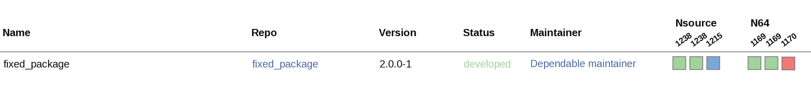

Check package build status
==========================

Released ROS 2 packages with binary releases enabled are built on the `ROS 2 build farm <https://build.ros2.org>`_.

Email notifications
-------------------

Maintainers of a released package will receive email notifications from the ROS 2 build farm, specifically ``noreply@build.ros2.org`` when builds fail or succeed after failure.
The email notification will include a log excerpt and a link to the failing build in the ROS 2 build farm web interface.

Build farm rosdistro status pages
---------------------------------

The ROS 2 build farm web interface was not designed for the scale of jobs on the build farm.
Navigating to specific builds using the web interface is cumbersome and generates unnecessary load and thus is not recommended.

The ROS 2 build farm repository hosts several status pages which are used by the ROS core team and ROS bosses.
These status pages can be used by package maintainers as well.

ROS 2 status pages are hosted at `<https://repo.ros2.org/status_page>`_, which contains an autoindex of all current status pages.
The status pages which are most relevant to package maintainers are the "release status" pages which are named ``ros_${ROS_DISTRO}_${TARGET}.html``.
The ``${ROS_DISTRO}`` value is the codename of a specific ROS distribution and the ``${TARGET}`` value is taken from the specific release build configuration file in the `ROS 2 build farm configuration <https://github.com/ros2/ros_buildfarm_config>`_.
Current target values are

- ``default`` for the AMD64 Ubuntu release supported by the ROS distribution, 
- ``rhel`` for the AMD64 RHEL-compatible Enterprise Linux release supported by the ROS odistribution.
- ``XYv8`` for the ARM64 Ubuntu release supported by the ROS distribution.
  The first two characters indicate the operating system distribution (``u`` for Ubuntu, ``d`` for Debian) and release codename (e.g. ``j`` for Ubuntu 22.04 Jammy, ``n`` for Ubuntu 24.04 Noble), the latter two characters ``v8`` refer to the target architecture ARM64 by its historic Debian designation ``armv8``.

To find information about your package in a specific ROS distribution such as Rolling Ridley on Ubuntu AMD64, use the ``ros_rolling_default.html`` status page.

Examples
^^^^^^^^

Fixed package
..
   TODO(nuclearsandwich) this is just filler to prove images work.
   Needs elaboration

