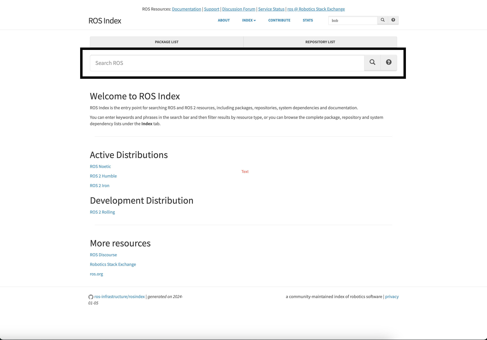
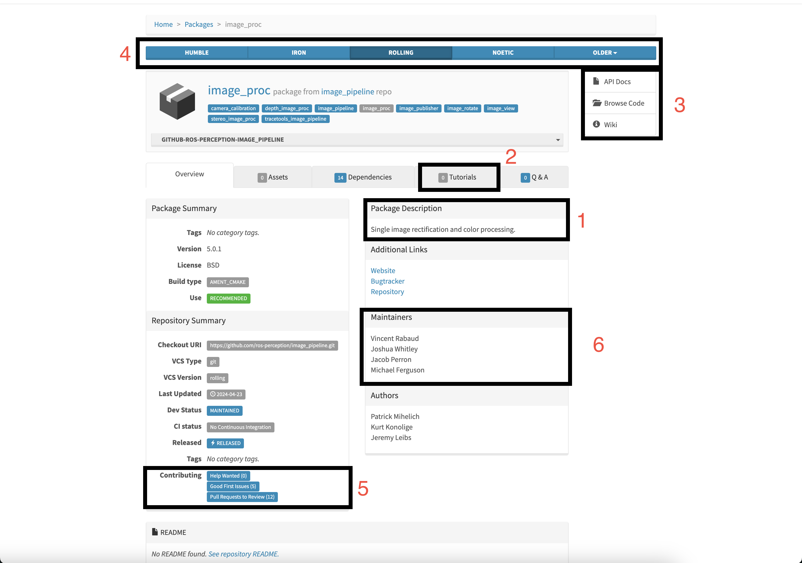

Effectively Searching the ROS 2 Ecosystem
#########################################

.. contents:: Table of Contents
   :depth: 2
   :local:

This guide introduces the standard way of searching for documentation for ROS 2 packages.
The best way to find solutions to one's problems will be using ROS Index to crawl through packages in the ROS 2 ecosystem.
One should find packages that would greatly benefit them and using the tutorials that go along with them, should only increase one's understanding.

Prerequisites
-------------

- `Open ROS Index <https://index.ros.org/>`

Finding a Beneficial Package
----------------------------

Locate the search bar in the middle of the screen:

Then utilize this to find either a specific package or search for the features of a package.
ROS Index has the capabilities to search through the available documentation and find keywords that match the given search.
If interested, one can `Create Documentation <https://docs.ros.org/en/rolling/How-To-Guides/Documenting-a-ROS-2-Package.html>` for their own packages.

For example if one wanted to do color processing on images they could either search `image_proc` or `image processing`.
After clicking the top package in the list, it will bring one to a page similar to `this <https://index.ros.org/p/image_proc/github-ros-perception-image_pipeline/#humble>`:

Breaking it Down
~~~~~~~~~~~~~~~~

1. `Package Description` The general description of the package, this should be similar to what was searched if it wasn't an exact package name.
2. `Tutorials` If there are any tutorials available in the documentation they will show up here.
Those looking to get started with a package should look here as the tutorials will often be up to date and well maintained by those who use the package often.
3. `Documentation` The original documentation and github repository where this data is found
4. `Distrobution` ROS 2 has `various distrobutions <>https://docs.ros.org/en/rolling/Releases.html ` which may have differences in design.
One should click the distrobution which most fits their needs.
5. `Contributing` This software is open source, so it needs the community's help to actively be maintained.
One should utilize this section if they wish to help solve issues, review pull requests, or are looking to see if an active fix is being deployed for a problem they encountered.
6. `Maintainers` Those in the community actively responsible for the development of the package.
While the maintainers have a vast amount of information one should use the `Robotics Stack Exchange <https://robotics.stackexchange.com/search?q=> ` with the [tag] of the package, if they want questions answered.
