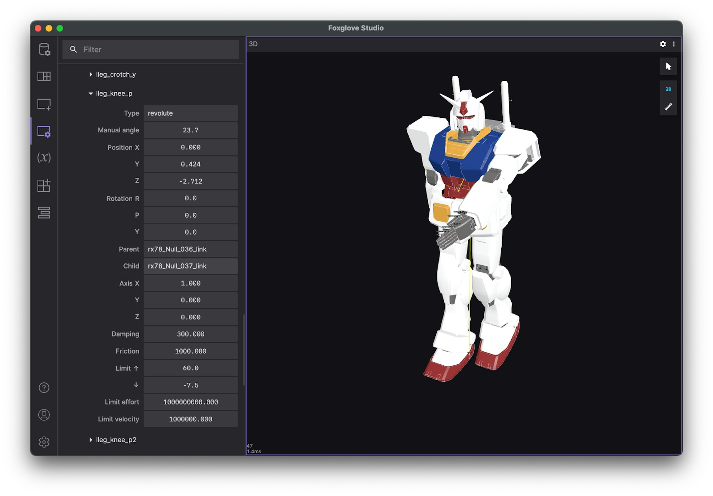

Visualizing ROS 2 data with Foxglove
====================================

`Foxglove <https://foxglove.dev/>`__ is a visualization and observability tool for robotics developers. It's available in the browser or as a standalone desktop app and is free for individual, small team, and academic use.

Installation
------------

To use Foxglove, you will need to `create an account <https://app.foxglove.dev/signup>`__. It's free and all you need is a valid email address.

Once you've created an account, you can use Foxglove on the web by opening Google Chrome and navigating to `app.foxglove.dev <https://app.foxglove.dev>`__.

To use the desktop app for Linux, macOS, or Windows, download it directly from the `Foxglove website <https://foxglove.dev/download>`__.

Connect to a live data source
-----------------------------

To connect to a live ROS 2 stack, you will need to `install the Foxglove ROS 2 bridge <https://docs.foxglove.dev/docs/connecting-to-data/ros-foxglove-bridge>`__ with:

.. code-block:: bash

   sudo apt install ros-$ROS_DISTRO-foxglove-bridge

Once you have the bridge installed, launch it with:

.. code-block:: bash

   ros2 launch foxglove_bridge foxglove_bridge_launch.xml

With the bridge running on your robot, you're ready to connect view live data from it in Foxglove. Make sure you are on the same network as your robot, open Foxglove (web or desktop) and click "Open connection".

Select the option for "Foxglove WebSocket" and enter your robot's WebSocket URL. The default is ``ws://localhost:8765``, however you can read about configuration options for the ROS Foxglove bridge `here <https://docs.foxglove.dev/docs/connecting-to-data/ros-foxglove-bridge#configuration-1`__.

.. note::

  Foxglove can also connect to using Rosbridge, however for performance and stability reasons we recommend using the Foxglove bridge.

View and replay recorded data
-----------------------------

If you'd rather visualize recorded data, you can use Foxglove to replay ROS 2 ``.mcap`` as well as older ROS 2 ``.db3``, and ROS 1 ``.bag`` files. Foxglove is particularly convenient for recorded data because it does not require a ROS 2 to be running to view data.

Use the :doc:`ros2 bag command line tool <../Tutorials/Beginner-CLI-Tools/Recording-And-Playing-Back-Data/Recording-And-Playing-Back-Data>` to record data from your robot to a ``.mcap`` file:

.. code-block:: bash

   ros2 bag record -a

From the Foxglove dashboard or menu, select "Open local file" and navigate to your recorded ``.mcap`` file.

See the Foxglove documentation for `more information about the types of data sources you can use with it <https://docs.foxglove.dev/docs/connecting-to-data/introduction/>`__.

Building layouts with panels
----------------------------

`Panels <https://docs.foxglove.dev/docs/visualization/panels/introduction>`__ allow you to visualize different specific types of data such as logs, maps, plots, and 3D information. Panels can be arranged by dragging and dropping them into Foxglove `layouts <https://foxglove.dev/docs/studio/layouts>`__ to view many types of data at once.

You can also save layouts for future use, or to share with your team.

Find the full list of available panels by clicking the "Add panel" icon in the upper left of the menu bar.

We've highlighted some particularly useful ones below:

3D: View 3D data and visualization markers
^^^^^^^^^^^^^^^^^^^^^^^^^^^^^^^^^^^^^^^^^^

Publish marker messages to add primitive shapes (arrows, spheres, etc.) and more complex visualizations (occupancy grids, point clouds, etc.) to your 3D panel's scene.

Choose the topics you want to display via the topic picker on the left, and configure each topic's visualization settings in the "Edit topic settings" menu.

.. image:: foxglove/3d.png
  :width: 500 px
  :alt: Foxglove Studio's 3D panel

Reference the `docs <https://foxglove.dev/docs/studio/panels/3d>`__ for a full list of `supported message types <https://foxglove.dev/docs/studio/panels/3d#supported-messages>`__ and some useful `user interactions <https://foxglove.dev/docs/studio/panels/3d#user-interactions>`__.

Diagnostics: Filter and sort diagnostics messages
^^^^^^^^^^^^^^^^^^^^^^^^^^^^^^^^^^^^^^^^^^^^^^^^^^^

Display the status of seen nodes (i.e. stale, error, warn, or OK) from topics with a ``diagnostic_msgs/msg/DiagnosticArray`` datatype in a running feed, and display the diagnostics data for a given ``diagnostic_name/hardware_id``.

.. image:: foxglove/diagnostics.png
  :width: 500 px
  :alt: Foxglove Studio's Diagnostics panel

Reference the `docs <https://foxglove.dev/docs/studio/panels/diagnostics>`__ for more details.

Image: View camera feed images
^^^^^^^^^^^^^^^^^^^^^^^^^^^^^^

Select a ``sensor_msgs/msg/Image`` or ``sensor_msgs/msg/CompressedImage`` topic to display.

.. image:: foxglove/image.png
  :width: 500 px
  :alt: Foxglove Studio's Image panel

Reference the `docs <https://foxglove.dev/docs/studio/panels/image>`__ for more details.

Log: View log messages
^^^^^^^^^^^^^^^^^^^^^^

To view ``rcl_interfaces/msg/Log`` messages live, use the desktop app to `connect <https://foxglove.dev/docs/studio/connection/native>`__ to your running ROS stack.
To view ``rcl_interfaces/msg/Log`` messages from a pre-recorded data file, you can drag-and-drop your file into either the `web <https://studio.foxglove.dev>`__ or desktop app.

Next, add a `Log <https://foxglove.dev/docs/studio/panels/log>`__ panel to your layout.
If you've connected to your ROS stack correctly, you should now see a list of your log messages, with the ability to filter them by node name or severity level.

Reference the `docs <https://foxglove.dev/docs/studio/panels/log>`__ for more details.

Plot: Plot arbitrary values over time
^^^^^^^^^^^^^^^^^^^^^^^^^^^^^^^^^^^^^

Plot arbitrary values from your topics' message paths over playback time.

Specify the topic values you want to plot along the y-axis.
For the x-axis, choose between plotting the y-axis value's timestamp, element index, or another custom topic message path.

.. image:: foxglove/plot.png
  :width: 500 px
  :alt: Foxglove Studio's Plot panel

Reference the `docs <https://foxglove.dev/docs/studio/panels/plot>`__ for more details.

Raw Messages: View incoming topic messages
^^^^^^^^^^^^^^^^^^^^^^^^^^^^^^^^^^^^^^^^^^

Display incoming topic data in an easy-to-read collapsible JSON tree format.

.. image:: foxglove/raw-messages.png
  :width: 500 px
  :alt: Foxglove Studio's Raw Messages panel

Reference the `docs <https://foxglove.dev/docs/studio/panels/raw-messages>`__ for more details.

Teleop: Teleoperate your robot
^^^^^^^^^^^^^^^^^^^^^^^^^^^^^^

Teleoperate your physical robot by publishing ``geometry_msgs/msg/Twist`` messages on a given topic back to your live ROS stack.

.. image:: foxglove/teleop.png
  :width: 300 px
  :alt: Foxglove Studio's URDF Viewer panel

Reference the `docs <https://foxglove.dev/docs/studio/panels/teleop>`__ for more details.

URDF Viewer: View and manipulate your URDF model
^^^^^^^^^^^^^^^^^^^^^^^^^^^^^^^^^^^^^^^^^^^^^^^^

To visualize and control your robot model in Foxglove Studio, open the web or desktop application and add a `URDF Viewer <https://foxglove.dev/docs/studio/panels/urdf-viewer>`__ panel to your layout.
Then, drag and drop your URDF file into that panel to visualize your robot model.

Select any topic publishing a ``JointState`` message to update the visualization based on the published joint states (defaults to ``/joint_states``).

Toggle to "Manual joint control" to set joint positions using the provided controls.

Reference the `docs <https://foxglove.dev/docs/studio/panels/urdf-viewer>`__ for more details.

Other basic actions
-------------------

1 View your ROS graph
^^^^^^^^^^^^^^^^^^^^^

`Using the desktop app <https://foxglove.dev/download>`__, `connect <https://foxglove.dev/docs/studio/connection/native>`__ to your running ROS stack.
Next, add a `Topic Graph <https://foxglove.dev/docs/studio/panels/topic-graph>`__ panel to your layout.
If you've connected to your ROS stack correctly, you should now see a computational graph of your ROS nodes, topics, and services in that panel.
Use the controls on the right side of the panel to select which topics to display or to toggle services.

2 View and edit your ROS params
^^^^^^^^^^^^^^^^^^^^^^^^^^^^^^^

`Using the desktop app <https://foxglove.dev/download>`__, `connect <https://foxglove.dev/docs/studio/connection/native>`__ to your running ROS stack.
Next, add a `Parameters <https://foxglove.dev/docs/studio/panels/parameters>`__ panel to your layout.
If you've connected to your ROS stack correctly, you should now see a live view of your current ``rosparams``.
You can edit these parameter values to publish ``rosparam`` updates back to your ROS stack.

3 Publish messages back to your live ROS stack
^^^^^^^^^^^^^^^^^^^^^^^^^^^^^^^^^^^^^^^^^^^^^^

`Using the desktop app <https://foxglove.dev/download>`__, `connect <https://foxglove.dev/docs/studio/connection/native>`__ to your running ROS stack.
Next, add a `Publish <https://foxglove.dev/docs/studio/panels/publish>`__ panel to your layout.

Specify the topic you want to publish on to infer its datatype and populate the text field with a JSON message template.

Selecting a datatype in the dropdown of common ROS datatypes will also populate the text field with a JSON message template.

Edit the template to customize your message before hitting "Publish".

.. image:: foxglove/publish.png
  :width: 300 px
  :alt: Foxglove Studio's Publish panel
