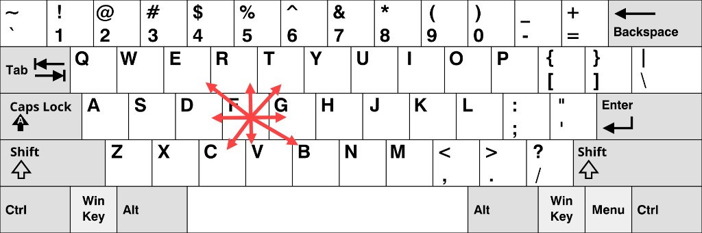

.. redirect-from::

    Tutorials/Understanding-ROS2-Actions
    Tutorials/Beginner-CLI-Tools/Understanding-ROS2-Actions/Understanding-ROS2-Actions

.. _ROS2Actions:

Learning about actions - tutorial
==================================

Actions are one of the communication types used for long-duration tasks in a ROS system.
This article walks you through using command-line tools to examine and send action goals.
A hands-on exercise with Turtlesim helps you understand how goals, feedback, and results work together.

**Area: Framework | Content-type: tutorial | Experience: beginner**

.. contents:: Contents
   :depth: 2
   :local:

Summary
-------

Actions provide a way to execute long-duration tasks with continuous feedback and the ability to cancel mid-execution.
An action client sends a goal to an action server.
The action server then acknowledges the goal, streams feedback, and returns a result when done.

For more information, see :doc:`About actions <../../../About-Actions>`.

Prerequisites
-------------

#. Make sure you understand the concepts of :doc:`nodes <../../../../nodes/Working-with-nodes/Understanding-ROS2-Nodes/Understanding-ROS2-Nodes>` and :doc:`topics <../../../topics/Understanding-ROS2-Topics/Understanding-ROS2-Topics>`.
#. You will need the :doc:`turtlesim package <../../../../../Get-Started/Introducing-Turtlesim/Introducing-Turtlesim>`.

Steps
-----

.. note::
    Remember to source ROS in every new terminal you open.
    See :doc:`Configuring environment <../../../../../Get-Started/Configuring-ROS2-Environment>`.

1 Setup
^^^^^^^

For this tutorial, you need to run two Turtlesim nodes: ``/turtlesim`` and ``/teleop_turtle``.

Open a new terminal and run:

.. code-block:: console

  $ ros2 run turtlesim turtlesim_node

Open another terminal and run:

.. code-block:: console

  $ ros2 run turtlesim turtle_teleop_key

2 Use actions
^^^^^^^^^^^^^

When you launch the ``/teleop_turtle`` node, you will see the following message in your terminal:

.. code-block:: console

    Use arrow keys to move the turtle.
    Use G|B|V|C|D|E|R|T keys to rotate to absolute orientations. 'F' to cancel a rotation.

The first line corresponds to the ``cmd_vel`` topic, covered in :doc:`Learning about topics <../../../topics/Understanding-ROS2-Topics/Understanding-ROS2-Topics>`.
The second line corresponds to an action.

Notice that the letter keys :kbd:`G`, :kbd:`B`, :kbd:`V`, :kbd:`C`, :kbd:`D`, :kbd:`E`, :kbd:`R`, and :kbd:`T` surround the :kbd:`F` key on a US QWERTY keyboard.
Each key's position around :kbd:`F` corresponds to that orientation in Turtlesim.
For example, the :kbd:`E` key will rotate the turtle's orientation to the upper left corner.

The figure shows those orientation keys on a QWERTY layout.
Teleoperation uses the letters themselves, so if you use a different layout such as Dvorak, press the same letters, even if they do not surround the :kbd:`F` key on your keyboard.

The results are displayed in the terminal where the ``/turtlesim`` node is running.
Each time you press one of these keys, you send a goal to an action server that is part of the ``/turtlesim`` node.
The goal is to rotate the turtle to face a particular direction.
After the turtle completes its rotation, the terminal should display the result:

.. code-block:: console

    [INFO] [turtlesim]: Rotation goal completed successfully

The :kbd:`F` key cancels a goal mid-execution.

Try pressing the :kbd:`C` key, and then pressing the :kbd:`F` key before the turtle can complete its rotation.
In the terminal where the ``/turtlesim`` node is running, you should see the following message:

.. code-block:: console

  [INFO] [turtlesim]: Rotation goal canceled

Not only can the client side (your input in the teleoperation node) stop a goal, but the server side (the ``/turtlesim`` node) can as well.
When the server side stops processing a goal before the goal is completed, this is known as "aborting" the goal.

Press the :kbd:`D` key, then the :kbd:`G` key before the first rotation can complete.
In the terminal where the ``/turtlesim`` node is running, you should see the message:

.. code-block:: console

  [WARN] [turtlesim]: Rotation goal received before a previous goal finished. Aborting previous goal

When a new goal arrives while another is still running, what happens next depends on the action server implementation.
ROS does not define a single policy for this case.
The goal callback of the server can accept or reject the new goal, and then decides what to do with any goal that is already running.
In Turtlesim, the callback accepts the new goal and aborts the previous one, but a different server might reject the new goal, or keep both.

For more information, see :doc:`About actions <../../../About-Actions>` and the `Actions design article <https://design.ros2.org/articles/actions.html>`_.

3 List all the actions of a node
^^^^^^^^^^^^^^^^^^^^^^^^^^^^^^^^

To see the list of actions a node provides, run:

.. code-block:: console

  $ ros2 node info /turtlesim

The terminal returns:

.. code-block:: console

  /turtlesim
    Subscribers:
      /parameter_events: rcl_interfaces/msg/ParameterEvent
      /turtle1/cmd_vel: geometry_msgs/msg/Twist
    Publishers:
      /parameter_events: rcl_interfaces/msg/ParameterEvent
      /rosout: rcl_interfaces/msg/Log
      /turtle1/color_sensor: turtlesim_msgs/msg/Color
      /turtle1/pose: turtlesim_msgs/msg/Pose
    Service Servers:
      /clear: std_srvs/srv/Empty
      /kill: turtlesim_msgs/srv/Kill
      /reset: std_srvs/srv/Empty
      /spawn: turtlesim_msgs/srv/Spawn
      /turtle1/set_pen: turtlesim_msgs/srv/SetPen
      /turtle1/teleport_absolute: turtlesim_msgs/srv/TeleportAbsolute
      /turtle1/teleport_relative: turtlesim_msgs/srv/TeleportRelative
      /turtlesim/describe_parameters: rcl_interfaces/srv/DescribeParameters
      /turtlesim/get_parameter_types: rcl_interfaces/srv/GetParameterTypes
      /turtlesim/get_parameters: rcl_interfaces/srv/GetParameters
      /turtlesim/list_parameters: rcl_interfaces/srv/ListParameters
      /turtlesim/set_parameters: rcl_interfaces/srv/SetParameters
      /turtlesim/set_parameters_atomically: rcl_interfaces/srv/SetParametersAtomically
    Service Clients:

    Action Servers:
      /turtle1/rotate_absolute: turtlesim_msgs/action/RotateAbsolute
    Action Clients:

The command returns a list of ``/turtlesim``'s subscribers, publishers, services, action servers and action clients.

Notice that the ``/turtle1/rotate_absolute`` action for ``/turtlesim`` is under ``Action Servers``.
This means ``/turtlesim`` responds to and provides feedback for the ``/turtle1/rotate_absolute`` action.

The ``/teleop_turtle`` node has the name ``/turtle1/rotate_absolute`` under ``Action Clients``, meaning that it sends goals for that action.

To see the list, run:

.. code-block:: console

  $ ros2 node info /teleop_turtle

The terminal returns:

.. code-block:: console

  /teleop_turtle
    Subscribers:
      /parameter_events: rcl_interfaces/msg/ParameterEvent
    Publishers:
      /parameter_events: rcl_interfaces/msg/ParameterEvent
      /rosout: rcl_interfaces/msg/Log
      /turtle1/cmd_vel: geometry_msgs/msg/Twist
    Service Servers:
      /teleop_turtle/describe_parameters: rcl_interfaces/srv/DescribeParameters
      /teleop_turtle/get_parameter_types: rcl_interfaces/srv/GetParameterTypes
      /teleop_turtle/get_parameters: rcl_interfaces/srv/GetParameters
      /teleop_turtle/list_parameters: rcl_interfaces/srv/ListParameters
      /teleop_turtle/set_parameters: rcl_interfaces/srv/SetParameters
      /teleop_turtle/set_parameters_atomically: rcl_interfaces/srv/SetParametersAtomically
    Service Clients:

    Action Servers:

    Action Clients:
      /turtle1/rotate_absolute: turtlesim_msgs/action/RotateAbsolute

4 Identify all the actions in the ROS graph
^^^^^^^^^^^^^^^^^^^^^^^^^^^^^^^^^^^^^^^^^^^

To identify all the actions in the ROS graph, run:

.. code-block:: console

  $ ros2 action list

The terminal returns:

.. code-block:: console

  /turtle1/rotate_absolute

This is the only action in the ROS graph right now.
``rotate_absolute`` controls the turtle's rotation.
From the ``ros2 node info`` output, there is one action client (part of ``/teleop_turtle``) and one action server (part of ``/turtlesim``) for this action.

4.1 List all actions and their types
~~~~~~~~~~~~~~~~~~~~~~~~~~~~~~~~~~~~

Like topics and services, actions have types.

To list every active action with its type, run:

.. code-block:: console

  $ ros2 action list -t

The terminal returns:

.. code-block:: console

  /turtle1/rotate_absolute [turtlesim_msgs/action/RotateAbsolute]

Right now there is only one action, so the list has a single entry.
In each line, the action name comes first, followed by the action type in brackets.
In this case, ``/turtle1/rotate_absolute`` is the action name and ``turtlesim_msgs/action/RotateAbsolute`` is the type.
You will use that type later when you send a goal.

5 List the type of an action
^^^^^^^^^^^^^^^^^^^^^^^^^^^^

To check the type of the ``/turtle1/rotate_absolute`` action, run:

.. code-block:: console

  $ ros2 action type /turtle1/rotate_absolute

The terminal returns:

.. code-block:: console

  turtlesim_msgs/action/RotateAbsolute

6 View the details of an action
^^^^^^^^^^^^^^^^^^^^^^^^^^^^^^^

To further introspect the ``/turtle1/rotate_absolute`` action, run:

.. code-block:: console

  $ ros2 action info /turtle1/rotate_absolute

The terminal returns:

.. code-block:: console

  Action: /turtle1/rotate_absolute
  Type: turtlesim_msgs/action/RotateAbsolute
  Action clients: 1
      /teleop_turtle
  Action servers: 1
      /turtlesim

This confirms what ``ros2 node info`` showed: the ``/teleop_turtle`` node has an action client and the ``/turtlesim`` node has an action server for the ``/turtle1/rotate_absolute`` action.

6.1 View detailed action information
~~~~~~~~~~~~~~~~~~~~~~~~~~~~~~~~~~~~

To get more detailed information about an action, use the ``--verbose`` (or ``-v``) option:

.. code-block:: console

  $ ros2 action info /turtle1/rotate_absolute --verbose

Besides the action type and the number of clients and servers, the verbose result shows the node name, namespace, endpoint type, type hash, globally unique identifier (GID), and quality of service (QoS) profile for each action client and server.
It groups this information by the five services and topics that implement an action: the goal, cancel, and result services, and the feedback and status topics.

The terminal returns:

.. code-block:: console

  Action: /turtle1/rotate_absolute
  Type: turtlesim_msgs/action/RotateAbsolute
  Action clients: 1
  Node name: teleop_turtle
  Node namespace: /
  Action type: turtlesim_msgs/action/RotateAbsolute
  Endpoint type: CLIENT
  Goal service:
    Service type: turtlesim_msgs/action/RotateAbsolute_SendGoal
    Service type hash: RIHS01_3d5d3cfcbb721f88038eaedcd4af95565360a82b36f1983e3a6c7448d2d18fbe
    Endpoint count: 1
    GID: 58.a3.b2.bb.0f.71.4b.00.86.21.74.db.f8.50.6d.f1
    QoS profile:
      Reliability: RELIABLE
      History (Depth): KEEP_LAST (10)
      Durability: VOLATILE
      Lifespan: Infinite
      Deadline: Infinite
      Liveliness: AUTOMATIC
      Liveliness lease duration: Infinite
  Cancel service:
    Service type: action_msgs/srv/CancelGoal
    Service type hash: RIHS01_573d8b0a534451d7bc2ac8c5ffde8ac14b8593b7001175d0cd6516dcbeb8689a
    Endpoint count: 1
    GID: f5.b6.de.83.ef.5d.5e.b4.bf.4e.7e.09.a0.a1.f1.e6
    QoS profile:
      Reliability: RELIABLE
      History (Depth): KEEP_LAST (10)
      Durability: VOLATILE
      Lifespan: Infinite
      Deadline: Infinite
      Liveliness: AUTOMATIC
      Liveliness lease duration: Infinite
  Result service:
    Service type: turtlesim_msgs/action/RotateAbsolute_GetResult
    Service type hash: RIHS01_f96fd02477be2a47122fca142e960d407b24850c6eac72047872ba764473c4ef
    Endpoint count: 1
    GID: 9d.3a.ec.00.16.b4.74.1a.cc.72.c5.0a.b9.f7.50.3a
    QoS profile:
      Reliability: RELIABLE
      History (Depth): KEEP_LAST (10)
      Durability: VOLATILE
      Lifespan: Infinite
      Deadline: Infinite
      Liveliness: AUTOMATIC
      Liveliness lease duration: Infinite
  Feedback topic:
    Topic type: turtlesim_msgs/action/RotateAbsolute_FeedbackMessage
    Topic type hash: RIHS01_bef10993e1ee82b35f99f7e390bac1e6cc64e2a3090536887832e122aa71f1b5
    GID: 33.cd.0e.59.6a.da.e8.00.86.48.aa.84.0a.94.98.cd
    QoS profile:
      Reliability: RELIABLE
      History (Depth): KEEP_LAST (10)
      Durability: VOLATILE
      Lifespan: Infinite
      Deadline: Infinite
      Liveliness: AUTOMATIC
      Liveliness lease duration: Infinite
  Status topic:
    Topic type: action_msgs/msg/GoalStatusArray
    Topic type hash: RIHS01_6c1684b00f177d37438febe6e709fc4e2b0d4248dca4854946f9ed8b30cda83e
    GID: 26.36.ed.69.7c.5d.a9.77.c5.7a.b0.5e.13.49.b5.77
    QoS profile:
      Reliability: RELIABLE
      History (Depth): KEEP_LAST (1)
      Durability: TRANSIENT_LOCAL
      Lifespan: Infinite
      Deadline: Infinite
      Liveliness: AUTOMATIC
      Liveliness lease duration: Infinite

  Action servers: 1
  Node name: turtlesim
  Node namespace: /
  Action type: turtlesim_msgs/action/RotateAbsolute
  Endpoint type: SERVER
  Goal service:
    Service type: turtlesim_msgs/action/RotateAbsolute_SendGoal
    Service type hash: RIHS01_3d5d3cfcbb721f88038eaedcd4af95565360a82b36f1983e3a6c7448d2d18fbe
    Endpoint count: 1
    GID: ea.d4.17.fc.c4.af.65.09.b7.e4.60.96.b8.4f.04.d9
    QoS profile:
      Reliability: RELIABLE
      History (Depth): KEEP_LAST (10)
      Durability: VOLATILE
      Lifespan: Infinite
      Deadline: Infinite
      Liveliness: AUTOMATIC
      Liveliness lease duration: Infinite
  Cancel service:
    Service type: action_msgs/srv/CancelGoal
    Service type hash: RIHS01_573d8b0a534451d7bc2ac8c5ffde8ac14b8593b7001175d0cd6516dcbeb8689a
    Endpoint count: 1
    GID: 13.30.8c.df.fc.73.3e.61.5e.9c.c6.36.ce.05.30.3e
    QoS profile:
      Reliability: RELIABLE
      History (Depth): KEEP_LAST (10)
      Durability: VOLATILE
      Lifespan: Infinite
      Deadline: Infinite
      Liveliness: AUTOMATIC
      Liveliness lease duration: Infinite
  Result service:
    Service type: turtlesim_msgs/action/RotateAbsolute_GetResult
    Service type hash: RIHS01_f96fd02477be2a47122fca142e960d407b24850c6eac72047872ba764473c4ef
    Endpoint count: 1
    GID: 56.e0.d1.76.92.06.62.9d.cc.b6.55.3e.84.84.a5.31
    QoS profile:
      Reliability: RELIABLE
      History (Depth): KEEP_LAST (10)
      Durability: VOLATILE
      Lifespan: Infinite
      Deadline: Infinite
      Liveliness: AUTOMATIC
      Liveliness lease duration: Infinite
  Feedback topic:
    Topic type: turtlesim_msgs/action/RotateAbsolute_FeedbackMessage
    Topic type hash: RIHS01_bef10993e1ee82b35f99f7e390bac1e6cc64e2a3090536887832e122aa71f1b5
    GID: 44.ea.b3.79.f7.ba.2a.08.c4.1a.9b.3b.57.f8.7a.e5
    QoS profile:
      Reliability: RELIABLE
      History (Depth): KEEP_LAST (10)
      Durability: VOLATILE
      Lifespan: Infinite
      Deadline: Infinite
      Liveliness: AUTOMATIC
      Liveliness lease duration: Infinite
  Status topic:
    Topic type: action_msgs/msg/GoalStatusArray
    Topic type hash: RIHS01_6c1684b00f177d37438febe6e709fc4e2b0d4248dca4854946f9ed8b30cda83e
    GID: 64.f6.5d.c4.68.8c.06.a4.f8.07.ef.f7.78.a7.57.30
    QoS profile:
      Reliability: RELIABLE
      History (Depth): KEEP_LAST (1)
      Durability: TRANSIENT_LOCAL
      Lifespan: Infinite
      Deadline: Infinite
      Liveliness: AUTOMATIC
      Liveliness lease duration: Infinite

The GIDs in your output will differ because they uniquely identify endpoints in the running ROS graph.
Endpoint counts and QoS settings can also differ depending on the RMW implementation and runtime configuration.

7 View the structure of the action type
^^^^^^^^^^^^^^^^^^^^^^^^^^^^^^^^^^^^^^^

Before sending an action goal, you need to know the structure of the action type.

From the ``ros2 action list -t`` output, the type of ``/turtle1/rotate_absolute`` is ``turtlesim_msgs/action/RotateAbsolute``.
To see its structure, run:

.. code-block:: console

  $ ros2 interface show turtlesim_msgs/action/RotateAbsolute

The output should look like this:

.. code-block:: text

  # The desired heading in radians
  float32 theta
  ---
  # The angular displacement in radians to the starting position
  float32 delta
  ---
  # The remaining rotation in radians
  float32 remaining

The section before the first ``---`` is the structure of the goal request.
The next section is the structure of the result.
The last section is the structure of the feedback.

8 Send an action goal from the command line
^^^^^^^^^^^^^^^^^^^^^^^^^^^^^^^^^^^^^^^^^^^

To send an action goal from the command line, use:

.. code-block:: console

  $ ros2 action send_goal <action_name> <action_type> <values>

``<values>`` need to be in YAML format.

The goal field ``theta`` is the desired orientation in radians.
The value is absolute, not a relative turn amount.
A value of ``1.57`` is about :math:`\pi/2` radians, so the turtle turns to face roughly a quarter turn from the default rightward orientation.

Keep an eye on the Turtlesim window, then run:

.. code-block:: console

  $ ros2 action send_goal /turtle1/rotate_absolute turtlesim_msgs/action/RotateAbsolute "{theta: 1.57}"

The terminal returns:

.. code-block:: console

  Waiting for an action server to become available...
  Sending goal:
     theta: 1.57

  Goal accepted with ID: f8db8f44410849eaa93d3feb747dd444

  Result:
    delta: -1.568000316619873

  Goal finished with status: SUCCEEDED

You should see the turtle rotating.

All goals have a unique ID, shown in the return message.
You can also see the result, a field with the name ``delta``, which is the displacement to the starting position.

To see the feedback of this goal, add ``--feedback`` to the ``ros2 action send_goal`` command:

.. code-block:: console

  $ ros2 action send_goal /turtle1/rotate_absolute turtlesim_msgs/action/RotateAbsolute "{theta: -1.57}" --feedback

The terminal returns:

.. code-block:: console

  Sending goal:
     theta: -1.57

  Goal accepted with ID: e6092c831f994afda92f0086f220da27

  Feedback:
    remaining: -3.1268222332000732

  Feedback:
    remaining: -3.1108222007751465

  …

  Result:
    delta: 3.1200008392333984

  Goal finished with status: SUCCEEDED

You should continue to receive feedback, the remaining radians, until the goal is complete.

.. _understanding-actions-ros2-action-echo:

9 View the communication between an action client and action server
^^^^^^^^^^^^^^^^^^^^^^^^^^^^^^^^^^^^^^^^^^^^^^^^^^^^^^^^^^^^^^^^^^^

.. note::

   This feature is available on ``Kilted Kaiju`` or later.

To see the data communication between an action client and an action server, use:

.. code-block:: console

  $ ros2 action echo <action_name> <optional arguments/action_type>

``ros2 action echo`` requires action introspection, which is disabled by default.
To enable it, call ``configure_introspection`` after creating an action client or server.

Start up the ``fibonacci_action_server`` and ``fibonacci_action_client``, enabling the ``action_server_configure_introspection`` parameter for demonstration:

.. code-block:: console

  $ ros2 run action_tutorials_cpp fibonacci_action_server --ros-args -p action_server_configure_introspection:=contents

.. code-block:: console

  $ ros2 run action_tutorials_py fibonacci_action_client --ros-args -p action_client_configure_introspection:=contents

To see the action communication between ``fibonacci_action_server`` and ``fibonacci_action_client``, run:

.. code-block:: console

   $ ros2 action echo /fibonacci example_interfaces/action/Fibonacci --flow-style

The terminal shows events for the goal, feedback, and result traffic:

.. code-block:: console

   interface: GOAL_SERVICE
   info:
     event_type: REQUEST_SENT
     stamp:
       sec: 1742070798
       nanosec: 400435819
     client_gid: [1, 15, 165, 231, 194, 197, 167, 157, 0, 0, 0, 0, 0, 0, 20, 4]
     sequence_number: 1
   request: [{goal_id: {uuid: [230, 96, 12, 6, 100, 69, 69, 70, 220, 205, 135, 251, 210, 2, 231, 110]}, goal: {order: 10}}]
   response: []
   ---
   interface: GOAL_SERVICE
   info:
     event_type: REQUEST_RECEIVED
     stamp:
       sec: 1742070798
       nanosec: 400706446
     client_gid: [1, 15, 165, 231, 194, 197, 167, 157, 0, 0, 0, 0, 0, 0, 20, 4]
     sequence_number: 1
   request: [{goal_id: {uuid: [230, 96, 12, 6, 100, 69, 69, 70, 220, 205, 135, 251, 210, 2, 231, 110]}, goal: {order: 10}}]
   response: []
   ---
   interface: RESULT_SERVICE
   info:
     event_type: REQUEST_SENT
     stamp:
       sec: 1742070798
       nanosec: 401486678
     client_gid: [1, 15, 165, 231, 194, 197, 167, 157, 0, 0, 0, 0, 0, 0, 24, 4]
     sequence_number: 1
   request: [{goal_id: {uuid: [230, 96, 12, 6, 100, 69, 69, 70, 220, 205, 135, 251, 210, 2, 231, 110]}}]
   response: []
   ---
   interface: FEEDBACK_TOPIC
   goal_id:
     uuid: [230, 96, 12, 6, 100, 69, 69, 70, 220, 205, 135, 251, 210, 2, 231, 110]
   feedback:
     sequence: [0, 1, 1]
   ---
   interface: STATUS_TOPIC
   status_list: [{goal_info: {goal_id: {uuid: [230, 96, 12, 6, 100, 69, 69, 70, 220, 205, 135, 251, 210, 2, 231, 110]}, stamp: {sec: 1742070798, nanosec: 401146752}}, status: 2}]
   ---
   ...

Related content
---------------

More articles:

* :doc:`Learning about topics <../../../topics/Understanding-ROS2-Topics/Understanding-ROS2-Topics>`
* :doc:`Learning about services <../../../services/Working-with-services/Understanding-ROS2-Services/Understanding-ROS2-Services>`
* :doc:`Interfaces (topics, services, actions) <../../../../Interfaces-Topics-Services-Actions>`

External resources:

* `Actions design article <https://design.ros2.org/articles/actions.html>`_: background on the design decisions behind actions in ROS.

FAQs
----

What is the difference between an action and a service?
   Services use a single call-and-response: a client sends a request and receives one response.
   Actions are for long-duration tasks: a client sends a goal, receives a continuous stream of feedback while the task runs, and gets a final result on completion.
   Actions can also be cancelled mid-execution.

What happens if a new goal is sent before the current one finishes?
   It depends on the action server's implementation.
   The Turtlesim server aborts the current goal when it receives a new one, but a server could also reject the new goal or defer it.
   Do not assume every action server aborts the current goal automatically.
   See :doc:`About actions <../../../About-Actions>` and the `Actions design article <https://design.ros2.org/articles/actions.html>`_.

Can an action be cancelled from either side?
   Yes.
   The client can cancel a goal at any time.
   The server can also abort a goal, for example when its implementation replaces a running goal with a new one.

What is the structure of an action type?
   An action type has three sections separated by ``---``: the goal (sent by the client), the result (returned when the action completes), and the feedback (streamed while the action is running).
