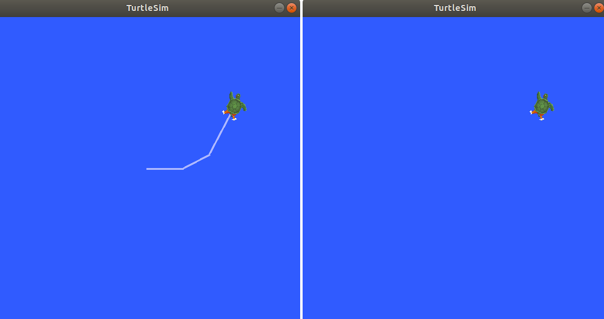
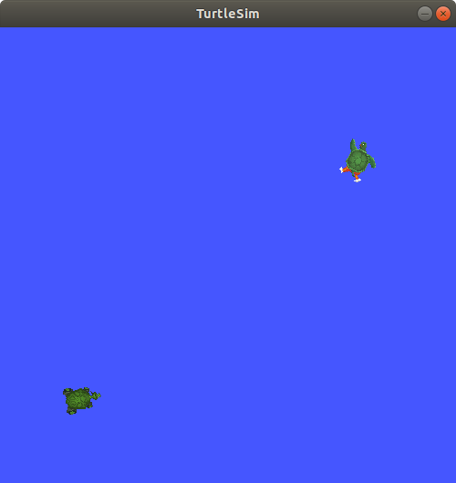

.. redirect-from::

    Tutorials/Services/Understanding-ROS2-Services
    Tutorials/Beginner-CLI-Tools/Understanding-ROS2-Services/Understanding-ROS2-Services

.. _ROS2Services:

Learning about services - tutorial
===================================

Services are one of the communication types used to exchange data in a ROS system.
This article walks you through using command-line tools to examine and call services between nodes.
A hands-on exercise with Turtlesim helps you understand how the call-and-response model works in the ROS graph.

**Area: Framework | Content-type: tutorial | Experience: beginner**

.. contents:: Contents
   :depth: 2
   :local:

Summary
-------

Services use a call-and-response model: a client sends a request to a server, which processes it and returns a response.
Unlike topics, services only provide data when specifically called, so they are not suited for continuous data streams.

For more information, see :doc:`How ROS works <../../../../How-ROS-Works>`.

Prerequisites
-------------

#. Make sure you understand the concepts of :doc:`nodes <../../../../nodes/Working-with-nodes/Understanding-ROS2-Nodes/Understanding-ROS2-Nodes>` and :doc:`topics <../../../topics/Understanding-ROS2-Topics/Understanding-ROS2-Topics>`.
#. Make sure you have installed the :doc:`turtlesim package <../../../../../Get-Started/Introducing-Turtlesim/Introducing-Turtlesim>`.

Steps
-----

.. note::
    Do not forget to source ROS in every new terminal you open.
    See :doc:`Configuring environment <../../../../../Get-Started/Configuring-ROS2-Environment>`.

1 Setup
^^^^^^^

You need a running system with services to inspect.
Start the ``/turtlesim`` node, which provides the application services you will examine and call later (such as ``/clear`` and ``/spawn``).

Open a new terminal and run:

.. code-block:: console

  $ ros2 run turtlesim turtlesim_node

Open another terminal and run:

.. code-block:: console

  $ ros2 run turtlesim turtle_teleop_key

Running this node along with ``turtlesim_node`` lets you see that each node exposes its own set of parameter services when you list services.

Leave both terminals running while you work through the Turtlesim examples below.

2 List the active services
^^^^^^^^^^^^^^^^^^^^^^^^^^

Listing services is useful when you need to discover what you can call on a running system.
To list all the services currently active in the system, in a new terminal, run:

.. code-block:: console

  $ ros2 service list

The terminal returns the active service names:

.. code-block:: console

  /clear
  /kill
  /reset
  /spawn
  /teleop_turtle/describe_parameters
  /teleop_turtle/get_parameter_types
  /teleop_turtle/get_parameters
  /teleop_turtle/list_parameters
  /teleop_turtle/set_parameters
  /teleop_turtle/set_parameters_atomically
  /turtle1/set_pen
  /turtle1/teleport_absolute
  /turtle1/teleport_relative
  /turtlesim/describe_parameters
  /turtlesim/get_parameter_types
  /turtlesim/get_parameters
  /turtlesim/list_parameters
  /turtlesim/set_parameters
  /turtlesim/set_parameters_atomically

Both Turtlesim nodes have the same six services with ``parameters`` in their names.
Nearly every node in ROS has these infrastructure services on which parameters are based.
Parameters are covered in :doc:`Learning about parameters <../../../../parameters/Working-with-parameters/Understanding-ROS2-Parameters/Understanding-ROS2-Parameters>`.
In this tutorial, the parameter services will not be discussed in detail.

The turtlesim-specific services are ``/clear``, ``/kill``, ``/reset``, ``/spawn``, ``/turtle1/set_pen``, ``/turtle1/teleport_absolute``, and ``/turtle1/teleport_relative``.
Some of these services were covered in the :doc:`Using turtlesim, ros2, and rqt <../../../../../Get-Started/Introducing-Turtlesim/Introducing-Turtlesim>` tutorial.

3 View the service type
^^^^^^^^^^^^^^^^^^^^^^^

Before you call a service, you need its type so you know what request and response data it expects.
Services have types that describe how that data is structured.
Service types are defined similarly to topic types, except service types have two parts: one message for the request and another for the response.

To find out the type of a service, run:

.. code-block:: console

  $ ros2 service type <service_name>

For example, to check Turtlesim's ``/clear`` service, open a new terminal and run:

.. code-block:: console

  $ ros2 service type /clear

The terminal returns:

.. code-block:: console

  std_srvs/srv/Empty

The ``Empty`` type means the service call sends no data when making a request and receives no data when receiving a response.

3.1 View a list of all active services
~~~~~~~~~~~~~~~~~~~~~~~~~~~~~~~~~~~~~~

When you need a quick overview of every service and its type together, append the ``--show-types`` option (abbreviated as ``-t``) to the ``list`` command:

.. code-block:: console

  $ ros2 service list -t

The terminal returns each service with its type:

.. code-block:: console

  /clear [std_srvs/srv/Empty]
  /kill [turtlesim_msgs/srv/Kill]
  /reset [std_srvs/srv/Empty]
  /spawn [turtlesim_msgs/srv/Spawn]
  ...
  /turtle1/set_pen [turtlesim_msgs/srv/SetPen]
  /turtle1/teleport_absolute [turtlesim_msgs/srv/TeleportAbsolute]
  /turtle1/teleport_relative [turtlesim_msgs/srv/TeleportRelative]
  ...

4 View the information about a particular service
^^^^^^^^^^^^^^^^^^^^^^^^^^^^^^^^^^^^^^^^^^^^^^^^^

Use ``ros2 service info`` to see a service's type and how many clients and servers are using it.

To inspect a particular service, run:

.. code-block:: console

  $ ros2 service info <service_name>

For example, to check the ``/clear`` service, run:

.. code-block:: console

  $ ros2 service info /clear

The terminal returns:

.. code-block:: console

   Type: std_srvs/srv/Empty
   Clients count: 0
   Services count: 1

To see more detail about the same service, including which node provides it, append the ``--verbose`` (or ``-v``) option:

.. code-block:: console

  $ ros2 service info --verbose <service_name>

.. note::
    The ``--verbose`` option is available on Lyrical.
    Older distributions do not support it.

For example, to get verbose information about the ``/clear`` service:

.. code-block:: console

  $ ros2 service info --verbose /clear

Besides the basic type and client/server counts, the verbose result also shows which node provides the service and the low-level connection details from the ROS middleware (RMW).
You mainly need those details when troubleshooting connection problems with a service.
The ``Endpoint count`` value is ``2`` for DDS-based RMW implementations (``rmw_connextdds``, ``rmw_cyclonedds``, ``rmw_fastrtps``) because DDS creates two endpoints per service server: one for request and one for response.

.. code-block:: console

    Type: std_srvs/srv/Empty
    Clients count: 0
    Services count: 1
    Node name: turtlesim
    Node namespace: /
    Service type: std_srvs/srv/Empty
    Service type hash: RIHS01_5888399dedec5ccc85ea6451949fd2c9f97bfdf963f9a588821639fcd31b5d19
    Endpoint type: SERVER
    Endpoint count: 2
    GIDs:
    - Request Reader : 01.0f.93.f0.07.92.53.47.00.00.00.00.00.00.13.04
    - Response Writer : 01.0f.93.f0.07.92.53.47.00.00.00.00.00.00.14.03
    QoS profiles:
    - Request Reader :
          Reliability: RELIABLE
          History (Depth): KEEP_LAST (10)
          Durability: VOLATILE
          Lifespan: Infinite
          Deadline: Infinite
          Liveliness: AUTOMATIC
          Liveliness lease duration: Infinite
    - Response Writer :
          Reliability: RELIABLE
          History (Depth): KEEP_LAST (10)
          Durability: VOLATILE
          Lifespan: Infinite
          Deadline: Infinite
          Liveliness: AUTOMATIC
          Liveliness lease duration: Infinite

For non-DDS RMW implementations such as ``rmw_zenoh_cpp``, the ``Endpoint count`` value is ``1`` because a single endpoint handles both request and response.

.. code-block:: console

    Type: std_srvs/srv/Empty
    Clients count: 0
    Services count: 1
    Node name: turtlesim
    Node namespace: /
    Service type: std_srvs/srv/Empty
    Service type hash: RIHS01_5888399dedec5ccc85ea6451949fd2c9f97bfdf963f9a588821639fcd31b5d19
    Endpoint type: SERVER
    Endpoint count: 1
    GID: 59.b0.ea.78.57.3c.52.b4.c6.e9.af.44.22.3d.7c.f5
    QoS profile:
      Reliability: RELIABLE
      History (Depth): KEEP_LAST (10)
      Durability: VOLATILE
      Lifespan: Infinite
      Deadline: Infinite
      Liveliness: AUTOMATIC
      Liveliness lease duration: Infinite

To learn more about different RMW implementations, see :doc:`About Different Middleware Vendors <../../../../client-libraries/About-Different-Middleware-Vendors>`.

5 Find services of a specific type
^^^^^^^^^^^^^^^^^^^^^^^^^^^^^^^^^^

Use ``ros2 service find`` when you know the type you need and want every service that uses it.
For example, you can find all ``Empty`` services in the graph.

To find all the services of a specific type, run:

.. code-block:: console

  $ ros2 service find <type_name>

To find all ``Empty`` typed services, run:

.. code-block:: console

  $ ros2 service find std_srvs/srv/Empty

The terminal returns:

.. code-block:: console

  /clear
  /reset

6 View the arguments of the call and response for a service type
^^^^^^^^^^^^^^^^^^^^^^^^^^^^^^^^^^^^^^^^^^^^^^^^^^^^^^^^^^^^^^^^

Before you call a service with arguments, inspect its type so you know which fields the request needs and what the response contains.

To inspect a service type's structure, run:

.. code-block:: console

  $ ros2 interface show <type_name>

Try the following command on the ``/clear`` service's type, ``Empty``:

.. code-block:: console

  $ ros2 interface show std_srvs/srv/Empty

The terminal returns:

.. code-block:: console

  ---

The ``---`` separates the request structure from the response structure.
The ``Empty`` type doesn't send or receive any data, so its structure is blank above and below the separator.

Let's introspect a service with a type that sends and receives data, like ``/spawn``.
From the results of ``ros2 service list -t``, we know ``/spawn``'s type is ``turtlesim_msgs/srv/Spawn``.

To see the request and response arguments of the ``/spawn`` service, run:

.. code-block:: console

  $ ros2 interface show turtlesim_msgs/srv/Spawn

The terminal returns:

.. code-block:: console

  float32 x
  float32 y
  float32 theta
  string name # Optional.  A unique name will be created and returned if this is empty
  ---
  string name

The text above the separator lists the arguments needed to call ``/spawn``:
``x``, ``y`` and ``theta`` determine the 2D pose of the spawned turtle, and ``name`` is optional.

The text below the separator line is the response.
In this case, the response is the name assigned to the new turtle.

7 Call a service from the command line
^^^^^^^^^^^^^^^^^^^^^^^^^^^^^^^^^^^^^^

Now that you know the service names, types, and argument layouts, you can send requests from the command line.

To call a service, use:

.. code-block:: console

  $ ros2 service call <service_name> <service_type> <arguments>

The ``<arguments>`` part is optional.
For example, ``Empty`` typed services don't have any arguments:

.. code-block:: console

  $ ros2 service call /clear std_srvs/srv/Empty

This clears the Turtlesim window of any lines drawn by the turtle.

Next, spawn a new turtle by calling ``/spawn`` with arguments.
Arguments in a service call from the command line must be in YAML syntax.

To spawn a new turtle, run:

.. code-block:: console

  $ ros2 service call /spawn turtlesim_msgs/srv/Spawn "{x: 2, y: 2, theta: 0.2, name: ''}"

.. note::
    On distributions older than Kilted, use the type ``turtlesim/srv/Spawn`` instead.

The terminal shows the request that was sent and the service response:

.. code-block:: console

  requester: making request: turtlesim_msgs.srv.Spawn_Request(x=2.0, y=2.0, theta=0.2, name='')

  response:
  turtlesim_msgs.srv.Spawn_Response(name='turtle2')

The Turtlesim window updates with the newly spawned turtle:

8 Monitor the communication between a service client and a service server
^^^^^^^^^^^^^^^^^^^^^^^^^^^^^^^^^^^^^^^^^^^^^^^^^^^^^^^^^^^^^^^^^^^^^^^^^

Sometimes you may need to watch the request and response traffic as it happens.
For example, you might want to debug a client that seems to hang, or verify that a server received the fields you expect.

Use ``ros2 service echo`` to print that live traffic:

.. code-block:: console

  $ ros2 service echo <service_name | service_type> <arguments>

``ros2 service echo`` needs service introspection, which Turtlesim does not enable.
Use the ``demo_nodes_cpp`` introspection demo instead.

Start the introspection demo, which runs the ``introspection_client`` and ``introspection_service`` nodes, and leave this terminal running:

.. code-block:: console

  $ ros2 launch demo_nodes_cpp introspect_services_launch.py

``ros2 service echo`` only works when service introspection is enabled.
In your own nodes, you would call ``configure_introspection`` on the client and server after you create them.
The demo exposes that setting as parameters, so you can turn introspection on from the command line.

Open another terminal and enable introspection on both demo nodes:

.. code-block:: console

  $ ros2 param set /introspection_service service_configure_introspection contents
  $ ros2 param set /introspection_client client_configure_introspection contents

Open another terminal and watch the ``/add_two_ints`` service.
The demo client calls that service repeatedly, so you should see a continuous stream of events:

.. code-block:: console

  $ ros2 service echo --flow-style /add_two_ints

The terminal shows events for each request and response as they pass between the client and the server:

.. code-block:: console

   info:
     event_type: REQUEST_SENT
     stamp:
       sec: 1709408301
       nanosec: 423227292
     client_gid: [1, 15, 0, 18, 250, 205, 12, 100, 0, 0, 0, 0, 0, 0, 21, 3]
     sequence_number: 618
   request: [{a: 2, b: 3}]
   response: []
   ---
   info:
     event_type: REQUEST_RECEIVED
     stamp:
       sec: 1709408301
       nanosec: 423601471
     client_gid: [1, 15, 0, 18, 250, 205, 12, 100, 0, 0, 0, 0, 0, 0, 20, 4]
     sequence_number: 618
   request: [{a: 2, b: 3}]
   response: []
   ---
   info:
     event_type: RESPONSE_SENT
     stamp:
       sec: 1709408301
       nanosec: 423900744
     client_gid: [1, 15, 0, 18, 250, 205, 12, 100, 0, 0, 0, 0, 0, 0, 20, 4]
     sequence_number: 618
   request: []
   response: [{sum: 5}]
   ---
   info:
     event_type: RESPONSE_RECEIVED
     stamp:
       sec: 1709408301
       nanosec: 424153133
     client_gid: [1, 15, 0, 18, 250, 205, 12, 100, 0, 0, 0, 0, 0, 0, 21, 3]
     sequence_number: 618
   request: []
   response: [{sum: 5}]
   ---

Related content
---------------

More articles:

* :doc:`Learning about topics <../../../topics/Understanding-ROS2-Topics/Understanding-ROS2-Topics>`
* :doc:`Learning about nodes <../../../../nodes/Working-with-nodes/Understanding-ROS2-Nodes/Understanding-ROS2-Nodes>`
* :doc:`Interfaces (topics, services, actions) <../../../../Interfaces-Topics-Services-Actions>`

External resources:

* `Calling ROS 2 services <https://discourse.ubuntu.com/t/call-services-in-ros-2/15261>`_: a realistic application of services using a Robotis robot arm.

FAQs
----

What is the difference between a service and a topic?
   Topics use a publish-subscribe model where data is broadcast continuously to any subscriber.
   Services use a call-and-response model: a client sends a specific request and waits for a single response.
   Use topics for continuous data streams and services for discrete, one-time interactions.

Why do I see so many services with ``parameters`` in their names?
   Nearly every ROS node automatically exposes a set of parameter services.
   These are infrastructure services that the parameter system is built on.
   This tutorial focuses on application-specific services; parameter services are covered in the parameters tutorial.

What does the ``---`` separator mean in ``ros2 interface show`` for a service?
   The ``---`` separates the request fields from the response fields.
   For ``Empty`` typed services, both halves are blank because no data is sent or received.

When should I use a service instead of a topic?
   Use a service when you need a discrete, one-time interaction with a guaranteed response, such as spawning an entity or resetting a node's state.
   For continuous data streams, use a topic.
   For long-running goals that provide feedback, consider using an action.

Why does ``ros2 service echo`` show no output?
   Service introspection is disabled by default.
   Enable it on both the client and the server.
   In this tutorial, do that by running the ``ros2 param set`` commands on the demo nodes before you start ``ros2 service echo``.
   Keep the demo launch running in its own terminal so the client keeps sending requests.
