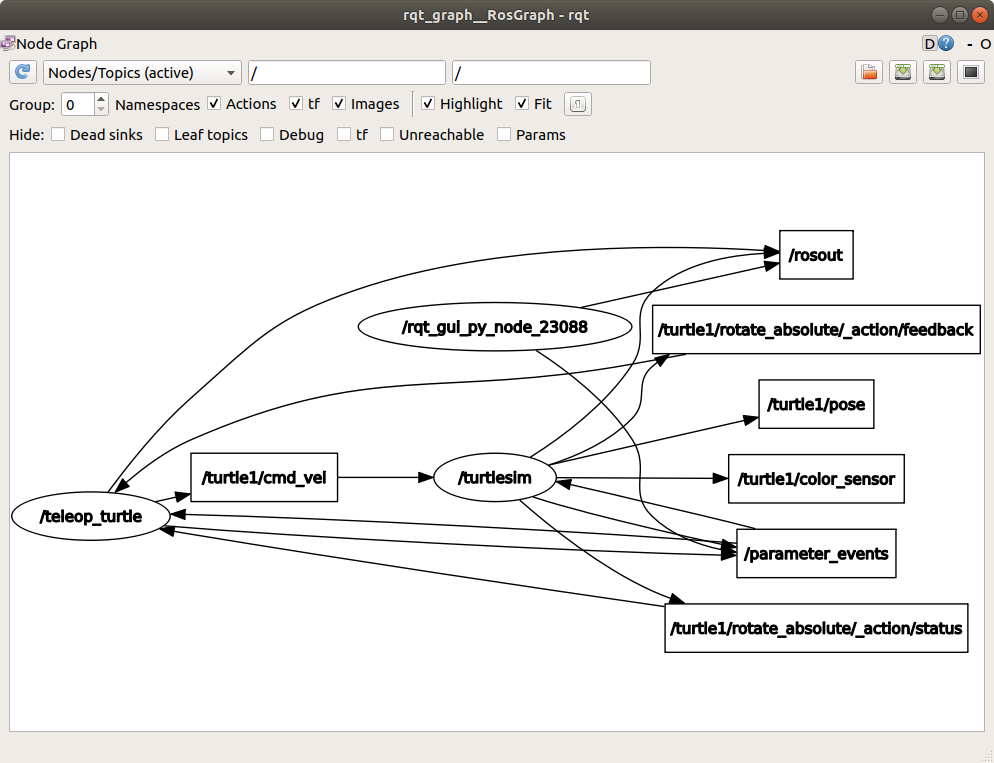
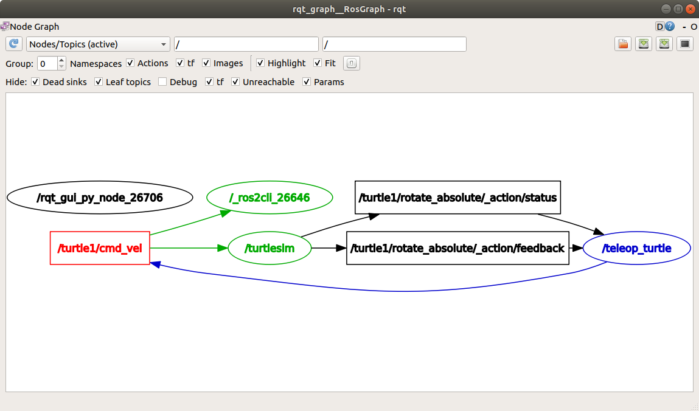
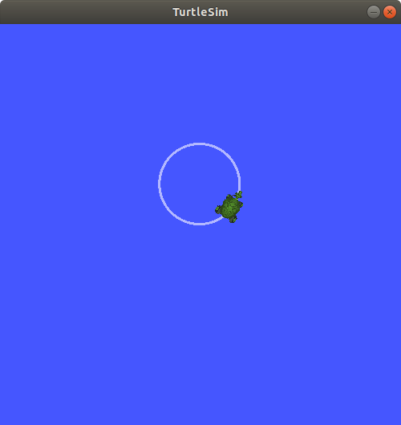
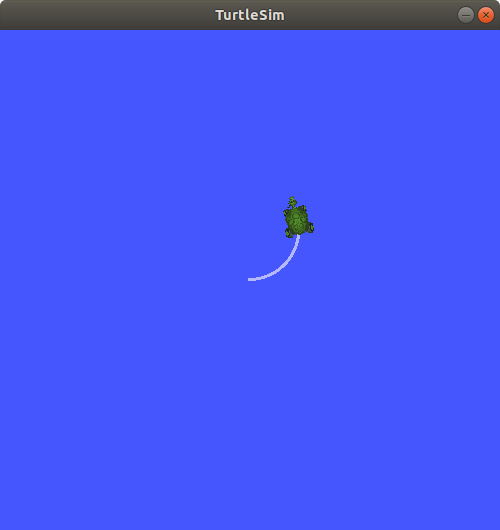
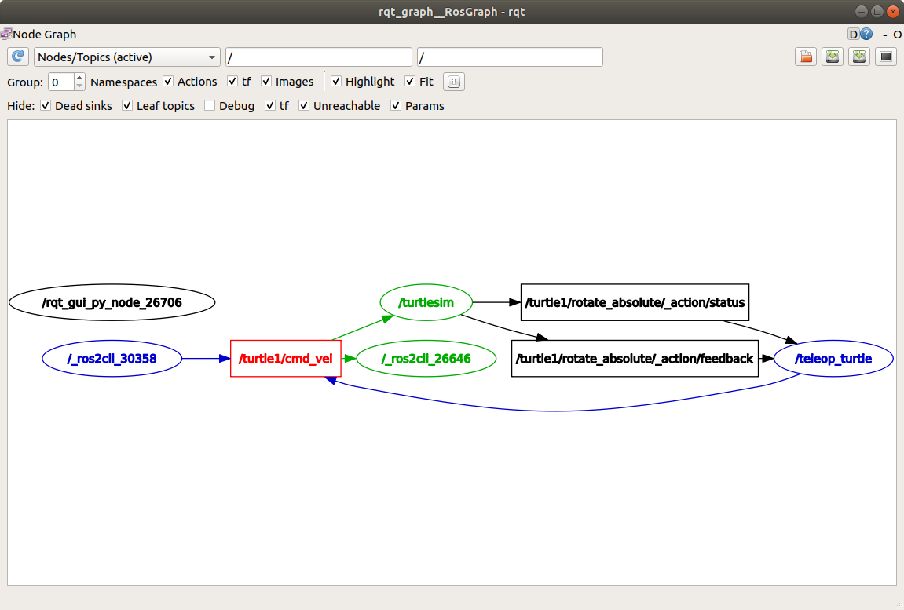
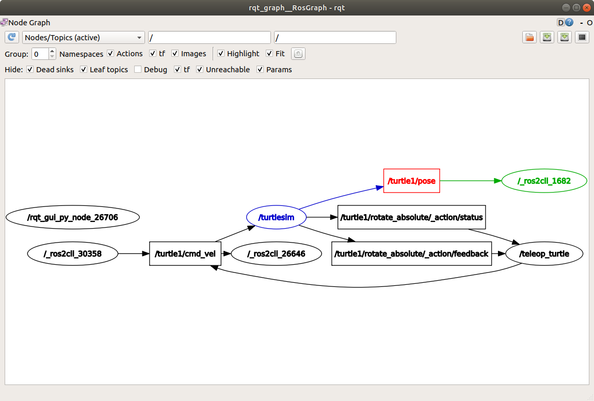

.. redirect-from::

    Tutorials/Topics/Understanding-ROS2-Topics
    Tutorials/Beginner-CLI-Tools/Understanding-ROS2-Topics/Understanding-ROS2-Topics

.. _ROS2Topics:

Learning about topics - tutorial
================================

Topics are one of the main communication types used for moving data around a ROS system.
This article walks you through using ``rqt_graph`` and other command-line tools to examine how nodes connect over topics.
A hands-on exercise with Turtlesim helps you understand how data moves around the ROS graph.

**Area: Framework | Content-type: tutorial | Experience: beginner**

.. contents:: Contents
   :depth: 3
   :local:

Summary
-------

Nodes publish information to topics, which allows any number of other nodes to subscribe to and access that information.
You can use ``rqt_graph`` and command-line tools to introspect and examine the connections between nodes that share topics.

Prerequisites
-------------

#. :doc:`Install ROS <../../../../Get-Started/Installation>` and :doc:`set up your workspace <../../../../Get-Started/Configuring-ROS2-Environment>`.
#. Make sure you understand:

   * The function of :doc:`nodes <../../../nodes/Working-with-nodes/Understanding-ROS2-Nodes/Understanding-ROS2-Nodes>` and how to work with them
   * The different :doc:`interface types <../../../Interfaces-Topics-Services-Actions>`, including topics

Steps
-----

.. note::
    Remember to source ROS in every new terminal you open.
    See :doc:`Configuring environment <../../../../Get-Started/Configuring-ROS2-Environment>`.

1 Run turtlesim nodes
^^^^^^^^^^^^^^^^^^^^^

Open a new terminal and run:

.. code-block:: console

    $ ros2 run turtlesim turtlesim_node

Open another terminal and run:

.. code-block:: console

    $ ros2 run turtlesim turtle_teleop_key

Names of these nodes are ``/turtlesim`` and ``/teleop_turtle`` by default.

2 Visualize the nodes with rqt_graph
^^^^^^^^^^^^^^^^^^^^^^^^^^^^^^^^^^^^

Throughout this tutorial, you use ``rqt_graph`` to visualize the changing nodes and topics, as well as the connections between them.
``rqt_graph`` is a graphical introspection tool whose highlighting feature is helpful when you examine more complex systems with multiple nodes and topics connected in many different ways.

:doc:`Using turtlesim, ros2, and rqt <../../../../Get-Started/Introducing-Turtlesim/Introducing-Turtlesim>` tells you how to install ``rqt`` and all its plugins, including ``rqt_graph``.

To run ``rqt_graph``, open a new terminal and enter the command:

.. code-block:: console

    $ ros2 run rqt_graph rqt_graph

You can also open ``rqt_graph`` by opening ``rqt`` and selecting **Plugins** > **Introspection** > **Node Graph**.

You should see a graph similar to this:

.. image:: images/rqt_graph.png

.. note::
    If your graph looks different, change the first drop-down to **Nodes/Topics (active)** and click the refresh button to its left.

In the graph, you should see the ``/turtlesim`` and ``/teleop_turtle`` nodes and the topic connecting them, as well as two actions around the periphery.
If you hover your mouse over the topic in the center, you should see the colour highlighting shown in the screenshot.

The graph illustrates how the ``/turtlesim`` node and the ``/teleop_turtle`` node communicate with each other over a topic.
The ``/teleop_turtle`` node publishes data (the keystrokes you enter to move the turtle around) to the ``/turtle1/cmd_vel`` topic, and the ``/turtlesim`` node is subscribed to that topic to receive the data.

3 List the active topics
^^^^^^^^^^^^^^^^^^^^^^^^

In a new terminal, run the ``ros2 topic list`` command to list of all the topics currently active in the system:

.. code-block:: console

  $ ros2 topic list

The terminal returns:

.. code-block:: console

  /parameter_events
  /rosout
  /turtle1/cmd_vel
  /turtle1/color_sensor
  /turtle1/pose

Now run ``ros2 topic list -t`` to get the same list, but with the topic type appended in brackets:

.. code-block:: console

  $ ros2 topic list -t

The terminal returns:

.. code-block:: console

  /parameter_events [rcl_interfaces/msg/ParameterEvent]
  /rosout [rcl_interfaces/msg/Log]
  /turtle1/cmd_vel [geometry_msgs/msg/Twist]
  /turtle1/color_sensor [turtlesim_msgs/msg/Color]
  /turtle1/pose [turtlesim_msgs/msg/Pose]

These attributes, particularly the type, are how nodes confirm they are exchanging compatible data.

To show all of the topics in the ``rqt_graph``, you can clear all of the **Hide** checkboxes.
For now, leave those options checked to avoid confusion.

4 View the data being published to a topic
^^^^^^^^^^^^^^^^^^^^^^^^^^^^^^^^^^^^^^^^^^

To see the data being published on a topic, use:

.. code-block:: console

    $ ros2 topic echo <topic_name>

In a previous step, you learned that ``/teleop_turtle`` publishes data to ``/turtlesim`` over the ``/turtle1/cmd_vel`` topic.
Use ``echo`` to introspect that topic:

.. code-block:: console

    $ ros2 topic echo /turtle1/cmd_vel

At first, this command won't return any data.
That's because it's waiting for ``/teleop_turtle`` to publish something.

Return to the terminal where ``turtle_teleop_key`` is running and use the arrow keys to move the turtle around.

.. note::
    The ``turtle_teleop_key`` terminal must be the active window to capture your key presses.

You should see position data being published for every movement that you make:

.. code-block:: console

  linear:
    x: 2.0
    y: 0.0
    z: 0.0
  angular:
    x: 0.0
    y: 0.0
    z: 0.0
    ---

Now return to ``rqt_graph``, uncheck the **Debug** box, and select the **Refresh** button.

The node created by the ``echo`` command should appear.
In this example it is ``/_ros2cli_26646``, but the number on your machine will be different.
You can now see that the publisher is publishing data on the ``cmd_vel`` topic, and two subscribers are subscribed to it.

5 View the publisher and subscriber counts for a topic
^^^^^^^^^^^^^^^^^^^^^^^^^^^^^^^^^^^^^^^^^^^^^^^^^^^^^^

Any number of nodes can publish on a topic, and any number of nodes can subscribe to that topic.

To see the publisher and subscriber counts for a topic, run:

.. code-block:: console

  $ ros2 topic info /turtle1/cmd_vel

The terminal returns:

.. code-block:: console

  Type: geometry_msgs/msg/Twist
  Publisher count: 1
  Subscription count: 2

5.1 View detailed topic information
~~~~~~~~~~~~~~~~~~~~~~~~~~~~~~~~~~~

To get more detailed information about a topic, use the ``--verbose`` (or ``-v``) flag:

.. code-block:: console

  $ ros2 topic info /turtle1/cmd_vel --verbose

This will return additional details, including:

- Node names and namespaces of publishers and subscribers
- Topic type
- QoS profiles

.. code-block:: console

  Type: geometry_msgs/msg/Twist

  Publisher count: 1

  Node name: teleop_turtle
  Node namespace: /
  Topic type: geometry_msgs/msg/Twist
  Topic type hash: RIHS01_9c45bf16fe0983d80e3cfe750d6835843d265a9a6c46bd2e609fcddde6fb8d2a
  Endpoint type: PUBLISHER
  GID: 24.ba.3e.e7.c1.51.bb.46.21.41.de.36.1b.14.73.5e
  QoS profile:
    Reliability: RELIABLE
    History (Depth): KEEP_LAST (7)
    Durability: VOLATILE
    Lifespan: Infinite
    Deadline: Infinite
    Liveliness: AUTOMATIC
    Liveliness lease duration: Infinite

  Subscription count: 2

  Node name: _ros2cli_300492
  Node namespace: /
  Topic type: geometry_msgs/msg/Twist
  Topic type hash: RIHS01_9c45bf16fe0983d80e3cfe750d6835843d265a9a6c46bd2e609fcddde6fb8d2a
  Endpoint type: SUBSCRIPTION
  GID: cc.4d.98.79.29.91.fe.25.8a.0a.c9.03.db.1a.ec.81
  QoS profile:
    Reliability: RELIABLE
    History (Depth): KEEP_LAST (5)
    Durability: VOLATILE
    Lifespan: Infinite
    Deadline: Infinite
    Liveliness: AUTOMATIC
    Liveliness lease duration: Infinite

  Node name: turtlesim
  Node namespace: /
  Topic type: geometry_msgs/msg/Twist
  Topic type hash: RIHS01_9c45bf16fe0983d80e3cfe750d6835843d265a9a6c46bd2e609fcddde6fb8d2a
  Endpoint type: SUBSCRIPTION
  GID: 9c.33.59.38.b2.f2.42.47.69.1b.7f.0e.5e.1d.86.f5
  QoS profile:
    Reliability: RELIABLE
    History (Depth): KEEP_LAST (7)
    Durability: VOLATILE
    Lifespan: Infinite
    Deadline: Infinite
    Liveliness: AUTOMATIC
    Liveliness lease duration: Infinite

6 View the message definition
^^^^^^^^^^^^^^^^^^^^^^^^^^^^^

Nodes send data over topics by using messages.
To communicate, publishers and subscribers must send and receive the same type of message.

The topic types you see after running ``ros2 topic list -t`` tell you what message type is used on each topic.

For example, the ``cmd_vel`` topic has the type ``geometry_msgs/msg/Twist``.
Here, ``geometry_msgs`` is the package and ``Twist`` is the message definition within it.

Now you can run ``ros2 interface show <msg_type>`` on this type to learn its details.
Specifically, what structure of data the message expects.

To learn the details of the ``Twist`` message, run:

.. code-block:: console

    $ ros2 interface show geometry_msgs/msg/Twist

The command will return:

.. code-block:: text

    # This expresses velocity in free space broken into its linear and angular parts.
        Vector3  linear
                float64 x
                float64 y
                float64 z
        Vector3  angular
                float64 x
                float64 y
                float64 z

This tells you that the ``/turtlesim`` node is expecting a message with two vectors, ``linear`` and ``angular``, of three elements each.
The data that ``ros2 topic echo`` printed earlier follows the same structure:

.. code-block:: console

  linear:
    x: 2.0
    y: 0.0
    z: 0.0
  angular:
    x: 0.0
    y: 0.0
    z: 0.0
    ---

7 Publish data to a topic
^^^^^^^^^^^^^^^^^^^^^^^^^

Now that you have the message structure, you can publish data to a topic directly from the command line.

To do this, use the following syntax:

.. code-block:: console

    $ ros2 topic pub <topic_name> <msg_type> '<args>'

The ``'<args>'`` argument is the actual data passed to the topic, in the structure shown by ``ros2 interface show`` in `6 View the message definition`_.

There are four main ways to use the ``pub`` command.

a. **Publish dictionary strings**:

  In order to publish data to a topic, you need to pass the data in the form of YAML strings.

  .. code-block:: console

    $ ros2 topic pub /turtle1/cmd_vel geometry_msgs/msg/Twist "{linear: {x: 2.0, y: 0.0, z: 0.0}, angular: {x: 0.0, y: 0.0, z: 1.8}}"

  However, you do not need to specify the entire message.
  If you are only changing the linear or angular velocity, specify just the values you want to change.

  For example, if you want to change the linear velocity to 2.0 and keep the angular velocity at 1.8, you can do the following:

  .. code-block:: console

    $ ros2 topic pub /turtle1/cmd_vel geometry_msgs/msg/Twist "{linear: {x: 2.0}, angular: {z: 1.8}}"

b. **Publishing an empty message**:

  .. code-block:: console

    $ ros2 topic pub /turtle1/cmd_vel geometry_msgs/msg/Twist

  This will publish the default values for the message type at the default rate of 1 Hz, which is equivalent to:

  .. code-block:: console

    $ ros2 topic pub /turtle1/cmd_vel geometry_msgs/msg/Twist "{linear: {x: 0.0, y: 0.0, z: 0.0}, angular: {x: 0.0, y: 0.0, z: 0.0}}" --rate 1

c. **Use auto-complete**:

  .. note::
      This feature is not supported on Windows.
      For other operating systems, you must configure ``argcomplete``.
      :doc:`Sourcing the ROS setup script <../../../../Get-Started/Configuring-ROS2-Environment>` sets this up automatically.
      If ``argcomplete`` is active in your shell, then :kbd:`Tab` completion provides command options, not file paths.

  You can trigger the auto-complete feature of your terminal by entering the following, then pressing :kbd:`Tab` instead of :kbd:`Enter`:

  .. code-block:: console

    $ ros2 topic pub /turtle1/cmd_vel geometry_msgs/msg/Twist

  The terminal shows the available options:

  .. code-block:: console

    --keep-alive
    --max-wait-time-secs
    --node-name
    --once
    --print
    --qos-depth
    --qos-durability
    --qos-history
    --qos-liveliness
    --qos-liveliness-lease-duration-seconds
    --qos-profile
    --qos-reliability
    --rate
    --spin-time
    --stdin
    --times
    --use-sim-time
    --wait-matching-subscriptions
    --yaml-file
    -1
    -n
    -p
    -r
    -s
    -t
    -w
    \'linear:\^J\ \ x:\ 0.0\^J\ \ y:\ 0.0\^J\ \ z:\ 0.0\^Jangular:\^J\ \ x:\ 0.0\^J\ \ y:\ 0.0\^J\ \ z:\ 0.0\^J\'

  When you press :kbd:`Tab` after entering the first few characters of an option, the terminal auto-completes it.
  The last item in the options list is a YAML template of the message fields with default values.
  To insert that template, enter an escaped single quote, then press :kbd:`Tab`:

  .. code-block:: console

    $ ros2 topic pub /turtle1/cmd_vel geometry_msgs/msg/Twist \'

  The terminal does not recognise an unescaped single quote as part of the auto-complete string, so you need to escape it with ``\'``.

  The final auto-completed string should look like this:

  .. code-block:: text

    $ ros2 topic pub /turtle1/cmd_vel geometry_msgs/msg/Twist 'linear:
      x: 0.0
      y: 0.0
      z: 0.0
    angular:
      x: 0.0
      y: 0.0
      z: 0.0
    '

  This string is editable.
  Change the field values as required before you run the command.

d. **Use the raw auto-completed string**:

  .. note::
      This feature is not supported on Windows.
      For other operating systems, you must configure ``argcomplete``.
      :doc:`Sourcing the ROS setup script <../../../../Get-Started/Configuring-ROS2-Environment>` sets this up automatically.
      If ``argcomplete`` is active in your shell, then :kbd:`Tab` completion provides command options, not file paths.

  The auto-completed string for ``geometry_msgs/msg/Twist`` looks like this:

  .. code-block:: console

    \'linear:\^J\ \ x:\ 0.0\^J\ \ y:\ 0.0\^J\ \ z:\ 0.0\^Jangular:\^J\ \ x:\ 0.0\^J\ \ y:\ 0.0\^J\ \ z:\ 0.0\^J\'

  You can use this string directly in place of the YAML string on the command line:

  .. code-block:: console

    $ ros2 topic pub /turtle1/cmd_vel geometry_msgs/msg/Twist \'linear:\^J\ \ x:\ 0.0\^J\ \ y:\ 0.0\^J\ \ z:\ 0.0\^Jangular:\^J\ \ x:\ 0.0\^J\ \ y:\ 0.0\^J\ \ z:\ 0.0\^J\'

  This publishes the default field values for the message type.
  For ``Twist``, those defaults are all zero values, so if you run this command exactly as shown, the turtle doesn't move.

  To make the turtle move, before you run the command, replace the zero values with the velocities you want.

The turtle, like physical robots, requires a steady stream of commands to operate continuously.
To keep the turtle moving continuously, use non-zero values for the velocities, like this:

.. code-block:: console

  $ ros2 topic pub /turtle1/cmd_vel geometry_msgs/msg/Twist "{linear: {x: 2.0, y: 0.0, z: 0.0}, angular: {x: 0.0, y: 0.0, z: 1.8}}"

Sometimes you may want to publish data to your topic only once rather than continuously.
To publish your command only once, add the ``--once`` option.

.. code-block:: console

  $ ros2 topic pub --once -w 2 /turtle1/cmd_vel geometry_msgs/msg/Twist "{linear: {x: 2.0, y: 0.0, z: 0.0}, angular: {x: 0.0, y: 0.0, z: 1.8}}"

``--once`` is an optional argument that means "publish one message then exit".

``-w 2`` is an optional argument that means "wait for two matching subscriptions".
The argument is needed because you have both ``turtlesim`` and the topic ``echo`` subscribed.

You should see the following output in the terminal:

.. code-block:: console

  Waiting for at least 2 matching subscription(s)...
  publisher: beginning loop
  publishing #1: geometry_msgs.msg.Twist(linear=geometry_msgs.msg.Vector3(x=2.0, y=0.0, z=0.0), angular=geometry_msgs.msg.Vector3(x=0.0, y=0.0, z=1.8))

You should see your turtle move like so:

You can refresh ``rqt_graph`` to see what's happening graphically.
You should see that the ``ros2 topic pub ...`` node (``/_ros2cli_30358``) is publishing over the ``/turtle1/cmd_vel`` topic, which is now being received by both the ``ros2 topic echo ...`` node (``/_ros2cli_26646``) and the ``/turtlesim`` node.

Finally, to see the ``/turtlesim`` node publishing on the ``pose`` topic, run ``echo`` on it and refresh ``rqt_graph``:

.. code-block:: console

  $ ros2 topic echo /turtle1/pose

You can see that the ``/turtlesim`` node is also publishing to the ``pose`` topic, which the new ``echo`` node has subscribed to.

When publishing messages with timestamps, ``pub`` has two methods to automatically fill them out with the current time:

- For messages with a ``std_msgs/msg/Header``, set the header field to ``auto`` to fill out the ``stamp`` field:

  .. code-block:: console

    $ ros2 topic pub /pose geometry_msgs/msg/PoseStamped '{header: "auto", pose: {position: {x: 1.0, y: 2.0, z: 3.0}}}'

- If the message has a ``builtin_interfaces/msg/Time`` field instead of a full header, set that field to ``now``:

  .. code-block:: console

    $ ros2 topic pub /reference sensor_msgs/msg/TimeReference '{header: "auto", time_ref: "now", source: "dumy"}'

8 View the rate at which data is published
^^^^^^^^^^^^^^^^^^^^^^^^^^^^^^^^^^^^^^^^^^

To view the rate at which data is published, run:

.. code-block:: console

    $ ros2 topic hz /turtle1/pose

You should see output similar to the following:

.. code-block:: console

    average rate: 59.354
      min: 0.005s max: 0.027s std dev: 0.00284s window: 58

The command will return data on the rate at which the ``/turtlesim`` node is publishing data to the ``pose`` topic.

To check the rate of ``turtle1/cmd_vel``, which was set to 1 Hz using ``ros2 topic pub --rate 1``, run ``ros2 topic hz /turtle1/cmd_vel`` and the average should reflect that rate.

.. note::
    The rate reflects the receiving rate on the subscription created by the ``ros2 topic hz`` command, which might be affected by platform resources and QoS configuration, and may not exactly match the publisher rate.

9 View the bandwidth utilization of a topic
^^^^^^^^^^^^^^^^^^^^^^^^^^^^^^^^^^^^^^^^^^^

To view the bandwidth used by a topic, run:

.. code-block:: console

    $ ros2 topic bw /turtle1/pose

You should see output similar to the following:

.. code-block:: console

    Subscribed to [/turtle1/pose]
    1.51 KB/s from 62 messages
        Message size mean: 0.02 KB min: 0.02 KB max: 0.02 KB

The command will return the bandwidth utilization and number of messages being published to the ``/turtle1/pose`` topic.

.. note::
    The bandwidth reflects the receiving rate on the subscription created by the ``ros2 topic bw`` command, which might be affected by platform resources and QoS configuration, and may not exactly match the publisher's bandwidth.

10 List available topics of a specific type
^^^^^^^^^^^^^^^^^^^^^^^^^^^^^^^^^^^^^^^^^^^

To list the available topics of a given type, use:

.. code-block:: console

    $ ros2 topic find <topic_type>

The ``cmd_vel`` topic has the type:

.. code-block:: console

    geometry_msgs/msg/Twist

To list topics with this message type, run:

.. code-block:: console

    $ ros2 topic find geometry_msgs/msg/Twist

The terminal returns:

.. code-block:: console

    /turtle1/cmd_vel

11 Clean up
^^^^^^^^^^^

At this point you'll have a lot of nodes running.
Stop them by entering ``Ctrl+C`` in each terminal.

Related content
---------------

More articles:

* :doc:`Understanding nodes <../../../nodes/Working-with-nodes/Understanding-ROS2-Nodes/Understanding-ROS2-Nodes>`
* :doc:`Understanding services <../../services/Working-with-services/Understanding-ROS2-Services/Understanding-ROS2-Services>`
* :doc:`Interfaces (topics, services, actions) <../../../Interfaces-Topics-Services-Actions>`

FAQs
----

Why does ``ros2 topic echo`` show no data when I first run it?
   That is expected if nothing is publishing on the topic yet.
   The ``echo`` command waits for a publisher to send a message.
   Start or use a publisher (for example ``turtle_teleop_key``) and move the turtle to see data appear.

What is the difference between ``ros2 topic list`` and ``ros2 topic list -t``?
   ``ros2 topic list`` returns the names of all active topics.
   Adding ``-t`` appends each topic's message type in brackets, which shows what type of data travels on each topic.

Can a topic have more than one publisher or subscriber?
   Yes.
   Multiple nodes can publish on the same topic, and multiple nodes can subscribe to it at the same time.
   Use ``ros2 topic info`` to see how many publishers and subscribers are connected to a topic.

Why must publishers and subscribers use the same message type?
   Both sides must agree on the message structure so data can be serialized and interpreted correctly.
   Check a topic's type with ``ros2 topic list -t`` or ``ros2 topic info``, then inspect the type with ``ros2 interface show``.

Why does ``ros2 topic pub`` auto-complete not work on Windows?
   The auto-complete options for publishing (dictionary auto-complete and the raw auto-completed string) rely on shell behaviour that is not supported on Windows.
   On Windows, type message data manually as YAML strings instead of using tab completion for the message field template.
