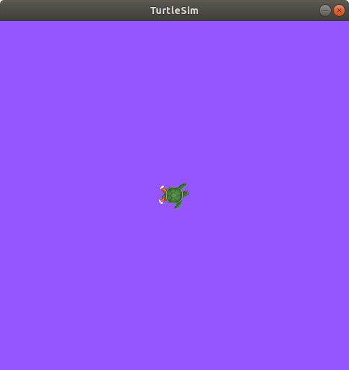

.. redirect-from::

    Tutorials/Parameters/Understanding-ROS2-Parameters
    Tutorials/Beginner-CLI-Tools/Understanding-ROS2-Parameters/Understanding-ROS2-Parameters

.. _ROS2Params:

Learning about parameters - tutorial
=====================================

Parameters are configuration values stored by each node in the ROS graph.
This article walks you through using the ``ros2 param`` command-line tools to inspect, change, save, and reload parameters.
A hands-on exercise with Turtlesim shows how parameters control node behaviour at runtime.

**Area: Framework | Content-type: tutorial | Experience: beginner**

.. contents:: Contents
   :depth: 2
   :local:

Summary
-------

Each node in the ROS graph stores its own set of configuration values, called parameters.
Use the ``ros2 param`` commands to get, set, save, and reload parameter values at runtime.

For more information, see :doc:`About parameters <../../../About-Parameters>`.

Prerequisites
-------------

You will need the :doc:`turtlesim package <../../../../Get-Started/Introducing-Turtlesim/Introducing-Turtlesim>`.

Steps
-----

.. note::
    Do not forget to source ROS in every new terminal you open.

    For more information, see :doc:`Configuring environment <../../../../Get-Started/Configuring-ROS2-Environment>`.

1 Setup
^^^^^^^

Start up the two Turtlesim nodes, ``/turtlesim`` and ``/teleop_turtle``.

Open a new terminal and run:

.. code-block:: console

    $ ros2 run turtlesim turtlesim_node

Open another terminal and run:

.. code-block:: console

    $ ros2 run turtlesim turtle_teleop_key

2 View the list of parameters for your nodes
^^^^^^^^^^^^^^^^^^^^^^^^^^^^^^^^^^^^^^^^^^^^

To see the parameters belonging to your nodes, open a new terminal and run:

.. code-block:: console

  $ ros2 param list

You should see output similar to:

.. code-block:: console

  /teleop_turtle:
    qos_overrides./parameter_events.publisher.depth
    qos_overrides./parameter_events.publisher.durability
    qos_overrides./parameter_events.publisher.history
    qos_overrides./parameter_events.publisher.reliability
    scale_angular
    scale_linear
    use_sim_time
  /turtlesim:
    background_b
    background_g
    background_r
    qos_overrides./parameter_events.publisher.depth
    qos_overrides./parameter_events.publisher.durability
    qos_overrides./parameter_events.publisher.history
    qos_overrides./parameter_events.publisher.reliability
    use_sim_time

The output groups the parameters under each node name, ``/teleop_turtle`` and ``/turtlesim``.
The namespace and name of a parameter are separated by dots, as in ``parameter_events.publisher.depth``.

Before you continue, notice the following parameters:

* ``use_sim_time``: Specifies whether the node uses simulated time or the computer's clock.
* ``background_r``, ``background_g``, and ``background_b``: Define the RGB values for the background colour of the Turtlesim window

3 Identify the type and value of a parameter
^^^^^^^^^^^^^^^^^^^^^^^^^^^^^^^^^^^^^^^^^^^^

To display the type and current value of a parameter, use the following command:

.. code-block:: console

  $ ros2 param get <node_name> <parameter_name>

You can also query a parameter across all nodes by omitting the node name:

.. code-block:: console

  $ ros2 param get <parameter_name>

To find out the current value of ``/turtlesim``'s parameter ``background_g``, run:

.. code-block:: console

  $ ros2 param get /turtlesim background_g

The terminal returns:

.. code-block:: console

  Integer value is: 86

This tells you ``background_g`` holds an integer value.

Running the same command on ``background_r`` and ``background_b`` should return the values ``69`` and ``255``, respectively.

You can also omit the node name.
As an example, you can try querying ``use_sim_time``, because every node has it:

.. code-block:: console

  $ ros2 param get use_sim_time

The command displays the value for each node that has that parameter.

.. note::
   Omitting the node name works only on Lyrical, Rolling, and later distributions.
   On earlier distributions, ``ros2 param get`` requires both a node name and a parameter name.

4 Change a parameter value at runtime
^^^^^^^^^^^^^^^^^^^^^^^^^^^^^^^^^^^^^

To change a parameter's value at runtime, use the following command:

.. code-block:: console

  $ ros2 param set <node_name> <parameter_name> <value>

Change ``/turtlesim``'s background colour:

.. code-block:: console

  $ ros2 param set /turtlesim background_r 150

The terminal returns:

.. code-block:: console

  Set parameter successful

The background of the Turtlesim window should change colour, like this:

Setting parameters with the ``set`` command will only change them in your current session, not permanently.
However, you can save your settings and reload them the next time you start a node.
See :ref:`dumping parameters <DumpNodeParameters>` and :ref:`loading a parameter file on node startup <LoadParameterFileOnNodeStartup>`.

.. _DumpNodeParameters:

5 Save the parameters of a node to a file
^^^^^^^^^^^^^^^^^^^^^^^^^^^^^^^^^^^^^^^^^

You can save parameters of a node to a file.
This comes in handy if you want to reload the node with the same parameters in the future.
Use the following command:

.. code-block:: console

  $ ros2 param dump <node_name>

The command prints to the standard output (stdout) by default, but you can also redirect the parameter values into a file to save them for later.
To save your current configuration of ``/turtlesim``'s parameters into the file ``turtlesim.yaml``, run:

.. code-block:: console

  $ ros2 param dump /turtlesim > turtlesim.yaml

A new file is created in the current working directory.

Open the file to view the following content:

.. code-block:: YAML

  /turtlesim:
    ros__parameters:
      background_b: 255
      background_g: 86
      background_r: 150
      qos_overrides:
        /parameter_events:
          publisher:
            depth: 1000
            durability: volatile
            history: keep_last
            reliability: reliable
      use_sim_time: false

6 Load node parameters from a file
^^^^^^^^^^^^^^^^^^^^^^^^^^^^^^^^^^^

You can load parameters from a file to a currently running node using the following command:

.. code-block:: console

  $ ros2 param load <node_name> <parameter_file>

To load the ``turtlesim.yaml`` file generated with ``ros2 param dump`` into ``/turtlesim`` node's parameters, run:

.. code-block:: console

  $ ros2 param load /turtlesim turtlesim.yaml

The terminal returns:

.. code-block:: console

  Set parameter background_b successful
  Set parameter background_g successful
  Set parameter background_r successful
  Set parameter qos_overrides./parameter_events.publisher.depth failed: parameter 'qos_overrides./parameter_events.publisher.depth' cannot be set because it is read-only
  Set parameter qos_overrides./parameter_events.publisher.durability failed: parameter 'qos_overrides./parameter_events.publisher.durability' cannot be set because it is read-only
  Set parameter qos_overrides./parameter_events.publisher.history failed: parameter 'qos_overrides./parameter_events.publisher.history' cannot be set because it is read-only
  Set parameter qos_overrides./parameter_events.publisher.reliability failed: parameter 'qos_overrides./parameter_events.publisher.reliability' cannot be set because it is read-only
  Set parameter use_sim_time successful

.. note::

  Read-only parameters can only be modified at startup and not afterwards, which is why there are some ``failed`` warnings for the ``qos_overrides`` parameters.

.. _LoadParameterFileOnNodeStartup:

7 Load parameter file on node startup
^^^^^^^^^^^^^^^^^^^^^^^^^^^^^^^^^^^^^

To start the same node using your saved parameter values, use:

.. code-block:: console

  $ ros2 run <package_name> <executable_name> --ros-args --params-file <file_name>

This is the same command used to start Turtlesim, with the added flags ``--ros-args`` and ``--params-file``, followed by the file you want to load.

Stop your running Turtlesim node, and try reloading it with your saved parameters:

.. code-block:: console

  $ ros2 run turtlesim turtlesim_node --ros-args --params-file turtlesim.yaml

The Turtlesim window should appear as usual, but with the purple background you set earlier.

.. note::

  When a parameter file is used at node startup, all parameters are updated, including the read-only ones.

Related content
---------------

More articles:

* :doc:`Learning about nodes <../../../nodes/Working-with-nodes/Understanding-ROS2-Nodes/Understanding-ROS2-Nodes>`
* :doc:`Learning about services <../../../interfaces/services/Working-with-services/Understanding-ROS2-Services/Understanding-ROS2-Services>`
* :doc:`About parameters <../../../About-Parameters>`

FAQs
----

What types can a parameter hold?
   Parameters can be integers, floats, booleans, strings, and lists.

Do parameter changes persist after a node is restarted?
   No.
   Changes made with ``ros2 param set`` apply only to the current session.
   To persist them, use ``ros2 param dump`` to save the values to a YAML file and load that file when starting the node.

Why do some parameters fail to load with ``ros2 param load``?
   Parameters marked as read-only can only be set at node startup, not at runtime.
   The ``qos_overrides`` parameters are read-only, which is why they show ``failed`` messages when loading a parameter file into a running node.

What is the difference between ``ros2 param dump`` and ``ros2 param load``?
   ``ros2 param dump`` saves a node's current parameter values to a YAML file.
   ``ros2 param load`` reads a YAML file and applies the values to a currently running node.
