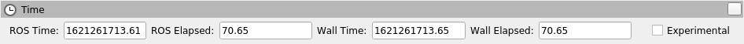

.. _upcoming-release:

.. _galactic-release:

.. move this directive when next release page is created

ROS 2 Galactic Geochelone (codename 'galactic'; May, 2021)
==========================================================

.. contents:: Table of Contents
   :depth: 2
   :local:

*Galactic Geochelone* is the seventh release of ROS 2.
What follows is highlights of the important changes and features in Galactic Geochelone since the last release.
For a list of all of the changes since Foxy, see the `long form changelog <Galactic-Geochelone-Complete-Changelog>`.

Supported Platforms
-------------------

Galactic Geochelone is primarily supported on the following platforms:

Tier 1 platforms:

* Ubuntu 20.04 (Focal): ``amd64`` and ``arm64``
* Windows 10 (Visual Studio 2019): ``amd64``

Tier 2 platforms:

* RHEL 8: ``amd64``

Tier 3 platforms:

* Ubuntu 20.04 (Focal): ``arm32``
* Debian Bullseye (11): ``amd64``, ``arm64`` and ``arm32``
* OpenEmbedded Thud (2.6) / webOS OSE: ``arm32`` and ``arm64``
* Mac macOS 10.14 (Mojave): ``amd64``

For more information about RMW implementations, compiler / interpreter versions, and system dependency versions see `REP 2000 <https://www.ros.org/reps/rep-2000.html>`__.

Installation
------------

`Install Galactic Geochelone <../../galactic/Installation.html>`__

New features in this ROS 2 release
----------------------------------

Ability to specify per-logger log levels
^^^^^^^^^^^^^^^^^^^^^^^^^^^^^^^^^^^^^^^^

It is now possible to specify different logging levels for different loggers on the command line:

.. code-block:: bash

   ros2 run demo_nodes_cpp talker --ros-args --log-level WARN --log-level talker:=DEBUG

The above command sets a global log level of WARN, but sets the log level of the talker node messages to DEBUG.
The ``--log-level`` command-line option can be passed an arbitrary number of times to set different log levels for each logger.

Ability to configure logging directory through environment variables
^^^^^^^^^^^^^^^^^^^^^^^^^^^^^^^^^^^^^^^^^^^^^^^^^^^^^^^^^^^^^^^^^^^^

It is now possible to configure the logging directory through two environment variables: ``ROS_LOG_DIR`` and ``ROS_HOME``.
The logic is as follows:

* Use ``$ROS_LOG_DIR`` if ``ROS_LOG_DIR`` is set and not empty.
* Otherwise, use ``$ROS_HOME/log``, using ``~/.ros`` for ``ROS_HOME`` if not set or if empty.

Thus the default value stays the same: ``~/.ros/log``.

Related PRs: `ros2/rcl_logging#53 <https://github.com/ros2/rcl_logging/pull/53>`_ and `ros2/launch#460 <https://github.com/ros2/launch/pull/460>`_.

For example:

.. code-block:: bash

  ROS_LOG_DIR=/tmp/foo ros2 run demo_nodes_cpp talker

Will place all logs in ``/tmp/foo``.

.. code-block:: bash

  ROS_HOME=/path/to/home ros2 run demo_nodes_cpp talker

Will place all logs in ``/path/to/home/log``.

Ability to invoke ``rosidl`` pipeline outside CMake
^^^^^^^^^^^^^^^^^^^^^^^^^^^^^^^^^^^^^^^^^^^^^^^^^^^

It is now straightforward to invoke the ``rosidl`` interface generation pipeline outside CMake.
Source code generators and interface definition translators are accessible through a unified command line interface.

For example, given a ``Demo`` message in some ``demo`` package like:

.. code-block:: bash

  mkdir -p demo/msg
  cd demo
  cat << EOF > msg/Demo.msg
  std_msgs/Header header
  geometry_msgs/Twist twist
  geometry_msgs/Accel accel
  EOF

it is easy to generate C, C++, and Python support source code:

.. code-block:: bash

  rosidl generate -o gen -t c -t cpp -t py -I$(ros2 pkg prefix --share std_msgs) \
    -I$(ros2 pkg prefix --share geometry_msgs) demo msg/Demo.msg

Generated source code will be put in the ``gen`` directory.

One may also translate the message definition to a different format for a third-party code generation tool to consume:

.. code-block:: bash

  rosidl translate -o gen --to idl -I$(ros2 pkg prefix --share std_msgs) \
    -I$(ros2 pkg prefix --share geometry_msgs) demo msg/Demo.msg

The translated message definition will be put in the ``gen`` directory.

Note that these tools generate sources but do not build it -- that responsibility is still on the caller.
This is a first step towards enabling ``rosidl`` interface generation in build systems other than CMake.
See the `design document <https://github.com/ros2/design/pull/310>`_ for further reference and next steps.

Externally configure QoS at start-up
^^^^^^^^^^^^^^^^^^^^^^^^^^^^^^^^^^^^

It is now possible to externally configure the QoS settings for a node at start-up time.
QoS settings are **not** configurable during runtime; they are only configurable at start-up.
Node authors must opt-in to enable changing QoS settings at start-up.
If the feature is enabled on a node, then QoS settings can be set with ROS parameters when a node first starts.

`Demos in C++ and Python can be found here. <https://github.com/ros2/demos/tree/a66f0e894841a5d751bce6ded4983acb780448cf/quality_of_service_demo#qos-overrides>`_

See the `design document for more details <http://design.ros2.org/articles/qos_configurability.html>`_.

Note, user code handling parameter changes with registered callbacks should avoid rejecting updates for unknown parameters.
It was considered bad practice prior to Galactic, but with externally configurable QoS enabled it will result in a hard failure.

Related PRs: `ros2/rclcpp#1408 <https://github.com/ros2/rclcpp/pull/1408>`_ and `ros2/rclpy#635 <https://github.com/ros2/rclpy/pull/635>`_

Python point_cloud2 utilities available
^^^^^^^^^^^^^^^^^^^^^^^^^^^^^^^^^^^^^^^

Several utilities for interacting with `PointCloud2 messages <https://github.com/ros2/common_interfaces/blob/galactic/sensor_msgs/msg/PointCloud2.msg>`__ in Python were `ported to ROS 2 <https://github.com/ros2/common_interfaces/pull/128>`__.
These utilities allow one to get a list of points from a PointCloud2 message (``read_points`` and ``read_points_list``), and to create a PointCloud2 message from a list of points (``create_cloud`` and ``create_cloud_xyz32``).

An example of creating PointCloud 2 message, then reading it back:

.. code-block:: python

  import sensor_msgs_py.point_cloud2
  from std_msgs.msg import Header

  pointlist = [[0.0, 0.1, 0.2]]

  pointcloud = sensor_msgs_py.point_cloud2.create_cloud_xyz32(Header(frame_id='frame'), pointlist)

  for point in sensor_msgs_py.point_cloud2.read_points(pointcloud):
      print(point)

RViz2 Time Panel
^^^^^^^^^^^^^^^^

The Rviz2 Time Panel, which shows the current Wall and ROS time, along with the elapsed Wall and ROS time, has been `ported to RViz2 <https://github.com/ros2/rviz/pull/599>`__.
To enable the Time Panel, click on Panels -> Add New Panel, and select "Time".
A panel that looks like the following will appear:

ros2 topic echo can print serialized data
^^^^^^^^^^^^^^^^^^^^^^^^^^^^^^^^^^^^^^^^^

When debugging middleware issues, it can be useful to see the raw serialized data that the RMW is sending.
The `--raw command-line flag <https://github.com/ros2/ros2cli/pull/470>`__ was added to ``ros2 topic echo`` to show this data.
To see this in action, run the following commands.

Terminal 1:

.. code-block:: bash

  $ ros2 topic pub /chatter std_msgs/msg/String "data: 'hello'"

Terminal 2:

.. code-block:: bash

  $ ros2 topic echo --raw /chatter
  b'\x00\x01\x00\x00\x06\x00\x00\x00hello\x00\x00\x00'
  ---

Changes since the Foxy release
------------------------------

Default RMW changed to Eclipse Cyclone DDS
^^^^^^^^^^^^^^^^^^^^^^^^^^^^^^^^^^^^^^^^^^

During the Galactic development process, the ROS 2 Technical Steering Committee `voted <https://discourse.ros.org/t/ros-2-galactic-default-middleware-announced/18064>`__ to change the default ROS middleware (RMW) to `Eclipse Cyclone DDS <https://github.com/eclipse-cyclonedds/cyclonedds>`__ project of `Eclipse Foundation <https://www.eclipse.org>`__.
Without any configuration changes, users will get Eclipse Cyclone DDS by default.
Fast-DDS and Connext are still Tier-1 supported RMW vendors, and users can opt-in to use one of these RMWs at their discretion by using the ``RMW_IMPLEMENTATION`` environment variable.
See the `Working with multiple RMW implementations guide <../Guides/Working-with-multiple-RMW-implementations>` for more information.

Connext RMW changed to rmw_connextdds
^^^^^^^^^^^^^^^^^^^^^^^^^^^^^^^^^^^^^

A new RMW for Connext called `rmw_connextdds <https://github.com/ros2/rmw_connextdds>`_ was merged for Galactic.
This RMW has better performance and fixes many of the issues with the older RMW ``rmw_connext_cpp``.

New RMW API
^^^^^^^^^^^

``rmw_qos_profile_check_compatible`` is a new function for checking the compatibility of two QoS profiles.

RMW vendors should implement this API for some features in ROS 2 packages to work correctly.

Related PR: `ros2/rmw#299 <https://github.com/ros2/rmw/pull/299>`_

nav2
^^^^

Changes include, but are not limited to, a number of stability improvements, new plugins, interface changes, costmap filters.
See `Migration Guides <https://navigation.ros.org/migration/Foxy.html>`_ for full list

tf2_ros Python split out of tf2_ros
^^^^^^^^^^^^^^^^^^^^^^^^^^^^^^^^^^^

The Python code that used to live in tf2_ros has been moved into its own package named tf2_ros_py.
Any existing Python code that depends on tf2_ros will continue to work, but the package.xml of those packages should be amended to ``exec_depend`` on tf2_ros_py.

tf2_ros Python TransformListener uses global namespace
^^^^^^^^^^^^^^^^^^^^^^^^^^^^^^^^^^^^^^^^^^^^^^^^^^^^^^

The Python ``TransformListener`` now subscribes to ``/tf`` and ``/tf_static`` in the global namespace.
Previously, it was susbcribing in the node's namespace.
This means that the node's namespace will no longer have an effect on the ``/tf`` and ``/tf_static`` subscriptions.

For example:

.. code-block:: bash

  ros2 run tf2_ros tf2_echo --ros-args -r __ns:=/test -- odom base_link

will subscribe to ``/tf`` and ``/tf_static``, as ``ros2 topic list`` will show.

Related PR: `ros2/geometry2#390 <https://github.com/ros2/geometry2/pull/390>`_

rclcpp
^^^^^^

Change in spin_until_future_complete template parameters
""""""""""""""""""""""""""""""""""""""""""""""""""""""""

The first template parameter of ``Executor::spin_until_future_complete`` was the future result type ``ResultT``, and the method only accepted a ``std::shared_future<ResultT>``.
In order to accept other types of futures (e.g.: ``std::future``), that parameter was changed to the future type itself.

In places where a ``spin_until_future_complete`` call was relying on template argument deduction, no change is needed.
If not, this is an example diff:

.. code-block:: dpatch

   std::shared_future<MyResultT> future;
   ...
   -executor.spin_until_future_complete<MyResultT>(future);
   +executor.spin_until_future_complete<std::shared_future<MyResultT>>(future);

For more details, see `ros2/rclcpp#1160 <https://github.com/ros2/rclcpp/pull/1160>`_.
For an example of the needed changes in user code, see `ros-visualization/interactive_markers#72 <https://github.com/ros-visualization/interactive_markers/pull/72>`_.

Change in default ``/clock`` subscription QoS profile
"""""""""""""""""""""""""""""""""""""""""""""""""""""

The default was changed from a reliable communication with history depth 10 to a best effort communication with history depth 1.
See `ros2/rclcpp#1312 <https://github.com/ros2/rclcpp/pull/1312>`_.

Waitable API
""""""""""""

Waitable API was modified to avoid issues with the ``MultiThreadedExecutor``.
This only affects users implementing a custom waitable.
See `ros2/rclcpp#1241 <https://github.com/ros2/rclcpp/pull/1241>`_ for more details.

Change in ``rclcpp``'s logging macros
"""""""""""""""""""""""""""""""""""""
Previously, the logging macros were vulnerable to a `format string attack <https://owasp.org/www-community/attacks/Format_string_attack>`_, where the format string is evaluated and can potentially execute code, read the stack, or cause a segmentation fault in the running program.
To address this security issue, the logging macro now accepts only string literals for it's format string argument.

If you previously had code like:

.. code-block::

  const char *my_const_char_string format = "Foo";
  RCLCPP_DEBUG(get_logger(), my_const_char_string);

you should now replace it with:

.. code-block::

  const char *my_const_char_string format = "Foo";
  RCLCPP_DEBUG(get_logger(), "%s", my_const_char_string);

or:

.. code-block::

  RCLCPP_DEBUG(get_logger(), "Foo");

This change removes some convenience from the logging macros, as ``std::string``\s are no longer accepted as the format argument.

If you previously had code with no format arguments like:

.. code-block::

  std::string my_std_string = "Foo";
  RCLCPP_DEBUG(get_logger(), my_std_string);

you should now replace it with:

.. code-block::

    std::string my_std_string = "Foo";
    RCLCPP_DEBUG(get_logger(), "%s", my_std_string.c_str());

.. note::
    If you are using a ``std::string`` as a format string with format arguments, converting that string to a ``char *`` and using it as the format string will yield a format security warning. That's because the compiler has no way at compile to introspect into the ``std::string`` to verify the arguments.  To avoid the security warning, we recommend you build the string manually and pass it in with no format arguments like the previous example.

``std::stringstream`` types are still accepted as arguments to the stream logging macros.
See `ros2/rclcpp#1442 <https://github.com/ros2/rclcpp/pull/1442>`_ for more details.

Parameter types are now static by default
"""""""""""""""""""""""""""""""""""""""""

Previously, the type of a parameter could be changed when a parameter was set.
For example, if a parameter was declared as an integer, a later call to set the parameter could change that type to a string.
This behavior could lead to bugs, and is rarely what the user wants.
As of Galactic parameter types are static by default, and attempts to change the type will fail.
If the previous dynamic behavior is desired, there is an mechanism to opt it in (see the code below).

.. code-block:: cpp

    // declare integer parameter with default value, trying to set it to a different type will fail.
    node->declare_parameter("my_int", 5);
    // declare string parameter with no default and mandatory user provided override.
    // i.e. the user must pass a parameter file setting it or a command line rule -p <param_name>:=<value>
    node->declare_parameter("string_mandatory_override", rclcpp::PARAMETER_STRING);
    // Conditionally declare a floating point parameter with a mandatory override.
    // Useful when the parameter is only needed depending on other conditions and no default is reasonable.
    if (mode == "modeA") {
        node->declare_parameter("conditionally_declare_double_parameter", rclcpp::PARAMETER_DOUBLE);
    }
    // You can also get the old dynamic typing behavior if you want:
    rcl_interfaces::msg::ParameterDescriptor descriptor;
    descriptor.dynamic_typing = true;
    node->declare_parameter("dynamically_typed_param", rclcpp::ParameterValue{}, descriptor);

For more details see https://github.com/ros2/rclcpp/blob/master/rclcpp/doc/notes_on_statically_typed_parameters.md.

Add API for checking QoS profile compatibility
""""""""""""""""""""""""""""""""""""""""""""""

``qos_check_compatible`` is a new function for checking the compatibility of two QoS profiles.

Related PR: `ros2/rclcpp#1554 <https://github.com/ros2/rclcpp/pull/1554>`_

rclpy
^^^^^

Removal of deprecated Node.set_parameters_callback
""""""""""""""""""""""""""""""""""""""""""""""""""

The method ``Node.set_parameters_callback`` was `deprecated in ROS Foxy <https://github.com/ros2/rclpy/pull/504>`_ and has been `removed in ROS Galactic <https://github.com/ros2/rclpy/pull/633>`_.
Use ``Node.add_on_set_parameters_callback()`` instead.
Here is some example code using it.

.. code-block:: python

    import rclpy
    import rclpy.node
    from rcl_interfaces.msg import ParameterType
    from rcl_interfaces.msg import SetParametersResult

    rclpy.init()
    node = rclpy.node.Node('callback_example')
    node.declare_parameter('my_param', 'initial value')

    def on_parameter_event(parameter_list):
        for parameter in parameter_list:
            node.get_logger().info(f'Got {parameter.name}={parameter.value}')
        return SetParametersResult(successful=True)

    node.add_on_set_parameters_callback(on_parameter_event)
    rclpy.spin(node)

Run this command to see the parameter callback in action.

.. code-block::

    ros2 param set /callback_example my_param "Hello World"

Parameter types are now static by default
"""""""""""""""""""""""""""""""""""""""""

In Foxy and earlier a call to set a parameter could change its type.
As of Galactic parameter types are static and cannot be changed by default.
If the previous behavior is desired, then set ``dynamic_typing`` to true in the parameter descriptor.
Here is an example.

.. code-block:: python

  import rclpy
  import rclpy.node
  from rcl_interfaces.msg import ParameterDescriptor

  rclpy.init()
  node = rclpy.node.Node('static_param_example')
  node.declare_parameter('static_param', 'initial value')
  node.declare_parameter('dynamic_param', 'initial value', descriptor=ParameterDescriptor(dynamic_typing=True))
  rclpy.spin(node)

Run these commands to see how statically and dynamically typed parameters are different.

.. code-block:: console

    $ ros2 param set /static_param_example dynamic_param 42
    Set parameter successful
    $ ros2 param set /static_param_example static_param 42
    Setting parameter failed: Wrong parameter type, expected 'Type.STRING' got 'Type.INTEGER'

For more details see https://github.com/ros2/rclcpp/blob/master/rclcpp/doc/notes_on_statically_typed_parameters.md.

Add API for checking QoS profile compatibility
""""""""""""""""""""""""""""""""""""""""""""""

``rclpy.qos.qos_check_compatible`` is `a new function <https://github.com/ros2/rclpy/pull/708>`_ for checking the compatibility of two QoS profiles.
If the profiles are compatible, then a publisher and subscriber using them will be able to talk to each other.

.. code-block:: python

    import rclpy.qos

    publisher_profile = rclpy.qos.qos_profile_sensor_data
    subscription_profile = rclpy.qos.qos_profile_parameter_events

    print(rclpy.qos.qos_check_compatible(publisher_profile, subscription_profile))

.. code-block:: console

    $ python3 qos_check_compatible_example.py
    (QoSCompatibility.ERROR, 'ERROR: Best effort publisher and reliable subscription;')

rclcpp_action
^^^^^^^^^^^^^

Action client goal response callback signature changed
""""""""""""""""""""""""""""""""""""""""""""""""""""""

The goal response callback should now take a shared pointer to a goal handle, instead of a future.

For `example <https://github.com/ros2/examples/pull/291>`_, old signature:

.. code-block:: c++

   void goal_response_callback(std::shared_future<GoalHandleFibonacci::SharedPtr> future)

New signature:

.. code-block:: c++

   void goal_response_callback(GoalHandleFibonacci::SharedPtr goal_handle)

Related PR: `ros2/rclcpp#1311 <https://github.com/ros2/rclcpp/pull/1311>`_

rosidl_typesupport_introspection_c
^^^^^^^^^^^^^^^^^^^^^^^^^^^^^^^^^^

API break in function that gets an element from an array
""""""""""""""""""""""""""""""""""""""""""""""""""""""""

The signature of the function was changed because it was semantically different to all the other functions used to get an element from an array or sequence.
This only affects authors of rmw implementations using the introspection typesupport.

For further details, see `ros2/rosidl#531 <https://github.com/ros2/rosidl/pull/531>`_.

rcl_lifecycle and rclcpp_lifecycle
^^^^^^^^^^^^^^^^^^^^^^^^^^^^^^^^^^

RCL's lifecycle state machine gets new init API
"""""""""""""""""""""""""""""""""""""""""""""""

The lifecycle state machine in rcl_lifecycle was modified to expect a newly introduced options struct, combining general configurations for the state machine.
The option struct allows to indicate whether the state machine shall be initialized with default values, whether its attached services are active and which allocator to be used.

.. code-block:: c

  rcl_ret_t
  rcl_lifecycle_state_machine_init(
    rcl_lifecycle_state_machine_t * state_machine,
    rcl_node_t * node_handle,
    const rosidl_message_type_support_t * ts_pub_notify,
    const rosidl_service_type_support_t * ts_srv_change_state,
    const rosidl_service_type_support_t * ts_srv_get_state,
    const rosidl_service_type_support_t * ts_srv_get_available_states,
    const rosidl_service_type_support_t * ts_srv_get_available_transitions,
    const rosidl_service_type_support_t * ts_srv_get_transition_graph,
    const rcl_lifecycle_state_machine_options_t * state_machine_options);

RCL's lifecycle state machine stores allocator instance
"""""""""""""""""""""""""""""""""""""""""""""""""""""""

The options struct (discussed above) entails an instance of the allocator being used for initializing the state machine.
This options struct and there the embodied allocator are being stored within the lifecycle state machine.
As a direct consequence, the ``rcl_lifecycle_fini function`` no longer expects an allocator in its fini function but rather uses the allocator set in the options struct for deallocating its internal data structures.

.. code-block:: c

  rcl_ret_t
  rcl_lifecycle_state_machine_fini(
    rcl_lifecycle_state_machine_t * state_machine,
    rcl_node_t * node_handle);

RCLCPP's lifecycle node exposes option to not instantiate services
""""""""""""""""""""""""""""""""""""""""""""""""""""""""""""""""""

In order to use rclcpp's lifecycle nodes without exposing its internal services such as ``change_state``, ``get_state`` et. al., the constructor of a lifecycle node has a newly introduced parameter indicating whether or not the services shall be available.
This boolean flag is set to true by default, not requiring any changes to existing API if not wished.

.. code-block:: c++

  explicit LifecycleNode(
    const std::string & node_name,
    const rclcpp::NodeOptions & options = rclcpp::NodeOptions(),
    bool enable_communication_interface = true);

Related PRs: `ros2/rcl#882 <https://github.com/ros2/rcl/pull/882>`_ and `ros2/rclcpp#1507 <https://github.com/ros2/rclcpp/pull/1507>`_

Known Issues
------------

ros2cli
^^^^^^^

Daemon slows down CLI on Windows
""""""""""""""""""""""""""""""""

As a workaround, CLI commands may be used without a daemon e.g.:

.. code-block:: bash

  ros2 topic list --no-daemon

Issue is tracked by `ros2/ros2cli#637 <https://github.com/ros2/ros2cli/issues/637>`_.

Timeline before the release
---------------------------

    Mon. March 22, 2021 - Alpha
        Preliminary testing and stabilization of ROS Core [1]_ packages.

    Mon. April 5, 2021 - Freeze
        API and feature freeze for ROS Core [1]_ packages in Rolling Ridley.
        Note that this includes ``rmw``, which is a recursive dependency of ``ros_core``.
        Only bug fix releases should be made after this point.
        New packages can be released independently.

    Mon. April 19, 2021 - Branch
        Branch from Rolling Ridley.
        ``rosdistro`` is reopened for Rolling PRs for ROS Core [1]_ packages.
        Galactic development shifts from ``ros-rolling-*`` packages to ``ros-galactic-*`` packages.

    Mon. April 26, 2021 - Beta
        Updated releases of ROS Desktop [2]_ packages available.
        Call for general testing.

    Mon. May 17, 2021 - RC
        Release Candidate packages are built.
        Updated releases of ROS Desktop [2]_ packages available.

    Thu. May 20, 2021 - Distro Freeze
        Freeze rosdistro.
        No PRs for Galactic on the ``rosdistro`` repo will be merged (reopens after the release announcement).

    Sun. May 23, 2021 - General Availability
        Release announcement.
        ``rosdistro`` is reopened for Galactic PRs.

.. [1] The ``ros_core`` variant is described in `REP 2001 (ros-core) <https://www.ros.org/reps/rep-2001.html#ros-core>`_.
.. [2] The ``desktop`` variant is described in `REP 2001 (desktop-variants) <https://www.ros.org/reps/rep-2001.html#desktop-variants>`_.
