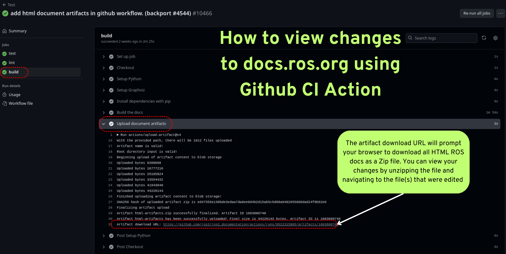
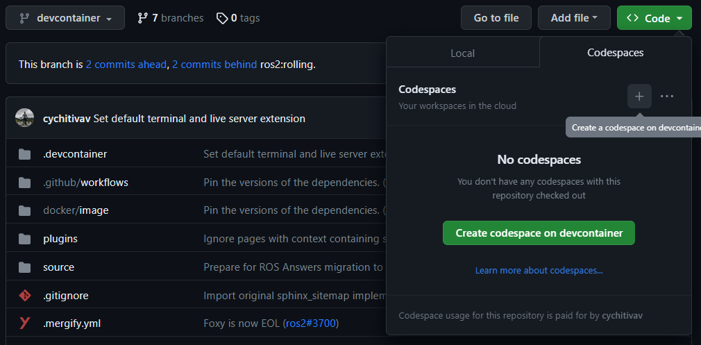
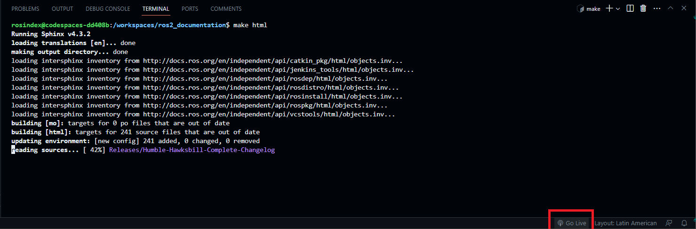

.. _CreatingOrUpdatingDocs:

Creating or updating documentation
==================================

.. contents:: Table of Contents
   :depth: 2
   :local:

Building the site locally
-------------------------

Start by creating `venv <https://docs.python.org/3/library/venv.html>`__ to build the documentation:

.. code-block:: console

   $ python3 -m venv ros2doc  # create venv
   $ source ros2doc/bin/activate  # activate venv

And install requirements located in the ``requirements.txt`` file:

.. tabs::

  .. group-tab:: Linux

    .. code-block:: console

       $ pip install -r requirements.txt -c constraints.txt

  .. group-tab:: macOS

    .. code-block:: console

       $ pip install -r requirements.txt -c constraints.txt

  .. group-tab:: Windows

    .. code-block:: console

      $ python -m pip install -r requirements.txt -c constraints.txt

In order for Sphinx to be able to generate diagrams, the ``dot`` command must be available.

.. tabs::

  .. group-tab:: Linux

    .. code-block:: console

       $ sudo apt update ; sudo apt install graphviz

  .. group-tab:: macOS

    .. code-block:: console

      $ brew install graphviz

  .. group-tab:: Windows

      Download an installer from `the Graphviz Download page <https://graphviz.gitlab.io/_pages/Download/Download_windows.html>`__ and install it.
      Make sure to allow the installer to add it to the Windows ``%PATH%``, otherwise Sphinx will not be able to find it.

Building the site for one branch
^^^^^^^^^^^^^^^^^^^^^^^^^^^^^^^^

To build the site for just this branch, type ``make html`` at the top-level of the repository.
This is the recommended way to test out local changes.

.. code-block:: console

   $ make html

The build process can take some time.
To see the output, open ``build/html/index.html`` in your browser.


Checking / Testing the site
^^^^^^^^^^^^^^^^^^^^^^^^^^^

You can run the documentation tests locally (using `doc8 <https://github.com/PyCQA/doc8>`_) with the following command:

.. code-block:: console

   $ make test

You can run the Python documentation tools tests locally (using `pytest <https://docs.pytest.org/en/stable/>`_) with the following command:

.. code-block:: console

   $ make test-tools

You can run the documentation linter locally (using `sphinx-lint <https://github.com/sphinx-contrib/sphinx-lint>`_) with the following command:

.. code-block:: console

   $ make lint

You can run the documentation spell checker locally (using `codespell <https://github.com/codespell-project/codespell>`_) with the following command:

.. code-block:: console

   $ make spellcheck

.. note::

   If that detects specific words that need to be ignored, add it to `codespell_whitelist <https://github.com/ros2/ros2_documentation/blob/{REPOS_FILE_BRANCH}/codespell_whitelist.txt>`_ .

To know more about spelling checks, refer to :ref:`Spelling check <spelling-check>`

View Site Through Github CI
^^^^^^^^^^^^^^^^^^^^^^^^^^^

For small changes to the ROS 2 Docs you can view your changes as rendered HTML using artifacts generated in our Github Actions.
The "build" action produces the entire ROS Docs as a downloadable Zip file that contains all HTML for `docs.ros.org <https://docs.ros.org/>`_
This build action is triggered after passing the test action and lint action.

To download and view your changes first go to your pull request and under the title click the "Checks" tab.
On the left hand side of the checks page, click on the "Test" section under the "tests" section  click on "build" dialog.
This will open a menu on the right, where you can click on "Upload document artifacts" and scroll to the bottom to see the download link for the Zipped' HTML files under the heading "Artifact download URL".



Building the site for all branches
^^^^^^^^^^^^^^^^^^^^^^^^^^^^^^^^^^

To build the site for all branches, type ``make multiversion`` from the ``rolling`` branch.
This has two drawbacks:

#. The multiversion plugin doesn't understand how to do incremental builds, so it always rebuilds everything.
   This can be slow.

#. When typing ``make multiversion``, it will always check out exactly the branches listed in the ``conf.py`` file.
   That means that local changes will not be shown.

To show local changes in the multiversion output, you must first commit the changes to a local branch.
Then you must edit the `conf.py <https://github.com/ros2/ros2_documentation/blob/rolling/conf.py>`_ file and change the ``smv_branch_whitelist`` variable to point to your branch.

Checking for broken links
^^^^^^^^^^^^^^^^^^^^^^^^^

To check for broken links on the site, run:

.. code-block:: console

   $ make linkcheck

This will check the entire site for broken links, and output the results to the screen and ``build/linkcheck``.

.. _spelling-check:

Spelling check
^^^^^^^^^^^^^^

The ``make spellcheck`` command scans the documentation files and flags any misspellings.
If errors are detected, review the suggestions and update the pull request as necessary.

Some words, such as technical terms or proper nouns, maybe mistakenly flagged as misspelled.
If you encounter such instances, you can add them to the ignore list to prevent them from being flagged in the future.
To do this, add it to the `codespell_whitelist <https://github.com/ros2/ros2_documentation/blob/{REPOS_FILE_BRANCH}/codespell_whitelist.txt>`_ file as follows:

.. code-block:: text

   empy
   jupyter
   lets
   ws

To include custom corrections that ``codespell`` should apply, you can add them to the `codespell_dictionary <https://github.com/ros2/ros2_documentation/blob/{REPOS_FILE_BRANCH}/codespell_dictionary.txt>`_ file as follows:

.. code-block:: text

   amnet->ament
   colcn->colcon
   rosabg->rosbag
   rosdistroy->rosdistro

To check the dictionaries, you can run the ``make check-dictionaries`` command.
This will check the blank lines and leading/trailing spaces in the dictionaries.
If it complains about the dictionaries, you can run the ``make sort-dictionaries`` command.
This command will automatically modify the dictionaries if any issues are found.

Building the site with GitHub Codespaces
----------------------------------------
First, you need to have a GitHub account (if you don't have one, you can create one for free).
Then, you need to go to the `ROS 2 Documentation GitHub repository <https://github.com/ros2/ros2_documentation>`__.
After that, you can open the repository in Codespaces, it can be done just by clicking on the "Code" button on the repository page, then choose "Open with Codespaces" from the dropdown menu.



After that, you will be redirected to your Codespaces page, where you can see the progress of the Codespaces creation.
Once it is done, a Visual Studio Code tab will be opened in your browser.
You can open the terminal by clicking on the "Terminal" tab in the top panel or by pressing :kbd:`Ctrl-J`.

In this terminal, you can run any command you want, for example, you can run the following command to build the site for just this branch:

.. code-block:: console

   $ make html

Finally, to view the site, you can click on the "Go Live" button in the right bottom panel and then, it will open the site in a new tab in your browser (you will need to browse to the ``build/html`` folder).



Building the site with Devcontainer
-----------------------------------

`ROS 2 Documentation GitHub repository <https://github.com/ros2/ros2_documentation>`__ also supports ``Devcontainer`` development environment with Visual Studio Code.
This will enable you to build the documentation much easier without changing your operating system.

See :doc:`/How-To-Guides/Setup-ROS-2-with-VSCode-and-Docker-Container` to install VS Code and Docker before the following procedure.

Clone repository and start VS Code:

.. code-block:: console

   $ git clone https://github.com/ros2/ros2_documentation
   $ cd ./ros2_documentation
   $ code .

To use ``Devcontainer``, you need to install "Remote Development" Extension within VS Code search in Extensions (CTRL+SHIFT+X) for it.

And then, use ``View->Command Palette...`` or ``Ctrl+Shift+P`` to open the command palette.
Search for the command ``Dev Containers: Reopen in Container`` and execute it.
This will build your development docker container for you automatically.

To build the documentation, open a terminal using ``View->Terminal`` or ``Ctrl+Shift+``` and ``New Terminal`` in VS Code.
Inside the terminal, you can build the documentation:

.. code-block:: console

   $ make html

.. image:: images/vscode_devcontainer.png
   :width: 100%
   :alt: VS Code Devcontainer
