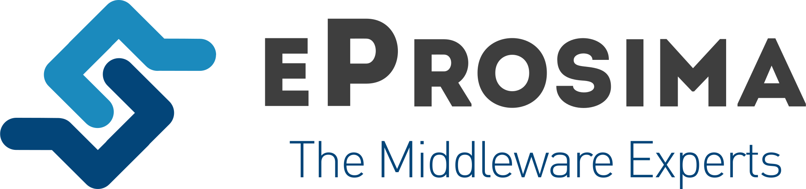
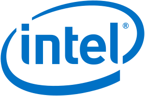
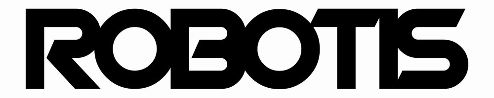
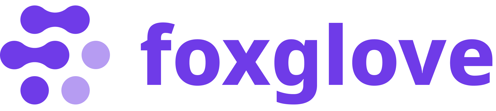
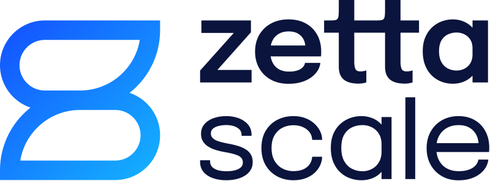

.. redirect-from::

  Governance

.. _Governance:

Project Governance
==================

.. contents:: Table of Contents
   :depth: 1
   :local:

Technical Steering Committee (TSC)
----------------------------------
Since the beginning of ROS, the project has been overseen and prioritized primarily by one organization, first Willow Garage and now Open Robotics.
That approach has worked well enough, as evidenced by the widespread adoption of ROS around the world.

But with ROS 2, we want to broaden participation to accelerate ROS 2 delivery, starting with these areas: determining the roadmap, developing core tools and libraries, and establishing working groups to focus on important topics.
To that end, we've established a Technical Steering Committee (TSC).
As described in the :doc:`charter <Governance/ROS2-TSC-Charter>`, the TSC comprises representatives of organizations that are contributing to the development of ROS 2, and it has the responsibility to set the technical direction for the project.

Packages relevant to this ROS 2 TSC are listed in `REP 2005 <https://www.ros.org/reps/rep-2005.html>`_.

Meeting notes can be found on `ROS Discourse <https://discourse.ros.org/tag/tsc>`_.

The current members of the ROS 2 TSC are (23 as of 2022-02-01):

.. |amazon| image:: Governance/images/amazon.svg
.. |apex| image:: Governance/images/apex.png

.. |canonical| image:: Governance/images/ubuntu.svg

.. |gvsc| image:: Governance/images/gvsc.png

.. |irobot| image:: Governance/images/irobot.png

.. |openrobotics| image:: Governance/images/openrobotics-logo-stacked.png

.. |ros2| image:: Governance/images/ros2_logo.png
.. |rosindustrial| image:: Governance/images/ros-industrial.png
.. |sony| image:: Governance/images/sony.png
.. |tri| image:: Governance/images/tri_logo_landscape-web.svg
.. |windriver| image:: Governance/images/windriver.png

.. raw:: html

    <!--
    The CSS and HTML below generate the list of TSC members.
    It is currently using raw HTML because there was no way that I could see to make the
    ReStructured Text "list-tables" directive make the logos a consistent size.
    -->
    
    <table class="tscclass">
      <tbody>
        <tr class="tscclass">
          <td class="tscclass" align="center">

</td>
          <td class="tscclass" align="center">
Amazon: Aaron Blasdel
</td>
        </tr>
        <tr class="tscclass">
          <td class="tscclass" align="center">

</td>
          <td class="tscclass" align="center">
Apex.AI: Lyle Johnson
</td>
        </tr>
        <tr class="tscclass">
          <td class="tscclass" align="center">

</td>
          <td class="tscclass" align="center">
Bosch: Christian Henkel
</td>
        </tr>
        <tr class="tscclass">
          <td class="tscclass" align="center">

</td>
          <td class="tscclass" align="center">
Canonical: Mirko Ferrati
</td>
        </tr>
        <tr class="tscclass">
          <td class="tscclass" align="center">

</td>
          <td class="tscclass" align="center">
eProsima: Jaime Martin Losa
</td>
        </tr>
        <tr class="tscclass">
          <td class="tscclass" align="center">

</td>
          <td class="tscclass" align="center">
GVSC: Jerry Towler (SwRI)
</td>
        </tr>
        <tr class="tscclass">
          <td class="tscclass" align="center">

</td>
          <td class="tscclass" align="center">
Intel: Harold Yang
</td>
        </tr>
        <tr class="tscclass">
          <td class="tscclass" align="center">

</td>
          <td class="tscclass" align="center">
Intrinsic: Chris Lalancette
</td>
        </tr>
        <tr class="tscclass">
          <td class="tscclass" align="center">

</td>
          <td class="tscclass" align="center">
iRobot: Alberto Soragna
</td>
        </tr>
        <tr class="tscclass">
          <td class="tscclass" align="center">

</td>
          <td class="tscclass" align="center">
Microsoft: Lou Amadio
</td>
        </tr>
        <tr class="tscclass">
          <td class="tscclass" align="center">

</td>
          <td class="tscclass" align="center">
OSRF: Geoff Biggs
</td>
        </tr>
        <tr class="tscclass">
          <td class="tscclass" align="center">

</td>
          <td class="tscclass" align="center">
PickNik: Henning Kayser
</td>
        </tr>
        <tr class="tscclass">
          <td class="tscclass" align="center">

</td>
          <td class="tscclass" align="center">
ROBOTIS: Will Son
</td>
        </tr>
        <tr class="tscclass">
          <td class="tscclass" align="center">

</td>
          <td class="tscclass" align="center">
ROS-Industrial: Matt Robinson
</td>
        </tr>
        <tr class="tscclass">
          <td class="tscclass" align="center">

</td>
          <td class="tscclass" align="center">
Sony: Tomoya Fujita
</td>
        </tr>
        <tr class="tscclass">
          <td class="tscclass" align="center">

</td>
          <td class="tscclass" align="center">
Toyota Research Institute: Ian McMahon
</td>
        </tr>
        <tr class="tscclass">
          <td class="tscclass" align="center">

</td>
          <td class="tscclass" align="center">
Wind River: Andrei Kholodnyi
</td>
        </tr>
        <tr class="tscclass">
          <td class="tscclass" align="center">

</td>
          <td class="tscclass" align="center">
Foxglove:  Adrian Macneil
</td>
        </tr>
        <tr class="tscclass">
          <td class="tscclass" align="center">

</td>
          <td class="tscclass" align="center">
Zetta Scale: Angelo Corsaro
</td>
        </tr>
        <tr class="tscclass">
          <td class="tscclass" align="center">

</td>
          <td class="tscclass" align="center">
Community Representative: <a href="https://github.com/omichel"> Oliver Michel </a> 
</td>
        </tr>
        <tr class="tscclass">
          <td class="tscclass" align="center">

</td>
          <td class="tscclass" align="center">
Community Representative: <a href="https://github.com/pmusau17"> Patrick Musau </a>
</td>
        </tr>
        <tr class="tscclass">
          <td class="tscclass" align="center">

</td>
          <td class="tscclass" align="center">
Community Representative:  <a href="https://github.com/fmrico"> Francisco Martin Rico </a>
</td>
        </tr>
      </tbody>
    </table>
     

If you are interested in joining the ROS 2 TSC, please inquire via info@openrobotics.org.

.. toctree::
   :maxdepth: 1

   Governance/ROS2-TSC-Charter
   Governance/ROS2-TSC-Intake-process
   Governance/Working-Groups
   Governance/How-To-Start-A-Community-Working-Group

Working Groups (WGs)
--------------------

As described in its :doc:`charter <Governance/ROS2-TSC-Charter>`, the TSC establishes working groups (WGs) to discuss and make progress on specific topics.
More information about working groups, along with a list of active ROS 2 working groups :doc:`can be found here <Governance/Working-Groups>`.

Upcoming ROS Events
-------------------

Upcoming Working group meetings can be found in this `Google Calendar <https://calendar.google.com/calendar/embed?src=agf3kajirket8khktupm9go748%40group.calendar.google.com&ctz=America%2FLos_Angeles>`_.
It can be accessed via `iCal <https://calendar.google.com/calendar/ical/agf3kajirket8khktupm9go748%40group.calendar.google.com/public/basic.ics>`_.

.. raw:: html

    <!--
    The below code comes from https://www.mpking.com/2021/04/making-google-calendar-embeddable.html.
    The basic idea is that if we are on a desktop device (defined as anything that has more than 767 pixels),
    then we show the monthly version of the calendar. If we are on a device with 767 or less, show the agenda
    version, which is much narrower.
    -->
    
    

      

        <iframe src="https://calendar.google.com/calendar/embed?src=agf3kajirket8khktupm9go748%40group.calendar.google.com" style="border: 0" width="800" height="600" frameborder="0" scrolling="no"></iframe>
      

      
<iframe src="https://calendar.google.com/calendar/embed?mode=AGENDA&amp;height=400&amp;wkst=1&amp;src=agf3kajirket8khktupm9go748%40group.calendar.google.com" style="border: 0" width="280" height="500" frameborder="0" scrolling="no"></iframe>
      

    

If you have an individual event or series of events that you'd like to post please contact info@openrobotics.org
