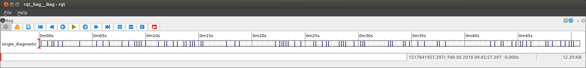
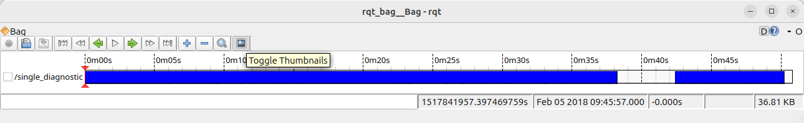
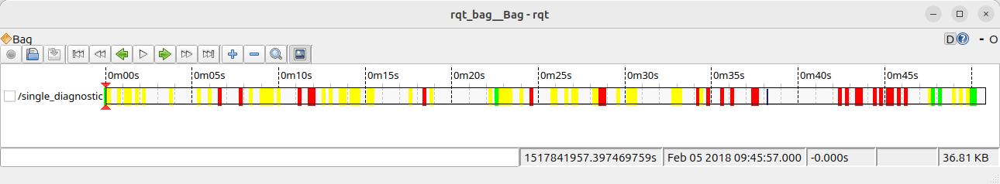

Create an rqt_bag Plugin
========================

Let's say you have bags of data and you want to be able to visualize them.
``rqt_bag`` gives you the ability to scroll through the recorded messages and visualize the raw message values.
However, often may want something more visual, or to do some post-processing on the raw message.
For that, you can write an rqt_bag plugin, using the proof-of-concept Python plugin system.
That way you can go from a simple visualization of the messages...

to something like this:

.. image:: images/rqtbag_plugin_full.png
   :alt: screenshot of rqt_bag with colored timeline and extra panel on the side

Some Test Data
--------------

`SomeDiagnostics <https://github.com/MetroRobots/rqt_bag_diagnostics_demo/raw/refs/heads/main/SomeDiagnostics.zip>`__ is a bag file you can use for this tutorial, once you unzip it.

Package Setup
-------------

We're going to create a package called ``rqt_bag_diagnostics_demo``.
Start with a basic ``ament_python`` package, and insert the following into your ``package.xml``.

.. code:: xml

       <depend>diagnostic_msgs</depend>
       <depend>rqt_bag</depend>
       <export>
         <build_type>ament_python</build_type>
         <rqt_bag plugin="${prefix}/plugins.xml"/>
       </export>

In ``setup.py``, insert the following line:

.. code:: python

       package_dir={'': 'src'},

and add

.. code:: python

           ('share/' + package_name, ['plugins.xml']),

to the ``data_files``.

Finally, we're going to define the plugin in an xml file called ``plugins.xml`` (as referenced in the ``package.xml``)

.. code:: xml

   <library path="src">
     <class name="DiagnosticBagPlugin"
            type="rqt_bag_diagnostics_demo.the_plugin.DiagnosticBagPlugin"
            base_class_type="rqt_bag::Plugin">
       <description>
       </description>
     </class>
   </library>

The name is the name of the class we'll create.
The type is the way we would import the class in Python, i.e. ``package_name.name_of_file.class_name``

Defining the Plugin
-------------------

In this particular Python library, we need to define the package within the ``src`` folder, so the ``__init__.py`` should be located at ``src/package_name/__init__.py`` relative to the package root.
As referenced in the ``plugins.xml``, all the code that follows will be in ``src/rqt_bag_diagnostics_demo/the_plugin.py``.

First, the core Plugin class.

.. code:: python

   from rqt_bag.plugins.plugin import Plugin
   from python_qt_binding.QtCore import Qt
   from diagnostic_msgs.msg import DiagnosticStatus

   def get_color(diagnostic):
       if diagnostic.level == DiagnosticStatus.OK:
           return Qt.green
       elif diagnostic.level == DiagnosticStatus.WARN:
           return Qt.yellow
       else:  # ERROR or STALE
           return Qt.red

   class DiagnosticBagPlugin(Plugin):
       def __init__(self):
           pass

       def get_view_class(self):
           return None

       def get_renderer_class(self):
           return None

       def get_message_types(self):
           return ['diagnostic_msgs/msg/DiagnosticStatus']

Here we have some basic imports, and helper function that we'll use later, and a class that defines the three parts of an ``rqt_bag`` plugin.

  1. ``view_class`` - a.k.a. ``TopicMessageView`` - A separate panel that can be used for viewing individual messages.
  2. ``renderer_class`` - a.k.a. ``TimelineView`` - A tool for drawing onto the timeline view of the bag data.
  3. ``message_types`` - An array of strings that define what message types this plugin can be used for.
     You can return ``['*']`` for it to apply to all messages.

Since we return None for the first two methods, this plugin won't do anything.
We'll tackle each of these separately.

TopicMessageView
----------------

Version 1
~~~~~~~~~

We're going to create a class that extends the ``TopicMessageView`` class.
First, add the import:

.. code:: python

   from rqt_bag import TopicMessageView

Then define this new class:

.. code:: python

   class DiagnosticPanel(TopicMessageView):
       name = 'Awesome Diagnostic'

       def message_viewed(self, bag, entry, ros_message, msg_type_name, topic):
           super(DiagnosticPanel, self).message_viewed(bag=bag, entry=entry, ros_message=ros_message, msg_type_name=msg_type_name, topic=topic)
           print(f'{topic}: {ros_message}')

Here we define two things.
The name string defines what we'll see in the menu of ``rqt_bag``.
The ``message_viewed`` method defines what to do when the message is selected.
So here, we'll just print the message to terminal for now.

We need to hook this class we've created into the plugin infrastructure, and for that, we return the class object itself in the ``get_view_class`` method.

.. code:: python

       def get_view_class(self):
           return DiagnosticPanel

To see this in action, open up the provided bag file, and right click on the diagnostic track.
It will give you two options under the "View": Raw, and our "Awesome Diagnostic."
Clicking this should open a panel and you can scroll through the messages and watch them print.

.. image:: images/rqtbag_plugin_panel.png
   :alt: screenshot of rqt_bag with blank extra panel

Version 2
~~~~~~~~~

``TopicMessageView`` is itself an extension of a ``QObject``.
There's lots of things you could do with this using all the might and power of Qt.
This is not a python Qt tutorial sadly.
So we're going to just add a simple QWidget and draw on it.
First, add the following imports:

.. code:: python

   from python_qt_binding.QtWidgets import QWidget
   from python_qt_binding.QtGui import QBrush, QPainter

Then update the ``DiagnosticPanel`` class to the following:

.. code:: python

   class DiagnosticPanel(TopicMessageView):
       name = 'Awesome Diagnostic'

       def __init__(self, timeline, parent, topic):
           super(DiagnosticPanel, self).__init__(timeline, parent, topic)
           self.widget = QWidget()
           parent.layout().addWidget(self.widget)
           self.msg = None
           self.widget.paintEvent = self.paintEvent

       def message_viewed(self, bag, msg_details):
           super(DiagnosticPanel, self).message_viewed(bag, msg_details)
           _, self.msg, _ = msg_details
           self.widget.update()

       def paintEvent(self, event):
           self.qp = QPainter()
           self.qp.begin(self.widget)

           rect = event.rect()

           if self.msg is None:
               self.qp.fillRect(0, 0, rect.width(), rect.height(), Qt.white)
           else:
               color = get_color(self.msg)
               self.qp.setBrush(QBrush(color))
               self.qp.drawEllipse(0, 0, rect.width(), rect.height())

In the constructor, we create a ``QWidget`` and override its ``paintEvent`` method.
Now when we get a message with ``message_viewed``, we save it, and update the widget, which will in turn call our ``paintEvent``.
Before a message is selected, we'll just paint a white rectangle.
Otherwise, we'll draw a circle, using our handy helper method to relate the color to what level the diagnostic is at.

.. image:: images/rqtbag_plugin_circle.png
   :alt: screenshot of rqt_bag with a circle drawn on the extra panel

TimelineRenderer
----------------

.. _version-1-1:

Version 1
~~~~~~~~~

To draw on the timeline, we extend the ``TimelineRenderer`` class.
Add an import:

.. code:: python

   from rqt_bag import TimelineRenderer

Then add the new class.

.. code:: python

   class DiagnosticTimeline(TimelineRenderer):
       def __init__(self, timeline, height=80):
           TimelineRenderer.__init__(self, timeline, msg_combine_px=height)

       def draw_timeline_segment(self, painter, topic, start, end, x, y, width, height):
           painter.setBrush(QBrush(Qt.blue))
           painter.drawRect(x, y, width, height)

You can customize how tall the message's portion of the timeline is with the ``msg_combine_px`` parameter.
The key method to override is the ``draw_timeline_segment`` method which gives you potions of the timeline to draw.
For now we'll just draw blue rectangles on each segment.

Just like the message view, you also have to edit the plugin to return your class.

.. code:: python

       def get_renderer_class(self):
           return DiagnosticTimeline

To view this, you have to enable "Thumbnails" (a misleading name) in the rqt_bag gui.

.. _version-2-1:

Version 2
~~~~~~~~~

Okay, now we actually want to customize how the messages are drawn in the timeline based on the messages themselves.
For that, there's a wonky bunch of magical incantations you need to read the messages out of the bag files.
Here are the new imports:

.. code:: python

   from python_qt_binding.QtGui import QPen
   from rclpy.time import Time
   import math
   from rclpy.serialization import deserialize_message

Then update ``draw_timeline_segment``:

.. code:: python

       def draw_timeline_segment(self, painter, topic, start, end, x, y, width, height):
           def _convert_stamp(float_t):
               nano, sec = math.modf(float_t)
               return Time(seconds=int(sec), nanoseconds=int(nano * 1e9))

           bag_timeline = self.timeline.scene()
           start_t = _convert_stamp(start)
           end_t = _convert_stamp(end)

           for bag, entry in bag_timeline.get_entries_with_bags([topic], start_t, end_t):
               topic, raw_data, t = bag_timeline.read_message(bag, entry.timestamp, topic)
               msg = deserialize_message(raw_data, DiagnosticStatus)
               color = get_color(msg)
               painter.setBrush(QBrush(color))
               painter.setPen(QPen(color, 5))

               p_x = self.timeline.map_stamp_to_x(t / 1e9)
               painter.drawLine(p_x, y, p_x, y + height - 1)

Using the topic, start and end parameters of the method, we can get the bag entries that correspond with this segment of the timeline.
We can then get the actual message and use it to draw.
Here we are drawing a line based on the level of the diagnostic message.
We can automatically figure out where to draw the message horizontally using the ``map_stamp_to_x`` method.

The alternative to this weird way of accessing the messages is to use the
`Timeline Cache <https://github.com/ros-visualization/rqt_bag/blob/rolling/rqt_bag/src/rqt_bag/timeline_cache.py>`__
like the
`ImageTimelineViewer <https://github.com/ros-visualization/rqt_bag/blob/rolling/rqt_bag_plugins/src/rqt_bag_plugins/image_timeline_renderer.py>`__
does, but figuring that out is left as an exercise to the reader.
