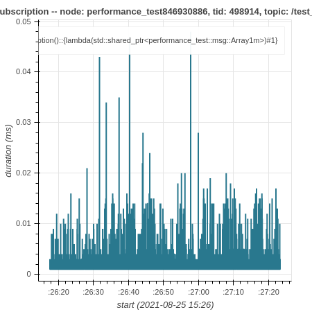

How to use ros2_tracing to trace and analyze an application
===========================================================

This tutorial shows how to use `ros2_tracing <https://github.com/ros2/ros2_tracing>`_ to trace and analyze a ROS 2 application.
For this tutorial, the application will be `performance_test <https://gitlab.com/ApexAI/performance_test>`_.

Overview
--------

This tutorial covers:

1. running and tracing a ``performance_test`` run
2. analyzing the trace data using `tracetools_analysis <https://github.com/ros-tracing/tracetools_analysis>`_ to plot the callback durations

Prerequisites
-------------

This tutorial is aimed at real-time Linux systems.
See the :doc:`real-time system setup tutorial <../Miscellaneous/Building-Realtime-rt_preempt-kernel-for-ROS-2>`.
However, the tutorial will work if you are using a non-real-time Linux system.

Installing and building
-----------------------

Install ROS 2 on Linux by following the :doc:`installation instructions <../../Installation>`.

.. note::

  This tutorial should generally work with all supported Linux distributions.
  However, you might need to adapt some commands.

Install ``babeltrace`` and ``ros2trace``.

.. code-block:: bash

  sudo apt-get update
  sudo apt-get install -y babeltrace ros-{DISTRO}-ros2trace ros-{DISTRO}-tracetools-analysis

Source the ROS 2 installation and verify that tracing is enabled:

.. code-block:: bash

  source /opt/ros/{DISTRO}/setup.bash
  ros2 run tracetools status

You should see ``Tracing enabled`` in the output.

Then create a workspace, and clone ``performance_test`` and ``tracetools_analysis``.

.. code-block:: bash

  cd ~/
  mkdir -p tracing_ws/src
  cd tracing_ws/src/
  git clone https://gitlab.com/ApexAI/performance_test.git
  git clone https://github.com/ros-tracing/tracetools_analysis.git -b {DISTRO}
  cd ..

Install dependencies with rosdep.

.. code-block:: bash

  rosdep update
  rosdep install --from-paths src --ignore-src -y

Then build and configure ``performance_test`` for ROS 2.
See its `documentation <https://gitlab.com/ApexAI/performance_test/-/tree/master/performance_test#performance_test>`_.

.. code-block:: bash

  colcon build --packages-select performance_test --cmake-args -DPERFORMANCE_TEST_RCLCPP_ENABLED=ON

Next, we will run a ``performance_test`` experiment and trace it.

Tracing
-------

Step 1: Trace
^^^^^^^^^^^^^

In one terminal, source the workspace and set up tracing.
When running the command, a list of ROS 2 userspace events will be printed.
It will also print the path to the directory that will contain the resulting trace (under ``~/.ros/tracing``).

.. code-block:: bash

  # terminal 1
  cd ~/tracing_ws
  source install/setup.bash
  ros2 trace --session-name perf-test --list

Press enter to start tracing.

Step 2: Run Application
^^^^^^^^^^^^^^^^^^^^^^^

In a second terminal, source the workspace.

.. code-block:: bash

  # terminal 2
  cd ~/tracing_ws
  source install/setup.bash

Then run the ``performance_test`` experiment (or your own application).
We simply create an experiment with a node publishing ~1 MB messages to another node as fast as possible for 60 seconds using the second highest real-time priority so that we don't interfere with critical kernel threads.
We need to run ``performance_test`` as ``root`` to be able to use real-time priorities.

.. code-block:: bash

  # terminal 2
  sudo ./install/performance_test/lib/performance_test/perf_test -c rclcpp-single-threaded-executor -p 1 -s 1 -r 0 -m Array1m --reliability RELIABLE --max-runtime 60 --use-rt-prio 98

If that last command doesn't work for you (with an error like: "error while loading shared libraries"), run the slightly-different command below.
This is because, for security reasons, we need to manually pass ``*PATH`` environment variables for some shared libraries to be found (see `this explanation <https://unix.stackexchange.com/a/251374>`_).

.. code-block:: bash

  # terminal 2
  sudo env PATH="$PATH" LD_LIBRARY_PATH="$LD_LIBRARY_PATH" ./install/performance_test/lib/performance_test/perf_test -c rclcpp-single-threaded-executor -p 1 -s 1 -r 0 -m Array1m --reliability RELIABLE --max-runtime 60 --use-rt-prio 98

.. note::

  If you're not using a real-time kernel, simply run:

  .. code-block:: bash

    # terminal 2
    ./install/performance_test/lib/performance_test/perf_test -c rclcpp-single-threaded-executor -p 1 -s 1 -r 0 -m Array1m --reliability RELIABLE --max-runtime 60

Step 3: Validate Trace
^^^^^^^^^^^^^^^^^^^^^^

Once the experiment is done, in the first terminal, press enter again to stop tracing.
Use ``babeltrace`` to quickly look at the resulting trace.

.. code-block:: bash

  babeltrace ~/.ros/tracing/perf-test | less

The output of the above command is a human-readable version of the raw Common Trace Format (CTF) data, which is a list of trace events.
Each event has a timestamp, an event type, some information on the process that generated the event, and the values of the fields of the given event type.

Use the arrow keys to scroll, or press ``q`` to exit.

Next, we will analyze the trace.

Analysis
--------

`tracetools_analysis <https://github.com/ros-tracing/tracetools_analysis>`_ provides a Python API to easily analyze traces.
We can use it in a `Jupyter notebook <https://jupyter.org/>`_ with `bokeh <https://docs.bokeh.org/en/latest/index.html>`_ to plot the data.
The ``tracetools_analysis`` repository contains a `few sample notebooks <https://github.com/ros-tracing/tracetools_analysis/tree/{DISTRO}/tracetools_analysis/analysis>`_, including `one notebook to analyze subscription callback durations <https://github.com/ros-tracing/tracetools_analysis/blob/{DISTRO}/tracetools_analysis/analysis/callback_duration.ipynb>`_.

For this tutorial, we will plot the durations of the subscription callback in the subscriber node.

Install Jupyter notebook and bokeh, and then open the sample notebook.

.. code-block:: bash

  pip3 install bokeh
  jupyter notebook ~/tracing_ws/src/tracetools_analysis/tracetools_analysis/analysis/callback_duration.ipynb

This will open the notebook in the browser.

Replace the value for the ``path`` variable in the second cell to the path to the trace directory:

.. code-block:: python

  path = '~/.ros/tracing/perf-test'

Run the notebook by clicking the *Run* button for each cell.
Running the cell that does the trace processing might take a few minutes on the first run, but subsequent runs will be much quicker.

You should get a plot that looks similar to this:

We can see that most of the callbacks take less than 0.01 ms, but there are some outliers taking over 0.02 or 0.03 ms.

Conclusion
----------

This tutorial showed how to install tracing-related tools.
Then it showed how to trace a `performance_test <https://gitlab.com/ApexAI/performance_test>`_ experiment using `ros2_tracing <https://github.com/ros2/ros2_tracing>`_ and plot the callback durations using `tracetools_analysis <https://github.com/ros-tracing/tracetools_analysis>`_.

For more trace analyses, take a look at the `other sample notebooks <https://github.com/ros-tracing/tracetools_analysis/tree/{DISTRO}/tracetools_analysis/analysis>`_ and the `tracetools_analysis API documentation <https://docs.ros.org/en/{DISTRO}/p/tracetools_analysis/>`_.
The `ros2_tracing design document <https://github.com/ros2/ros2_tracing/blob/{DISTRO}/doc/design_ros_2.md>`_ also contains a lot of information.
