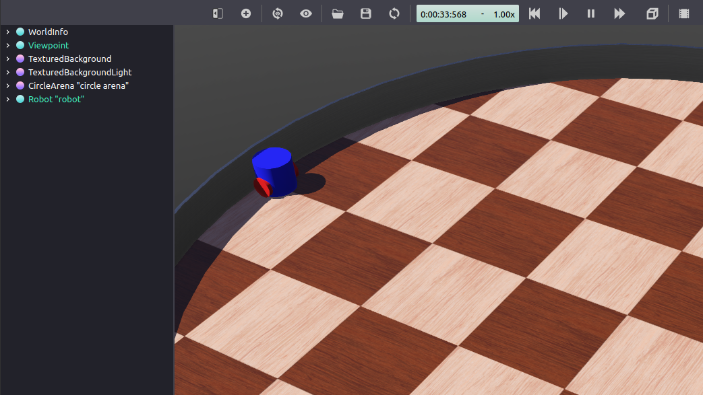

.. redirect-from::

    Tutorials/Simulators/Webots/Setting-up-a-Robot-Simulation-Webots
    Tutorials/Advanced/Simulators/Webots

Setting up a robot simulation (Basic)
======================================

**Goal:** Setup a robot simulation and control it from ROS 2.

**Tutorial level:** Advanced

**Time:** 30 minutes

.. contents:: Contents
   :depth: 2
   :local:

Background
----------

In this tutorial, you are going to use the Webots robot simulator to set-up and run a very simple ROS 2 simulation scenario.

The ``webots_ros2`` package provides an interface between ROS 2 and Webots.
It includes several sub-packages, but in this tutorial, you are going to use only the ``webots_ros2_driver`` sub-package to implement a Python or C++ plugin controlling a simulated robot.
Some other sub-packages contain demos with different robots such as the TurtleBot3.
They are documented in the `Webots ROS 2 examples <https://github.com/cyberbotics/webots_ros2/wiki/Examples>`_ page.

Prerequisites
-------------

It is recommended to understand basic ROS principles covered in the beginner :doc:`../../../../Tutorials`.
In particular, :doc:`../../../Beginner-CLI-Tools/Introducing-Turtlesim/Introducing-Turtlesim`, :doc:`../../../Beginner-CLI-Tools/Understanding-ROS2-Topics/Understanding-ROS2-Topics`, :doc:`../../../Beginner-Client-Libraries/Creating-A-Workspace/Creating-A-Workspace`, :doc:`../../../Beginner-Client-Libraries/Creating-Your-First-ROS2-Package` and :doc:`../../../Intermediate/Launch/Creating-Launch-Files` are useful prerequisites.

.. tabs::

    .. group-tab:: Linux

        The Linux and ROS commands of this tutorial can be run in a standard Linux terminal.
        The following page :doc:`./Installation-Ubuntu` explains how to install the ``webots_ros2`` package on Linux.

    .. group-tab:: Windows

        The Linux and ROS commands of this tutorial must be run in a WSL (Windows Subsystem for Linux) environment.
        The following page :doc:`./Installation-Windows` explains how to install the ``webots_ros2`` package on Windows.

    .. group-tab:: macOS

        The Linux and ROS commands of this tutorial must be run in a pre-configured Linux Virtual Machine (VM).
        The following page :doc:`./Installation-MacOS` explains how to install the ``webots_ros2`` package on macOS.

This tutorial is compatible with version 2023.1.0 of ``webots_ros2`` and Webots R2023b, as well as upcoming versions.

Tasks
-----

1 Create the package structure
^^^^^^^^^^^^^^^^^^^^^^^^^^^^^^

Let's organize the code in a custom ROS 2 package.
Create a new package named ``my_package`` from the ``src`` folder of your ROS 2 workspace.
Change the current directory of your terminal to ``ros2_ws/src`` and run:

.. tabs::

    .. group-tab:: Python

        .. code-block:: console

            ros2 pkg create --build-type ament_python --license Apache-2.0 --node-name my_robot_driver my_package --dependencies rclpy geometry_msgs webots_ros2_driver

        The ``--node-name my_robot_driver`` option will create a ``my_robot_driver.py`` template Python plugin in the ``my_package`` subfolder that you will modify later.
        The ``--dependencies rclpy geometry_msgs webots_ros2_driver`` option specifies the packages needed by the ``my_robot_driver.py`` plugin in the ``package.xml`` file.

        Let's add a ``launch`` and a ``worlds`` folder inside the ``my_package`` folder.

        .. code-block:: console

                cd my_package
                mkdir launch
                mkdir worlds

        You should end up with the following folder structure:

        .. code-block:: console

            src/
            └── my_package/
                ├── launch/
                ├── my_package/
                │   ├── __init__.py
                │   └── my_robot_driver.py
                ├── resource/
                │   └── my_package
                ├── test/
                │   ├── test_copyright.py
                │   ├── test_flake8.py
                │   └── test_pep257.py
                ├── worlds/
                ├── package.xml
                ├── setup.cfg
                └── setup.py

    .. group-tab:: C++

        .. code-block:: console

            ros2 pkg create --build-type ament_cmake --license Apache-2.0 --node-name MyRobotDriver my_package --dependencies rclcpp geometry_msgs webots_ros2_driver pluginlib

        The ``--node-name MyRobotDriver`` option will create a ``MyRobotDriver.cpp`` template C++ plugin in the ``my_package/src`` subfolder that you will modify later.
        The ``--dependencies rclcpp geometry_msgs webots_ros2_driver pluginlib`` option specifies the packages needed by the ``MyRobotDriver`` plugin in the ``package.xml`` file.

        Let's add a ``launch``, a ``worlds`` and a ``resource`` folder inside the ``my_package`` folder.

        .. code-block:: console

            cd my_package
            mkdir launch
            mkdir worlds
            mkdir resource

        Two additional files must be created: the header file for ``MyRobotDriver`` and the ``my_robot_driver.xml`` pluginlib description file.

        .. code-block:: console

            touch my_robot_driver.xml
            touch include/my_package/MyRobotDriver.hpp

        You should end up with the following folder structure:

        .. code-block:: console

            src/
            └── my_package/
                ├── include/
                │   └── my_package/
                │       └── MyRobotDriver.hpp
                ├── launch/
                ├── resource/
                ├── src/
                │   └── MyRobotDriver.cpp
                ├── worlds/
                ├── CMakeList.txt
                ├── my_robot_driver.xml
                └── package.xml

2 Setup the simulation world
^^^^^^^^^^^^^^^^^^^^^^^^^^^^

You will need a world file containing a robot to launch your simulation.
:download:`Download this world file <Code/my_world.wbt>` and move it inside ``my_package/worlds/``.

This is actually a fairly simple text file you can visualize in a text editor.
A simple robot is already included in this ``my_world.wbt`` world file.

.. note::

    In case you want to learn how to create your own robot model in Webots, you can check this `tutorial <https://cyberbotics.com/doc/guide/tutorial-6-4-wheels-robot>`_.

3 Edit the ``my_robot_driver`` plugin
^^^^^^^^^^^^^^^^^^^^^^^^^^^^^^^^^^^^^

The ``webots_ros2_driver`` sub-package automatically creates a ROS 2 interface for most sensors.
More details on existing device interfaces and how to configure them is given in the second part of the tutorial: :doc:`./Setting-Up-Simulation-Webots-Advanced`.
In this task, you will extend this interface by creating your own custom plugin.
This custom plugin is a ROS node equivalent to a robot controller.
You can use it to access the `Webots robot API  <https://cyberbotics.com/doc/reference/robot?tab-language=python>`_ and create your own topics and services to control your robot.

.. note::

    The purpose of this tutorial is to show a basic example with a minimum number of dependencies.
    However, you could avoid the use of this plugin by using another ``webots_ros2`` sub-package named ``webots_ros2_control``, introducing a new dependency.
    This other sub-package creates an interface with the ``ros2_control`` package that facilitates the control of a differential wheeled robot.

.. tabs::

    .. group-tab:: Python

        Open ``my_package/my_package/my_robot_driver.py`` in your favorite editor and replace its contents with the following:

        .. literalinclude:: Code/my_robot_driver.py
            :language: python

        As you can see, the ``MyRobotDriver`` class implements three methods.

        The first method, named ``init(self, ...)``, is actually the ROS node counterpart of the Python ``__init__(self, ...)`` constructor.
        The ``init`` method always takes two arguments:

        - The ``webots_node`` argument contains a reference on the Webots instance.
        - The ``properties`` argument is a dictionary created from the XML tags given in the URDF files (:ref:`4 Create the my_robot.urdf file`) and allows you to pass parameters to the controller.

        The robot instance from the simulation ``self.__robot`` can be used to access the `Webots robot API <https://cyberbotics.com/doc/reference/robot?tab-language=python>`_.
        Then, it gets the two motor instances and initializes them with a target position and a target velocity.
        Finally a ROS node is created and a callback method is registered for a ROS topic named ``/cmd_vel`` that will handle ``Twist`` messages.

        .. literalinclude:: Code/my_robot_driver.py
            :language: python
            :dedent: 4
            :lines: 8-24

        Then comes the implementation of the ``__cmd_vel_callback(self, twist)`` callback private method that will be called for each ``Twist`` message received on the ``/cmd_vel`` topic and will save it in the ``self.__target_twist`` member variable.

        .. literalinclude:: Code/my_robot_driver.py
            :language: python
            :dedent: 4
            :lines: 26-27

        Finally, the ``step(self)`` method is called at every time step of the simulation.
        The call to ``rclpy.spin_once()`` is needed to keep the ROS node running smoothly.
        At each time step, the method will retrieve the desired ``forward_speed`` and ``angular_speed`` from ``self.__target_twist``.
        As the motors are controlled with angular velocities, the method will then convert the ``forward_speed`` and ``angular_speed`` into individual commands for each wheel.
        This conversion depends on the structure of the robot, more specifically on the radius of the wheel and the distance between them.

        .. literalinclude:: Code/my_robot_driver.py
            :language: python
            :dedent: 4
            :lines: 29-39

    .. group-tab:: C++

        Open ``my_package/include/my_package/MyRobotDriver.hpp`` in your favorite editor and replace its contents with the following:

        .. literalinclude:: Code/MyRobotDriver.hpp
            :language: cpp

        The class ``MyRobotDriver`` is defined, which inherits from the ``webots_ros2_driver::PluginInterface`` class.
        The plugin has to override ``step(...)`` and ``init(...)`` functions.
        More details are given in the ``MyRobotDriver.cpp`` file.
        Several helper methods, callbacks and member variables that will be used internally by the plugin are declared privately.

        Then, open ``my_package/src/MyRobotDriver.cpp`` in your favorite editor and replace its contents with the following:

        .. literalinclude:: Code/MyRobotDriver.cpp
            :language: cpp

        The ``MyRobotDriver::init`` method is executed once the plugin is loaded by the ``webots_ros2_driver`` package.
        It takes two arguments:

        * A pointer to the ``WebotsNode`` defined by ``webots_ros2_driver``, which allows to access the ROS 2 node functions.
        * The ``parameters`` argument is an unordered map of strings, created from the XML tags given in the URDF files (:ref:`4 Create the my_robot.urdf file`) and allows to pass parameters to the controller. It is not used in this example.

        It initializes the plugin by setting up the robot motors, setting their positions and velocities, and subscribing to the ``/cmd_vel`` topic.

        .. literalinclude:: Code/MyRobotDriver.cpp
            :language: cpp
            :lines: 13-29

        Then comes the implementation of the ``cmdVelCallback()`` callback function that will be called for each Twist message received on the ``/cmd_vel`` topic and will save it in the ``cmd_vel_msg`` member variable.

        .. literalinclude:: Code/MyRobotDriver.cpp
            :language: cpp
            :lines: 31-35

        The ``step()`` method is called at every time step of the simulation.
        At each time step, the method will retrieve the desired ``forward_speed`` and ``angular_speed`` from ``cmd_vel_msg``.
        As the motors are controlled with angular velocities, the method will then convert the ``forward_speed`` and ``angular_speed`` into individual commands for each wheel.
        This conversion depends on the structure of the robot, more specifically on the radius of the wheel and the distance between them.

        .. literalinclude:: Code/MyRobotDriver.cpp
            :language: cpp
            :lines: 37-50

        The final lines of the file define the end of the ``my_robot_driver`` namespace and include a macro to export the ``MyRobotDriver`` class as a plugin using the ``PLUGINLIB_EXPORT_CLASS`` macro.
        This allows the plugin to be loaded by the Webots ROS2 driver at runtime.

        .. literalinclude:: Code/MyRobotDriver.cpp
            :language: cpp
            :lines: 53-55

        .. note::

            While the plugin is implemented in C++, the C API must be used to interact with the Webots controller library.

.. _4 Create the my_robot.urdf file:

4 Create the ``my_robot.urdf`` file
^^^^^^^^^^^^^^^^^^^^^^^^^^^^^^^^^^^

You now have to create a URDF file to declare the ``MyRobotDriver`` plugin.
This will allow the ``webots_ros2_driver`` ROS node to launch the plugin and connect it to the target robot.

In the ``my_package/resource`` folder create a text file named ``my_robot.urdf`` with this content:

.. tabs::

    .. group-tab:: Python

        .. literalinclude:: Code/my_robot_python.urdf
            :language: xml

        The ``type`` attribute specifies the path to the class given by the hierarchical structure of files.
        ``webots_ros2_driver`` is responsible for loading the class based on the specified package and modules.

    .. group-tab:: C++

        .. literalinclude:: Code/my_robot_cpp.urdf
            :language: xml

        The ``type`` attribute specifies the namespace and class name to load.
        ``pluginlib`` is responsible for loading the class based on the specified information.

.. note::

    This simple URDF file doesn't contain any link or joint information about the robot as it is not needed in this tutorial.
    However, URDF files usually contain much more information as explained in the :doc:`../../../Intermediate/URDF/URDF-Main` tutorial.

.. note::

    Here the plugin does not take any input parameter, but this can be achieved with a tag containing the parameter name.

    .. tabs::

        .. group-tab:: Python

            .. code-block:: xml

                <plugin type="my_package.my_robot_driver.MyRobotDriver">
                    <parameterName>someValue</parameterName>
                </plugin>

        .. group-tab:: C++

            .. code-block:: xml

                <plugin type="my_robot_driver::MyRobotDriver">
                    <parameterName>someValue</parameterName>
                </plugin>

    This is namely used to pass parameters to existing Webots device plugins (see :doc:`./Setting-Up-Simulation-Webots-Advanced`).

5 Create the launch file
^^^^^^^^^^^^^^^^^^^^^^^^

Let's create the launch file to easily launch the simulation and the ROS controller with a single command.
In the ``my_package/launch`` folder create a new text file named ``robot_launch.py`` with this code:

.. literalinclude:: Code/robot_launch.py
    :language: python

The ``WebotsLauncher`` object is a custom action that allows you to start a Webots simulation instance.
You have to specify in the constructor which world file the simulator will open.

.. literalinclude:: Code/robot_launch.py
    :language: python
    :dedent: 4
    :lines: 13-15

Then, the ROS node interacting with the simulated robot is created.
This node, named ``WebotsController``, is located in the ``webots_ros2_driver`` package.

.. tabs::

    .. group-tab:: Linux

        The node will be able to communicate with the simulated robot by using a custom protocol based on IPC and shared memory.

    .. group-tab:: Windows

        The node (in WSL) will be able to communicate with the simulated robot (in Webots on native Windows) through a TCP connection.

    .. group-tab:: macOS

        The node (in the docker container) will be able to communicate with the simulated robot (in Webots on native macOS) through a TCP connection.

In your case, you need to run a single instance of this node, because you have a single robot in the simulation.
But if you had more robots in the simulation, you would have to run one instance of this node per robot.
The ``robot_name`` parameter is used to define the name of the robot the driver should connect to.
The ``robot_description`` parameter holds the path to the URDF file which refers to the ``MyRobotDriver`` plugin.
You can see the ``WebotsController`` node as the interface that connects your controller plugin to the target robot.

.. literalinclude:: Code/robot_launch.py
    :language: python
    :dedent: 4
    :lines: 17-22

After that, the two nodes are set to be launched in the ``LaunchDescription`` constructor:

.. literalinclude:: Code/robot_launch.py
    :language: python
    :dedent: 4
    :lines: 24-26

Finally, an optional part is added in order to shutdown all the nodes once Webots terminates (e.g., when it gets closed from the graphical user interface).

.. literalinclude:: Code/robot_launch.py
    :language: python
    :dedent: 8
    :lines: 27-32

.. note::

    More details on ``WebotsController`` and ``WebotsLauncher`` arguments can be found `on the nodes reference page <https://github.com/cyberbotics/webots_ros2/wiki/References-Nodes>`_.

6 Edit additional files
^^^^^^^^^^^^^^^^^^^^^^^

.. tabs::

    .. group-tab:: Python

        Before you can start the launch file, you have to modify the ``setup.py`` file to include the extra files you added.
        Open ``my_package/setup.py`` and replace its contents with:

        .. literalinclude:: Code/setup.py
            :language: python

        This sets-up the package and adds in the ``data_files`` variable the newly added files: ``my_world.wbt``, ``my_robot.urdf`` and ``robot_launch.py``.

    .. group-tab:: C++

        Before you can start the launch file, you have to modify ``CMakeLists.txt`` and ``my_robot_driver.xml`` files:

        * ``CMakeLists.txt`` defines the compilation rules of your plugin.
        * ``my_robot_driver.xml`` is necessary for the pluginlib to find your Webots ROS 2 plugin.

        Open ``my_package/my_robot_driver.xml`` and replace its contents with:

        .. literalinclude:: Code/my_robot_driver.xml
            :language: xml

        Open ``my_package/CMakeLists.txt`` and replace its contents with:

        .. literalinclude:: Code/CMakeLists.txt
            :language: cmake

        The CMakeLists.txt exports the plugin configuration file with the ``pluginlib_export_plugin_description_file()``, defines a shared library of the C++ plugin ``src/MyRobotDriver.cpp``, and sets the include and library dependencies using ``ament_target_dependencies()``.

        The file then installs the library, the directories ``launch``, ``resource``, and ``worlds`` to the ``share/my_package`` directory.
        Finally, it exports the include directories and libraries using ``ament_export_include_directories()`` and ``ament_export_libraries()``, respectively, and declares the package using ``ament_package()``.

7 Test the code
^^^^^^^^^^^^^^^

.. tabs::

    .. group-tab:: Linux

        From a terminal in your ROS 2 workspace run:

        .. code-block:: console

            colcon build
            source install/local_setup.bash
            ros2 launch my_package robot_launch.py

        This will launch the simulation.
        Webots will be automatically installed on the first run in case it was not already installed.

    .. group-tab:: Windows

        From a terminal in your WSL ROS 2 workspace run:

        .. code-block:: console

            colcon build
            export WEBOTS_HOME=/mnt/c/Program\ Files/Webots
            source install/local_setup.bash
            ros2 launch my_package robot_launch.py

        Be sure to use the ``/mnt`` prefix in front of your path to the Webots installation folder to access the Windows file system from WSL.

        This will launch the simulation.
        Webots will be automatically installed on the first run in case it was not already installed.

    .. group-tab:: macOS

        On macOS, a local server must be started on the host to start Webots from the VM.
        The local server can be downloaded `on the webots-server repository <https://github.com/cyberbotics/webots-server/blob/main/local_simulation_server.py>`_.

        In a terminal of the host machine (not in the VM), specify the Webots installation folder (e.g. ``/Applications/Webots.app``) and start the server using the following commands:

        .. code-block:: console

            export WEBOTS_HOME=/Applications/Webots.app
            python3 local_simulation_server.py

        From a terminal in the Linux VM in your ROS 2 workspace, build and launch your custom package with:

        .. code-block:: console

            colcon build
            source install/local_setup.bash
            ros2 launch my_package robot_launch.py

.. note::

    If you want to install Webots manually, you can download it `here <https://github.com/cyberbotics/webots/releases/latest>`_.

Then, open a second terminal and send a command with:

.. code-block:: console

            ros2 topic pub /cmd_vel geometry_msgs/Twist  "linear: { x: 0.1 }"

The robot is now moving forward.

.. image:: Image/Robot_moving_forward.png

At this point, the robot is able to blindly follow your motor commands.
But it will eventually bump into the wall as you order it to move forwards.

Close the Webots window, this should also shutdown your ROS nodes started from the launcher.
Close also the topic command with ``Ctrl+C`` in the second terminal.

Summary
-------

In this tutorial, you set-up a realistic robot simulation with Webots and implemented a custom plugin to control the motors of the robot.

Next steps
----------

To improve the simulation, the robot's sensors can be used to detect obstacles and avoid them.
The second part of the tutorial shows how to implement such behaviour:

* :doc:`./Setting-Up-Simulation-Webots-Advanced`.
