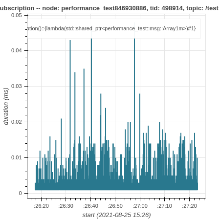

How to use ros2_tracing to trace and analyze an application
===========================================================

This guide shows how to use
`ros2_tracing <https://github.com/ros2/ros2_tracing>`_ to trace and
analyze a ROS 2 application. For this guide, the application will be
`performance_test <https://gitlab.com/ApexAI/performance_test>`_.

Overview
--------

This guide covers:

1. installing tracing-related tools and building ROS 2 with the core
   instrumentation enabled
2. running and tracing a ``performance_test`` run
3. analyzing the trace data using
   `tracetools_analysis <https://gitlab.com/ros-tracing/tracetools_analysis>`_
   to plot the callback durations

Prerequisites
-------------

This guide is aimed at real-time systems. See the `real-time system setup guide 
<Real-Time-Operating-System-Setup/Real-Time-Linux/rt_linux_index.md>`_.
However, the guide will work if you are using a non-real-time system.

.. note::

  This guide was written for ROS 2 Rolling on Ubuntu 20.04. It should work on other ROS 2 distros or Ubuntu versions, but some things might need to be adjusted.

Installing and building
-----------------------

First, make sure you have `installed all dependencies for ROS 2
Rolling <https://docs.ros.org/en/rolling/Installation/Ubuntu-Development-Setup.html>`_.

Install `LTTng <https://lttng.org/docs/>`__ as well as ``babeltrace``.
We will only install the LTTng userspace tracer.

.. code-block:: bash

   $ sudo apt-get update
   $ sudo apt-get install -y lttng-tools liblttng-ust-dev python3-lttng python3-babeltrace babeltrace

Then create a workspace, import the ROS 2 Rolling code-block, and clone
``performance_test`` and ``tracetools_analysis``.

.. code-block:: bash

   $ cd ~/
   $ mkdir -p tracing_ws/src
   $ cd tracing_ws/
   $ vcs import src/ --input https://raw.githubusercontent.com/ros2/ros2/master/ros2.repos
   $ cd src/
   $ git clone https://gitlab.com/ApexAI/performance_test.git
   $ git clone https://gitlab.com/ros-tracing/tracetools_analysis.git
   $ cd ..

Install dependencies with rosdep.

.. code-block:: bash

   $ rosdep update
   $ rosdep install --from-paths src --ignore-src -y --skip-keys "fastcdr rti-connext-dds-6.0.1 urdfdom_headers"

Then build up to ``performance_test`` and configure it for ROS 2. See its
`documentation <https://gitlab.com/ApexAI/performance_test#ros-2-middleware-plugins>`_.
We also need to build ``ros2trace`` to set up tracing using the
``ros2 trace`` command and ``tracetools_analysis`` to analyze the data.

.. code-block:: bash

   $ colcon build --packages-up-to ros2trace tracetools_analysis performance_test --cmake-args -DPERFORMANCE_TEST_RCLCPP_ENABLED=ON

You should see the following message once ``tracetools`` is done
building:

.. code-block:: bash

   LTTng found: tracing enabled

This confirms that LTTng was properly detected and that the
instrumentation built into the ROS 2 core is enabled.

Next, we will run a ``performance_test`` experiment and trace it.

Tracing
-------

-  **(Optional)** Step 0. Start an LTTng session daemon.

   For userspace tracing, the daemon does not need to be started as
   ``root``. Note that a non-root daemon will be spawned automatically
   by ``ros2 trace`` if it is not already running.

   .. code-block:: bash

      $ lttng-sessiond --daemonize

-  Step 1: Start Trace

   In one terminal, source the workspace and setup tracing. We need to
   explicitly use the ``--kernel`` option with no values to disable
   kernel tracing, since we did not install the kernel tracer. When
   running the command, a list of ROS 2 userspace events will be
   printed. It will also print the path to the directory that will
   contain the resulting trace (under ``~/.ros/tracing``). Press enter
   to start tracing.

   .. code-block:: bash

      $ # terminal 1
      $ cd ~/tracing_ws
      $ source install/setup.bash
      $ ros2 trace --session-name perf-test --kernel --list

-  Step 2: Run Application

   In a second terminal, source the workspace.

   .. code-block:: bash

      $ # terminal 2
      $ cd ~/tracing_ws
      $ source install/setup.bash

   Then run the ``performance_test`` experiment (or your own
   application). We simply create an experiment with a node publishing
   ~1 MB messages to another node as fast as possible for 60 seconds
   using the second highest real-time priority so that we don’t
   interfere with critical kernel threads. We need to run
   ``performance_test`` as root to be able to use real-time priorities.

   .. code-block:: bash

      $ # terminal 2
      $ sudo ./install/performance_test/lib/performance_test/perf_test -c rclcpp-single-threaded-executor -p 1 -s 1 -r 0 -m Array1m --reliability RELIABLE --max-runtime 60 --use-rt-prio 98

   If that last command doesn’t work for you (with an error like: “error
   while loading shared libraries”), run the slightly-different command
   below. This is because, for security reasons, we need to manually
   pass ``*PATH`` environment variables for some shared libraries to be
   found (see `this explanation <https://unix.stackexchange.com/a/251374>`_).

   .. code-block:: bash

      $ # terminal 2
      $ sudo env PATH="$PATH" LD_LIBRARY_PATH="$LD_LIBRARY_PATH" ./install/performance_test/lib/performance_test/perf_test -c rclcpp-single-threaded-executor -p 1 -s 1 -r 0 -m Array1m --reliability RELIABLE --max-runtime 60 --use-rt-prio 98

  .. note::
    If you're not using a real-time kernel, simply run:

    .. code-block:: bash

        $ # terminal 2
        $ ./install/performance_test/lib/performance_test/perf_test -c rclcpp-single-threaded-executor -p 1 -s 1 -r 0 -m Array1m --reliability RELIABLE --max-runtime 60

-  Step 3: Confirm Trace

   Once the experiment is done, in the first terminal, press enter again
   to stop tracing. Use ``babeltrace`` to quickly look at the resulting
   trace.

   .. code-block:: bash

      $ babeltrace ~/.ros/tracing/perf-test

   The output of the above command is a human-readable version of the
   raw Common Trace Format (CTF) data, which is a list of trace events.
   Each event has a timestamp, an event type, some information on the
   process that generated the event, and the values of the fields of the
   given event type.

   Next, we will analyze the trace.

Analysis
--------

`tracetools_analysis <https://gitlab.com/ros-tracing/tracetools_analysis>`_
provides a Python API to easily analyze traces. We can use it in a
`Jupyter notebook <https://jupyter.org/>`_ with
`bokeh <https://docs.bokeh.org/en/latest/index.html>`_ to plot the
data. The ``tracetools_analysis`` repository contains a `few sample
notebooks <https://gitlab.com/ros-tracing/tracetools_analysis/-/tree/master/tracetools_analysis/analysis>`__,
including `one notebook to analyze subscription callback
durations <https://gitlab.com/ros-tracing/tracetools_analysis/-/blob/master/tracetools_analysis/analysis/callback_duration.ipynb>`__.

For this guide, we will plot the durations of the subscription callback
in the subscriber node.

Install Jupyter notebook and bokeh, and then open the sample notebook.

.. code-block:: bash

   $ sudo apt-get install -y jupyter-notebook
   $ pip3 install bokeh
   $ jupyter notebook ~/tracing_ws/src/tracetools_analysis/tracetools_analysis/analysis/callback_duration.ipynb

This will open the notebook in the browser.

Replace the value for the ``path`` variable in the second cell to the
path to the trace directory:

.. code-block:: python

   path = '~/.ros/tracing/perf-test'

Run the notebook by clicking the *Run* button for each cell. Running the
cell that does the trace processing might take a few minutes on the
first run, but subsequent runs will be much quicker.

You should get a plot that looks like this:

We can see that most of the callbacks take less than 0.01 ms, but there
are some outliers taking over 0.02 or 0.03 ms.

Conclusion
----------

This guide showed how to install tracing-related tools and build ROS 2
with tracing instrumentation. Then it showed how to trace a
`performance_test <https://gitlab.com/ApexAI/performance_test>`_
experiment using
`ros2_tracing <https://github.com/ros2/ros2_tracing>`_ and plot the
callback durations using
`tracetools_analysis <https://gitlab.com/ros-tracing/tracetools_analysis>`_.

For more trace analyses, take a look at the `other sample notebooks
<https://gitlab.com/ros-tracing/tracetools_analysis/-/tree/master/tracetools_analysis/analysis>`_
and the `tracetools_analysis API documentation
<https://ros-tracing.gitlab.io/tracetools_analysis-api/master/tracetools_analysis/>`_.
The `ros2_tracing design document
<https://github.com/ros2/ros2_tracing/blob/master/doc/design_ros_2.md>`_
also contains a lot of information.
