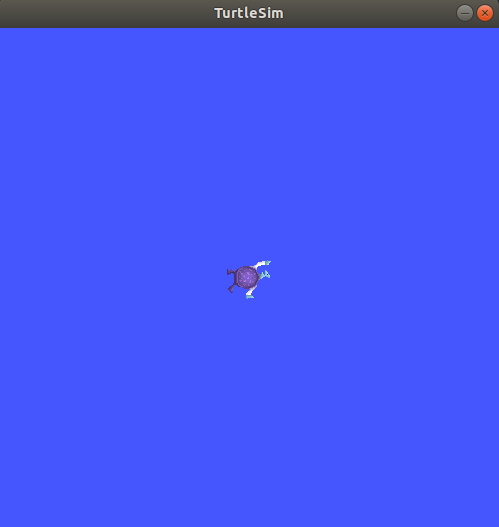
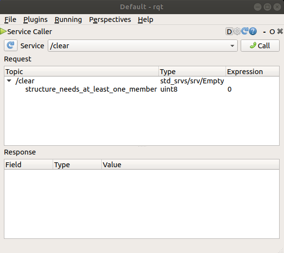
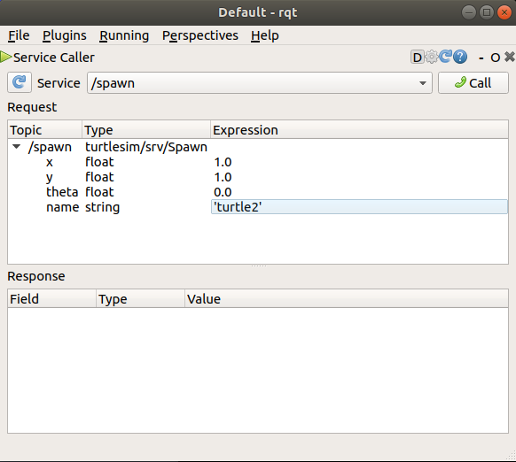
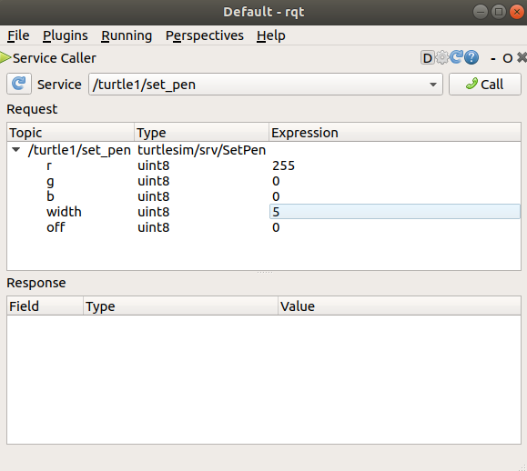
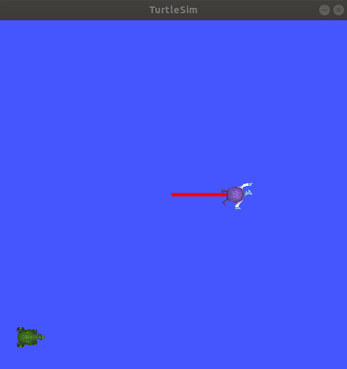

.. redirect-from::

    Tutorials/Turtlesim/Introducing-Turtlesim

.. _Turtlesim:

Using ``turtlesim`` and ``rqt``
===============================

**Objetivo:** Instalar y utilizar el paquete turtlesim y la herramienta rqt, para prepararse para los próximos tutoriales.

**Nivel del Tutorial:** Principiante

**Tiempo:** 15 minutos

.. contents:: Contents
   :depth: 2
   :local:

Historial
---------

turtlesim es un simulador ligero para aprender ROS 2.
Permite ilustrar lo que ROS 2 hace en el nivel más básico, para darle una idea de lo que hará con un robot real o una simulación de robots más adelante.

rqt es una herramienta Interfaz Gráfica de Usuario (GUI) para ROS 2.
Todo lo hecho en rqt se puede hacer mediante la línea de comandos, pero proporciona una forma más fácil de manipular los elementos ROS 2.

Este tutorial involucra conceptos de fundamentales de ROS 2, como la separación de nodos, tópicos y servicios.
Todos estos conceptos se elaborarán en tutoriales posteriores; Por ahora, simplemente configurará las herramientas y tendrá una idea de ellas.

Requisitos previos
------------------

El tutorial anterior, :doc:`../Configuring-ROS2-Environment`, lo guiará en como configurar su entorno de desarrollo.

Tareas
------

1 Instalar turtlesim
^^^^^^^^^^^^^^^^^^^^

Como siempre, comience por hacer un source del archivos de configuración en un nuevo terminal, como se describe en el :doc:` tutorial previo <../Configuring-ROS2-Environment>`.

Instale el paquete turtlesim para su distribución ROS 2:

.. tabs::

   .. group-tab:: Linux

      .. code-block:: console

        sudo apt update

        sudo apt install ros-{DISTRO}-turtlesim

   .. group-tab:: macOS

      Siempre que el archivo desde el que instaló ROS 2 contenga el repositorio ``ros_tutorials``, ya debería tener turtlesim instalado.

   .. group-tab:: Windows

      Siempre que el archivo desde el que instaló ROS 2 contenga el repositorio ``ros_tutorials``, ya debería tener turtlesim instalado.

Compruebe que el paquete esté instalado:

.. code-block:: console

  ros2 pkg executables turtlesim

El comando anterior debería devolver una lista de los ejecutables de turtlesim:

.. code-block:: console

  turtlesim draw_square
  turtlesim mimic
  turtlesim turtle_teleop_key
  turtlesim turtlesim_node

2 Iniciar turtlesim
^^^^^^^^^^^^^^^^^^^

Para iniciar turtlesim, ingrese el siguiente comando en su terminal:

.. code-block:: console

  ros2 run turtlesim turtlesim_node

Debería aparecer la ventana del simulador, con un diseño de tortuga aleatorio en el centro.

En la terminal debajo el comando, verá los mensajes generados por el nodo:

.. code-block:: console

  [INFO] [turtlesim]: Starting turtlesim with node name /turtlesim

  [INFO] [turtlesim]: Spawning turtle [turtle1] at x=[5.544445], y=[5.544445], theta=[0.000000]

Aquí puede ver que el nombre de la tortuga es ``turtle1``, y las coordenadas predeterminadas donde se generó.

3 Utilizar turtlesim
^^^^^^^^^^^^^^^^^^^^

Abra una nueva terminal y realice un source de ROS 2 nuevamente.

Ahora ejecutará un nuevo nodo para controlar la tortuga del primer nodo:

.. code-block:: console

  ros2 run turtlesim turtle_teleop_key

En este punto, debería tener tres ventanas abiertas: una terminal que ejecuta ``turtlesim_node``, la ventana de turtlesim, y una terminal que ejecuta ``turtle_teleop_key``.
Organice estas ventanas para que pueda ver la ventana de turtlesim, y tenga seleccionado el terminal que ejecuta ``turtle_teleop_key`` para que pueda controlar la tortuga de turtlesim.

Utilice las flechas de su teclado para controlar la tortuga.
Se moverá por la pantalla, usando su "bolígrafo" adjunto para dibujar el camino que ha seguido hasta el momento.

.. note::

  Presionar las flechas del teclado solo hará que la tortuga se mueva una distancia corta y luego se detenga.
  Esto se debe a que, de manera realista, no le gustaría que un robot continuara con una instrucción si, por ejemplo, el operador perdiera la conexión con el robot.

Puede ver los nodos, tópicos, servicios y acciones asociadas mediante el comando ``list``:

.. code-block:: console

  ros2 node list
  ros2 topic list
  ros2 service list
  ros2 action list

Aprenderá más sobre estos conceptos en los próximos tutoriales.
Dado que el objetivo de este tutorial es solo obtener una descripción general de turtlesim, utilizaremos rqt (una interfaz gráfica de usuario para ROS 2) la cual nos permite ver los servicios más de cerca.

4 Instalar rqt
^^^^^^^^^^^^^

Abra una nueva terminal para instalar ``rqt`` y sus complementos:

.. tabs::

  .. group-tab:: Linux (apt 2.0/Ubuntu 20.04 and newer)

    .. code-block:: console

      sudo apt update

      sudo apt install ~nros-{DISTRO}-rqt*

  .. group-tab:: Linux (apt 1.x/Ubuntu 18.04 and older)

    .. code-block:: console

      sudo apt update

      sudo apt install ros-{DISTRO}-rqt*

  .. group-tab:: macOS

    El archivo estándar para instalar ROS 2 en macOS contiene ``rqt`` y sus complementos, por lo que ya debería tener ``rqt`` instalado.

  .. group-tab:: Windows

    El archivo estándar para instalar ROS 2 en Windows contiene ``rqt`` y sus complementos, por lo que ya debería tener ``rqt`` instalado.

Para ejecutar rqt:

.. code-block:: console

  rqt

5 Utilizar rqt
^^^^^^^^^

Después de ejecutar rqt por primera vez, la ventana estará en blanco.
No se precoupe; simplemente seleccione **Plugins** > **Services** > **Service Caller** en la barra de menú de la parte superior.

.. note::

  Es posible que rqt tarde un tiempo en localizar todos los complementos.
  Si hace clic en **Plugins**, pero no ve **Services** ni ninguna otra opción, debe cerrar rqt e ingresar el comando ``rqt --force-discover`` en su terminal.

Utilice el botón Actualizar a la izquierda de la lista desplegable **Service** para asegurarse de que todos los servicios de su nodo turtlesim estén disponibles.

Haga clic en la lista desplegable **Service** para ver los servicios de turtlesim y seleccione el servicio ``/spawn``.

5.1 Pruebe el servicio de spawn
~~~~~~~~~~~~~~~~~~~~~~~~~~~~~~~

Utilizaremos rqt para llamar al servicio ``/spawn``.
Como puedes deducir por su nombre, ``/spawn`` creará otra tortuga en la ventana del simulador.

Asigne a la nueva tortuga un nombre único, como ``turtle2``, haciendo doble clic entre las comillas simples vacías en la columna **Expression**.
Puede ver que esta expresión corresponde al valor de **name** y es de tipo **string**.

Ingrese nuevas coordenadas para la nueva tortuga, como ``x = 1.0`` e ``y = 1.0``.

.. note::

  Si intenta generar una nueva tortuga con el mismo nombre que una tortuga existente, como su tortuga predeterminada ``turtle1``, obtendrá un mensaje de error en la terminal que ejecuta ``turtlesim_node``:

  .. code-block:: console

    [ERROR] [turtlesim]: A turtle named [turtle1] already exists

Para generar turtle2, debe llamar al servicio haciendo clic en el botón **Call** en la parte superior derecha de la ventana rqt.

Verá aparecer una nueva tortuga (nuevamente con un diseño aleatorio) en las coordenadas que ingresó para **x** e **y**.

Si actualiza la lista de servicios en rqt, también verá que ahora hay servicios relacionados con la nueva tortuga, ``/turtle2/…``, además de ``/turtle1/…``.

5.2 Pruebe el servicio set_pen
~~~~~~~~~~~~~~~~~~~~~~~~~~~~~~

Ahora vamos a darle a turtle1 un bolígrafo único mediante el servicio ``/set_pen``:

Los valores para **r**, **g** y **b** deben estar entre 0 y 255, y establecerán el color del bolígrafo con el que dibuja turtle1. Con **width** se establece el grosor de la línea.

Para que turtle1 dibuje con una línea roja, cambie el valor de **r** a 255 y el valor de **width** a 5.
No olvide llamar al servicio después de actualizar los valores.

Si regresa a la terminal donde se está ejecutando ``turtle_teleop_key`` y presiona las flechas del teclado, verá que el bolígrafo de turtle1 ha cambiado.

Probablemente hayas notado que no hay forma de mover la segunda tortuga.
Esto se puede lograr reasignando el tópico ``cmd_vel`` de turtle1 a turtle2.

6 Reasignación
^^^^^^^^^^^^^^

Abra una nueva terminal, realice un source de ROS 2 y ejecute:

.. code-block:: console

  ros2 run turtlesim turtle_teleop_key --ros-args --remap turtle1/cmd_vel:=turtle2/cmd_vel

Now you can move turtle2 when this terminal is active, and turtle1 when the other terminal running the ``turtle_teleop_key`` is active.
Ahora puede mover la segunda tortuga mientras esta terminal está activa, y la primer tortuga cuando la otra terminal que ejecuta ``turtle_teleop_key`` está activa.

.. image:: images/remap.png

7 Cerrar turtlesim
^^^^^^^^^^^^^^^^^

Para detener la simulación puede ingresar ``Ctrl + C`` en la terminal ``turtlesim_node``, y ``q`` en la terminal que ejecuta ``turtle_teleop_key``.

Resumen
-------

Utilizar turtlesim y rqt es una excelente manera de aprender los conceptos básicos de ROS 2.

Next steps
----------

Now that you have turtlesim and rqt up and running, and an idea of how they work, let's dive in to the first core ROS 2 concept with the next tutorial, 
Ahora que tiene turtlesim y rqt en funcionamiento, y una idea de cómo funcionan, profundicemos en el primer concepto básico de ROS 2 con el siguiente tutorial, :doc:`../Understanding-ROS2-Nodes/Understanding-ROS2-Nodes`.

Contenido Relacionado
---------------

El paquete turtlesim se puede encontrar en el `repositorio ros_tutorials <https://github.com/ros/ros_tutorials/tree/humble/turtlesim>`_.
Asegúrese de seleccionar la rama correspondiente a su distribución ROS 2 instalada.

`Este video aportado por la comunidad <https://youtu.be/xwT7XWflMdc>`_ demuestra muchos de los elementos cubiertos en este tutorial.
