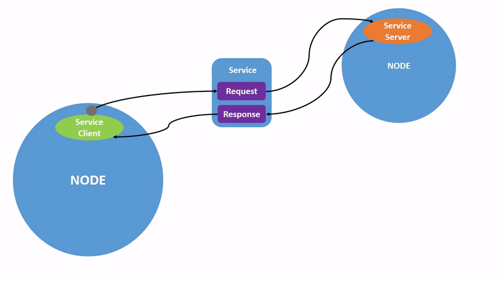
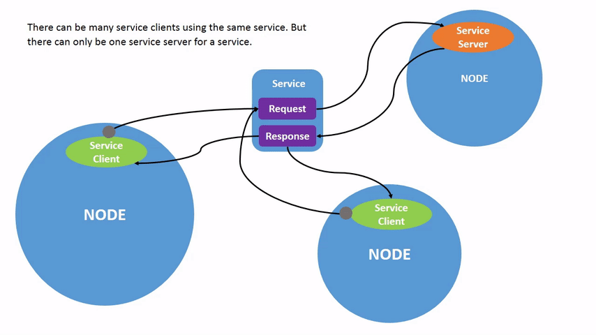

.. redirect-from::

    Tutorials/Services/Understanding-ROS2-Services

.. _ROS2Services:

Understanding services
======================

**Goal:** Learn about services in ROS 2 using command line tools.

**Tutorial level:** Beginner

**Time:** 10 minutes

.. contents:: Contents
   :depth: 2
   :local:

Background
----------

Services are another method of communication for nodes in the ROS graph.
Services are based on a call-and-response model, versus topics’ publisher-subscriber model.
While topics allow nodes to subscribe to data streams and get continual updates, services only provide data when they are specifically called by a client.

Prerequisites
-------------

Some concepts mentioned in this tutorial, like :doc:`Nodes <../Understanding-ROS2-Nodes/Understanding-ROS2-Nodes>` and :doc:`Topics <../Understanding-ROS2-Topics/Understanding-ROS2-Topics>`, were covered in previous tutorials in the series.

You will need the :doc:`turtlesim package <../Introducing-Turtlesim/Introducing-Turtlesim>`.

As always, don’t forget to source ROS 2 in :doc:`every new terminal you open <../Configuring-ROS2-Environment>`.

Tasks
-----

1 Setup
^^^^^^^
Start up the two turtlesim nodes, ``/turtlesim`` and ``/teleop_turtle``.

Open a new terminal and run:

.. code-block:: console

    ros2 run turtlesim turtlesim_node

Open another terminal and run:

.. code-block:: console

    ros2 run turtlesim turtle_teleop_key

2 ros2 service list
^^^^^^^^^^^^^^^^^^^

Running the ``ros2 service list`` command in a new terminal will return a list of all the services currently active in the system:

.. code-block:: console

  /clear
  /kill
  /reset
  /spawn
  /teleop_turtle/describe_parameters
  /teleop_turtle/get_parameter_types
  /teleop_turtle/get_parameters
  /teleop_turtle/list_parameters
  /teleop_turtle/set_parameters
  /teleop_turtle/set_parameters_atomically
  /turtle1/set_pen
  /turtle1/teleport_absolute
  /turtle1/teleport_relative
  /turtlesim/describe_parameters
  /turtlesim/get_parameter_types
  /turtlesim/get_parameters
  /turtlesim/list_parameters
  /turtlesim/set_parameters
  /turtlesim/set_parameters_atomically

You will see that both nodes have the same six services with ``parameters`` in their names.
Nearly every node in ROS 2 has these infrastructure services that parameters are built off of.
There will be more about parameters in the next tutorial.
In this tutorial, the parameter services will be omitted from discussion.

For now, let’s focus on the turtlesim-specific services, ``/clear``, ``/kill``, ``/reset``, ``/spawn``, ``/turtle1/set_pen``, ``/turtle1/teleport_absolute``, and ``/turtle1/teleport_relative``.
You may recall interacting with some of these services using rqt in the :doc:`Use turtlesim and rqt <../Introducing-Turtlesim/Introducing-Turtlesim>` tutorial.

3 ros2 service type
^^^^^^^^^^^^^^^^^^^

Services have types that describe how the request and response data of a service is structured.
Service types are defined similarly to topic types, except service types have two parts: one message for the request and another for the response.

To find out the type of a service, use the command:

.. code-block:: console

  ros2 service type <service_name>

Let’s take a look at turtlesim’s ``/clear`` service.
In a new terminal, enter the command:

.. code-block:: console

  ros2 service type /clear

Which should return:

.. code-block:: console

  std_srvs/srv/Empty

The ``Empty`` type means the service call sends no data when making a request and receives no data when receiving a response.

3.1 ros2 service list -t
~~~~~~~~~~~~~~~~~~~~~~~~

To see the types of all the active services at the same time, you can append the ``--show-types`` option, abbreviated as ``-t``, to the ``list`` command:

.. code-block:: console

  ros2 service list -t

Which will return:

.. code-block:: console

  /clear [std_srvs/srv/Empty]
  /kill [turtlesim/srv/Kill]
  /reset [std_srvs/srv/Empty]
  /spawn [turtlesim/srv/Spawn]
  ...
  /turtle1/set_pen [turtlesim/srv/SetPen]
  /turtle1/teleport_absolute [turtlesim/srv/TeleportAbsolute]
  /turtle1/teleport_relative [turtlesim/srv/TeleportRelative]
  ...

4 ros2 service find
^^^^^^^^^^^^^^^^^^^

If you want to find all the services of a specific type, you can use the command:

.. code-block:: console

  ros2 service find <type_name>

For example, you can find all the ``Empty`` typed services like this:

.. code-block:: console

  ros2 service find std_srvs/srv/Empty

Which will return:

.. code-block:: console

  /clear
  /reset

5 ros2 interface show
^^^^^^^^^^^^^^^^^^^^^

You can call services from the command line, but first you need to know the structure of the input arguments.

.. code-block:: console

  ros2 interface show <type_name>

To run this command on the ``/clear`` service’s type, ``Empty``:

.. code-block:: console

  ros2 interface show std_srvs/srv/Empty

Which will return:

.. code-block:: console

  ---

The ``---`` separates the request structure (above) from the response structure (below).
But, as you learned earlier, the ``Empty`` type doesn’t send or receive any data.
So, naturally, its structure is blank.

Let’s introspect a service with a type that sends and receives data, like ``/spawn``.
From the results of ``ros2 service list -t``, we know ``/spawn``’s type is ``turtlesim/srv/Spawn``.

To see the arguments in a ``/spawn`` call-and-request, run the command:

.. code-block:: console

  ros2 interface show turtlesim/srv/Spawn

Which will return:

.. code-block:: console

  float32 x
  float32 y
  float32 theta
  string name # Optional.  A unique name will be created and returned if this is empty
  ---
  string name

The information above the ``---`` line tells us the arguments needed to call ``/spawn``.
``x``, ``y`` and ``theta`` determine the location of the spawned turtle, and ``name`` is clearly optional.

The information below the line isn’t something you need to know in this case, but it can help you understand the data type of the response you get from the call.

6 ros2 service call
^^^^^^^^^^^^^^^^^^^

Now that you know what a service type is, how to find a service’s type, and how to find the structure of that type’s arguments, you can call a service using:

.. code-block:: console

  ros2 service call <service_name> <service_type> <arguments>

The ``<arguments>`` part is optional.
For example, you know that ``Empty`` typed services don’t have any arguments:

.. code-block:: console

  ros2 service call /clear std_srvs/srv/Empty

This command will clear the turtlesim window of any lines your turtle has drawn.

.. image:: images/clear.png

Now let’s spawn a new turtle by calling ``/spawn`` and inputting arguments.
Input ``<arguments>`` in a service call from the command-line need to be in YAML syntax.

Enter the command:

.. code-block:: console

  ros2 service call /spawn turtlesim/srv/Spawn "{x: 2, y: 2, theta: 0.2, name: ''}"

You will get this method-style view of what’s happening, and then the service response:

.. code-block:: console

  requester: making request: turtlesim.srv.Spawn_Request(x=2.0, y=2.0, theta=0.2, name='')

  response:
  turtlesim.srv.Spawn_Response(name='turtle2')

Your turtlesim window will update with the newly spawned turtle right away:

.. image:: images/spawn.png

7 ros2 service echo
^^^^^^^^^^^^^^^^^^^

    Note: this feature is avaliable only from in ``rolling ridley`` and ``iron irwini`` onwards.

To see the data communicated between a service client and a service server you can ``echo`` the service using

.. code-block:: console

  ros2 service echo <service_name | service_type> <arguments>

Since we know from the previous tutorials that turtlesim offers a ``/teleport_relative`` service for teleporting the turtle, let's use it to test out ``echo`` to introspect that service.

With ``turtlesim`` running, run

.. code-block:: console

  ros2 service echo /turtle1/teleport_relative

Nothing will print at first, but that's just because the service hasn't been called yet.
Next, in another terminal, make a service call with:

.. code-block:: console

   ros2 service call /turtle1/teleport_relative turtlesim/srv/TeleportRelative "{linear: 10.0, angular: 20.0}"

You should now see the service events being printed to the console in the terminal where you ran ``ros2 service echo``.

.. code-block:: console

  info:
    event_type: REQUEST_RECEIVED
    stamp:
      sec: 1661567531
      nanosec: 182051385
    client_id:
      uuid: 6ad14b1e-a8b3-e7a4-a516-502f2f1c5de3
    sequence_number: 1
  request:
    linear: 10.0
    angular: 20.0

  ---------------------------
  info:
    event_type: RESPONSE_SENT
    stamp:
      sec: 1661567531
      nanosec: 182179116
    client_id:
      uuid: 6ad14b1e-a8b3-e7a4-a516-502f2f1c5de3
    sequence_number: 1
  response: {}

  ---------------------------

Breaking it down, ``ros2 service echo`` echoes information about the service call and response logged to a hidden ``<service_name>/_service_event`` topic.
These service event messages contain a ``service_msgs/ServiceEventInfo`` message containing information about the event as well as the ``request`` and ``response``.
Though there are a total of four different service event types; ``REQUEST_SENT``, ``REQUEST_RECEIVED``, ``RESPONSE_SENT``, and ``RESPONSE_RECEIVED``, we only see the ``REQUEST_RECEIVED`` and ``RESPONSE_SENT`` events being echoed here because only the turtlesim node had service introspection enabled.

Since echoing service event messages to a hidden topic can incur a performance penalty, you can disable service introspection features during runtime by setting the following boolean parameters

.. code-block:: yaml

   /<node_name>:
    publish_client_content
    publish_client_events
    publish_service_content
    publish_service_events

For more information see REP2012_.

   .. _REP2012: https://github.com/ros-infrastructure/rep/pull/360

Summary
-------

Nodes can communicate using services in ROS 2.
Unlike a topic - a one way communication pattern where a node publishes information that can be consumed by one or more subscribers - a service is a request/response pattern where a client makes a request to a node providing the service and the service processes the request and generates a response.

You generally don’t want to use a service for continuous calls; topics or even actions would be better suited.

In this tutorial you used command line tools to identify, elaborate on, and call services.

Next steps
----------

In the next tutorial, :doc:`../Understanding-ROS2-Parameters/Understanding-ROS2-Parameters`, you will learn about configuring node settings.

Related content
---------------

Check out `this tutorial <https://discourse.ubuntu.com/t/call-services-in-ros-2/15261>`_; it's an excellent realistic application of ROS services using a Robotis robot arm.
