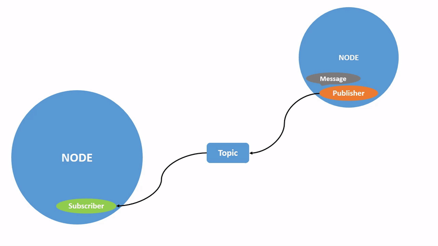
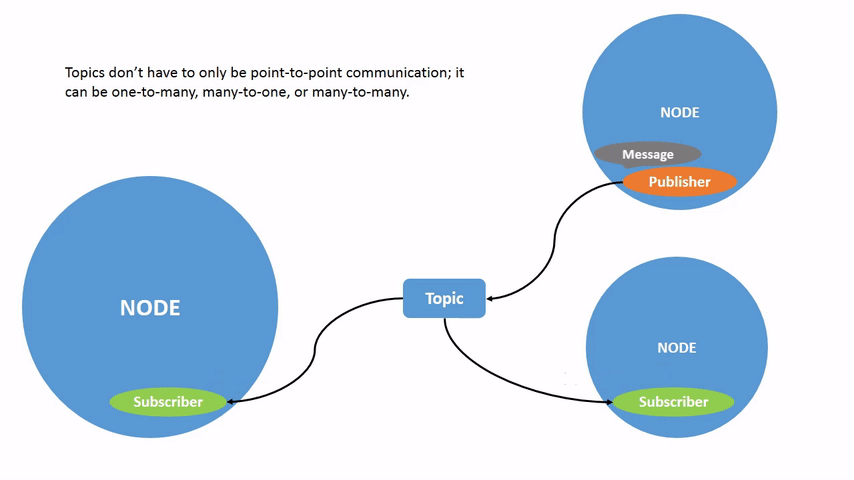
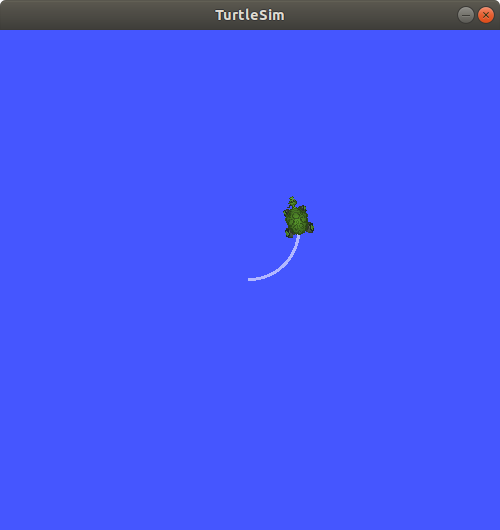
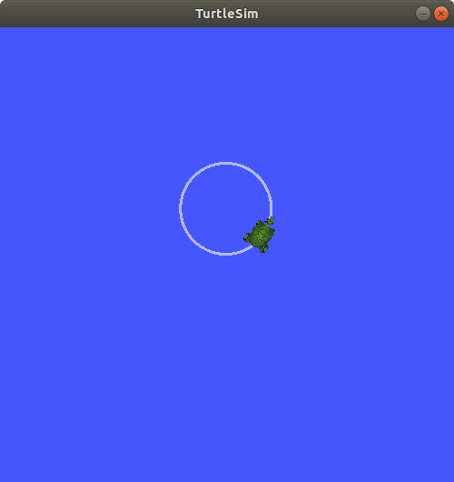
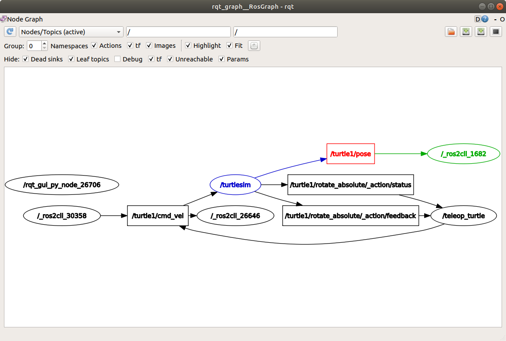

.. redirect-from::

    Tutorials/Topics/Understanding-ROS2-Topics

.. _ROS2Topics:

Comprender los Topics
=====================

**Objetivo:** Utilizar rqt_graph y las herramientas de línea de comandos para inspeccionar los topics de ROS 2.

**Nivel del Tutorial:** Principiante

**Tiempo:** 20 minutos

.. contents:: Contenido
   :depth: 2
   :local:

Historial
---------

ROS 2 divide los sistemas complejos en muchos nodos modulares.
Los topic son un elemento vital del grafo de ROS, que actúa como un bus para que los nodos intercambien mensajes.

Un nodo puede publicar datos en cualquier número de topics y simultáneamente tener suscripciones a cualquier número de topics.

Los topics son una de las principales formas en que los datos se mueven entre nodos y, por lo tanto, entre diferentes partes del sistema.

Requisitos previos
------------------

El :doc:`tutorial previo <../Understanding-ROS2-Nodes/Understanding-ROS2-Nodes>` proporciona información básica sobre los nodos que se construyen aquí.

Como siempre, no olvides ejecutar `source` con el archivo de setup :doc:`en cada nueva terminal<../Configuring-ROS2-Environment>`.

Tareas
------

1 Configuración
^^^^^^^^^^^^^^^

A estas alturas ya deberías estar cómodo iniciando Turtlesim.

Abre una nueva terminal y ejecuta:

.. code-block:: console

    ros2 run turtlesim turtlesim_node

Abre otra terminal y ejecuta:

.. code-block:: console

    ros2 run turtlesim turtle_teleop_key

Recuerde del :doc:`tutorial previo <../Understanding-ROS2-Nodes/Understanding-ROS2-Nodes>` que los nombres de estos nodos son ``/turtlesim`` y ``/teleop_turtle`` por defecto.

2 rqt_graph
^^^^^^^^^^^

A lo largo de este tutorial, utilizaremos ``rqt_graph`` para visualizar los nodos y topics cambiantes, así como las conexiones entre ellos.

El tutorial :doc:`turtlesim <../Introducing-Turtlesim/Introducing-Turtlesim>` indica cómo instalar rqt y todos sus complementos, incluido ``rqt_graph``.

Para ejecutar rqt_graph, abre una nueva terminal e ingrese el comando:

.. code-block:: console

    rqt_graph

También puedes abrir rqt_graph abriendo ``rqt`` y seleccionando **Plugins** > **Introspection** > **Node Graph**.

.. image:: images/rqt_graph.png

Deberías ver los nodos (elipses) y los topic (rectángulo) como en la imágen anterior.
También se pueden observar dos acciones alrededor de la periferia del gráfico (ignorémoslas por ahora).
Si pasas el mouse sobre el topic en el centro, verá el color resaltado como en la imagen de arriba.

El gráfico muestra cómo el nodo ``/turtlesim`` y el nodo ``/teleop_turtle`` se comunican entre sí mediante un topic.
El nodo ``/teleop_turtle`` está publicando datos (las pulsaciones de teclas que ingresa para mover la tortuga) en el topic ``/turtle1/cmd_vel``, y el nodo ``/turtlesim`` está suscrito a ese topic para recibir los datos.

La característica de resaltado de rqt_graph es muy útil cuando se examinan sistemas más complejos con muchos nodos y topics conectados de muchas maneras diferentes.

Como vimos recién, rqt_graph es una herramienta gráfica de inspección.
Ahora veremos algunas herramientas de línea de comandos para la inspección de topics.

3 ros2 topic list
^^^^^^^^^^^^^^^^^

Ejecuta el comando ``ros2 topic list`` en una nueva terminal para obtener una lista de todos los topics actualmente activos en el sistema:

.. code-block:: console

  /parameter_events
  /rosout
  /turtle1/cmd_vel
  /turtle1/color_sensor
  /turtle1/pose

``ros2 topic list -t`` devolverá la misma lista de topics, esta vez con el tipo entre corchetes:

.. code-block:: console

  /parameter_events [rcl_interfaces/msg/ParameterEvent]
  /rosout [rcl_interfaces/msg/Log]
  /turtle1/cmd_vel [geometry_msgs/msg/Twist]
  /turtle1/color_sensor [turtlesim/msg/Color]
  /turtle1/pose [turtlesim/msg/Pose]

Estos atributos, particularmente el tipo, son la forma en que los nodos saben que están hablando de la misma información a medida que se mueve sobre los topics.

Si te preguntas dónde están todos estos topics en rqt_graph, puedes desmarcar todas las casillas debajo de **Hide**:

.. image:: images/unhide.png

Por ahora, deja esas opciones marcadas para evitar confusiones.

4 ros2 topic echo
^^^^^^^^^^^^^^^^^

Para ver los datos que se publican sobre un topic, utiliza:

.. code-block:: console

    ros2 topic echo <topic_name>

Como sabemos que ``/teleop_turtle`` publica datos en ``/turtlesim`` sobre el topic ``/turtle1/cmd_vel``, utilizaremos ``echo`` para hacer una inspección sobre ese topic:

.. code-block:: console

    ros2 topic echo /turtle1/cmd_vel

Al principio, este comando no devolverá ningún dato.
Eso es porque está esperando que ``/teleop_turtle`` publique algo.

Regresa a la terminal donde se está ejecutando ``turtle_teleop_key`` y usa las flechas para mover la tortuga.
Si observas la terminal donde se ejecuta el comando ``echo``, verás que se publican los datos de posición para cada movimiento que realice:

.. code-block:: console

  linear:
    x: 2.0
    y: 0.0
    z: 0.0
  angular:
    x: 0.0
    y: 0.0
    z: 0.0
    ---

Ahora regresa a rqt_graph y desmarque la casilla **Debug**.

.. image:: images/debug.png

``/_ros2cli_26646`` es el nodo creado por el ``echo`` que acabamos de ejecutar (el número puede ser diferente).
Ahora puedes ver que el editor está publicando datos sobre el topic ``cmd_vel`` y que hay dos suscriptores suscritos.

5 ros2 topic info
^^^^^^^^^^^^^^^^^

Los topics no tienen que ser solo comunicación punto a punto; puede ser de uno a muchos, de muchos a uno o de muchos a muchos.

Otra forma de ver esto es ejecutando:

.. code-block:: console

    ros2 topic info /turtle1/cmd_vel

Que regresará:

.. code-block:: console

  Type: geometry_msgs/msg/Twist
  Publisher count: 1
  Subscription count: 2

6 ros2 interface show
^^^^^^^^^^^^^^^^^^^^^

Los nodos envían datos sobre topics mediante mensajes.
Los Publicadores y Suscriptores deben enviar y recibir el mismo tipo de mensaje para comunicarse.

Los tipos de topics que vimos antes, después de ejecutar ``ros2 topic list -t`` nos permiten saber qué tipo de mensaje se usa en cada topic.
Recuerda que el topic ``cmd_vel`` tiene el tipo:

.. code-block:: console

    geometry_msgs/msg/Twist

Esto significa que en el paquete ``geometric_msgs`` hay un ``mensaje`` llamado ``Twist``.

Ahora podemos ejecutar ``ros2 interface show <msg type>`` con el tipo de mensaje anterio para conocer sus detalles, específicamente, qué estructura de datos espera el mensaje.

.. code-block:: console

    ros2 interface show geometry_msgs/msg/Twist

Para el tipo de mensaje de arriba, produce:

.. code-block:: console

  # This expresses velocity in free space broken into its linear and angular parts.

      Vector3  linear
              float64 x
              float64 y
              float64 z
      Vector3  angular
              float64 x
              float64 y
              float64 z

Esto indica que el nodo ``/turtlesim`` está esperando un mensaje con dos vectores, ``linear`` y ``angular``, de tres elementos cada uno.
Si recuerdas los datos que vimos pasar de ``/teleop_turtle`` a ``/turtlesim`` con el comando ``echo``, utilizan la misma estructura:

.. code-block:: console

  linear:
    x: 2.0
    y: 0.0
    z: 0.0
  angular:
    x: 0.0
    y: 0.0
    z: 0.0
    ---

7 ros2 topic pub
^^^^^^^^^^^^^^^^

Ahora que tienes la estructura del mensaje, puedes publicar datos en un topic directamente desde la línea de comando usando:

.. code-block:: console

    ros2 topic pub <topic_name> <msg_type> '<args>'

El argumento ``'<args>'`` son los datos que pasarán al topic, en la estructura que acabas de utilizar en la sección anterior.

Es importante tener en cuenta que este argumento debe ingresarse utilizando la sintaxis YAML.
Ingrese el comando completo así:

.. code-block:: console

  ros2 topic pub --once /turtle1/cmd_vel geometry_msgs/msg/Twist "{linear: {x: 2.0, y: 0.0, z: 0.0}, angular: {x: 0.0, y: 0.0, z: 1.8}}"

``--once`` es un argumento opcional que significa "publicar un mensaje y luego salir".

Recibirás el siguiente mensaje en la terminal:

.. code-block:: console

  publisher: beginning loop
  publishing #1: geometry_msgs.msg.Twist(linear=geometry_msgs.msg.Vector3(x=2.0, y=0.0, z=0.0), angular=geometry_msgs.msg.Vector3(x=0.0, y=0.0, z=1.8))

Y verás a tu tortuga moverse así:

La tortuga (y comúnmente los robots reales que pretende emular) requieren un flujo constante de comandos para operar continuamente.
Entonces, para que la tortuga siga moviéndose, puedes ejecutar:

.. code-block:: console

  ros2 topic pub --rate 1 /turtle1/cmd_vel geometry_msgs/msg/Twist "{linear: {x: 2.0, y: 0.0, z: 0.0}, angular: {x: 0.0, y: 0.0, z: 1.8}}"

La diferencia aquí es la eliminación de la opción ``--once`` y la adición de la opción ``--rate 1``, que le dice a ``ros2 topic pub`` que publique el comando en un flujo constante a 1 Hz.

Puedes actualizar rqt_graph para ver lo que sucede gráficamente.
Verás que el nodo ``ros 2 topic pub ...`` (``/_ros2cli_30358``) se está publicando sobre el topic ``/turtle1/cmd_vel``, y lo está recibiendo tanto el nodo ``ros2 topic echo ...`` (``/_ros2cli_26646``) como el nodo ``/turtlesim``.

.. image:: images/rqt_graph2.png

Finalmente, puedes ejecutar ``echo`` en el topic de ``pose`` y volver a verificar rqt_graph:

.. code-block:: console

  ros2 topic echo /turtle1/pose

Puedes ver que el nodo ``/turtlesim`` también está publicando en el topic de ``pose``, al que está suscrito el nuevo nodo de ``echo``.

8 ros2 topic hz
^^^^^^^^^^^^^^^

Para una última inspección sobre este proceso, puedes ver la velocidad a la que se publican los datos usando:

.. code-block:: console

    ros2 topic hz /turtle1/pose

Devolverá datos sobre la velocidad a la que el nodo ``/turtlesim`` está publicando datos en el topic de ``pose``.

.. code-block:: console

  average rate: 59.354
    min: 0.005s max: 0.027s std dev: 0.00284s window: 58

Recuerda que configuraste la tasa de ``turtle1/cmd_vel`` para publicar a 1 Hz constante usando ``ros2 topic pub --rate 1``.
Si ejecutas el comando anterior con ``turtle1/cmd_vel`` en lugar de ``turtle1/pose``, verás un promedio que refleja esa tasa.

.. 9 rqt_plot
   ^^^^^^^^^^
   Can't do this section now because there's some significant UI issues with rqt_plot for ROS 2

9 Limpieza
^^^^^^^^^^

En este punto, tendrás muchos nodos en ejecución.
No olvides detenerlos ingresando ``Ctrl+C`` en cada terminal.

Resumen
-------

Los nodos publican información sobre topics, lo que permite que cualquier número de otros nodos se suscriban y accedan a esa información.
En este tutorial, examinaste las conexiones entre varios nodos sobre topics utilizando rqt_graph y herramientas de línea de comandos.
Ahora deberías tener una buena idea de cómo se mueven los datos en un sistema ROS 2.

Pasos siguientes
----------------

A continuación, aprenderás sobre otro tipo de comunicación en el grafo ROS con el tutorial :doc:`../Understanding-ROS2-Services/Understanding-ROS2-Services`
