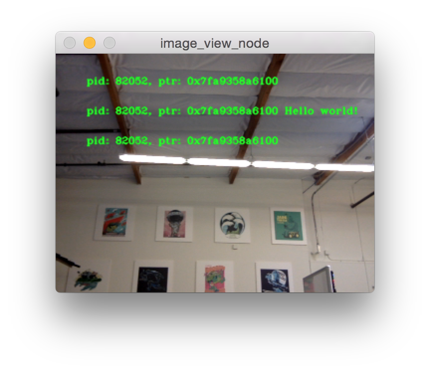
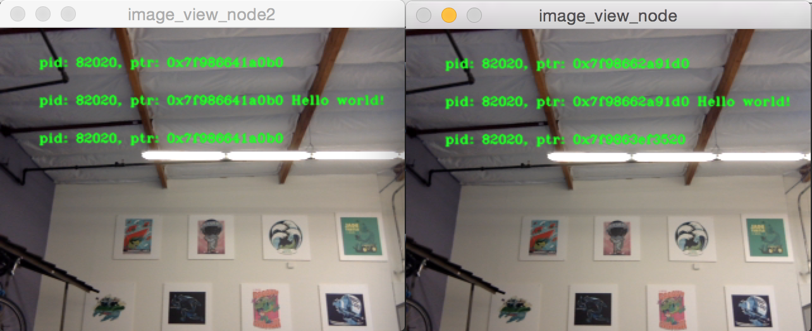
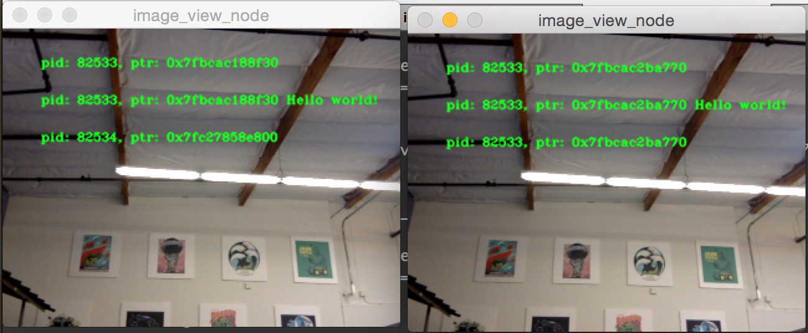

.. redirect-from::

    Intra-Process-Communication
    Tutorials/Intra-Process-Communication

Establecer una comunicación intraproceso eficiente
==================================================

.. contents:: Table of Contents
   :depth: 1
   :local:

Historial
---------

Las aplicaciones de ROS generalmente consisten en una composición de "nodos" individuales que realizan tareas específicas y están desacoplados de otras partes del sistema.
Esto promueve el aislamiento de fallas, un desarrollo más rápido, la modularidad y la reutilización de código, pero a menudo tiene un costo de rendimiento.
Después de que ROS 1 se desarrollara, la necesidad de una composición eficiente de los nodos se hizo evidente y se desarrollaron los Nodelets.
En ROS 2, nuestro objetivo es mejorar el diseño de Nodelets al abordar algunos problemas fundamentales que requirieron la reestructuración de los nodos.

En esta demo, destacaremos cómo los nodos se pueden componer manualmente, definiéndolos por separado pero combinándolos en diferentes diseños de procesos sin cambiar el código del nodo ni limitar sus capacidades.

Instalación de la demo
----------------------

Consulte las :doc:`installation instructions <../../Installation>` para obtener detalles sobre la instalación de ROS 2.

Si ha instalado ROS 2 desde paquetes, asegúrese de tener ``ros-{DISTRO}-intra-process-demo`` instalado.
Si descargó el archivo o creó ROS 2 desde fuentes, ya será parte de la instalación.

Ejecución y comprensión de las demos
------------------------------------

Hay diferentes demos: algunas son pequeños problemas diseñados para resaltar características de la funcionalidad de comunicaciones dentro del proceso y algunas son ejemplos complicados que usan OpenCV y demuestran la capacidad de recombinar nodos en diferentes configuraciones.

Demo de comunicación entre dos nodos
^^^^^^^^^^^^^^^^^^^^^^^^^^^^^^^^^^^^

Esta demo está diseñada para mostrar que la conexión de publicación/suscripción dentro del proceso puede generar un transporte de mensajes sin copia cuando se publica y se suscribe con ``std::unique_ptr``\.

Primero echemos un vistazo al código:

https://github.com/ros2/demos/blob/{REPOS_FILE_BRANCH}/intra_process_demo/src/two_node_pipeline/two_node_pipeline.cpp

.. code-block:: c++

   #include <chrono>
   #include <cinttypes>
   #include <cstdio>
   #include <memory>
   #include <string>
   #include <utility>

   #include "rclcpp/rclcpp.hpp"
   #include "std_msgs/msg/int32.hpp"

   using namespace std::chrono_literals;

   // Nodo que publica mensajes.
   struct Producer : public rclcpp::Node
   {
     Producer(const std::string & name, const std::string & output)
     : Node(name, rclcpp::NodeOptions().use_intra_process_comms(true))
     {
       // Crea un publicador sobre el topic de salida.
       pub_ = this->create_publisher<std_msgs::msg::Int32>(output, 10);
       std::weak_ptr<std::remove_pointer<decltype(pub_.get())>::type> captured_pub = pub_;
       // Crea un temporizador que publique en el tema de salida a ~ 1 Hz.
       auto callback = [captured_pub]() -> void {
           auto pub_ptr = captured_pub.lock();
           if (!pub_ptr) {
             return;
           }
           static int32_t count = 0;
           std_msgs::msg::Int32::UniquePtr msg(new std_msgs::msg::Int32());
           msg->data = count++;
           printf(
             "Published message with value: %d, and address: 0x%" PRIXPTR "\n", msg->data,
             reinterpret_cast<std::uintptr_t>(msg.get()));
           pub_ptr->publish(std::move(msg));
         };
       timer_ = this->create_wall_timer(1s, callback);
     }

     rclcpp::Publisher<std_msgs::msg::Int32>::SharedPtr pub_;
     rclcpp::TimerBase::SharedPtr timer_;
   };

   // Nodo que recibe mensajes.
   struct Consumer : public rclcpp::Node
   {
     Consumer(const std::string & name, const std::string & input)
     : Node(name, rclcpp::NodeOptions().use_intra_process_comms(true))
     {
       // Crea una suscripción en el topic de entrada que se imprime al recibir nuevos mensajes.
       sub_ = this->create_subscription<std_msgs::msg::Int32>(
         input,
         10,
          {
           printf(
             " Received message with value: %d, and address: 0x%" PRIXPTR "\n", msg->data,
             reinterpret_cast<std::uintptr_t>(msg.get()));
         });
     }

     rclcpp::Subscription<std_msgs::msg::Int32>::SharedPtr sub_;
   };

   int main(int argc, char * argv[])
   {
     setvbuf(stdout, NULL, _IONBF, BUFSIZ);
     rclcpp::init(argc, argv);
     rclcpp::executors::SingleThreadedExecutor executor;

     auto producer = std::make_shared<Producer>("producer", "number");
     auto consumer = std::make_shared<Consumer>("consumer", "number");

     executor.add_node(producer);
     executor.add_node(consumer);
     executor.spin();

     rclcpp::shutdown();

     return 0;
   }

Como puedes ver al observar la función ``main``, tenemos un nodo productor y otro consumidor, los agregamos a un único ejecutor de subprocesos y luego llamamos a spin.

Si observas la implementación del nodo "productor" en la estructura ``Producer``, puedes ver que hemos creado un publicador que publica sobre el topic "number" y un temporizador que periódicamente crea un nuevo mensaje, imprime su dirección en la memoria y el valor de su contenido y luego lo publica.

El nodo "consumidor" es un poco más simple, puedes ver su implementación en la estructura ``Consumer``, ya que solo se suscribe al topic "number" e imprime la dirección y el valor del mensaje que recibe.

La expectativa es que el productor imprimirá una dirección y un valor y el consumidor imprimirá una dirección y un valor coincidentes.
Esto demuestra que la comunicación dentro del proceso funciona y se evitan copias innecesarias, al menos para gráficos simples.

Ejecutemos la demostración ejecutando ``ros2 run intra_process_demo two_node_pipeline`` (no olvide hacer source del install.bash del paquete):

.. code-block:: bash

   $ ros2 run intra_process_demo two_node_pipeline
   Published message with value: 0, and address: 0x7fb02303faf0
   Published message with value: 1, and address: 0x7fb020cf0520
    Received message with value: 1, and address: 0x7fb020cf0520
   Published message with value: 2, and address: 0x7fb020e12900
    Received message with value: 2, and address: 0x7fb020e12900
   Published message with value: 3, and address: 0x7fb020cf0520
    Received message with value: 3, and address: 0x7fb020cf0520
   Published message with value: 4, and address: 0x7fb020e12900
    Received message with value: 4, and address: 0x7fb020e12900
   Published message with value: 5, and address: 0x7fb02303cea0
    Received message with value: 5, and address: 0x7fb02303cea0
   [...]

Una cosa que notará es que los mensajes avanzan aproximadamente uno por segundo.
Esto se debe a que le dijimos al temporizador que dispare aproximadamente una vez por segundo.

También puedes haber notado que el primer mensaje (con valor ``0``) no tiene una línea correspondiente de "Mensaje recibido...".
Esto se debe a que publicar/suscribir en "best effort" y no tenemos habilitado ningún comportamiento similar al "latching".
Esto significa que si el publicador publica un mensaje antes de que se haya establecido la suscripción, la suscripción no recibirá ese mensaje.
Esta condición de carrera puede provocar la pérdida de los primeros mensajes.
En este caso, como solo llegan una vez por segundo, normalmente solo se pierde el primer mensaje.

Finalmente, puedes ver que las líneas "Published message.." y "Received message ..." con el mismo valor también tienen la misma dirección.
Esto demuestra que la dirección del mensaje que se recibe es la misma que la que se publicó y que no es una copia.
Esto se debe a que estamos publicando y suscribiéndonos con ``std::unique_ptr``\ s que permiten que la propiedad de un mensaje se mueva por el sistema de forma segura.
También puedes publicar y suscribirse con ``const &`` y ``std::shared_ptr``, pero en ese caso no se producirá copia cero.

La demostración de comunicación cíclica
^^^^^^^^^^^^^^^^^^^^^^^^^^^^^^^^^^^^^^^

Esta demo es similar a la anterior, pero en lugar de que el productor cree un nuevo mensaje para cada iteración, esta demo solo usa una instancia de mensaje.
Esto se logra mediante la creación de un ciclo en el gráfico y el "kicking off" de la comunicación al hacer que uno de los nodos publique externamente antes de hacer girar el ejecutor:

https://github.com/ros2/demos/blob/{REPOS_FILE_BRANCH}/intra_process_demo/src/cyclic_pipeline/cyclic_pipeline.cpp

.. code-block:: c++

   #include <chrono>
   #include <cinttypes>
   #include <cstdio>
   #include <memory>
   #include <string>
   #include <utility>

   #include "rclcpp/rclcpp.hpp"
   #include "std_msgs/msg/int32.hpp"

   using namespace std::chrono_literals;

   // Este nodo recibe un Int32, espera 1 segundo, luego lo incrementa y lo envía.
   struct IncrementerPipe : public rclcpp::Node
   {
     IncrementerPipe(const std::string & name, const std::string & in, const std::string & out)
     : Node(name, rclcpp::NodeOptions().use_intra_process_comms(true))
     {
       // Crear un publicador sobre el topic de salida.
       pub = this->create_publisher<std_msgs::msg::Int32>(out, 10);
       std::weak_ptr<std::remove_pointer<decltype(pub.get())>::type> captured_pub = pub;
       // Crear una suscripción en el tema de entrada.
       sub = this->create_subscription<std_msgs::msg::Int32>(
         in,
         10,
         [captured_pub](std_msgs::msg::Int32::UniquePtr msg) {
           auto pub_ptr = captured_pub.lock();
           if (!pub_ptr) {
             return;
           }
           printf(
             "Received message with value:         %d, and address: 0x%" PRIXPTR "\n", msg->data,
             reinterpret_cast<std::uintptr_t>(msg.get()));
           printf("  sleeping for 1 second...\n");
           if (!rclcpp::sleep_for(1s)) {
             return;    // Regresa si la suspensión falló (por ejemplo, en ctrl-c).
           }
           printf("  done.\n");
           msg->data++;    // Incrementar los datos del mensaje.
           printf(
             "Incrementing and sending with value: %d, and address: 0x%" PRIXPTR "\n", msg->data,
             reinterpret_cast<std::uintptr_t>(msg.get()));
           pub_ptr->publish(std::move(msg));    // Envía el mensaje junto con el tema de salida.
         });
     }

     rclcpp::Publisher<std_msgs::msg::Int32>::SharedPtr pub;
     rclcpp::Subscription<std_msgs::msg::Int32>::SharedPtr sub;
   };

   int main(int argc, char * argv[])
   {
     setvbuf(stdout, NULL, _IONBF, BUFSIZ);
     rclcpp::init(argc, argv);
     rclcpp::executors::SingleThreadedExecutor executor;

     // Cree un bucle simple conectando los temas de entrada y salida de dos IncrementerPipe's.
     // La expectativa es que la dirección del mensaje que se pasa entre ellos nunca cambie.
     auto pipe1 = std::make_shared<IncrementerPipe>("pipe1", "topic1", "topic2");
     auto pipe2 = std::make_shared<IncrementerPipe>("pipe2", "topic2", "topic1");
     rclcpp::sleep_for(1s);  // Espere a que se establezcan las suscripciones para evitar condiciones de carrera.
     // Publicar el primer mensaje (dando inicio al ciclo).
     std::unique_ptr<std_msgs::msg::Int32> msg(new std_msgs::msg::Int32());
     msg->data = 42;
     printf(
       "Published first message with value:  %d, and address: 0x%" PRIXPTR "\n", msg->data,
       reinterpret_cast<std::uintptr_t>(msg.get()));
     pipe1->pub->publish(std::move(msg));

     executor.add_node(pipe1);
     executor.add_node(pipe2);
     executor.spin();

     rclcpp::shutdown();

     return 0;
   }

A diferencia de la demo anterior, esta demo usa solo un Nodo, instanciado dos veces con diferentes nombres y configuraciones.
El gráfico termina siendo ``pipe1`` -> ``pipe2`` -> ``pipe3`` ... en un bucle.

La línea ``pipe1->pub->publish(msg);`` inicia el proceso, pero a partir de ese momento, los mensajes se pasan de un lado a otro entre los nodos y cada uno llama a la publicación dentro de su propio callback de suscripción.

La expectativa aquí es que los nodos pasen el mensaje de un lado a otro, una vez por segundo, incrementando el valor del mensaje cada vez.
Debido a que el mensaje se publica y se suscribe como ``unique_ptr``, se usa continuamente el mismo mensaje creado al principio.

Para probar esas expectativas, ejecútelo:

.. code-block:: bash

   $ ros2 run intra_process_demo cyclic_pipeline
   Published first message with value:  42, and address: 0x7fd2ce0a2bc0
   Received message with value:         42, and address: 0x7fd2ce0a2bc0
     sleeping for 1 second...
     done.
   Incrementing and sending with value: 43, and address: 0x7fd2ce0a2bc0
   Received message with value:         43, and address: 0x7fd2ce0a2bc0
     sleeping for 1 second...
     done.
   Incrementing and sending with value: 44, and address: 0x7fd2ce0a2bc0
   Received message with value:         44, and address: 0x7fd2ce0a2bc0
     sleeping for 1 second...
     done.
   Incrementing and sending with value: 45, and address: 0x7fd2ce0a2bc0
   Received message with value:         45, and address: 0x7fd2ce0a2bc0
     sleeping for 1 second...
     done.
   Incrementing and sending with value: 46, and address: 0x7fd2ce0a2bc0
   Received message with value:         46, and address: 0x7fd2ce0a2bc0
     sleeping for 1 second...
     done.
   Incrementing and sending with value: 47, and address: 0x7fd2ce0a2bc0
   Received message with value:         47, and address: 0x7fd2ce0a2bc0
     sleeping for 1 second...
   [...]

Deberías ver números cada vez mayores en cada iteración, comenzando con 42... porque 42, y todo el tiempo reutiliza el mismo mensaje, como lo demuestran las direcciones de puntero que no cambian, lo que evita copias innecesarias.

La demo de comunicación de imágenes
^^^^^^^^^^^^^^^^^^^^^^^^^^^^^^^^^^^

En esta demo, usaremos OpenCV para capturar, anotar y luego ver imágenes.

.. note::

  Si está en macOS y estos ejemplos no funcionan o recibe un error como ``ddsi_conn_write fail -1``, entonces deberá aumentar el tamaño del paquete UDP en todo el sistema:

  .. code-block:: bash

    $ sudo sysctl -w net.inet.udp.recvspace=209715
    $ sudo sysctl -w net.inet.udp.maxdgram=65500

  Estos cambios no persistirán después de un reinicio.

Comunicación simple
~~~~~~~~~~~~~~~~~~~

Primero tendremos una comunicación de tres nodos, dispuestos de la siguiente manera: ``camera_node`` -> ``watermark_node`` -> ``image_view_node``

El ``camera_node`` lee desde el dispositivo de cámara ``0`` en su computadora, escribe alguna información en la imagen y la publica.
``watermark_node`` se suscribe a la salida de ``camera_node`` y agrega más texto antes de publicarlo también.
Finalmente, ``image_view_node`` se suscribe a la salida de ``watermark_node``, escribe más texto en la imagen y luego la visualiza con ``cv::imshow``.

En cada nodo se escribe en la imagen la dirección del mensaje que se está enviando, o el que se ha recibido, o ambos.
Los nodos de marca de agua y vista de imagen están diseñados para modificar la imagen sin copiarla, por lo que las direcciones impresas en la imagen deben ser todas iguales siempre que los nodos estén en el mismo proceso y el gráfico permanezca organizado en una canalización como se muestra arriba.

.. note::

   En algunos sistemas (lo hemos visto en Linux), es posible que la dirección impresa en la pantalla no cambie.
   Esto se debe a que se está reutilizando el mismo puntero único. En esta situación, la canalización aún se está ejecutando.

Ejecutemos la demostración ejecutando el siguiente ejecutable:

.. code-block:: bash

   ros2 run intra_process_demo image_pipeline_all_in_one

Deberías ver algo como esto:

Puedes pausar la representación de la imagen presionando la barra espaciadora y puedes reanudarla presionando la barra espaciadora nuevamente.
También puede presionar ``q`` o ``ESC`` para salir.

Si pausas el visor de imágenes, debería poder comparar las direcciones escritas en la imagen y ver que son iguales.

Comunicación con dos visualizadores de imágenes
~~~~~~~~~~~~~~~~~~~~~~~~~~~~~~~~~~~~~~~~~~~~~~~

Ahora veamos un ejemplo como el de arriba, excepto que tiene dos nodos de visualización de imagen.
Todos los nodos todavía están en el mismo proceso, pero ahora deberían aparecer dos ventanas de visualización de imágenes. (Nota para los usuarios de macOS: las ventanas de visualización de imágenes pueden estar una encima de la otra).
Vamos a ejecutarlo con el comando:

.. code-block:: bash

   ros2 run intra_process_demo image_pipeline_with_two_image_view

Al igual que en el último ejemplo, puede pausar el renderizado con la barra espaciadora y continuar presionando la barra espaciadora por segunda vez. Puede detener la actualización para inspeccionar los punteros escritos en la pantalla.

Como puedes ver en la imagen de ejemplo anterior, tenemos una imagen con todos los punteros iguales y luego otra imagen con los mismos punteros que la primera imagen para las dos primeras entradas, pero el último puntero en la segunda imagen es diferente. Para entender por qué sucede esto, considere la topología del gráfico:

.. code-block:: bash

   camera_node -> watermark_node -> image_view_node
                                 -> image_view_node2

El enlace entre ``camera_node`` y ``watermark_node`` puede usar el mismo puntero sin copiar porque solo hay una suscripción dentro del proceso a la que se debe entregar el mensaje. Pero para el enlace entre ``watermark_node`` y los dos nodos de visualización de imagen, la relación es de uno a muchos, por lo que si los nodos de vista de imagen estuvieran usando callbacks ``unique_ptr``, entonces sería imposible entregar la propiedad del mismo puntero a ambos. Puede ser, sin embargo, entregado a uno de ellos. No se define cuál obtendría el puntero original, sino que es simplemente el último en ser entregado.

Ten en cuenta que los nodos de visualización de imagen no están suscritos con callbacks ``unique_ptr``. En su lugar, están suscritos con ``const shared_ptr``\ s. Esto significa que el sistema entrega el mismo ``shared_ptr`` a ambos callbacks. Cuando se maneja la primera suscripción dentro del proceso, el ``unique_ptr`` almacenado internamente se promociona a ``shared_ptr``. Cada uno de los callbacks recibirá la propiedad compartida del mismo mensaje.

Comunicacion con visualización entre procesos
~~~~~~~~~~~~~~~~~~~~~~~~~~~~~~~~~~~~~~~~~~~~~

Otra cosa importante para hacerlo bien es evitar la interrupción del comportamiento de copia cero dentro del proceso cuando se realizan suscripciones entre procesos. Para probar esto, podemos ejecutar la demostración de canalización de la primera imagen, ``image_pipeline_all_in_one``, y luego ejecutar una instancia del independiente ``image_view_node`` (no olvide ponerles el prefijo ``ros2 run intra_process_demo`` en el Terminal). Esto se verá algo como esto:

Es difícil pausar ambas imágenes al mismo tiempo, por lo que es posible que las imágenes no se alineen, pero lo importante a tener en cuenta es que la vista de imagen ``image_pipeline_all_in_one`` muestra la misma dirección para cada paso. Esto significa que la copia cero dentro del proceso se conserva incluso cuando también se suscribe una vista externa. También puedes ver que la vista de imagen entre procesos tiene ID de proceso diferentes para las dos primeras líneas de texto y la ID de proceso del visor de imágenes independiente en la tercera línea de texto.
