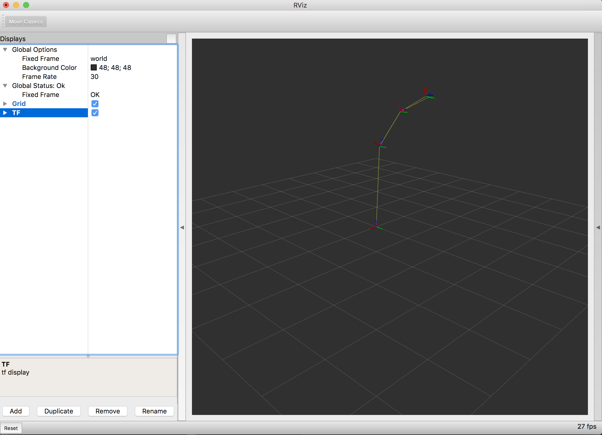

.. redirect-from::

    dummy-robot-demo
    Tutorials/dummy-robot-demo

Experimentando con un robot ficticio
====================================

En esta demo, presentamos un robot de demostración simple con todos los componentes, desde la publicación de estados conjuntos hasta la publicación de datos láser falsos hasta la visualización del modelo de robot en un mapa en RViz.

Lanzamiento de la demo
----------------------

Asumimos que tu directorio de instalación de ROS 2 es ``~/ros2_ws``. Cambia los directorios según su plataforma.

Para iniciar la demo, ejecutamos el archivo de inicio de la demo, que explicaremos con más detalle en la siguiente sección.

.. code-block:: bash

   source ~/ros2_ws/install/setup.bash
   ros2 launch dummy_robot_bringup dummy_robot_bringup_launch.py

Deberías ver algunas impresiones dentro de su terminal a lo largo de las siguientes líneas:

.. code-block:: bash

   [INFO] [launch]: process[dummy_map_server-1]: started with pid [25812]
   [INFO] [launch]: process[robot_state_publisher-2]: started with pid [25813]
   [INFO] [launch]: process[dummy_joint_states-3]: started with pid [25814]
   [INFO] [launch]: process[dummy_laser-4]: started with pid [25815]
   Initialize urdf model from file: /home/mikael/work/ros2/bouncy_ws/install_debug_isolated/dummy_robot_bringup/share/dummy_robot_bringup/launch/single_rrbot.urdf
   Parsing robot urdf xml string.
   Link single_rrbot_link1 had 1 children
   Link single_rrbot_link2 had 1 children
   Link single_rrbot_link3 had 2 children
   Link single_rrbot_camera_link had 0 children
   Link single_rrbot_hokuyo_link had 0 children
   got segment single_rrbot_camera_link
   got segment single_rrbot_hokuyo_link
   got segment single_rrbot_link1
   got segment single_rrbot_link2
   got segment single_rrbot_link3
   got segment world
   Adding fixed segment from world to single_rrbot_link1
   Adding moving segment from single_rrbot_link1 to single_rrbot_link2
   [INFO] [dummy_laser]: angle inc:    0.004363
   [INFO] [dummy_laser]: scan size:    1081
   [INFO] [dummy_laser]: scan time increment:  0.000028
   Adding moving segment from single_rrbot_link2 to single_rrbot_link3
   Adding fixed segment from single_rrbot_link3 to single_rrbot_camera_link
   Adding fixed segment from single_rrbot_link3 to single_rrbot_hokuyo_link

Si ahora abres en una terminal tu RViz, verás tu robot. 🎉

.. code-block:: bash

   $ source <ROS2_INSTALL_FOLDER>/setup.bash
   $ rviz2

Esto abre RViz2. Suponiendo que todavía tienes su dummy_robot_bringup lanzado, ahora puedes agregar el complemento de pantalla TF y configurar su marco global para ``world``. Una vez que hayas hecho eso, deberías ver una imagen similar:

¿Qué esta pasando?
^^^^^^^^^^^^^^^^^^

Si observas más de cerca el archivo de inicio, iniciamos un par de nodos al mismo tiempo.

* dummy_map_server
* dummy_laser
* dummy_joint_states
* robot_state_publisher

Los primeros dos paquetes son relativamente simples. El ``dummy_map_server`` publica constantemente un mapa vacío con una actualización periódica. El ``dummy_laser`` hace básicamente lo mismo; publicación de escaneos láser falsos ficticios.

El nodo ``dummy_joint_states`` está publicando datos de joint states falsos. Como estamos publicando un RRbot simple con solo dos articulaciones, este nodo publica valores de joint states para estas dos articulaciones.

El ``robot_state_publisher`` está haciendo un trabajo realmente interesante. Analiza el archivo URDF dado, extrae el modelo de robot y escucha los estados de unión entrantes. Con esta información publica valores de TF para nuestro robot que visualizamos en RViz.

¡Hurra!
