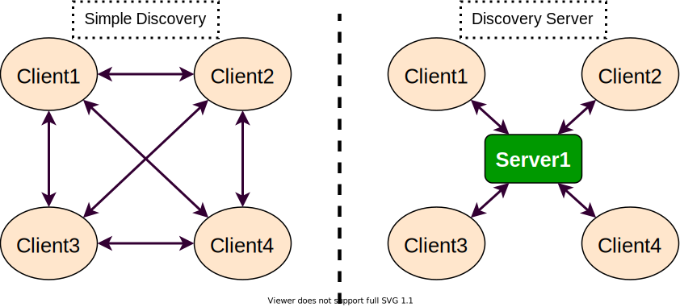
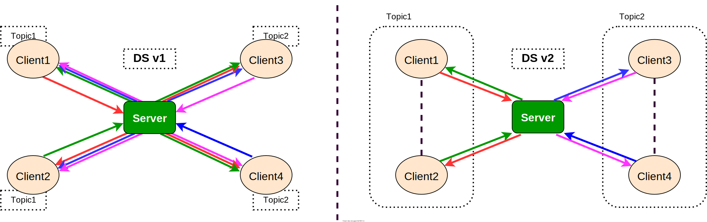
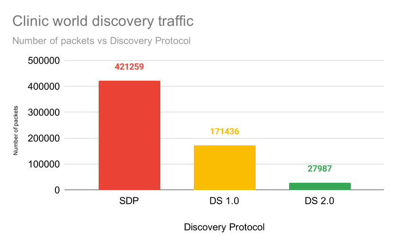
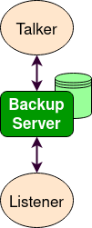
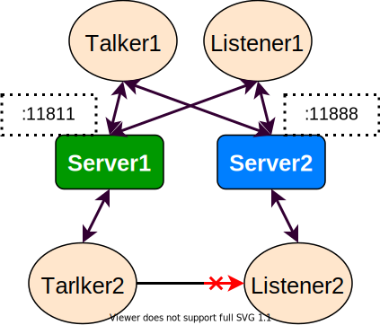
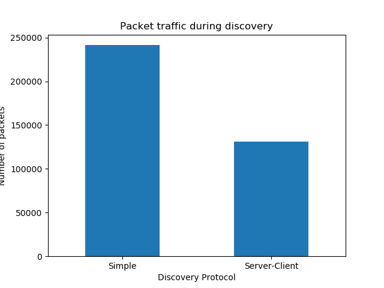

.. redirect-from::

    Discovery-Server

Using Fast DDS Discovery Server as discovery protocol [community-contributed]
=============================================================================

**Goal:** This tutorial will show how to launch ROS 2 Nodes using the **Fast DDS Discovery Server** discovery protocol.

**Tutorial level:** Intermediate

**Time:** 20 minutes

.. contents:: Table of Contents
   :depth: 2
   :local:

Background
----------

Starting from ROS 2 Eloquent Elusor, the **Fast DDS Discovery Server** protocol is a feature that offers a centralised dynamic discovery mechanism, as opposed to the distributed mechanism used in DDS by default.
This tutorial explains how to run some ROS 2 examples using the Fast DDS Discovery Server feature as discovery communication.

In order to get more information about the available discovery configuration, please check the `following documentation <https://fast-dds.docs.eprosima.com/en/v2.1.0/fastdds/discovery/discovery.html>`_ or read the `Fast DDS Discovery Server specific documentation <https://fast-dds.docs.eprosima.com/en/v2.1.0/fastdds/discovery/discovery_server.html#discovery-server>`__.

The `Simple Discovery Protocol <https://fast-dds.docs.eprosima.com/en/v2.1.0/fastdds/discovery/simple.html>`__ is the standard protocol defined in the `DDS standard <https://www.omg.org/omg-dds-portal/>`__.
However, it has known disadvantages in some scenarios.

* It does not **Scale** efficiently, as the number of exchanged packets increases significantly as new nodes are added.
* It requires **multicasting** capabilities that may not work reliably in some scenarios, e.g. WiFi.

The **Fast DDS Discovery Server** provides a Client-Server Architecture that allows nodes to connect with each other using an intermediate server.
Each node functions as a *discovery client*, sharing its info with one or more *discovery servers* and receiving discovery information from it.
This reduces discovery-related network traffic and it does not require multicasting capabilities.

These discovery servers can be independent, duplicated or connected with each other in order to create redundancy over the network and avoid having a single point of failure.

Fast DDS Discovery Server v2
----------------------------

The latest ROS 2 Foxy Fitzroy release (December 2020) included a new version, version 2 of the Fast DDS Discovery Server.
This version includes a new filter feature that further reduces the number of discovery messages sent.
This version uses the topic of the different nodes to decide if two nodes wish to communicate, or if they can be left unmatched (i.e. not discovering each other).
The following figure shows the decrease in discovery messages:

This architecture reduces the number of messages sent between the server and clients dramatically.
In the following graph, the reduction in network traffic over the discovery phase for the `RMF Clinic demonstration <https://github.com/osrf/rmf_demos#Clinic-World>`__ is shown:

In order to use this functionality, the discovery server can be configured using the `XML configuration for Participants <https://fast-dds.docs.eprosima.com/en/v2.1.0/fastdds/discovery/discovery_server.html#discovery-server>`__.
It is also possible to configure the discovery server using the ``fastdds`` `tool <https://fast-dds.docs.eprosima.com/en/v2.1.0/fastddscli/cli/cli.html#discovery>`__ and an `environment variable <https://fast-dds.docs.eprosima.com/en/v2.1.0/fastdds/env_vars/env_vars.html>`__, which is the approach used in this tutorial.
For a more detailed explanation about the configuration of the discovery server, visit `the Fast DDS Discovery Server documentation <https://fast-dds.docs.eprosima.com/en/v2.1.0/fastdds/discovery/discovery_server.html#discovery-server>`__.

Prerequisites
-------------

This tutorial assumes you have a ROS 2 Foxy (or newer) :ref:`installation <InstallationGuide>`.
If your installation is using a ROS 2 version lower than Foxy, you cannot use the ``fastdds`` tool.
Thus, in order to use the Discovery Server, you can update your repository to use a different Fast DDS version, or configure the discovery server using the `Fast DDS XML QoS configuration <https://fast-dds.docs.eprosima.com/en/v2.1.0/fastdds/discovery/discovery_server.html#discovery-server>`__.

Run this tutorial
-----------------

The ``talker-listener`` ROS 2 demo creates a ``talker`` node that publishes a "hello world" message every second, and a ``listener`` node that listens to these messages.

By :ref:`sourcing ROS 2 <ConfigROS2>` you will get access to the CLI tool ``fastdds``.
This tool gives access to the `discovery tool <https://fast-dds.docs.eprosima.com/en/v2.1.0/fastddscli/cli/cli.html#discovery>`__, which can be used to launch a discovery server. This server will manage the discovery process for the nodes that connect to it.

.. important::

    Do not forget to :ref:`source ROS 2 <ConfigROS2>` in every new terminal opened.

Setup Discovery Server
^^^^^^^^^^^^^^^^^^^^^^

Start by launching a discovery server with id 0, port 11811 (default port) and listening on all available interfaces.

Open a new terminal and run:

.. code-block:: console

    fastdds discovery --server-id 0

Launch listener node
^^^^^^^^^^^^^^^^^^^^

Execute the listener demo, to listen to the ``/chatter`` topic.

In a new terminal, set the environment variable ``ROS_DISCOVERY_SERVER`` to the location of the discovery server.
(Do not forget to source ROS 2 in every new terminal)

.. code-block:: console

    export ROS_DISCOVERY_SERVER=127.0.0.1:11811

Launch the listener node. Use the argument ``--remap __node:=listener_discovery_server`` to change the node's name for this tutorial.

.. code-block:: console

    ros2 run demo_nodes_cpp listener --ros-args --remap __node:=listener_discovery_server

This will create a ROS 2 node, that will automatically create a client for the discovery server and connect to the server created previously to perform discovery, rather than using multicast.

Launch talker node
^^^^^^^^^^^^^^^^^^

Open a new terminal and set the ``ROS_DISCOVERY_SERVER`` environment variable as before so that the node starts a discovery client.

.. code-block:: console

    export ROS_DISCOVERY_SERVER=127.0.0.1:11811
    ros2 run demo_nodes_cpp talker --ros-args --remap __node:=talker_discovery_server

You should now see the talker publishing "hello world" messages, and the listener receiving these messages.

Demonstrate Discovery Server execution
^^^^^^^^^^^^^^^^^^^^^^^^^^^^^^^^^^^^^^

So far, there is no evidence that this example and the standard talker-listener example are running differently.
To clearly demonstrate this, run another node that is not connected to the discovery server.
Run a new listener (listening in ``/chatter`` topic by default) in a new terminal and check that it is not connected to the talker already running.

.. code-block:: console

    ros2 run demo_nodes_cpp listener --ros-args --remap __node:=simple_listener

The new listener node should not be receiving the "hello world" messages.

To finally verify that everything is running correctly, a new talker can be created using the simple discovery protocol (the default DDS distributed discovery mechanism) for discovery.

.. code-block:: console

    ros2 run demo_nodes_cpp talker --ros-args --remap __node:=simple_talker

Now you should see the ``simple_listener`` node receiving the "hello world" messages from ``simple_talker`` but not the other messages from ``talker_discovery_server``.

Visualization tool ``rqt_graph``
^^^^^^^^^^^^^^^^^^^^^^^^^^^^^^^^

The ``rqt_graph`` tool can be used to verify the nodes and structure of this example.
Remember, in order to use ``rqt_graph`` with the discovery server protocol (i.e., to see the ``listener_discovery_server`` and ``talker_discovery_server`` nodes) the ``ROS_DISCOVERY_SERVER`` environment variable must be set before launching it.

Advance use cases
-----------------

The following sections show different features of the discovery server that allow you to build a robust discovery server over the network.

Server Redundancy
^^^^^^^^^^^^^^^^^

By using ``fastdds`` tool, multiple discovery servers can be created.
Discovery clients (ROS nodes) can connect to as many servers as desired.
This allows to have a redundant network that will work even if some servers or nodes shut down unexpectedly.
The figure below shows a simple architecture that provides server redundancy.

.. image:: figures/ds_redundancy_example.svg
    :align: center

In several terminals, run the following code to establish a communication with redundant servers.

.. code-block:: console

    fastdds discovery --server-id 0 --ip-address 127.0.0.1 --port 11811

.. code-block:: console

    fastdds discovery --server-id 1 --ip-address 127.0.0.1 --port 11888

``--server-id N`` means server with id N. When referencing the servers with ``ROS_DISCOVERY_SERVER``, server ``0`` must be in first place and server ``1`` in second place.

.. code-block:: console

    export ROS_DISCOVERY_SERVER="127.0.0.1:11811;127.0.0.1:11888"
    ros2 run demo_nodes_cpp talker --ros-args --remap __node:=talker

.. code-block:: console

    export ROS_DISCOVERY_SERVER="127.0.0.1:11811;127.0.0.1:11888"
    ros2 run demo_nodes_cpp listener --ros-args --remap __node:=listener

Now, if one of these servers fails, there will still be discovery capability available and nodes will still discover each other.

Backup Server
^^^^^^^^^^^^^

The Fast DDS Discovery Server allows creating a server with backup functionality.
This allows the server to restore the last state it saved in case of a shutdown.

In different terminals, run the following code to establish a communication with a backed-up server.

.. code-block:: console

    fastdds discovery --server-id 0 --ip-address 127.0.0.1 --port 11811 --backup

.. code-block:: console

    export ROS_DISCOVERY_SERVER="127.0.0.1:11811"
    ros2 run demo_nodes_cpp talker --ros-args --remap __node:=talker

.. code-block:: console

    export ROS_DISCOVERY_SERVER="127.0.0.1:11811"
    ros2 run demo_nodes_cpp listener --ros-args --remap __node:=listener

Several backup files are created in the discovery server's working directory (the directory it was launched in).
The two ``SQLite`` files and two ``json`` files contain the information required to start a new server and restore the failed server's state in case of failure, avoiding the need for the discovery process to happen again, and without losing information.

Discovery partitions
^^^^^^^^^^^^^^^^^^^^

Communication with discovery servers can be split to create virtual partitions in the discovery information.
This means that two endpoints will only know about each other if there is a shared discovery server or a network of discovery servers between them.
We are going to execute an example with two independent servers.
The following figure shows the architecture.

With this schema ``Listener 1`` will be connected to ``Talker 1`` and ``Talker 2``, as they share ``Server 1``.
``Listener 2`` will connect with ``Talker 1`` as they share ``Server 2``.
But ``Listener 2`` will not hear the messages from ``Talker 2`` because they do not share any discovery server or discovery servers, including indirectly via connections between redundant discovery servers.

Run the first server listening on localhost with the default port of 11811.

.. code-block:: console

    fastdds discovery --server-id 0 --ip-address 127.0.0.1 --port 11811

In another terminal run the second server listening on localhost using another port, in this case port 11888.

.. code-block:: console

    fastdds discovery --server-id 1 --ip-address 127.0.0.1 --port 11888

Now, run each node in a different terminal. Use ``ROS_DISCOVERY_SERVER`` environment variable to decide which server they are connected to. Be aware that the `ids must match <https://fast-dds.docs.eprosima.com/en/v2.1.0/fastdds/env_vars/env_vars.html>`__.

.. code-block:: console

    export ROS_DISCOVERY_SERVER="127.0.0.1:11811;127.0.0.1:11888"
    ros2 run demo_nodes_cpp talker --ros-args --remap __node:=talker_1

.. code-block:: console

    export ROS_DISCOVERY_SERVER="127.0.0.1:11811;127.0.0.1:11888"
    ros2 run demo_nodes_cpp listener --ros-args --remap __node:=listener_1

.. code-block:: console

    export ROS_DISCOVERY_SERVER="127.0.0.1:11811"
    ros2 run demo_nodes_cpp talker --ros-args --remap __node:=talker_2

.. code-block:: console

    export ROS_DISCOVERY_SERVER=";127.0.0.1:11888"
    ros2 run demo_nodes_cpp listener --ros-args --remap __node:=listener_2

We should see how ``Listener 1`` is receiving messages from both talker nodes, while ``Listener 2`` is in a different partition from ``Talker 2`` and so does not receive messages from it.

.. note::

    Once two endpoints (ROS nodes) have discovered each other, they do not need the discovery server network between them to listen to each other's messages.

Compare Fast DDS Discovery Server with Simple Discovery Protocol
----------------------------------------------------------------

In order to compare executing nodes using the Simple Discovery Protocol (the default DDS mechanism for distributed discovery) or the discovery server, two scripts that execute a talker and many listeners and analyze the network traffic during this time are provided.
For this experiment, ``tshark`` is required to be installed on your system.
The configuration file is mandatory in order to avoid using intraprocess mode.

.. note::

    These scripts require a discovery server closure feature that is only available from versions newer than the version provided in ROS 2 Foxy.
    In order to use this functionality, compile ROS 2 with Fast DDS v2.1.0 or higher.

These scripts' features are references for advanced purposes and their study is left to the user.

* :download:`bash network traffic generator <scripts/generate_discovery_packages.bash>`

* :download:`python3 graph generator <scripts/discovery_packets.py>`

* :download:`XML configuration <scripts/no_intraprocess_configuration.xml>`

Run the bash script with the path to ``setup.bash`` file to source ROS 2 as an argument.
This will generate the traffic trace for simple discovery.
Execute the same script with second argument ``SERVER``.
It will generate the trace for using the discovery server.

.. note::

    Depending on your configuration of ``tcpdump``, this script may require ``sudo`` privileges to read traffic across your network device.

After both executions are done, run the Python script to generate a graph similar to the one below.

.. code-block:: console

    $ export FASTRTPS_DEFAULT_PROFILES_FILE="no_intraprocess_configuration.xml"
    $ sudo bash generate_discovery_packages.bash ~/ros2_foxy/install/local_setup.bash
    $ sudo bash generate_discovery_packages.bash ~/ros2_foxy/install/local_setup.bash SERVER
    $ python3 discovery_packets.py

This graph is the result of a specific run of the experiment.
The reader can execute the scripts and generate their own results for comparison.
It can easily be seen that network traffic is reduced when using discovery service.

The reduction in traffic is a result of avoiding every node announcing itself and waiting a response from every other node on the network.
This creates a huge amount of traffic in large architectures.
The reduction from this method increases with the number of nodes, making this architecture more scalable than the Simple Discovery Protocol approach.

The new Fast DDS Discovery Server v2 is available since *Fast DDS* v2.0.2, replacing the old discovery server.
In this new version, those nodes that do not share topics will automatically not discover each other, saving the whole discovery data required to connect them and their endpoints.
The experiment above does not show this case, but even so the massive reduction in traffic can be appreciated due to the hidden infrastructure topics of ROS 2 nodes.
