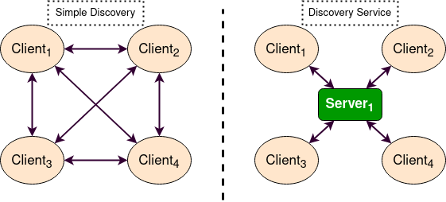
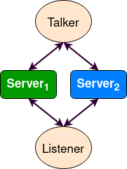
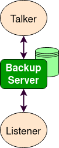
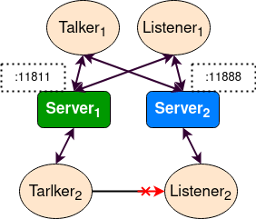
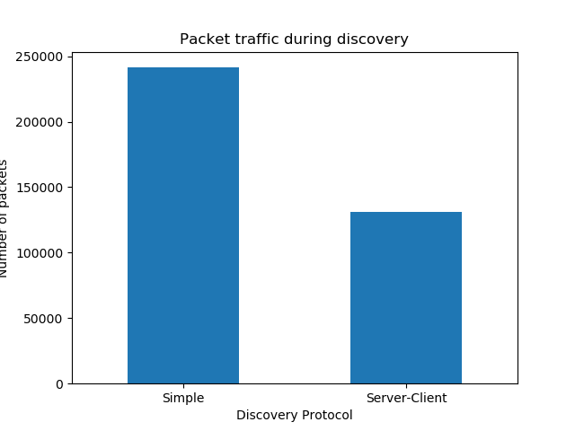

.. redirect-from::

    fast-discovery-service

Use ROS2 with Fast-DDS Discovery Service 
=========================================

**Goal:** This demo will show you how to use ROS 2 Nodes using the Fast-DDS Discovery Service communication.

**Tutorial level:** Intermediate

**Time:** 20 minutes

.. contents:: Table of Contents
   :depth: 2
   :local:

Background
----------

The **Discovery Service** is a **eProsima**
`Fast-DDS feature <https://eprosima.com/index.php/resources-all/scalability/discovery-server-an-enhanced-discovery-paradigm-for-dds-ecosystems>`__ 
that offers a dynamical discovering communication.

The `Simple Discovery Protocol <https://fast-dds.docs.eprosima.com/en/latest/fastdds/discovery/simple.html>`__ is the
standard protocol defined in the `standard DDS <https://www.omg.org/omg-dds-portal/>`__.
But this protocol has certain disadvantages in some scenarios:

* It has not great **Scalability** as the number of exchanged packets increases exponentially as new nodes are added.
* It requires **Multicasting** capabilities, that nowadays may not work reliably in some connection cases as WiFi.

The **Discovery Service** provides a Client-Server Architecture that allows the nodes to connect with each other using an intermediate server.
Each node will work as a *Client*, sharing its info with the **Discovery Server** and receiving the discovery information from it.
This means that the network traffic is highly reduced in big systems, and it does not require *Multicasting*.

    
.. note::

    This connection only affects the discovery communication. The DDS communication is still *Peer to Peer*.

These **Discovery Servers** could be independent, duplicated or connected with each other in order to create
redundancy over the network and avoid having a *Single-Point-Of-Failure*.

In order to use this functionality, this **Fast-DDS Discovery Service** could be set by parameters using
the `XML configuration for Participants <https://fast-dds.docs.eprosima.com/en/latest/fastdds/discovery/server_client.html#discovery-server>`__.

However, Fast-DDS library provide an easier way to set a **Discovery Service** communication using
the ``fastdds`` `tool <https://fast-dds.docs.eprosima.com/en/latest/fastddscli/cli/cli.html#discovery>`__ 
and an `environment variable <https://fast-dds.docs.eprosima.com/en/latest/fastdds/env_vars/env_vars.html>`__.

For a complete information about the actual implementation, testing and performance,
visit this `link <https://eprosima.com/index.php/resources-all/scalability/fast-rtps-discovery-mechanisms-analysis>`__

Prerequisites
-------------

This tutorial assumes you have a `working ROS 2 installation <../../Installation>`.
In case your installation is using a *Fast-DDS* version lower than v2.1.0, you could not use the ``fastdds`` tool.
You could update your repository to use a different *Fast-DDS* version,
or `set the discovery service by Fast-DDS XML QoS configuration <https://fast-dds.docs.eprosima.com/en/latest/fastdds/discovery/server_client.html#discovery-server>`__. 

The ``talker-listener`` ROS2 demo allows to create a *talker* node that publishes a *Hello World* message every second,
and a *listener* node that listens in these messages.

.. note::

    As always, don’t forget to source ROS 2 in :ref:`every new terminal you open <ConfigROS2>`.

Run the demo
------------

Sourcing ROS 2 you will get access to the CLI of Fast-DDS library: ``fastdds``.
From this CLI we have access to the `discovery tool <https://fast-dds.docs.eprosima.com/en/latest/fastddscli/cli/cli.html#discovery>`__,
that allows to launch a server. This server will manage the discovery process for the nodes that connect with it.

1 Setup Discovery Service
^^^^^^^^^^^^^^^^^^^^^^^^^

We launch a server with id 0, with port 11811 and listenig on all available interfaces.

Open a new terminal and run:

.. code-block:: console

    fastdds discovery -i 0

2 Launch node listener
^^^^^^^^^^^^^^^^^^^^^^

We execute the listener demo, that will listen in ``/chatter`` topic.

In a new terminal, we set the environment variable ``ROS_DISCOVERY_SERVER`` that sets the new nodes created to use *Discovery Service*. (Do not forget to source ROS2 in every new terminal)

.. code-block:: console

    export ROS_DISCOVERY_SERVER=127.0.0.1:11811

Afterwards, we launch the listener node. We change the node name to further demonstrations. 

.. code-block:: console

    ros2 run demo_nodes_cpp listener --ros-args --remap __node:=listener_discovery_service

This process will create a ROS2 node, that will automatically create a client for the *Discovery Service* to use the server created before to run the discovery protocol.

2 Launch node talker
^^^^^^^^^^^^^^^^^^^^

We open a new terminal and set the environment variable as done before, so the node that we will create will raise up a client for the discovery protocol.

.. code-block:: console

    export ROS_DISCOVERY_SERVER=127.0.0.1:11811
    ros2 run demo_nodes_cpp talker --ros-args --remap __node:=talker_discovery_service

Now, we should be watching the talker publishing *Hello World* messages, and the listener should be listening these messages.

3 Demonstrate Discovery Service execution
^^^^^^^^^^^^^^^^^^^^^^^^^^^^^^^^^^^^^^^^^

So far, we cannot probe that this example and the standard talker-listener example run differently.

For this purpose, we are going to run another node that is not connected to out *Discovery Server*.
We just need to run a new listener (listening in ``/chatter`` topic by default) in a new terminal and check that is not connected to the talker already running.

.. code-block:: console

    ros2 run demo_nodes_cpp listener --ros-args --remap __node:=simple_listener

In this case, we should not see the listener receiving the messages.

To finally verify that we are running everything correctly, we can create a new talker using the *simple discovery protocol*.

.. code-block:: console

    ros2 run demo_nodes_cpp talker --ros-args --remap __node:=simple_talker

Now we should be watching the listener *simple_listener* receiving the messages from *simple_talker* but not the other messages from *talker_discovery_service*.

In case the user wants to verify the nodes and structure of this example, the tool ``rqt_graph`` could be used.
Remind, to use the ``rqt_graph`` with the *Discovery Service Protocol* (to see the ``listener/talker_discovery_service``)
the environment variable ``ROS_DISCOVERY_SERVER`` must set beforehand.

Advance user cases
------------------

3 Server Redundancy
^^^^^^^^^^^^^^^^^^^

Using the Fast-DDS tool, we can create several servers, and we can connect each of our nodes to as many
servers as we want. This allows to have a save redundancy network that will work even if some servers or
nodes are shutteddown unexpectedly.

Next schema shows a simple architecture that will work with server redundancy:

In different terminals, run the next code to stablish a communication over a backup server.

.. code-block:: console

    fastdds discovery -i 0 -l 127.0.0.1 -p 11811

``-i 1`` means server with id 1. That means that to reference it with ``ROS_DISCOVERY_SERVER`` must be in second place.

.. code-block:: console

    fastdds discovery -i 1 -l 127.0.0.1 -p 11888

.. code-block:: console

    export ROS_DISCOVERY_SERVER="127.0.0.1:11811;127.0.0.1:11888"
    ros2 run demo_nodes_cpp talker --ros-args --remap __node:=talker

.. code-block:: console

    export ROS_DISCOVERY_SERVER="127.0.0.1:11811;127.0.0.1:11888"
    ros2 run demo_nodes_cpp listener --ros-args --remap __node:=listener

Now, if one of these servers fails, we would still have discovery communication between nodes.

.. note::

    Be aware that to successfully raise a new node, all the servers that this node will connect with
    must be running at the time we create it.

2 Backup Server
^^^^^^^^^^^^^^^

Fast-DDS Discovery Service allows to easily build a server with a **backup** funcionality.
This allows the server to retake the last state it saved in case of a shutdown.

In different terminals, run the next code to stablish a communication over a backup server.

.. code-block:: console

    fastdds discovery -i 0 -l 127.0.0.1 -p 11811 -b

.. code-block:: console

    export ROS_DISCOVERY_SERVER="127.0.0.1:11811"
    ros2 run demo_nodes_cpp talker --ros-args --remap __node:=talker

.. code-block:: console

    export ROS_DISCOVERY_SERVER="127.0.0.1:11811"
    ros2 run demo_nodes_cpp listener --ros-args --remap __node:=listener

We will see how a ``SQLite`` DB is created in the path we have run the server. 

3 Discovery partitions
^^^^^^^^^^^^^^^^^^^^^^

The **Discovery Service** communication could be used with different servers to split in virtual partitions the discovery info.
This means that two endpoints only would know each other if there is a server or a server network between them.

We are going to execute an example with two different servers. The following image shows an schema of the architecture desired:

With this schema we are going to see how *Listener 1* is connected to *Talker 1* and *Talker 2*, but
*Listener 2* will only listen *Talker 1*.

We run the first server listening in localhost in default port 11811.

.. code-block:: console

    fastdds discovery -i 0 -l 127.0.0.1 -p 11811

In another terminal we run the second server listening in localhost in port 11888 (random port).

.. code-block:: console

    fastdds discovery -i 1 -l 127.0.0.1 -p 11888

Now we run in different terminals each of the nodes we want to run. Using the env var ``ROS_DISCOVERY_SERVER`` we decide
which server they are connected to. Be aware that the `ids must match <https://fast-dds.docs.eprosima.com/en/latest/fastdds/env_vars/env_vars.html>`__.

.. code-block:: console

    export ROS_DISCOVERY_SERVER="127.0.0.1:11811;127.0.0.1:11888"
    ros2 run demo_nodes_cpp talker --ros-args --remap __node:=talker_1

.. code-block:: console

    export ROS_DISCOVERY_SERVER="127.0.0.1:11811;127.0.0.1:11888"
    ros2 run demo_nodes_cpp listener --ros-args --remap __node:=listener_1

.. code-block:: console

    export ROS_DISCOVERY_SERVER="127.0.0.1:11811"
    ros2 run demo_nodes_cpp talker --ros-args --remap __node:=talker_2

.. code-block:: console

    export ROS_DISCOVERY_SERVER=";127.0.0.1:11888"
    ros2 run demo_nodes_cpp listener --ros-args --remap __node:=listener_2

We should see how *Listener 1* is receiving double messages while *Listener 2* is in a different partition of *Talker 2* and so it does not
listen him.

.. note::

    Once two endpoints know each other, they do not need the server network between them to listen to each other messages.

Compare Discovery Service with Simple Discovery
-----------------------------------------------

In order to compare the ROS2 execution using *Simple Discovery* or *Discovery Service*, we would provide two scripts that
execute a talker and many listeners and analyze the network traffic during this time.

However, this functionality and scripts contains an advance purpose, and we are going to leave its understanding to the user.

Throw many listeners in simple and service mode to get traffic info:

* :download:`bash network traffic generator <generate_discovery_packages.bash>`

Analyze tcpdump traces and generates the graph:

* :download:`python3 graph generator <discovery_packets.py>`

To successfully execute these scripts, we must first run the bash script with the argument to the *setup* path to source ROS2.
This will generate the traffic trace for simple discovery. Executing the same script with second argument ``SERVER`` it will 
generates the trace for service discovery.

After both executions are done, we run the python script to generates a graph similar to the one below:

    
In this graph (this is a specific examples, but the user can execute the scripts and watch their own results) we can easily see how the network traffic
is reduced when using *Discovery Service*. 

The reduction in traffic is due to avoid the network discovery structure where every node communicate itself and wait a response for every
other node in the net. This creates a huge amount of traffic with big architectures.
This reduction would increase if we increase the number of Nodes, making this architecture more scalable than the simple one.
