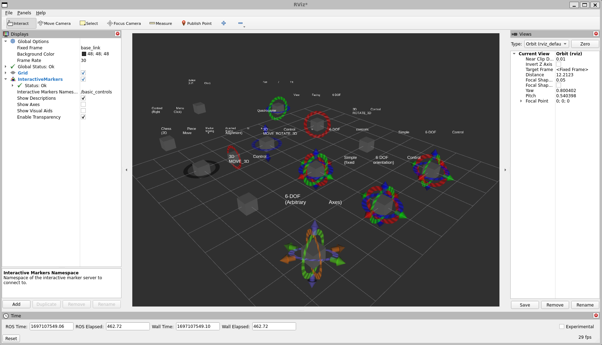
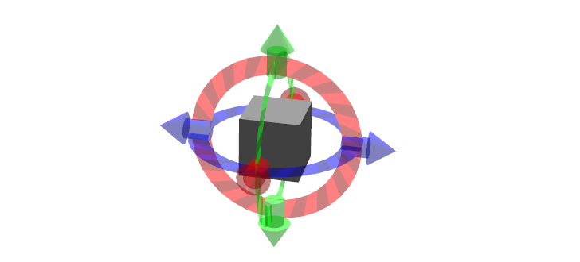
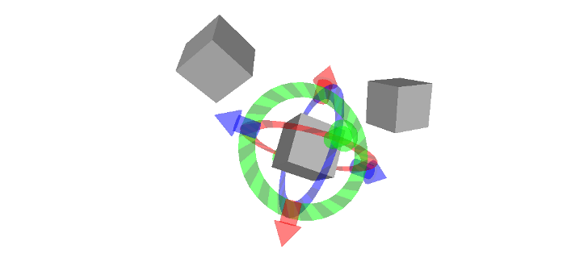
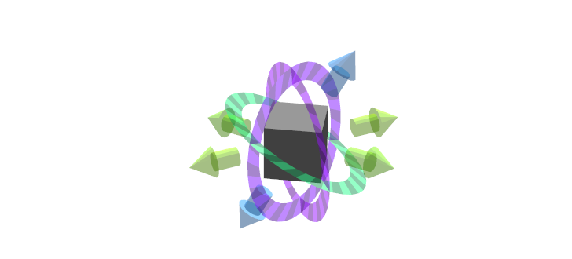
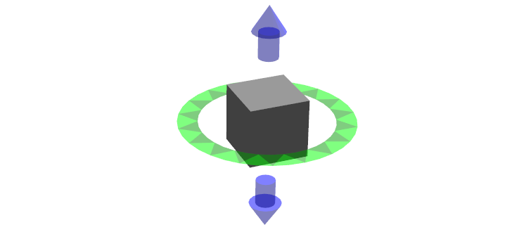
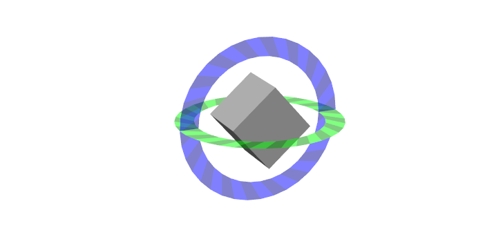

.. redirect-from::

    Tutorials/RViz/Interactive-marker-basic-controls

.. _RVizINTMarkerControls:

Interactive Markers: Basic Controls
===================================

**Goal:** Create interactive Marker Display to render markers that the user can interact with.

**Tutorial level:** Intermediate

**Time:** TBD

.. contents:: Contents
   :depth: 2
   :local:

Backround
---------
If you run the simple_marker example from interactive_marker_tutorials as described in the previous tutorial, you will see this in RViz:

This tutorial shows you most of the common options you have for designing interactive markers.
The node providing will print all feedback it gets from RViz on the command line.

All interactive markers contain a grey box, which in most cases will do nothing more than move together with the rest of the controls.
It will show you how the coordinate frame of the Interactive Marker moves.

Prerequisites
-------------
Before starting this tutorial, you should first complete the previous RViz tutorials

The basic_controls example explained
------------------------------------
This is the code for the basic_controls example is located `here  <https://github.com/ros-visualization/visualization_tutorials/blob/ros2/interactive_marker_tutorials/src/basic_controls.cpp>`__.

1. Simple 6-DOF control
^^^^^^^^^^^^^^^^^^^^^^^

This shows how to control all 6 degrees of freedom using 6 separate controls. Use the rings to rotate and the arrows to move the structure.

2. Simple 6-DOF control (fixed orientation)
^^^^^^^^^^^^^^^^^^^^^^^^^^^^^^^^^^^^^^^^^^^

Identical to the 6-DOF control, with the exception that the orientation of the controls will stay fixed, independent of the orientation of the frame being controlled.
Play around with these two two fully understand the difference between them!

.. code-block:: C++

    visualization_msgs::msg::Marker
    BasicControlsNode::makeBox(const visualization_msgs::msg::InteractiveMarker & msg)
    {
        visualization_msgs::msg::Marker marker;

        marker.type = visualization_msgs::msg::Marker::CUBE;
        marker.scale.x = msg.scale * 0.45;
        marker.scale.y = msg.scale * 0.45;
        marker.scale.z = msg.scale * 0.45;
        marker.color.r = 0.5;
        marker.color.g = 0.5;
        marker.color.b = 0.5;
        marker.color.a = 1.0;

        return marker;
    }

    visualization_msgs::msg::InteractiveMarkerControl &
    BasicControlsNode::makeBoxControl(visualization_msgs::msg::InteractiveMarker & msg)
    {
        visualization_msgs::msg::InteractiveMarkerControl control;
        control.always_visible = true;
        control.markers.push_back(makeBox(msg));
        msg.controls.push_back(control);

        return msg.controls.back();
    }

.. code-block:: C++

    void
    BasicControlsNode::make6DofMarker(
      bool fixed, unsigned int interaction_mode, const tf2::Vector3 & position, bool show_6dof)
    {
        visualization_msgs::msg::InteractiveMarker int_marker;
        int_marker.header.frame_id = "base_link";
        int_marker.pose.position.x = position.getX();
        int_marker.pose.position.y = position.getY();
        int_marker.pose.position.z = position.getZ();
        int_marker.scale = 1;

        int_marker.name = "simple_6dof";
        int_marker.description = "Simple 6-DOF Control";

        // insert a box
        makeBoxControl(int_marker);
        int_marker.controls[0].interaction_mode = interaction_mode;

        visualization_msgs::msg::InteractiveMarkerControl control;

        if (fixed) {
            int_marker.name += "_fixed";
            int_marker.description += "\n(fixed orientation)";
            control.orientation_mode = visualization_msgs::msg::InteractiveMarkerControl::FIXED;
        }

        if (interaction_mode != visualization_msgs::msg::InteractiveMarkerControl::NONE) {
            std::string mode_text;
            if (interaction_mode == visualization_msgs::msg::InteractiveMarkerControl::MOVE_3D) {
                mode_text = "MOVE_3D";
            } else if (interaction_mode == visualization_msgs::msg::InteractiveMarkerControl::ROTATE_3D) {
                mode_text = "ROTATE_3D";
            } else {
                if (interaction_mode == visualization_msgs::msg::InteractiveMarkerControl::MOVE_ROTATE_3D) {
                    mode_text = "MOVE_ROTATE_3D";
                }
            }
            int_marker.name += "_" + mode_text;
            int_marker.description = std::string("3D Control") +
              (show_6dof ? " + 6-DOF controls" : "") + "\n" + mode_text;
        }

        if (show_6dof) {
            tf2::Quaternion orien(1.0, 0.0, 0.0, 1.0);
            orien.normalize();
            control.orientation = tf2::toMsg(orien);
            control.name = "rotate_x";
            control.interaction_mode = visualization_msgs::msg::InteractiveMarkerControl::ROTATE_AXIS;
            int_marker.controls.push_back(control);
            control.name = "move_x";
            control.interaction_mode = visualization_msgs::msg::InteractiveMarkerControl::MOVE_AXIS;
            int_marker.controls.push_back(control);

            orien = tf2::Quaternion(0.0, 1.0, 0.0, 1.0);
            orien.normalize();
            control.orientation = tf2::toMsg(orien);
            control.name = "rotate_z";
            control.interaction_mode = visualization_msgs::msg::InteractiveMarkerControl::ROTATE_AXIS;
            int_marker.controls.push_back(control);
            control.name = "move_z";
            control.interaction_mode = visualization_msgs::msg::InteractiveMarkerControl::MOVE_AXIS;
            int_marker.controls.push_back(control);

            orien = tf2::Quaternion(0.0, 0.0, 1.0, 1.0);
            orien.normalize();
            control.orientation = tf2::toMsg(orien);
            control.name = "rotate_y";
            control.interaction_mode = visualization_msgs::msg::InteractiveMarkerControl::ROTATE_AXIS;
            int_marker.controls.push_back(control);
            control.name = "move_y";
            control.interaction_mode = visualization_msgs::msg::InteractiveMarkerControl::MOVE_AXIS;
            int_marker.controls.push_back(control);
        }

        server_->insert(int_marker);
        server_->setCallback(int_marker.name, std::bind(&BasicControlsNode::processFeedback, this, _1));
        if (interaction_mode != visualization_msgs::msg::InteractiveMarkerControl::NONE) {
            menu_handler_.apply(*server_, int_marker.name);
        }
    }

The code section above shows how to construct the first two interactive markers.
After adding the grey box, 6 controls for each degree of freedom are added.
No markers are added to these controls, which will result in RViz creating a set of colored rings and arrows as a default visualization.

The only difference between the two is that in the second case, the orientation mode is set to InteractiveMarkerControl::FIXED,
while in the first it is left at its default value, which is InteractiveMarkerControl::INHERIT.

Note that the 3D controls (shown lower in this list) are constructed using this function as well.
For the simple 6-DOF controls shown above, the block under if(interaction_mode != InteractiveMarkerControl::NONE) is ignored.

NOTE: The orientations in the above code snippet can be confusing.
If you compute the rotation matrices corresponding to each of the quaternions, you can verify that the specified orientation is correct.

3. 3D Controls
^^^^^^^^^^^^^^

These new marker types support various kinds of 3D motion with a mouse.

* MOVE_3D: Drawn as a box-marker in the tutorial, this interaction mode allows 3D translation of the marker (in the camera plane by default, and into/out-of the camera while holding shift).
* ROTATE_3D: Drawn as a box marker in this tutorial, this interacton mode allows 3D rotation of the marker (about the camera plane's vertical and horizontal axes by default, and about the axis perpendicular to the camera plane while holding shift).
* MOVE_ROTATE_3D: This interaction mode is the union of MOVE_3D (default) and ROTATE_3D (while holding ctrl). An interactive marker can have multiple redundant control types; in this tutorial, the box is a 3D control yet the marker also has a simple set of 6-DOF rings-and-arrows.

It is possible to write an Rviz plugin that allows 3D grabbing of these markers using a 6D input device such as a Phantom Omni or Razer Hydra.

4. 6-DOF (Arbitrary Axes)
^^^^^^^^^^^^^^^^^^^^^^^^^

Shows that controls are not limited to the unit axes but can work on any arbitrary orientation.

.. code-block:: C++

    void
    BasicControlsNode::makeRandomDofMarker(const tf2::Vector3 & position)
    {
        visualization_msgs::msg::InteractiveMarker int_marker;
        int_marker.header.frame_id = "base_link";
        int_marker.pose.position.x = position.getX();
        int_marker.pose.position.y = position.getY();
        int_marker.pose.position.z = position.getZ();
        int_marker.scale = 1;

        int_marker.name = "6dof_random_axes";
        int_marker.description = "6-DOF\n(Arbitrary Axes)";

        makeBoxControl(int_marker);

        visualization_msgs::msg::InteractiveMarkerControl control;

        for (int i = 0; i < 3; i++) {
            tf2::Quaternion orien(
            randFromRange(-1, 1), randFromRange(-1, 1), randFromRange(-1, 1), randFromRange(-1, 1));
            orien.normalize();
            control.orientation = tf2::toMsg(orien);
            control.interaction_mode = visualization_msgs::msg::InteractiveMarkerControl::ROTATE_AXIS;
            int_marker.controls.push_back(control);
            control.interaction_mode = visualization_msgs::msg::InteractiveMarkerControl::MOVE_AXIS;
            int_marker.controls.push_back(control);
        }

        server_->insert(int_marker);
        server_->setCallback(int_marker.name, std::bind(&BasicControlsNode::processFeedback, this, _1));
    }

The controls in this example are created by assigning random values to the quaternions which determine the orientation of each control.
RViz will normalize these quaternions, so you don't have to worry about it when creating an interactive marker.

5. View-Facing 6-DOF
^^^^^^^^^^^^^^^^^^^^

This interactive marker can move and rotate in all directions.
In contrast to the previous examples, it does that using only two controls.
The outer ring rotates along the view axis of the camera in RViz.
The box moves in the camera plane, although it is not visually aligned with the camera coordinate frame.

.. code-block:: C++

    void
    BasicControlsNode::makeViewFacingMarker(const tf2::Vector3 & position)
    {
        visualization_msgs::msg::InteractiveMarker int_marker;
        int_marker.header.frame_id = "base_link";
        int_marker.pose.position.x = position.getX();
        int_marker.pose.position.y = position.getY();
        int_marker.pose.position.z = position.getZ();
        int_marker.scale = 1;

        int_marker.name = "view_facing";
        int_marker.description = "View Facing 6-DOF";

        visualization_msgs::msg::InteractiveMarkerControl control;

        // make a control that rotates around the view axis
        control.orientation_mode = visualization_msgs::msg::InteractiveMarkerControl::VIEW_FACING;
        control.interaction_mode = visualization_msgs::msg::InteractiveMarkerControl::ROTATE_AXIS;
        control.orientation.w = 1;
        control.name = "rotate";

        int_marker.controls.push_back(control);

        // create a box in the center which should not be view facing,
        // but move in the camera plane.
        control.orientation_mode = visualization_msgs::msg::InteractiveMarkerControl::VIEW_FACING;
        control.interaction_mode = visualization_msgs::msg::InteractiveMarkerControl::MOVE_PLANE;
        control.independent_marker_orientation = true;
        control.name = "move";

        control.markers.push_back(makeBox(int_marker));
        control.always_visible = true;

        int_marker.controls.push_back(control);

        server_->insert(int_marker);
        server_->setCallback(int_marker.name, std::bind(&BasicControlsNode::processFeedback, this, _1));
    }

6. Quadrocopter
^^^^^^^^^^^^^^^

This interactive marker has a constrained set of 4 degrees of freedom.
It can rotate around the z axis and move in all 3 dimensions.
It it realized using two controls: the green ring moves in the y-z plane and rotates around the z-axis, while the two additional arrows move along z.

Click and drag the green ring to see how the combined movement and rotation works: If the mouse cursor stays close to the ring, it will only rotate.
Once you move it further away, it will start following the mouse.

.. code-block:: C++

    void
    BasicControlsNode::makeQuadrocopterMarker(const tf2::Vector3 & position)
    {
        visualization_msgs::msg::InteractiveMarker int_marker;
        int_marker.header.frame_id = "base_link";
        int_marker.pose.position.x = position.getX();
        int_marker.pose.position.y = position.getY();
        int_marker.pose.position.z = position.getZ();
        int_marker.scale = 1;

        int_marker.name = "quadrocopter";
        int_marker.description = "Quadrocopter";

        makeBoxControl(int_marker);

        visualization_msgs::msg::InteractiveMarkerControl control;

        tf2::Quaternion orien(0.0, 1.0, 0.0, 1.0);
        orien.normalize();
        control.orientation = tf2::toMsg(orien);
        control.interaction_mode = visualization_msgs::msg::InteractiveMarkerControl::MOVE_ROTATE;
        int_marker.controls.push_back(control);
        control.interaction_mode = visualization_msgs::msg::InteractiveMarkerControl::MOVE_AXIS;
        int_marker.controls.push_back(control);

        server_->insert(int_marker);
        server_->setCallback(int_marker.name, std::bind(&BasicControlsNode::processFeedback, this, _1));
    }

The creation of the interactive marker is analogous to the previous examples, just that the interaction mode for one of the controls is set to MOVE_ROTATE.

7. Chess Piece
^^^^^^^^^^^^^^

Click and drag the box or the surrounding Ring to move it in the x-y plane.
Once you let go of the mouse button, it will snap to one of the grid fields.
The way this works is that the basic_controls server running outside of RViz
will set the pose of the Interactive Marker to a new value when it receives the pose from RViz.
RViz will apply the update once you stop dragging it.

.. code-block:: C++

    void
    BasicControlsNode::makeChessPieceMarker(const tf2::Vector3 & position)
    {
        visualization_msgs::msg::InteractiveMarker int_marker;
        int_marker.header.frame_id = "base_link";
        int_marker.pose.position.x = position.getX();
        int_marker.pose.position.y = position.getY();
        int_marker.pose.position.z = position.getZ();
        int_marker.scale = 1;

        int_marker.name = "chess_piece";
        int_marker.description = "Chess Piece\n(2D Move + Alignment)";

        visualization_msgs::msg::InteractiveMarkerControl control;

        tf2::Quaternion orien(0.0, 1.0, 0.0, 1.0);
        orien.normalize();
        control.orientation = tf2::toMsg(orien);
        control.interaction_mode = visualization_msgs::msg::InteractiveMarkerControl::MOVE_PLANE;
        int_marker.controls.push_back(control);

        // make a box which also moves in the plane
        control.markers.push_back(makeBox(int_marker));
        control.always_visible = true;
        int_marker.controls.push_back(control);

        // we want to use our special callback function
        server_->insert(int_marker);
        server_->setCallback(int_marker.name, std::bind(&BasicControlsNode::processFeedback, this, _1));

        // set different callback for POSE_UPDATE feedback
        server_->setCallback(
            int_marker.name,
            std::bind(&BasicControlsNode::alignMarker, this, _1),
            visualization_msgs::msg::InteractiveMarkerFeedback::POSE_UPDATE);
    }

The major difference to the previous example is that an additional feedback function is specified,
which will be called instead of processFeedback() when the pose of the marker gets updated.
This function modifies the pose of the marker and sends it back to RViz:

.. code-block:: C++

    void
    BasicControlsNode::alignMarker(
      const visualization_msgs::msg::InteractiveMarkerFeedback::ConstSharedPtr & feedback)
    {
        geometry_msgs::msg::Pose pose = feedback->pose;

        pose.position.x = round(pose.position.x - 0.5) + 0.5;
        pose.position.y = round(pose.position.y - 0.5) + 0.5;

        std::ostringstream oss;
        oss << feedback->marker_name << ":" <<
            " aligning position = " <<
            feedback->pose.position.x <<
            ", " << feedback->pose.position.y <<
            ", " << feedback->pose.position.z <<
            " to " <<
            pose.position.x <<
            ", " << pose.position.y <<
            ", " << pose.position.z;
        RCLCPP_INFO(get_logger(), "%s", oss.str().c_str());

        server_->setPose(feedback->marker_name, pose);
        server_->applyChanges();
    }

8. Pan / Tilt
^^^^^^^^^^^^^

This example shows that you can combine frame aligned and fixed-orientation controls in one Interactive Marker.
The Pan control will always stay in place, while the tilt control will rotate.

.. code-block:: C++

    void
    BasicControlsNode::makePanTiltMarker(const tf2::Vector3 & position)
    {
        visualization_msgs::msg::InteractiveMarker int_marker;
        int_marker.header.frame_id = "base_link";
        int_marker.pose.position.x = position.getX();
        int_marker.pose.position.y = position.getY();
        int_marker.pose.position.z = position.getZ();
        int_marker.scale = 1;

        int_marker.name = "pan_tilt";
        int_marker.description = "Pan / Tilt";

        makeBoxControl(int_marker);

        visualization_msgs::msg::InteractiveMarkerControl control;

        tf2::Quaternion orien(0.0, 1.0, 0.0, 1.0);
        orien.normalize();
        control.orientation = tf2::toMsg(orien);
        control.interaction_mode = visualization_msgs::msg::InteractiveMarkerControl::ROTATE_AXIS;
        control.orientation_mode = visualization_msgs::msg::InteractiveMarkerControl::FIXED;
        int_marker.controls.push_back(control);

        orien = tf2::Quaternion(0.0, 0.0, 1.0, 1.0);
        orien.normalize();
        control.orientation = tf2::toMsg(orien);
        control.interaction_mode = visualization_msgs::msg::InteractiveMarkerControl::ROTATE_AXIS;
        control.orientation_mode = visualization_msgs::msg::InteractiveMarkerControl::INHERIT;
        int_marker.controls.push_back(control);

        server_->insert(int_marker);
        server_->setCallback(int_marker.name, std::bind(&BasicControlsNode::processFeedback, this, _1));
    }

9. Context Menu
^^^^^^^^^^^^^^^
This example shows how to attach a simple-static menu to an interactive marker.
If you do not specify a custom marker for visualization (as in the case of the grey box),
RViz will create a text marker floating above the Interactive Marker, which will enables you to open the context menu.

.. code-block:: C++

    void
    BasicControlsNode::makeMenuMarker(const tf2::Vector3 & position)
    {
        visualization_msgs::msg::InteractiveMarker int_marker;
        int_marker.header.frame_id = "base_link";
        int_marker.pose.position.x = position.getX();
        int_marker.pose.position.y = position.getY();
        int_marker.pose.position.z = position.getZ();
        int_marker.scale = 1;

        int_marker.name = "context_menu";
        int_marker.description = "Context Menu\n(Right Click)";

        visualization_msgs::msg::InteractiveMarkerControl control;

        control.interaction_mode = visualization_msgs::msg::InteractiveMarkerControl::MENU;
        control.name = "menu_only_control";

        visualization_msgs::msg::Marker marker = makeBox(int_marker);
        control.markers.push_back(marker);
        control.always_visible = true;
        int_marker.controls.push_back(control);

        server_->insert(int_marker);
        server_->setCallback(int_marker.name, std::bind(&BasicControlsNode::processFeedback, this, _1));
        menu_handler_.apply(*server_, int_marker.name);
    }

10. Button
^^^^^^^^^^
Button controls behave almost exactly like the Menu control in the previous example.
You can use this type to indicate to the user that a left-click is the desired mode of interaction.
RViz will use a different mouse cursor for this type of control.

.. code-block:: C++

    void
    BasicControlsNode::makeButtonMarker(const tf2::Vector3 & position)
        {
        visualization_msgs::msg::InteractiveMarker int_marker;
        int_marker.header.frame_id = "base_link";
        int_marker.pose.position.x = position.getX();
        int_marker.pose.position.y = position.getY();
        int_marker.pose.position.z = position.getZ();
        int_marker.scale = 1;

        int_marker.name = "button";
        int_marker.description = "Button\n(Left Click)";

        visualization_msgs::msg::InteractiveMarkerControl control;

        control.interaction_mode = visualization_msgs::msg::InteractiveMarkerControl::BUTTON;
        control.name = "button_control";

        visualization_msgs::msg::Marker marker = makeBox(int_marker);
        control.markers.push_back(marker);
        control.always_visible = true;
        int_marker.controls.push_back(control);

        server_->insert(int_marker);
        server_->setCallback(int_marker.name, std::bind(&BasicControlsNode::processFeedback, this, _1));
    }

11. Marker attached to a moving frame
^^^^^^^^^^^^^^^^^^^^^^^^^^^^^^^^^^^^^
This example shows what happens if you click on a marker that is attached to a frame which moves relative to the fixed frame specified in RViz.
Click on the box to move and on the ring to rotate.
As the containing frame moves, the marker will continue moving relative to your mouse even if you are holding it.
The interactive marker header's stamp must be ros::Time(0) (as it is by default if not set), so that rviz will take the most recent tf frames to transform it.

.. code-block:: C++

    void
    BasicControlsNode::makeMovingMarker(const tf2::Vector3 & position)
    {
        visualization_msgs::msg::InteractiveMarker int_marker;
        int_marker.header.frame_id = "moving_frame";
        int_marker.pose.position.x = position.getX();
        int_marker.pose.position.y = position.getY();
        int_marker.pose.position.z = position.getZ();
        int_marker.scale = 1;

        int_marker.name = "moving";
        int_marker.description = "Marker Attached to a\nMoving Frame";

        visualization_msgs::msg::InteractiveMarkerControl control;

        tf2::Quaternion orien(1.0, 0.0, 0.0, 1.0);
        orien.normalize();
        control.orientation = tf2::toMsg(orien);
        control.interaction_mode = visualization_msgs::msg::InteractiveMarkerControl::ROTATE_AXIS;
        int_marker.controls.push_back(control);

        control.interaction_mode = visualization_msgs::msg::InteractiveMarkerControl::MOVE_PLANE;
        control.always_visible = true;
        control.markers.push_back(makeBox(int_marker));
        int_marker.controls.push_back(control);

        server_->insert(int_marker);
        server_->setCallback(int_marker.name, std::bind(&BasicControlsNode::processFeedback, this, _1));
    }

12. The surrounding code
^^^^^^^^^^^^^^^^^^^^^^^^
To setup the server node, all that is needed is to create an instance of InteractiveMarkerServer and pass all InteractiveMarker messages to that object.

Note that you have to call applyChanges() after you have added, updated or removed interactive markers, their pose, menus or feedback functions.
This will cause the InteractiveMarkerServer to apply all scheduled changes to its internal state and send an update message to all connected clients.
This is done to make it possible to maintain a coherent state and minimize data traffic between the server and its clients.

.. code-block:: C++

    std::unique_ptr<interactive_markers::InteractiveMarkerServer> server_;
    interactive_markers::MenuHandler menu_handler_;

.. code-block:: C++

    int main(int argc, char ** argv)
    {
        rclcpp::init(argc, argv);

        auto basic_controls = std::make_shared<interactive_marker_tutorials::BasicControlsNode>();

        tf2::Vector3 position(-3, 3, 0);
        basic_controls->make6DofMarker(
            false, visualization_msgs::msg::InteractiveMarkerControl::NONE, position, true);
        position = tf2::Vector3(0, 3, 0);
        basic_controls->make6DofMarker(
            true, visualization_msgs::msg::InteractiveMarkerControl::NONE, position, true);
        position = tf2::Vector3(3, 3, 0);
        basic_controls->makeRandomDofMarker(position);
        position = tf2::Vector3(-3, 0, 0);
        basic_controls->make6DofMarker(
            false, visualization_msgs::msg::InteractiveMarkerControl::ROTATE_3D, position, false);
        position = tf2::Vector3(0, 0, 0);
        basic_controls->make6DofMarker(
            false, visualization_msgs::msg::InteractiveMarkerControl::MOVE_ROTATE_3D, position, true);
        position = tf2::Vector3(3, 0, 0);
        basic_controls->make6DofMarker(
            false, visualization_msgs::msg::InteractiveMarkerControl::MOVE_3D, position, false);
        position = tf2::Vector3(-3, -3, 0);
        basic_controls->makeViewFacingMarker(position);
        position = tf2::Vector3(0, -3, 0);
        basic_controls->makeQuadrocopterMarker(position);
        position = tf2::Vector3(3, -3, 0);
        basic_controls->makeChessPieceMarker(position);
        position = tf2::Vector3(-3, -6, 0);
        basic_controls->makePanTiltMarker(position);
        position = tf2::Vector3(0, -6, 0);
        basic_controls->makeMovingMarker(position);
        position = tf2::Vector3(3, -6, 0);
        basic_controls->makeMenuMarker(position);
        position = tf2::Vector3(0, -9, 0);
        basic_controls->makeButtonMarker(position);

        basic_controls->applyChanges();

        rclcpp::executors::SingleThreadedExecutor executor;
        executor.add_node(basic_controls);
        RCLCPP_INFO(basic_controls->get_logger(), "Ready");
        executor.spin();
        rclcpp::shutdown();

        return 0;
    }

A timer is set up to update the tf transformation between base_link and moving_frame, which is done in frameCallback():

.. code-block:: C++

    void
    BasicControlsNode::frameCallback()
    {
        static uint32_t counter = 0;

        if (!tf_broadcaster_) {
            tf_broadcaster_ = std::make_unique<tf2_ros::TransformBroadcaster>(shared_from_this());
        }

        tf2::TimePoint tf_time_point(std::chrono::nanoseconds(this->get_clock()->now().nanoseconds()));

        tf2::Stamped<tf2::Transform> transform;
        transform.stamp_ = tf_time_point;
        transform.frame_id_ = "base_link";
        transform.setOrigin(tf2::Vector3(0.0, 0.0, sin(static_cast<double>(counter) / 140.0) * 2.0));
        transform.setRotation(tf2::Quaternion(0.0, 0.0, 0.0, 1.0));

        geometry_msgs::msg::TransformStamped transform_msg;
        transform_msg = tf2::toMsg(transform);
        transform_msg.child_frame_id = "moving_frame";
        tf_broadcaster_->sendTransform(transform_msg);

        transform.setOrigin(tf2::Vector3(0.0, 0.0, 0.0));
        tf2::Quaternion quat;
        quat.setRPY(0.0, static_cast<double>(counter) / 140.0, 0.0);
        transform.setRotation(quat);
        transform_msg = tf2::toMsg(transform);
        transform_msg.child_frame_id = "rotating_frame";
        tf_broadcaster_->sendTransform(transform_msg);

        counter++;
    }

Finally, processFeedback() is used to print output to rosconsole when feedback arrives:

.. code-block:: C++

    void
    BasicControlsNode::processFeedback(
      const visualization_msgs::msg::InteractiveMarkerFeedback::ConstSharedPtr & feedback)
    {
        std::ostringstream oss;
        oss << "Feedback from marker '" << feedback->marker_name << "' " <<
            " / control '" << feedback->control_name << "'";

        std::ostringstream mouse_point_ss;
        if (feedback->mouse_point_valid) {
            mouse_point_ss << " at " << feedback->mouse_point.x <<
            ", " << feedback->mouse_point.y <<
            ", " << feedback->mouse_point.z <<
            " in frame " << feedback->header.frame_id;
        }

        switch (feedback->event_type) {
            case visualization_msgs::msg::InteractiveMarkerFeedback::BUTTON_CLICK:
            oss << ": button click" << mouse_point_ss.str() << ".";
            RCLCPP_INFO(get_logger(), "%s", oss.str().c_str());
            break;

            case visualization_msgs::msg::InteractiveMarkerFeedback::MENU_SELECT:
            oss << ": menu item " << feedback->menu_entry_id << " clicked" << mouse_point_ss.str() << ".";
            RCLCPP_INFO(get_logger(), "%s", oss.str().c_str());
            break;

            case visualization_msgs::msg::InteractiveMarkerFeedback::POSE_UPDATE:
            oss << ": pose changed" <<
                "\nposition = " <<
                feedback->pose.position.x <<
                ", " << feedback->pose.position.y <<
                ", " << feedback->pose.position.z <<
                "\norientation = " <<
                feedback->pose.orientation.w <<
                ", " << feedback->pose.orientation.x <<
                ", " << feedback->pose.orientation.y <<
                ", " << feedback->pose.orientation.z <<
                "\nframe: " << feedback->header.frame_id <<
                " time: " << feedback->header.stamp.sec << "sec, " <<
                feedback->header.stamp.nanosec << " nsec";
            RCLCPP_INFO(get_logger(), "%s", oss.str().c_str());
            break;

            case visualization_msgs::msg::InteractiveMarkerFeedback::MOUSE_DOWN:
            oss << ": mouse down" << mouse_point_ss.str() << ".";
            RCLCPP_INFO(get_logger(), "%s", oss.str().c_str());
            break;

            case visualization_msgs::msg::InteractiveMarkerFeedback::MOUSE_UP:
            oss << ": mouse up" << mouse_point_ss.str() << ".";
            RCLCPP_INFO(get_logger(), "%s", oss.str().c_str());
            break;
        }

        server_->applyChanges();
    }