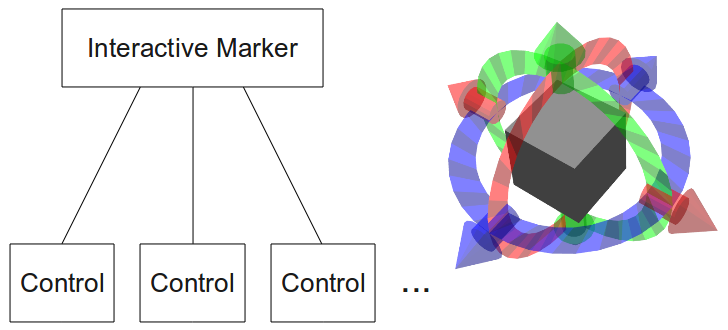
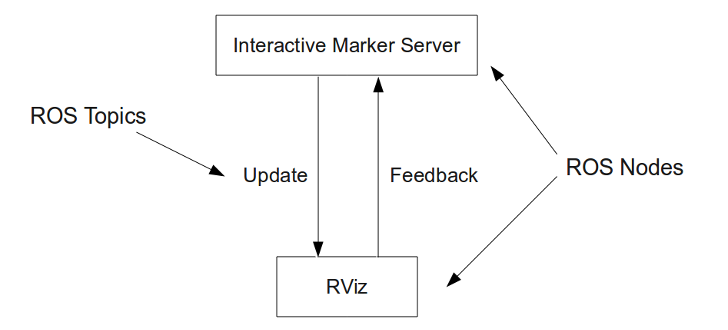
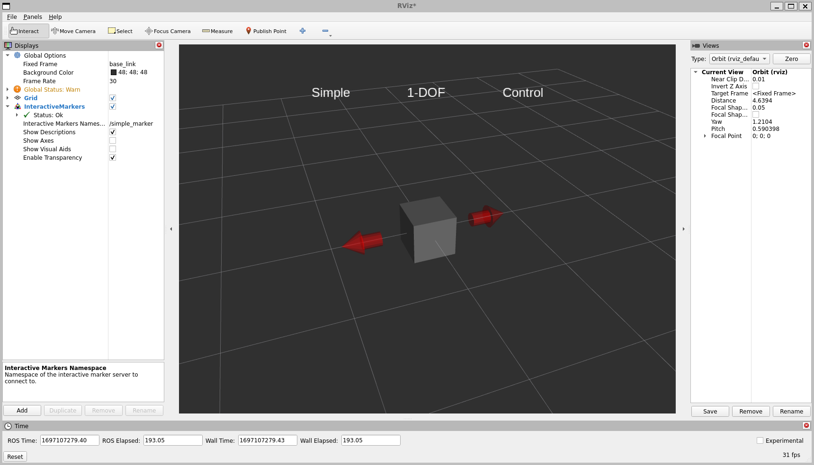
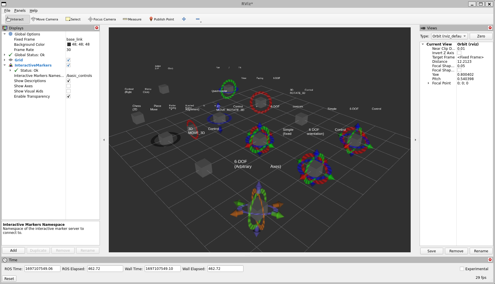
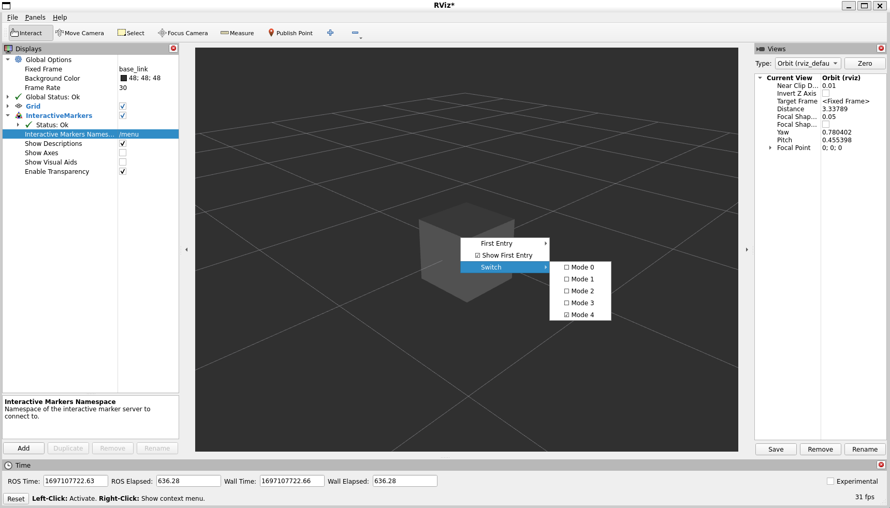
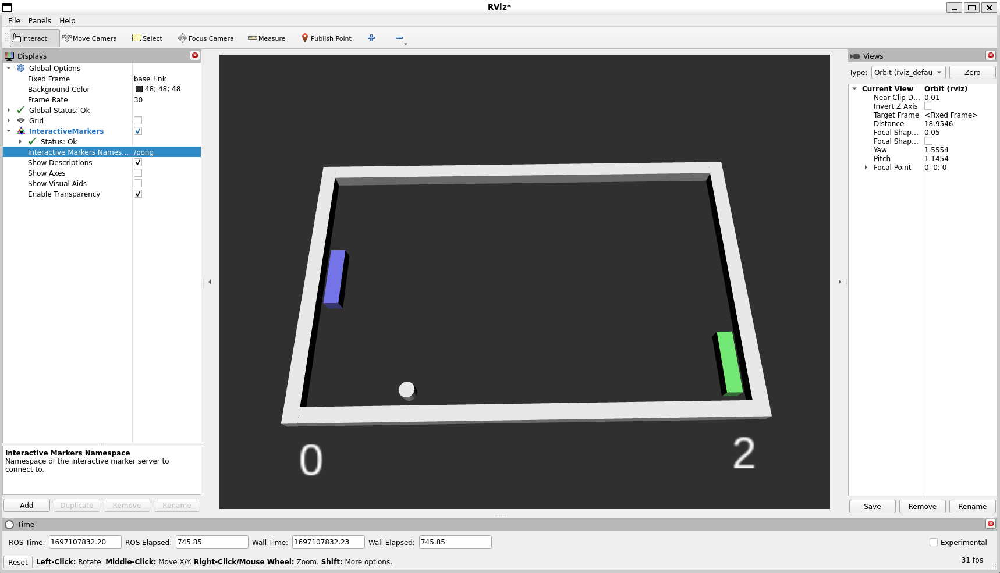
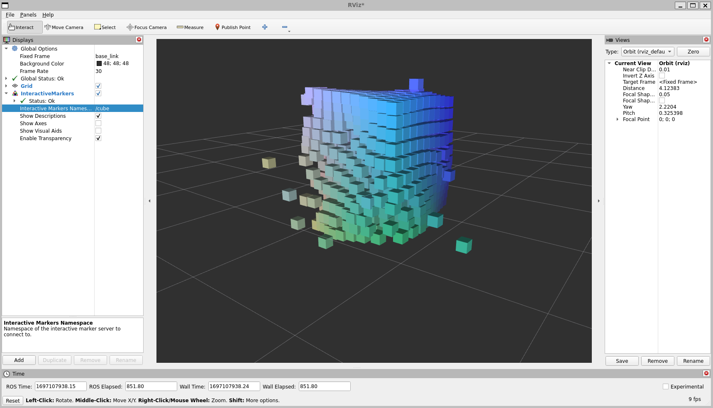

.. redirect-from::

    Tutorials/RViz/Interactive-marker-getting-started

.. _RVizINTMarkerGettingStarted:

Interactive Markers: Getting Started
====================================

**Goal:** This tutorial explains what Interactive Marker are and teaches you some of the basic concepts.

**Tutorial level:** Intermediate

**Time:** 10 Minutes

.. contents:: Contents
   :depth: 2
   :local:

Backround
---------
Interactive markers are similar to the "regular" markers described in the previous tutorials,
however they allow the user to interact with them by changing their position or rotation,
clicking on them or selecting something from a context menu assigned to each marker.

Prerequisites
-------------
Before starting this tutorial, you should first complete the previous RViz tutorials

Documentation
-------------
Interactive Markers are represented by the
`visualization_msgs/msg/InteractiveMarker <https://docs.ros2.org/latest/api/visualization_msgs/msg/InteractiveMarker.html>`__ message,
which contains a context menu and several controls
(`visualization_msgs/msg/InteractiveMarkerControl <https://docs.ros2.org/latest/api/visualization_msgs/msg/InteractiveMarkerControl.html>`__).
The controls define the different visual parts of the interactive marker,
can consist of several regular markers (`visualization_msgs/msg/Marker <https://docs.ros2.org/latest/api/visualization_msgs/msg/Marker.html>`__)
and can each have a different function.

If you want to create a node providing a set of interactive markers, you need to instantiate an ``InteractiveMarkerServer`` object.
This will handle the connection to the client (usually RViz) and make sure that all changes
you make are being transmitted and that your application is being notified of all the actions the user performs on the interactive markers.

To find out more about how to use interactive markers, refer to this and the following tutorials. The source code used can be found in the `visualization_tutorials <https://github.com/ros-visualization/visualization_tutorials/tree/ros2>`__ repository.

The messages used to describe interactive markers themselves contain a detailed description of all their parameters.
Of main interest are:

* `visualization_msgs/msg/InteractiveMarker <https://docs.ros2.org/latest/api/visualization_msgs/msg/InteractiveMarker.html>`__
* `visualization_msgs/msg/InteractiveMarkerControl <https://docs.ros2.org/latest/api/visualization_msgs/msg/InteractiveMarkerControl.html>`__
* `visualization_msgs/msg/InteractiveMarkerFeedback <https://docs.ros2.org/latest/api/visualization_msgs/msg/InteractiveMarkerFeedback.html>`__

The recommended way to create context menus is using the
`MenuHandler <https://docs.ros.org/en/api/interactive_markers/html/classinteractive__markers_1_1MenuHandler.html>`__ interface,
so you will not have to deal with the underlying messages.

The interactive_marker_tutorials Package
----------------------------------------
The best way to understand what interactive markers do is by trying out the examples contained in the
`visualization_tutorials <https://github.com/ros-visualization/visualization_tutorials/tree/ros2/interactive_marker_tutorials>`__ package.
It contains five examples: :ref:`simple_marker <VizTutorials_simple_marker>`, :ref:`basic_controls <VizTutorials_basic_controls>`,
:ref:`menu <VizTutorials_menu>`, :ref:`pong <VizTutorials_pong>` and :ref:`cube <VizTutorials_cube>`.

1 How to run the tutorials
^^^^^^^^^^^^^^^^^^^^^^^^^^
The procedure to run the tutorials is basically the same in all case. E.g. to run ``basic_controls``, open a terminal and type:

.. code-block:: console

    ros2 run interactive_marker_tutorials basic_controls

This will start the node which contains the interactive marker server. Then, start RViz by running the following command in a separate terminal:

.. code-block:: console

    ros2 run rviz2 rviz2

In RViz do the following:

* Set the fixed frame to ``/base_link``.
* Add an 'Interactive Markers' display by clicking on 'Add' in the 'Displays' panel.
* Set the update topic of this display to '/basic_controls'. This should immediately bring up several grey cubes in rviz.
* Now select 'Interact' in the tool panel. This will enable all interactive elements in the main view, which will bring up additional arrows and rings around the boxes. You can left-click on these controls and in some case on the box itself to change the pose of each interactive marker. Some markers have a context menu which you can access by right-clicking on them.
* Makr sure you have a 'Grid' display. This is a useful visual clue for perceiving how the markers move in space while you drag them.

.. _VizTutorials_simple_marker:

2 simple_marker
^^^^^^^^^^^^^^^
| `C++ Code  <https://github.com/ros-visualization/visualization_tutorials/blob/ros2/interactive_marker_tutorials/src/simple_marker.cpp>`__
| `Python Code  <https://github.com/ros-visualization/visualization_tutorials/blob/ros2/interactive_marker_tutorials/scripts/simple_marker.py>`__

This example will display a minimalist marker in RViz. See Writing a :doc:`Writing a Simple Interactive Marker Server <../Interactive-marker-writing-a-simple-interactive-marker-server/Interactive-marker-writing-a-simple-interactive-marker-server>` for more details.

.. _VizTutorials_basic_controls:

3 basic_controls
^^^^^^^^^^^^^^^^
| `C++ Code  <https://github.com/ros-visualization/visualization_tutorials/blob/ros2/interactive_marker_tutorials/src/basic_controls.cpp>`__
| `Python Code  <https://github.com/ros-visualization/visualization_tutorials/blob/ros2/interactive_marker_tutorials/scripts/basic_controls.py>`__

Displays a selection of interactive markers that can be manipulated in different ways. It is explained in more detail in the :doc:`Basic controls <../Interactive-marker-basic-controls/Interactive-marker-basic-controls>` tutorial.

.. _VizTutorials_menu:

4 menu
^^^^^^
| `C++ Code  <https://github.com/ros-visualization/visualization_tutorials/blob/ros2/interactive_marker_tutorials/src/menu.cpp>`__
| `Python Code  <https://github.com/ros-visualization/visualization_tutorials/blob/ros2/interactive_marker_tutorials/scripts/menu.py>`__

Shows how to manage a more complex context menu associated with an interactive marker, including hiding entries and adding check boxes.

.. _VizTutorials_pong:

5 pong
^^^^^^
| `C++ Code  <https://github.com/ros-visualization/visualization_tutorials/blob/ros2/interactive_marker_tutorials/src/pong.cpp>`__

Lets you play the classic arcade game with one or two players in rviz. It is meant to (distract you from your work) demonstrate the two-way interaction between an interactive marker server and multiple clients.

If you open two instances of RViz on different computers that are connected to the same pong server, you can play against each other. Otherwise, the computer will take control of the unused paddle.

.. _VizTutorials_cube:

6 cube
^^^^^^
| `C++ Code  <https://github.com/ros-visualization/visualization_tutorials/blob/ros2/interactive_marker_tutorials/src/cube.cpp>`__
| `Python Code  <https://github.com/ros-visualization/visualization_tutorials/blob/ros2/interactive_marker_tutorials/scripts/cube.py>`__

Demonstrates how to procedurally create and manage a large number of interactive markers.

