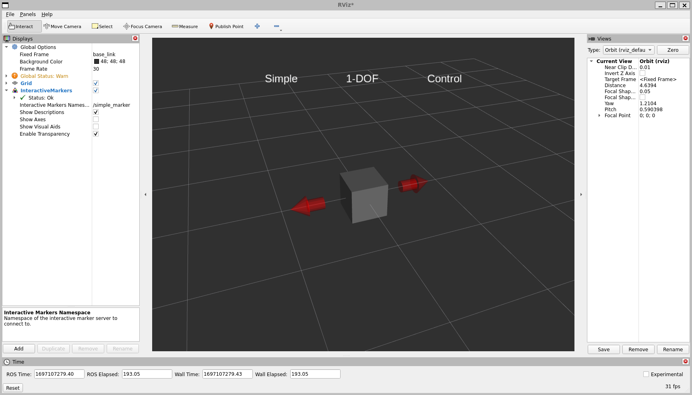

.. redirect-from::

    Tutorials/RViz/Interactive-marker-writing-a-simple-interactive-marker-server

.. _RVizINTMarkerServer:

Interactive Markers: Writing a Simple Interactive Marker Server (C++)
=====================================================================

**Goal:** This tutorial explains how to setup a minimalist server which manages a single interactive marker.

**Tutorial level:** Intermediate

**Time:** 10 Minutes

.. contents:: Contents
   :depth: 2
   :local:

Backround
---------
If you run the ``simple_marker`` example from ``interactive_marker_tutorials`` as described in the previous tutorial, you will see this in RViz:

It shows the single interactive marker provided by the server node. Click on the arrow to move the box.
What you will also see is that the server node prints out the current position of the marker each time you change it in RViz.
Using this example we are going to look at how the interactive marker server handels interactive marker.

Prerequisites
-------------
Before starting this tutorial, you should first complete the previous RViz tutorials

The simple_marker example explained
-----------------------------------
This is the code of the server node is located `here  <https://github.com/ros-visualization/visualization_tutorials/blob/ros2/interactive_marker_tutorials/src/simple_marker.cpp>`__.

.. code-block:: C++

    #include <memory>
    #include <sstream>

    #include "interactive_markers/interactive_marker_server.hpp"
    #include "rclcpp/rclcpp.hpp"
    #include "visualization_msgs/msg/interactive_marker.hpp"
    #include "visualization_msgs/msg/interactive_marker_control.hpp"
    #include "visualization_msgs/msg/marker.hpp"

    void processFeedback(
    const visualization_msgs::msg::InteractiveMarkerFeedback::ConstSharedPtr & feedback,
    rclcpp::Logger logger)
    {
        std::ostringstream oss;
        oss << feedback->marker_name << " is now at " << feedback->pose.position.x << ", " <<
            feedback->pose.position.y << ", " << feedback->pose.position.z;
        RCLCPP_INFO(logger, "%s", oss.str().c_str());
    }

    int main(int argc, char ** argv)
    {
        rclcpp::init(argc, argv);

        auto node = std::make_shared<rclcpp::Node>("simple_marker_node");
        rclcpp::executors::SingleThreadedExecutor executor;
        executor.add_node(node);

        // create an interactive marker server on the namespace "simple_marker"
        interactive_markers::InteractiveMarkerServer server("simple_marker", node);

        // create an interactive marker for our server
        visualization_msgs::msg::InteractiveMarker interactive_marker;
        interactive_marker.header.frame_id = "base_link";
        interactive_marker.header.stamp = node->get_clock()->now();
        interactive_marker.name = "my_marker";
        interactive_marker.description = "Simple 1-DOF Control";

        // create a grey box marker
        visualization_msgs::msg::Marker box_marker;
        box_marker.type = visualization_msgs::msg::Marker::CUBE;
        box_marker.scale.x = 0.45;
        box_marker.scale.y = 0.45;
        box_marker.scale.z = 0.45;
        box_marker.color.r = 0.5;
        box_marker.color.g = 0.5;
        box_marker.color.b = 0.5;
        box_marker.color.a = 1.0;

        // create a non-interactive control which contains the box
        visualization_msgs::msg::InteractiveMarkerControl box_control;
        box_control.always_visible = true;
        box_control.markers.push_back(box_marker);

        // add the control to the interactive marker
        interactive_marker.controls.push_back(box_control);

        // create a control which will move the box
        // this control does not contain any markers,
        // which will cause RViz to insert two arrows
        visualization_msgs::msg::InteractiveMarkerControl rotate_control;
        rotate_control.name = "move_x";
        rotate_control.interaction_mode = visualization_msgs::msg::InteractiveMarkerControl::MOVE_AXIS;

        // add the control to the interactive marker
        interactive_marker.controls.push_back(rotate_control);

        // add the interactive marker to our collection &
        // tell the server to call processFeedback() when feedback arrives for it
        server.insert(
            interactive_marker, std::bind(&processFeedback, std::placeholders::_1, node->get_logger()));

        // 'commit' changes and send to all clients
        server.applyChanges();

        RCLCPP_INFO(node->get_logger(), "Ready");

        // start processing callbacks
        executor.spin();

        rclcpp::shutdown();

        return 0;
    }

Examine the code
^^^^^^^^^^^^^^^^
Now let's break down the code, focusing on the functionalities of the Interactive marker server and skipping things that were explained in the previous tutorials.

.. code-block:: C++

    void processFeedback(
        const visualization_msgs::msg::InteractiveMarkerFeedback::ConstSharedPtr & feedback,
        rclcpp::Logger logger)
    {
        std::ostringstream oss;
        oss << feedback->marker_name << " is now at " << feedback->pose.position.x << ", " <<
          feedback->pose.position.y << ", " << feedback->pose.position.z;
        RCLCPP_INFO(logger, "%s", oss.str().c_str());
    }

Define a function ``processFeedback()`` which handles feedback messages from RViz by printing out the position.

.. code-block:: C++

    interactive_markers::InteractiveMarkerServer server("simple_marker", node);

This creates our Interactive marker server wich can handel many markers at the same time.
It is created on the topic namespace ``simple_marker``.

.. code-block:: C++

    visualization_msgs::msg::InteractiveMarker interactive_marker;
    interactive_marker.header.frame_id = "base_link";
    interactive_marker.header.stamp = node->get_clock()->now();
    interactive_marker.name = "my_marker";
    interactive_marker.description = "Simple 1-DOF Control";

Next we create our first ``interactive_marker`` object. It is filled with the standard message header.

.. code-block:: C++

    visualization_msgs::msg::Marker box_marker;
    box_marker.type = visualization_msgs::msg::Marker::CUBE;
    box_marker.scale.x = 0.45;
    box_marker.scale.y = 0.45;
    box_marker.scale.z = 0.45;
    box_marker.color.r = 0.5;
    box_marker.color.g = 0.5;
    box_marker.color.b = 0.5;
    box_marker.color.a = 1.0;

This is a standard ``marker`` object and we use it to define the apparence of the resulting interacitve marker.
In this case a cube, but any type is possible even using a mesh resource.

.. code-block:: C++

    visualization_msgs::msg::InteractiveMarkerControl box_control;
    box_control.always_visible = true;
    box_control.markers.push_back(box_marker);

    // add the control to the interactive marker
    interactive_marker.controls.push_back(box_control);

Next we create a non-interactive control of the basic marker box and add it to the ``interacitve_marker``.
Because of this you can only move the interacitve marker with the provided arrows.

.. code-block:: C++

    visualization_msgs::msg::InteractiveMarkerControl rotate_control;
    rotate_control.name = "move_x";
    rotate_control.interaction_mode = visualization_msgs::msg::InteractiveMarkerControl::MOVE_AXIS;

    // add the control to the interactive marker
    interactive_marker.controls.push_back(rotate_control);

This now creates the control which will move the box, becaue this control does not contain any markers RViz will insert to arrows.
The ``interaction_mode`` controls the degrees of freedom.

.. code-block:: C++

    server.insert(
        interactive_marker, std::bind(&processFeedback, std::placeholders::_1, node->get_logger()));
    // 'commit' changes and send to all clients
    server.applyChanges();

Now we add the interacitve marker to the server and we also pass our callback function with its parameters.

Note that when calling ``insert``, the server object will internally only push the new marker onto a waiting list.
Once you call ``applyChanges()``, it will incorporate it into it's publicly visible set of interactive markers and send it to all connected clients.