Marker: Display types
=====================

**Goal:** This tutorial explains the basic Marker types and how to use them.

**Tutorial level:** Intermediate

**Time:** 15 Minutes

.. contents:: Contents
   :depth: 3
   :local:

Backround
---------
The Markers display allows programmatic addition of various primitive shapes to the 3D view by sending a
`visualization_msgs/msg/Marker <https://github.com/ros2/common_interfaces/blob/rolling/visualization_msgs/msg/Marker.msg>`_ or
`visualization_msgs/msg/MarkerArray <https://github.com/ros2/common_interfaces/blob/rolling/visualization_msgs/msg/MarkerArray.msg>`_ message.

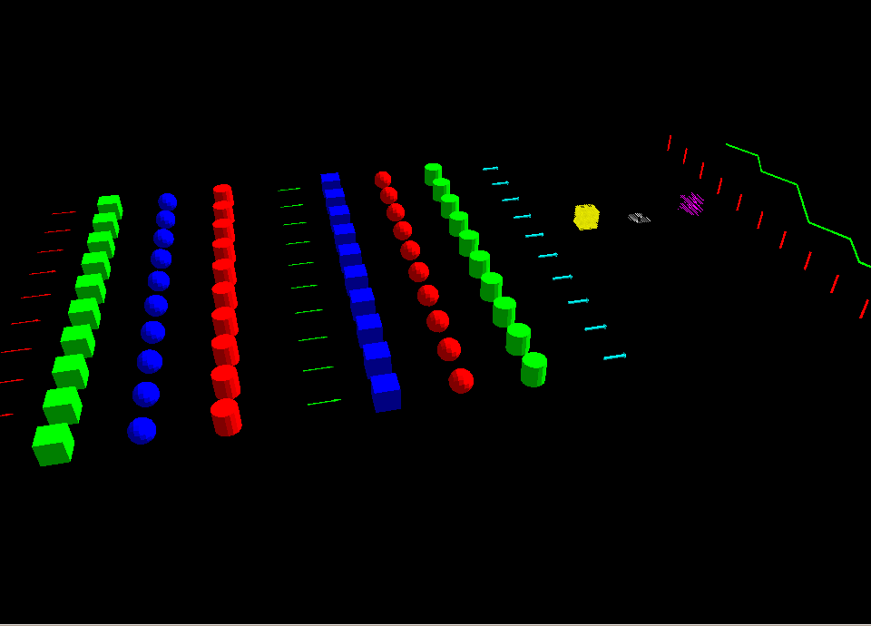

The :doc:`Marker: Sending Basic Shapes <../Markers-Sending-Basic-Shapes-CPP/Markers-Sending-Basic-Shapes-CPP>` tutorial begins a series of tutorials on sending markers.

The Marker Message
------------------
1 Example Usage (C++)
^^^^^^^^^^^^^^^^^^^^^
First we need to create a publisher and set a topic:

.. code-block:: C++

    auto marker_pub = node->create_publisher<visualization_msgs::msg::Marker>("visualization_marker", 1);

After that it is as simple as filling out a `visualization_msgs/msg/Marker <https://github.com/ros2/common_interfaces/blob/rolling/visualization_msgs/msg/Marker.msg>`_
message and publishing it:

.. code-block:: C++

    visualization_msgs::msg::Marker marker;

    marker.header.frame_id = "/my_frame";
    marker.header.stamp = rclcpp::Clock().now();

    marker.ns = "basic_shapes";
    marker.id = 0;

    marker.type = visualization_msgs::msg::Marker::SPHERE;

    marker.action = visualization_msgs::msg::Marker::ADD;

    marker.pose.position.x = 0;
    marker.pose.position.y = 0;
    marker.pose.position.z = 0;
    marker.pose.orientation.x = 0.0;
    marker.pose.orientation.y = 0.0;
    marker.pose.orientation.z = 0.0;
    marker.pose.orientation.w = 1.0;

    marker.scale.x = 1.0;
    marker.scale.y = 1.0;
    marker.scale.z = 1.0;

    marker.color.r = 0.0f;
    marker.color.g = 1.0f;
    marker.color.b = 0.0f;
    marker.color.a = 1.0;   // Don't forget to set the alpha!

    //only if using a MESH_RESOURCE marker type:
    marker.mesh_resource = "package://pr2_description/meshes/base_v0/base.dae";

    marker.lifetime = rclcpp::Duration::from_nanoseconds(0);

    marker_pub->publish(marker);

There is also a `visualization_msgs/msg/MarkerArray <https://github.com/ros2/common_interfaces/blob/rolling/visualization_msgs/msg/MarkerArray.msg>`_ message, which lets you publish many markers at once.

2 Message Parameters
^^^^^^^^^^^^^^^^^^^^
* ``ns``:

    Namespace for these markers. This plus the id form a unique identifier.

* ``id``:

    Unique id assigned to this marker. It is your responsibility to keep these unique within your namespace.

* ``type``:

    Type of marker (Arrow, Sphere, ...). The available types are specified in the message definition.

* ``action``:

    0 = add/modify, 1 = (deprecated), 2 = delete, 3 = deleteall

* ``pose``:

    Pose marker, specified as x/y/z position and x/y/z/w quaternion orientation.

* ``scale``:

    Scale of the marker. Applied before the position/orientation. A scale of [1,1,1] means the object will be 1m by 1m by 1m.

* ``color``:

    Color of the object, specified as r/g/b/a, with values in the range of [0, 1]. Don't forget to set a or it will default to 0 and be invisible.

* ``points``:

    Only used for markers of type ``Points``, ``Line strips``, and ``Line`` / ``Cube`` / ``Sphere`` -lists.
    It's also used for the Arrow type, if you want to specify the arrow start and end points.

* ``colors``:

    Only used for markers that use the points member, specifies per-vertex color (no alpha yet).

* ``lifetime``:

    A duration value used to automatically delete the marker after this period of time.
    The countdown resets if another marker of the same ``namespace`` / ``id`` is received.

* ``frame_locked``:

    Tells RViz to retransform the marker into the current location of the specified frame every update cycle.

* ``text``:

    The text string used for the ``TEXT_VIEW_FACING`` marker type

* ``mesh_resource``:

    The resource location for the ``MESH_RESOURCE`` marker type. Can be any mesh type supported by RViz (.stl or Ogre .mesh in 1.0, with the addition of COLLADA in 1.1).
    The format is the URI-form used by resource_retriever, including the package:// syntax.

3 Object types
^^^^^^^^^^^^^^

.. _RVizMarkerObjectTypes:

3.1 Arrow (ARROW=0)
~~~~~~~~~~~~~~~~~~~

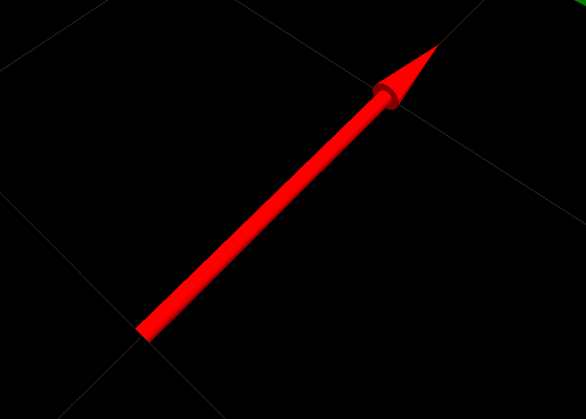

The arrow type provides two different ways of specifying where the arrow should begin/end:

* ``Position/Orientation``:

    Pivot point is around the tip of its tail. Identity orientation points it along the +X axis. ``scale.x`` is the arrow length, ``scale.y`` is the arrow width and ``scale.z`` is the arrow height.

* ``Start/End Points``:

    You can also specify a start/end point for the arrow, using the points member. If you put points into the points member, it will assume you want to do things this way.

    * The point at index 0 is assumed to be the start point, and the point at index 1 is assumed to be the end.
    * ``scale.x`` is the shaft diameter, and ``scale.y`` is the head diameter. If ``scale.z`` is not zero, it specifies the head length.

3.2 Cube (CUBE=1)
~~~~~~~~~~~~~~~~~

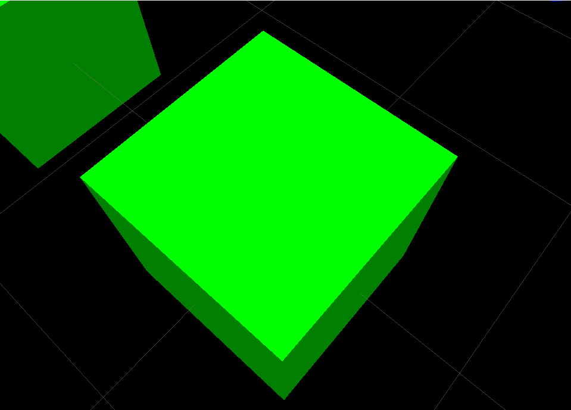

Pivot point is at the center of the cube.

3.3 Sphere (SPHERE=2)
~~~~~~~~~~~~~~~~~~~~~

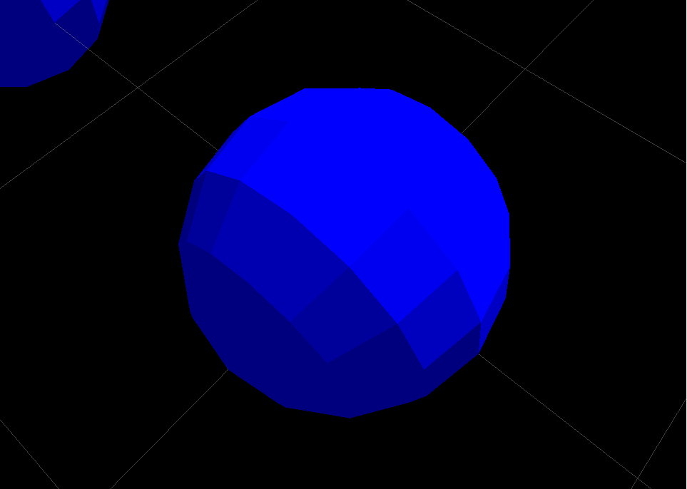

Pivot point is at the center of the sphere.

``scale.x`` is diameter in x direction, ``scale.y`` in y direction, ``scale.z`` in z direction.
By setting these to different values you get an ellipsoid instead of a sphere.

3.4 Cylinder (CYLINDER=3)
~~~~~~~~~~~~~~~~~~~~~~~~~

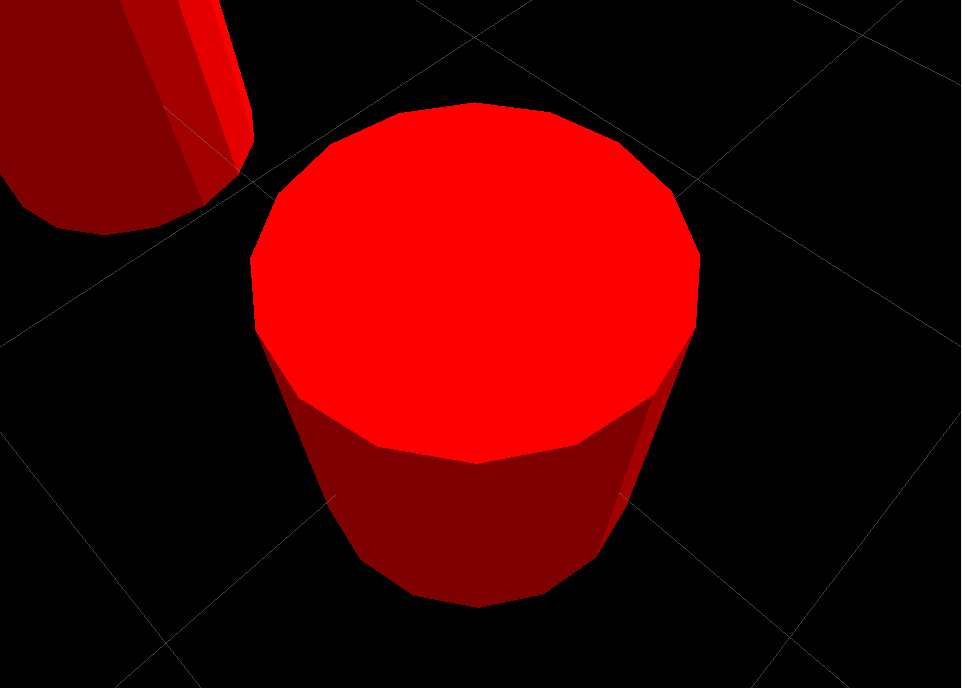

Pivot point is at the center of the cylinder.

``scale.x`` is diameter in x direction, ``scale.y`` in y direction, by setting these to different values you get an ellipse instead of a circle.
Use ``scale.z`` to specify the height.

3.5 Line Strip (LINE_STRIP=4)
~~~~~~~~~~~~~~~~~~~~~~~~~~~~~

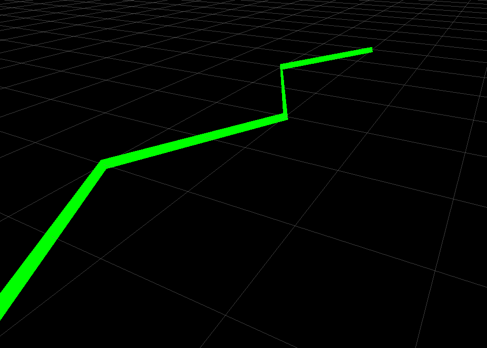

Line strips use the points member of the `visualization_msgs/msg/Marker <https://github.com/ros2/common_interfaces/blob/rolling/visualization_msgs/msg/Marker.msg>`_ message.
It will draw a line between every two consecutive points, so 0-1, 1-2, 2-3, 3-4, 4-5...

Line strips also have some special handling for scale: only ``scale.x`` is used and it controls the width of the line segments.

Note that ``pose`` is still used (the points in the line will be transformed by them), and the lines will be correct relative to the ``frame id`` specified in the header.

3.6 Line List (LINE_LIST=5)
~~~~~~~~~~~~~~~~~~~~~~~~~~~

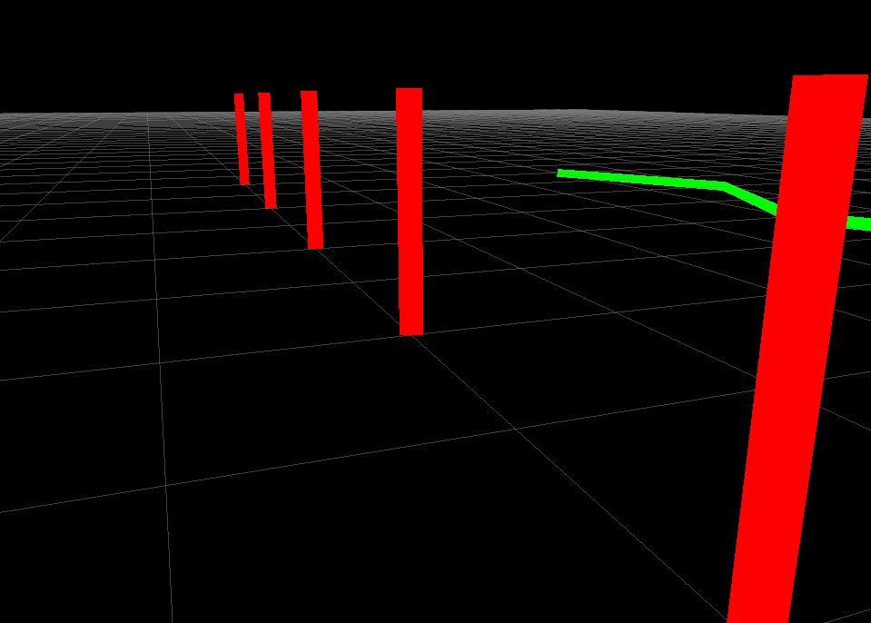

Line lists use the points member of the `visualization_msgs/msg/Marker <https://github.com/ros2/common_interfaces/blob/rolling/visualization_msgs/msg/Marker.msg>`_ message. It will draw a line between each pair of points, so 0-1, 2-3, 4-5, ...

Line lists also have some special handling for scale: only ``scale.x`` is used and it controls the width of the line segments.

Note that ``pose`` is still used (the points in the line will be transformed by them), and the lines will be correct relative to the ``frame id`` specified in the header.

3.7 Cube List (CUBE_LIST=6)
~~~~~~~~~~~~~~~~~~~~~~~~~~~

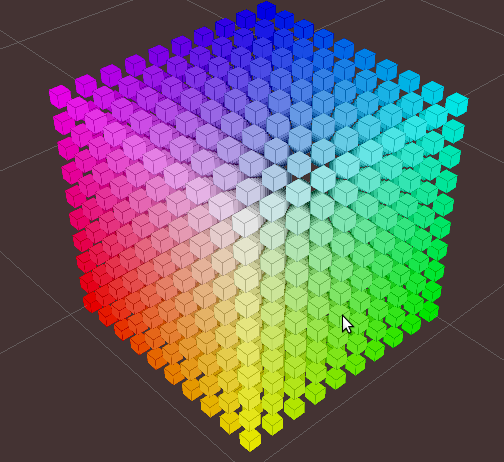

A cube list is a list of cubes with all the same properties except their positions.
Using this object type instead of a `visualization_msgs/msg/MarkerArray <https://github.com/ros2/common_interfaces/blob/rolling/visualization_msgs/msg/MarkerArray.msg>`_ allows RViz to batch-up rendering,
which causes them to render much faster.
The caveat is that they all must have the same scale.

The ``points`` member of the `visualization_msgs/msg/Marker <https://github.com/ros2/common_interfaces/blob/rolling/visualization_msgs/msg/Marker.msg>`_ message is used for the position of each cube.

3.8 Sphere List (SPHERE_LIST=7)
~~~~~~~~~~~~~~~~~~~~~~~~~~~~~~~

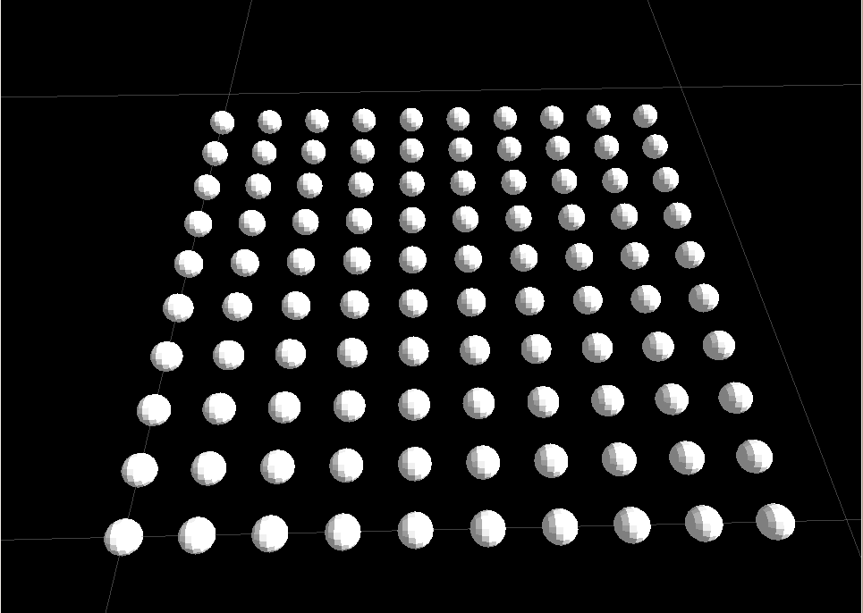

A sphere list is a list of spheres with all the same properties except their positions.
Using this object type instead of a `visualization_msgs/msg/MarkerArray <https://github.com/ros2/common_interfaces/blob/rolling/visualization_msgs/msg/MarkerArray.msg>`_ allows rviz to batch-up rendering,
which causes them to render much faster.
The caveat is that they all must have the same scale.

The ``points`` member of the `visualization_msgs/msg/Marker <https://github.com/ros2/common_interfaces/blob/rolling/visualization_msgs/msg/Marker.msg>`_ message is used for the position of each sphere.

Note that ``pose`` is still used (the ``points`` in the line will be transformed by them), and the lines will be correct relative to the ``frame id`` specified in the header.

3.9 Points (POINTS=8)
~~~~~~~~~~~~~~~~~~~~~

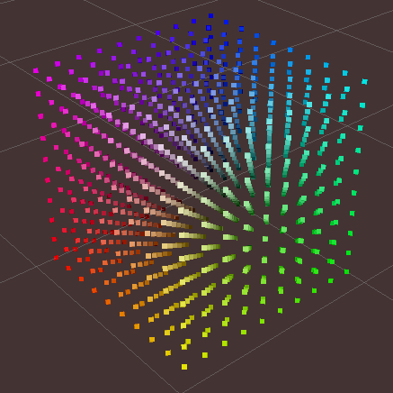

Uses the ``points`` member of the `visualization_msgs/msg/Marker <https://github.com/ros2/common_interfaces/blob/rolling/visualization_msgs/msg/Marker.msg>`_ message.

``Points`` have some special handling for scale: ``scale.x`` is point width, ``scale.y`` is point height

Note that ``pose`` is still used (the ``points`` in the line will be transformed by them), and the lines will be correct relative to the ``frame id`` specified in the header.

3.10 View-Oriented Text (TEXT_VIEW_FACING=9)
~~~~~~~~~~~~~~~~~~~~~~~~~~~~~~~~~~~~~~~~~~~~

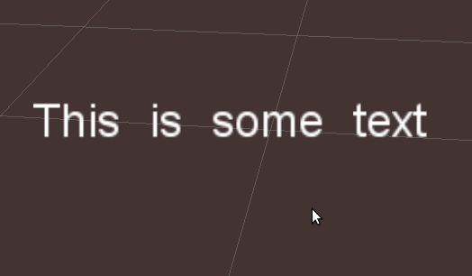

This marker displays text in a 3D spot in the world.
The text always appears oriented correctly to the view. Uses the ``text`` field in the marker.

Only ``scale.z`` is used. ``scale.z`` specifies the height of an uppercase "A".

3.11 Mesh Resource (MESH_RESOURCE=10)
~~~~~~~~~~~~~~~~~~~~~~~~~~~~~~~~~~~~~

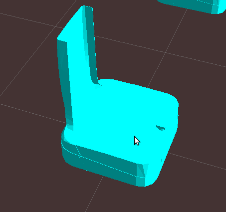

Uses the ``mesh_resource`` field in the marker.
Can be any mesh type supported by RViz (binary .stl or Ogre .mesh in 1.0, with the addition of COLLADA (.dae) in 1.1).
The format is the URI-form used by resource_retriever, including the ``package://`` syntax.

An example of a mesh an its use is:

.. code-block:: C++

    marker.type = visualization_msgs::Marker::MESH_RESOURCE;
    marker.mesh_resource = "package://pr2_description/meshes/base_v0/base.dae";

Scale on a mesh is relative.
A scale of (1.0, 1.0, 1.0) means the mesh will display as the exact size specified in the mesh file.
A scale of (1.0, 1.0, 2.0) means the mesh will show up twice as tall, but the same width/depth.

If the ``mesh_use_embedded_materials`` flag is set to true and the mesh is of a type which supports embedded materials (such as COLLADA),
the material defined in that file will be used instead of the color defined in the marker.

Since version [1.8], even when ``mesh_use_embedded_materials`` is true,
if the marker color is set to anything other than r=0,g=0,b=0,a=0 the marker color and alpha will be used to tint the mesh with the embedded material.

3.12 Triangle List (TRIANGLE_LIST=11)
~~~~~~~~~~~~~~~~~~~~~~~~~~~~~~~~~~~~~

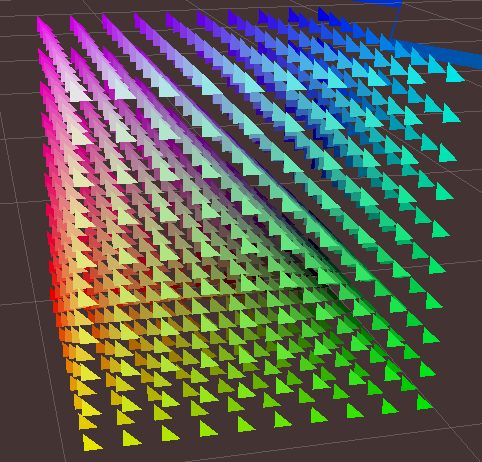

Uses the points and optionally colors members.
Every set of 3 points is treated as a triangle, so indices 0-1-2, 3-4-5, etc.

Note that ``pose`` and ``scale`` are still used (the points in the line will be transformed by them),
and the lines will be correct relative to the ``frame id`` specified in the header.

4 Rendering Complexity Notes
^^^^^^^^^^^^^^^^^^^^^^^^^^^^
A single marker is always less expensive to render than many markers.
For example, a single cube list can handle thousands of cubes, where we will not be able to render thousands of individual cube markers.