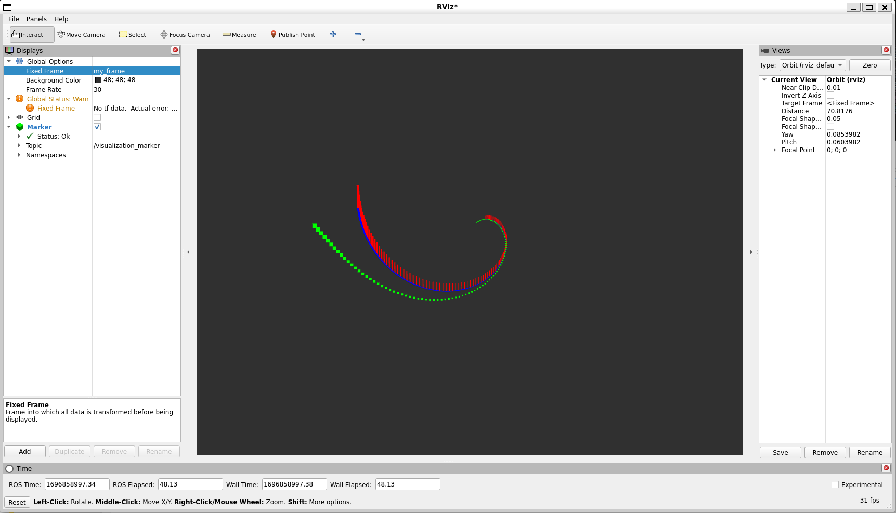

.. redirect-from::

    Tutorials/RViz/Marker-Points-and-Lines-CPP

Marker: Points and Lines CPP
============================

**Goal:** Teaches how to use the `visualization_msgs/Marker <http://docs.ros.org/en/api/visualization_msgs/html/msg/Marker.html>`__ to send points and lines to RViz

**Tutorial level:** Intermediate

**Time:** TBD

.. contents:: Contents
   :depth: 2
   :local:

Backround
---------
In the :doc:`Marker: Sending Basic Shapes  <../Markers-Sending-Basic-Shapes-CPP/Markers-Sending-Basic-Shapes-CPP>` you learned how to send simple shapes to rviz using visualization markers.
You can send more than just simple shapes though, and this tutorial will introduce you to the POINTS, LINE_STRIP and LINE_LIST marker types.
For a full list of types, see the `Marker Display <http://wiki.ros.org/rviz/DisplayTypes/Marker#Object_Types>`__ page.
The POINTS, LINE_STRIP and LINE_LIST markers all use the points member of the visualization_msgs/msg/Marker message.
The POINTS type places a point at each point added. The LINE_STRIP type uses each point as a vertex in a connected set of lines, where point 0 is connected to point 1, 1 to 2, 2 to 3, etc.
The LINE_LIST type creates unconnected lines out of each pair of points, i.e. point 0 to 1, 2 to 3, etc.

Prerequisites
-------------
Before starting this tutorial, you should first complete the following tutorial:
- :doc:`Marker: Sending Basic Shapes  <../Markers-Sending-Basic-Shapes-CPP/Markers-Sending-Basic-Shapes-CPP>`

The Code
--------

1 Getting the package
^^^^^^^^^^^^^^^^^^^^^
Use the package that was already created in :doc:`Marker: Sending Basic Shapes  <../Markers-Sending-Basic-Shapes-CPP/Markers-Sending-Basic-Shapes-CPP>` and build upon that.

2 Creating Points and Lines
^^^^^^^^^^^^^^^^^^^^^^^^^^^
Navigate into your ``ros2_ws/src/visualization_marker_tutorials/src`` and add a new file called ``points_and_lines.cpp``.
Open this file using your preferred text editor and add the following code.

.. code-block:: C++

    #define _USE_MATH_DEFINES

    #include <chrono>
    #include <cmath>
    #include <memory>

    #include "rclcpp/rclcpp.hpp"
    #include "geometry_msgs/msg/point.hpp"
    #include "visualization_msgs/msg/marker.hpp"

    int main(int argc, char ** argv)
    {
        rclcpp::init(argc, argv);
        auto node = rclcpp::Node::make_shared("points_and_lines");
        auto marker_pub = node->create_publisher<visualization_msgs::msg::Marker>(
            "visualization_marker", 10);
        rclcpp::Rate loop_rate(30);

        float f = 0.0f;
        while (rclcpp::ok()) {
            visualization_msgs::msg::Marker points, line_strip, line_list;
            points.header.frame_id = line_strip.header.frame_id = line_list.header.frame_id = "/my_frame";
            points.header.stamp = line_strip.header.stamp = line_list.header.stamp = rclcpp::Clock().now();
            points.ns = line_strip.ns = line_list.ns = "points_and_lines";
            points.action = line_strip.action = line_list.action = visualization_msgs::msg::Marker::ADD;

            points.id = 0;
            line_strip.id = 1;
            line_list.id = 2;

            points.type = visualization_msgs::msg::Marker::POINTS;
            line_strip.type = visualization_msgs::msg::Marker::LINE_STRIP;
            line_list.type = visualization_msgs::msg::Marker::LINE_LIST;

            // POINTS markers use x and y scale for width/height respectively
            points.scale.x = 0.2;
            points.scale.y = 0.2;

            // LINE_STRIP/LINE_LIST markers use only the x component of scale, for the line width
            line_strip.scale.x = 0.1;
            line_list.scale.x = 0.1;

            // Points are green
            points.color.g = 1.0f;
            points.color.a = 1.0;

            // Line strip is blue
            line_strip.color.b = 1.0;
            line_strip.color.a = 1.0;

            // Line list is red
            line_list.color.r = 1.0;
            line_list.color.a = 1.0;

            // Create the vertices for the points and lines
            for (uint32_t i = 0; i < 100; ++i) {
                float y = 5 * sin(f + i / 100.0f * 2 * M_PI);
                float z = 5 * cos(f + i / 100.0f * 2 * M_PI);

                geometry_msgs::msg::Point p;
                p.x = (int32_t)i - 50;
                p.y = y;
                p.z = z;

                points.points.push_back(p);
                line_strip.points.push_back(p);

                // The line list needs two points for each line
                line_list.points.push_back(p);
                p.z += 1.0;
                line_list.points.push_back(p);
            }

            marker_pub->publish(points);
            marker_pub->publish(line_strip);
            marker_pub->publish(line_list);

            loop_rate.sleep();

            f += 0.04f;
        }
    }

Now edit the CMakeLists.txt file in your package to look like this:

.. code-block:: console

   cmake_minimum_required(VERSION 3.8)
    project(visualization_marker_tutorials)

    # Default to C++17
    if(NOT CMAKE_CXX_STANDARD)
    set(CMAKE_CXX_STANDARD 17)
    endif()

    if(CMAKE_COMPILER_IS_GNUCXX OR CMAKE_CXX_COMPILER_ID MATCHES "Clang")
    add_compile_options(-Wall -Wextra -Wpedantic)
    endif()

    find_package(ament_cmake REQUIRED)
    find_package(rclcpp REQUIRED)
    find_package(geometry_msgs REQUIRED)
    find_package(visualization_msgs REQUIRED)

    ament_export_dependencies(
    rclcpp
    geometry_msgs
    visualization_msgs)

    add_executable(basic_shapes src/basic_shapes.cpp)
    ament_target_dependencies(basic_shapes
    "rclcpp"
    "visualization_msgs")

    add_executable(points_and_lines src/points_and_lines.cpp)
    ament_target_dependencies(points_and_lines
    "rclcpp"
    "geometry_msgs"
    "visualization_msgs")

    if(BUILD_TESTING)
    find_package(ament_lint_auto REQUIRED)
    ament_lint_auto_find_test_dependencies()
    endif()

    install(TARGETS
    basic_shapes
    points_and_lines
    RUNTIME DESTINATION lib/${PROJECT_NAME}
    )

    ament_package()

Next add one more line to the package.xml:

.. code-block:: xml

    <depend>geometry_msgs</depend>

2.1 Examine the code
~~~~~~~~~~~~~~~~~~~~
Now let's break down the code, skipping things that were explained in the previous tutorial.
The overall effect created is a rotating helix with lines sticking upwards from each vertex.

.. code-block:: C++

    visualization_msgs::msg::Marker points, line_strip, line_list;
    points.header.frame_id = line_strip.header.frame_id = line_list.header.frame_id = "/my_frame";
    points.header.stamp = line_strip.header.stamp = line_list.header.stamp = rclcpp::Clock().now();
    points.ns = line_strip.ns = line_list.ns = "points_and_lines";
    points.action = line_strip.action = line_list.action = visualization_msgs::msg::Marker::ADD;

Here we create three visualization_msgs/msg/Marker messages and initialize all of their shared data.
By default, the marker message contains a pose with a geometry_msgs/msg/Quaternion that is initialized to the identity quaternion.

.. code-block:: C++

    points.id = 0;
    line_strip.id = 1;
    line_list.id = 2;

We assign three different IDs to the three markers. The use of the points_and_lines namespace ensures they won't collide with other broadcasters.

.. code-block:: C++

    points.type = visualization_msgs::msg::Marker::POINTS;
    line_strip.type = visualization_msgs::msg::Marker::LINE_STRIP;
    line_list.type = visualization_msgs::msg::Marker::LINE_LIST;

Here we set the marker types to POINTS, LINE_STRIP and LINE_LIST.

.. code-block:: C++

    // POINTS markers use x and y scale for width/height respectively
    points.scale.x = 0.2;
    points.scale.y = 0.2;

    // LINE_STRIP/LINE_LIST markers use only the x component of scale, for the line width
    line_strip.scale.x = 0.1;
    line_list.scale.x = 0.1;

The scale member means different things for these marker types.
The POINTS marker uses the x and y members for width and height respectively, while the LINE_STRIP and LINE_LIST markers only use the x component, which defines the line width.
Scale values are in meters.

.. code-block:: C++

    // Points are green
    points.color.g = 1.0f;
    points.color.a = 1.0;

    // Line strip is blue
    line_strip.color.b = 1.0;
    line_strip.color.a = 1.0;

    // Line list is red
    line_list.color.r = 1.0;
    line_list.color.a = 1.0;

Here we set the points to green, the line strip to blue, and the line list to red.

.. code-block:: C++

    // Create the vertices for the points and lines
    for (uint32_t i = 0; i < 100; ++i) {
      float y = 5 * sin(f + i / 100.0f * 2 * M_PI);
      float z = 5 * cos(f + i / 100.0f * 2 * M_PI);

      geometry_msgs::msg::Point p;
      p.x = (int32_t)i - 50;
      p.y = y;
      p.z = z;

      points.points.push_back(p);
      line_strip.points.push_back(p);

      // The line list needs two points for each line
      line_list.points.push_back(p);
      p.z += 1.0;
      line_list.points.push_back(p);
    }

We use sine and cosine to generate a helix. The POINTS and LINE_STRIP markers both require only a point for each vertex, while the LINE_LIST marker requires 2.

4 Build and Run
~~~~~~~~~~~~~~~
You should be able to build the code with:

.. code-block:: console

   cd %TOP_DIR_OF_YOUR_WORKSPACE%
   colcon build --packages-select visualization_marker_tutorials

Now source the setup files:

.. code-block:: console

   source install/setup.bash

Next run the code:

.. code-block:: console

   ros2 run cpp_marker points_and_lines.cpp

5 Viewing the Markers
~~~~~~~~~~~~~~~~~~~~~
Open up a second Terminal and start RViz:

.. code-block:: console

   ros2 run rviz2 rviz2

You should see a rotating helix that looks something like this:

