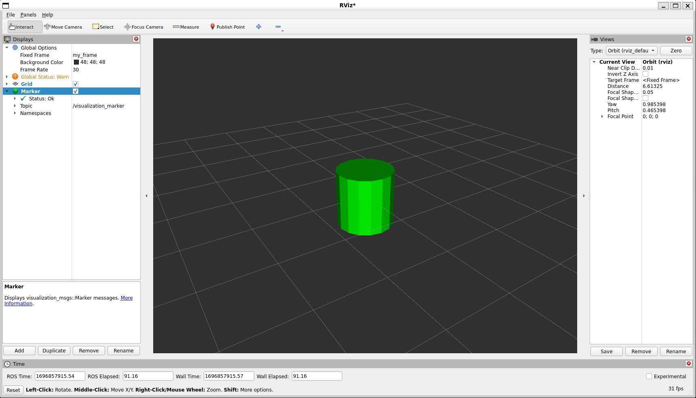

Marker: Sending Basic Shapes (C++)
==================================

**Goal:** Use `visualization_msgs/msg/Marker <https://github.com/ros2/common_interfaces/blob/rolling/visualization_msgs/msg/Marker.msg>`__
messages to send basic shapes (cube, sphere, cylinder, arrow) to RViz.

**Tutorial level:** Intermediate

**Time:** 15 Minutes

.. contents:: Contents
   :depth: 2
   :local:

Backround
---------
Unlike other displays, the :doc:`Marker Display <../Marker-Display-types/Marker-Display-types>` and `colcon <https://colcon.readthedocs.org>`__ lets you visualize data in RViz without RViz knowing anything about interpreting that data.
Instead, primitive objects are sent to the display through `visualization_msgs/msg/Marker <https://github.com/ros2/common_interfaces/blob/rolling/visualization_msgs/msg/Marker.msg>`_ messages, which let you show things like arrows, boxes, spheres and lines.
In this tutorial, you will learn how to send the four basic shapes (boxes, spheres, cylinders, and arrows) to RViz. We'll create a program that sends out a new marker every second, replacing the last one with a different shape.

Prerequisites
-------------
You should have :doc:`ROS 2 <../../../../Installation>` and `colcon <https://colcon.readthedocs.org>`__ installed.

You should know how to set up a :doc:`workspace <../../../Beginner-Client-Libraries/Creating-A-Workspace/Creating-A-Workspace>` and create packages.

Remember to :doc:`source your ROS 2 installation <../../../Beginner-CLI-Tools/Configuring-ROS2-Environment>` first.

The Code
--------

1 Getting the package
^^^^^^^^^^^^^^^^^^^^^
Recall that packages should be created in the ``src`` directory, not the root of the workspace.
So, navigate into your ``ros2_ws/src``, and run the following command to create a new package:

.. code-block:: console

   ros2 pkg create --build-type ament_cmake visualization_marker_tutorials --dependencies rclcpp visualization_msgs --license Apache-2.0

2 Sending Markers
^^^^^^^^^^^^^^^^^
Create a file ``basic_shapes.cpp`` in your ``visualization_marker_tutorials/src`` directory and paste the following code:

.. code-block:: C++

   #include <memory>

   #include "rclcpp/logging.hpp"
   #include "rclcpp/rclcpp.hpp"
   #include "visualization_msgs/msg/marker.hpp"

   int main(int argc, char ** argv)
   {
      rclcpp::init(argc, argv);
      auto node = rclcpp::Node::make_shared("basic_shapes");
      auto marker_pub = node->create_publisher<visualization_msgs::msg::Marker>("visualization_marker", 1);
      rclcpp::Rate loop_rate(1);

      // Set our initial shape type to be a cube
      uint32_t shape = visualization_msgs::msg::Marker::CUBE;

      while (rclcpp::ok()) {
         visualization_msgs::msg::Marker marker;
         // Set the frame ID and timestamp. See the TF tutorials for information on these.
         marker.header.frame_id = "/my_frame";
         marker.header.stamp = rclcpp::Clock().now();

         // Set the namespace and id for this marker. This serves to create a unique ID
         // Any marker sent with the same namespace and id will overwrite the old one
         marker.ns = "basic_shapes";
         marker.id = 0;

         // Set the marker type
         // Initially this is CUBE, and cycles between that and SPHERE, ARROW, and CYLINDER
         marker.type = shape;

         // Set the marker action
         // Options are ADD, DELETE, and DELETEALL
         marker.action = visualization_msgs::msg::Marker::ADD;

         // Set the pose of the marker
         // This is a full 6DOF pose relative to the frame/time specified in the header
         marker.pose.position.x = 0;
         marker.pose.position.y = 0;
         marker.pose.position.z = 0;
         marker.pose.orientation.x = 0.0;
         marker.pose.orientation.y = 0.0;
         marker.pose.orientation.z = 0.0;
         marker.pose.orientation.w = 1.0;

         // Set the scale of the marker -- 1x1x1 here means 1m on a side
         marker.scale.x = 1.0;
         marker.scale.y = 1.0;
         marker.scale.z = 1.0;

         // Set the color -- be sure to set alpha to something non-zero!
         marker.color.r = 0.0f;
         marker.color.g = 1.0f;
         marker.color.b = 0.0f;
         marker.color.a = 1.0;

         // Set the lifetime of the marker -- 0 indicates forever
         marker.lifetime = rclcpp::Duration::from_nanoseconds(0);

         // Publish the marker
         marker_pub->publish(marker);

         // Cycle between different shapes
         switch (shape) {
            case visualization_msgs::msg::Marker::CUBE:
            shape = visualization_msgs::msg::Marker::SPHERE;
            break;
            case visualization_msgs::msg::Marker::SPHERE:
            shape = visualization_msgs::msg::Marker::ARROW;
            break;
            case visualization_msgs::msg::Marker::ARROW:
            shape = visualization_msgs::msg::Marker::CYLINDER;
            break;
            case visualization_msgs::msg::Marker::CYLINDER:
            shape = visualization_msgs::msg::Marker::CUBE;
            break;
         }

         loop_rate.sleep();
      }
   }

Now edit the ``CMakeLists.txt`` file in your package to look like this:

.. code-block:: console

   cmake_minimum_required(VERSION 3.8)
   project(visualization_marker_tutorials)

   # Default to C++17
   if(NOT CMAKE_CXX_STANDARD)
      set(CMAKE_CXX_STANDARD 17)
   endif()

   if(CMAKE_COMPILER_IS_GNUCXX OR CMAKE_CXX_COMPILER_ID MATCHES "Clang")
      add_compile_options(-Wall -Wextra -Wpedantic)
   endif()

   find_package(ament_cmake REQUIRED)
   find_package(rclcpp REQUIRED)
   find_package(geometry_msgs REQUIRED)
   find_package(visualization_msgs REQUIRED)

   ament_export_dependencies(
      rclcpp
      geometry_msgs
      visualization_msgs)

   add_executable(basic_shapes src/basic_shapes.cpp)
   ament_target_dependencies(basic_shapes
      "rclcpp"
      "visualization_msgs")

   if(BUILD_TESTING)
      find_package(ament_lint_auto REQUIRED)
      ament_lint_auto_find_test_dependencies()
   endif()

   install(TARGETS
      basic_shapes
      RUNTIME DESTINATION lib/${PROJECT_NAME}
   )

   ament_package()

2.1 Examine the code
~~~~~~~~~~~~~~~~~~~~
You should have seen ``rclcpp`` include by now.
We also include the `visualization_msgs/msg/Marker <https://github.com/ros2/common_interfaces/blob/rolling/visualization_msgs/msg/Marker.msg>`__ message definition.

.. code-block:: C++

   #include <memory>

   #include "rclcpp/logging.hpp"
   #include "rclcpp/rclcpp.hpp"
   #include "visualization_msgs/msg/marker.hpp"

The next part should look familiar.
We initialize the node with the name ``basic_shapes`` and create a publsiher from this node.
This publisher is initialized with the ``Marker`` message type and topic name ``visualization_marker``.

.. code-block:: C++

   int main(int argc, char ** argv)
   {
      rclcpp::init(argc, argv);
      auto node = rclcpp::Node::make_shared("basic_shapes");
      auto marker_pub = node->create_publisher<visualization_msgs::msg::Marker>("visualization_marker", 1);
      rclcpp::Rate loop_rate(1);

Here we create an integer to keep track of what shape we're going to publish.
The four types we'll be using here all use the
`visualization_msgs/msg/Marker <https://github.com/ros2/common_interfaces/blob/rolling/visualization_msgs/msg/Marker.msg>`__ message in the same way,
so we can simply switch out the shape type to demonstrate the four different shapes.

.. code-block:: C++

    uint32_t shape = visualization_msgs::msg::Marker::CUBE;

Next comes the main part of the program.

First we create a ``visualization_msgs/msg/Marker``, and begin filling it out.
The header here is a ``std_msgs/Header``, which should be familiar if you've done the :doc:`tf tutorials  <../../Tf2/Tf2-Main>`.
We set the ``frame_id`` member to ``/my_frame`` as an example.
In a running system this should be the frame relative to which you want the marker's pose to be interpreted.

.. code-block:: C++

      while (rclcpp::ok()) {
         visualization_msgs::msg::Marker marker;
         // Set the frame ID and timestamp. See the TF tutorials for information on these.
         marker.header.frame_id = "/my_frame";
         marker.header.stamp = rclcpp::Clock().now();

Now the ``namespace`` (ns) and ``id`` are used to create a unique name for this marker.
If a marker message is received with the same ``namespace`` and ``id``, the new marker will replace the old one.

.. code-block:: C++

      // Set the namespace and id for this marker. This serves to create a unique ID
      // Any marker sent with the same namespace and id will overwrite the old one
      marker.ns = "basic_shapes";
      marker.id = 0;

This type field is what specifies the kind of marker we're sending.
The available types are enumerated in the
`visualization_msgs/msg/Marker <https://github.com/ros2/common_interfaces/blob/rolling/visualization_msgs/msg/Marker.msg>`__ message,
for more visual examples see :ref:`Marker: Display types <RVizMarkerObjectTypes>`.
Here we set the type to our shape variable, which will change every time through the loop.

.. code-block:: C++

      marker.type = shape;

The action field is what specifies what to do with the marker.
The options are ``visualization_msgs::msg::Marker::ADD``, ``visualization_msgs::msg::Marker::DELETE`` and ``visualization_msgs::msg::Marker::DELETEALL``.
``ADD`` is something of a misnomer, it really means "create or modify". ``DELETE`` deletes the marker with the corresponding ``namespace`` and ``id``.
``DELETEALL`` deletes all markers in the particular Rviz display, regardless of ``id`` or ``namespace``.

.. code-block:: C++

      marker.action = visualization_msgs::msg::Marker::ADD;

Next we set the pose of the marker. The ``geometry_msgs/msg/Pose`` message consists of a ``geometry_msgs/msg/Vector3`` to specify the position
and a ``geometry_msgs/msg/Quaternion`` to specify the orientation.
Here we set the position to the origin, and the orientation to the identity orientation (note the 1.0 for w).

.. code-block:: C++

      marker.pose.position.x = 0;
      marker.pose.position.y = 0;
      marker.pose.position.z = 0;
      marker.pose.orientation.x = 0.0;
      marker.pose.orientation.y = 0.0;
      marker.pose.orientation.z = 0.0;
      marker.pose.orientation.w = 1.0;

Now we specify the scale of the marker.
For the basic shapes, a scale of 1 in all directions means 1 meter on a side.

.. code-block:: C++

      marker.scale.x = 1.0;
      marker.scale.y = 1.0;
      marker.scale.z = 1.0;

The color of the marker is specified as a ``std_msgs/msg/ColorRGBA``.
Each member should be between 0 and 1.
An alpha (a) value of 0 means completely transparent (invisible), and 1 is completely opaque.

.. code-block:: C++

      marker.color.r = 0.0f;
      marker.color.g = 1.0f;
      marker.color.b = 0.0f;
      marker.color.a = 1.0;

The lifetime field specifies how long this marker should stick around before being automatically deleted.
A value of 0 in ``rclcpp::Duration::from_nanoseconds(0)`` means forever.
If a new marker message is received before the lifetime has been reached, the lifetime will be reset to the value in the new marker message.

.. code-block:: C++

      marker.lifetime = rclcpp::Duration::from_nanoseconds(0);

Next we publish the Marker

.. code-block:: C++

      marker_pub->publish(marker);

The next part lets us show all four shapes while just publishing the one marker message.
Based on the current shape, we set what the next shape to publish will be.

.. code-block:: C++

      switch (shape) {
         case visualization_msgs::msg::Marker::CUBE:
         shape = visualization_msgs::msg::Marker::SPHERE;
         break;
         case visualization_msgs::msg::Marker::SPHERE:
         shape = visualization_msgs::msg::Marker::ARROW;
         break;
         case visualization_msgs::msg::Marker::ARROW:
         shape = visualization_msgs::msg::Marker::CYLINDER;
         break;
         case visualization_msgs::msg::Marker::CYLINDER:
         shape = visualization_msgs::msg::Marker::CUBE;
         break;
      }

Sleep for the set rate and loop back to the top.

.. code-block:: C++

      r.sleep();
   }

4 Build and Run
~~~~~~~~~~~~~~~
You should be able to build the code with:

.. code-block:: console

   cd %TOP_DIR_OF_YOUR_WORKSPACE%
   colcon build --packages-select visualization_marker_tutorials

Now source the setup files:

.. code-block:: console

   source install/setup.bash

Next run the code:

.. code-block:: console

   ros2 run visualization_marker_tutorials basic_shapes

5 Viewing the Markers
~~~~~~~~~~~~~~~~~~~~~
Open up a second Terminal and start RViz:

.. code-block:: console

   ros2 run rviz2 rviz2

The first thing to do, because we don't have any tf transforms setup, is to set the ``Fixed Frame`` to the frame we set the marker to above, ``/my_frame``.
In order to do so, set the Fixed Frame field to ``/my_frame``.

Next add a Markers display.
Notice that the default topic specified, ``visualization_marker``, is the same as the one being published.

You should now see a marker at the origin that changes shape every second:

