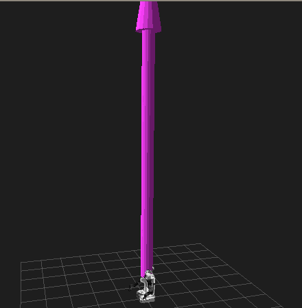

Plugins: New Display Type
=========================

**Goal:** Create a custom display plugin for RViz

**Tutorial level:** Intermediate

**Time:** 20 Minutes

.. contents:: Contents
   :depth: 2
   :local:

Backround
---------
RViz does not currently have a way to display `sensor_msgs/msg/Imu <https://github.com/ros2/common_interfaces/blob/rolling/sensor_msgs/msg/Imu.msg>`_ messages directly.
The code in this tutorial implements a subclass of ``rviz::Display`` to do so.

| The source code for this tutorial is in the `rviz_plugin_tutorials package <https://github.com/ros-visualization/visualization_tutorials/tree/ros2/rviz_plugin_tutorials>`_.
| Here is what the new ``ImuDisplay`` output looks like, showing a sequence of `sensor_msgs/msg/Imu <https://github.com/ros2/common_interfaces/blob/rolling/sensor_msgs/msg/Imu.msg>`_ messages from the test script:

Prerequisites
-------------
Before starting this tutorial, you should first complete the previous RViz tutorials

The Code
--------
The code for ``ImuDisplay`` is in these files: `imu_display.hpp <https://github.com/ros-visualization/visualization_tutorials/blob/ros2/rviz_plugin_tutorials/src/imu_display.hpp>`_,
`imu_display.cpp <https://github.com/ros-visualization/visualization_tutorials/blob/ros2/rviz_plugin_tutorials/src/imu_display.cpp>`_,
`imu_visual.hpp <https://github.com/ros-visualization/visualization_tutorials/blob/ros2/rviz_plugin_tutorials/src/imu_visual.hpp>`_ and
`imu_visual.cpp <https://github.com/ros-visualization/visualization_tutorials/blob/ros2/rviz_plugin_tutorials/src/imu_visual.cpp>`_

imu_display.hpp
^^^^^^^^^^^^^^^
The full source code of ``imu_display.h`` is here: `src/imu_display.hpp <https://github.com/ros-visualization/visualization_tutorials/blob/ros2/rviz_plugin_tutorials/src/imu_display.hpp>`_

Here we declare our new subclass of ``rviz::Display``. Every display which can be listed in the “Displays” panel is a subclass of ``rviz::Display``.

``ImuDisplay`` will show a 3D arrow showing the direction and magnitude of the IMU acceleration vector.
The base of the arrow will be at the frame listed in the header of the Imu message, and the direction of the arrow will be relative to the orientation of that frame.
It will also optionally show a history of recent acceleration vectors, which will be stored in a deque.

.. code-block:: C++

    class ImuDisplay : public rviz_common::MessageFilterDisplay<sensor_msgs::msg::Imu>
    {
      Q_OBJECT

    public:

The ``ImuDisplay`` class itself just implements the deque, editable parameters, and Display subclass machinery.
The visuals themselves are represented by a separate class, ``ImuVisual``.
The idiom for the visuals is that when the objects exist, they appear in the scene, and when they are deleted, they disappear.

.. code-block:: C++

    ImuDisplay();
    virtual ~ImuDisplay();

Constructor. ``pluginlib::ClassLoader`` creates instances by calling the default constructor, so make sure you have one.

.. code-block:: C++

    protected:
        virtual void onInitialize();

Overrides of protected virtual functions from Display.
As much as possible, when Displays are not enabled, they should not be subscribed to incoming data and should not show anything in the 3D view.
These functions are where these connections are made and broken.

.. code-block:: C++

    virtual void reset();

A helper to clear this display back to the initial state.

.. code-block:: C++

    private Q_SLOTS:
        void updateColorAndAlpha();
        void updateHistoryLength();

These Qt slots get connected to signals indicating changes in the user-editable properties.

.. code-block:: C++

    private:
        void processMessage(sensor_msgs::msg::Imu::ConstSharedPtr msg);

Function to handle an incoming ROS message.

.. code-block:: C++

    std::deque<std::shared_ptr<ImuVisual>> visuals_;

Storage for the list of visuals. It is a deque where data gets popped from the back (oldest) and pushed to the front (newest).

.. code-block:: C++

        rviz_common::properties::ColorProperty * color_property_;
        rviz_common::properties::FloatProperty * alpha_property_;
        rviz_common::properties::IntProperty * history_length_property_;
    };

User-editable property variables.

imu_display.cpp
^^^^^^^^^^^^^^^
The full source code of ``imu_display.cpp`` is here: `src/imu_display.cpp <https://github.com/ros-visualization/visualization_tutorials/blob/ros2/rviz_plugin_tutorials/src/imu_display.cpp>`_

.. code-block:: C++

    ImuDisplay::ImuDisplay()
    {
        color_property_ = new rviz_common::properties::ColorProperty(
            "Color", QColor(204, 51, 204),
            "Color to draw the acceleration arrows.",
            this, SLOT(updateColorAndAlpha()));

        alpha_property_ = new rviz_common::properties::FloatProperty(
            "Alpha", 1.0,
            "0 is fully transparent, 1.0 is fully opaque.",
            this, SLOT(updateColorAndAlpha()));

        history_length_property_ = new rviz_common::properties::IntProperty(
            "History Length", 1,
            "Number of prior measurements to display.",
            this, SLOT(updateHistoryLength()));
        history_length_property_->setMin(1);
        history_length_property_->setMax(100000);
    }

The constructor must have no arguments, so we can't give the constructor the parameters it needs to fully initialize.

.. code-block:: C++

    void ImuDisplay::onInitialize()
    {
        MFDClass::onInitialize();
        updateHistoryLength();
    }

    ImuDisplay::~ImuDisplay()
    {
    }

After the top-level ``rviz::Display::initialize()`` does its own setup, it calls the subclass's ``onInitialize()`` function.
This is where we instantiate all the workings of the class.
We make sure to also call our immediate super-class's ``onInitialize()`` function, since it does important stuff setting up the message filter.

| Note that ``MFDClass`` is a typedef of ``MessageFilterDisplay<message type>``, to save typing that long templated class name every time you need to refer to the superclass.

.. code-block:: C++

    void ImuDisplay::reset()
    {
        MFDClass::reset();
        visuals_.clear();
    }

Clear the visuals by deleting their objects.

.. code-block:: C++

    void ImuDisplay::updateColorAndAlpha()
    {
        float alpha = alpha_property_->getFloat();
        Ogre::ColourValue color = color_property_->getOgreColor();

        for (size_t i = 0; i < visuals_.size(); i++) {
            visuals_[i]->setColor(color.r, color.g, color.b, alpha);
        }
    }

Set the current color and alpha values for each visual.

.. code-block:: C++

    void ImuDisplay::updateHistoryLength()
    {
        history_length_ = static_cast<std::size_t>(history_length_property_->getInt());
        if (visuals_.size() > history_length_) {
            visuals_.resize(history_length_);
        }
    }

Set the number of past visuals to show.

.. code-block:: C++

    void ImuDisplay::processMessage(sensor_msgs::msg::Imu::ConstSharedPtr msg)
    {

This is our callback to handle an incoming message.

.. code-block:: C++

    Ogre::Quaternion orientation;
    Ogre::Vector3 position;
    if (!context_->getFrameManager()->getTransform(
        msg->header.frame_id, msg->header.stamp, position, orientation))
    {
        RCLCPP_INFO(
        rclcpp::get_logger("imu_display"),
        "Error transforming from frame '%s' to frame '%s'",
        msg->header.frame_id.c_str(), qPrintable(fixed_frame_));
        return;
    }

Here we call the ``rviz::FrameManager`` to get the transform from the fixed frame to the frame in the header of this Imu message.
If it fails, we can't do anything else so we return.

.. code-block:: C++

    std::shared_ptr<ImuVisual> visual;
    visual.reset(new ImuVisual(context_->getSceneManager(), scene_node_));
    visual->setMessage(msg);
    visual->setFramePosition(position);
    visual->setFrameOrientation(orientation);

    float alpha = alpha_property_->getFloat();
    Ogre::ColourValue color = color_property_->getOgreColor();
    visual->setColor(color.r, color.g, color.b, alpha);

Now set or update the contents of the chosen visual.

.. code-block:: C++

        if (visuals_.size() == history_length_) {
            visuals_.pop_back();
        }
        visuals_.push_front(visual);
    }

    }  // end namespace rviz_plugin_tutorials

We are keeping a deque of visual pointers.
This removes the oldest visual from the back if the capacity has been reached, and adds our new visual to the front.

.. code-block:: C++

    #include "pluginlib/class_list_macros.hpp"
    PLUGINLIB_EXPORT_CLASS(rviz_plugin_tutorials::ImuDisplay, rviz_common::Display)

Tell pluginlib about this class. It is important to do this in global scope, outside our package's namespace.

imu_visual.hpp
^^^^^^^^^^^^^^
The full source code of ``imu_display.cpp`` is here: `imu_visual.hpp <https://github.com/ros-visualization/visualization_tutorials/blob/ros2/rviz_plugin_tutorials/src/imu_visual.hpp>`_

Declare the visual class for this display.

.. code-block:: C++

    class ImuVisual
    {
        public:

Each instance of ImuVisual represents the visualization of a single ``sensor_msgs::msg::Imu`` message.
Currently it just shows an arrow with the direction and magnitude of the acceleration vector, but could easily be expanded to include more of the message data.

.. code-block:: C++

    ImuVisual(Ogre::SceneManager * scene_manager, Ogre::SceneNode * parent_node);

Constructor. Creates the visual stuff and puts it into the scene, but in an unconfigured state.

.. code-block:: C++

    virtual ~ImuVisual();

Destructor. Removes the visual stuff from the scene.

.. code-block:: C++

    void setMessage(sensor_msgs::msg::Imu::ConstSharedPtr msg);

Configure the visual to show the data in the message.

.. code-block:: C++

    void setFramePosition(const Ogre::Vector3 & position);
    void setFrameOrientation(const Ogre::Quaternion & orientation);

Set the pose of the coordinate frame the message refers to.
These could be done inside ``setMessage()``, but that would require calls to ``FrameManager`` and error handling inside ``setMessage()``, which doesn't seem as clean.
This way ``ImuVisual`` is only responsible for visualization.

.. code-block:: C++

        void setColor(float r, float g, float b, float a);

    private:

Set the color and alpha of the visual, which are user-editable parameters and therefore don't come from the Imu message.

.. code-block:: C++

    std::shared_ptr<rviz_rendering::Arrow> acceleration_arrow_;

The object implementing the actual arrow shape.

.. code-block:: C++

    Ogre::SceneNode * frame_node_;

A ``SceneNode`` whose pose is set to match the coordinate frame of the Imu message header.

.. code-block:: C++

        Ogre::SceneManager * scene_manager_;
    };

The ``SceneManager``, kept here only so the destructor can ask it to destroy the ``frame_node_``.

imu_visual.cpp
^^^^^^^^^^^^^^
The full source code of ``imu_visual.cpp`` is here: `imu_visual.cpp <https://github.com/ros-visualization/visualization_tutorials/blob/ros2/rviz_plugin_tutorials/src/imu_visual.cpp>`_

``Ogre::SceneNode`` s form a tree, with each node storing the transform (position and orientation) of itself relative to its parent.
Ogre does the math of combining those transforms when it is time to render

.. code-block:: C++

    frame_node_ = parent_node->createChildSceneNode();

Here we create a node to store the pose of the Imu's header frame relative to the RViz fixed frame.

.. code-block:: C++

        acceleration_arrow_.reset(new rviz_rendering::Arrow(scene_manager_, frame_node_));
    }

We create the arrow object within the frame node so that we can set its position and direction relative to its header frame.

.. code-block:: C++

    ImuVisual::~ImuVisual()
    {
        // Destroy the frame node since we don't need it anymore.
        scene_manager_->destroySceneNode(frame_node_);
    }

Destroy the frame node since we don't need it anymore.

.. code-block:: C++

    void ImuVisual::setMessage(sensor_msgs::msg::Imu::ConstSharedPtr msg)
    {
        const geometry_msgs::msg::Vector3 & a = msg->linear_acceleration;

        Ogre::Vector3 acc(static_cast<float>(a.x), static_cast<float>(a.y), static_cast<float>(a.z));

Convert the ``geometry_msgs::msg::Vector3`` to an ``Ogre::Vector3``.

.. code-block:: C++

    float length = acc.length();

Find the magnitude of the acceleration vector.

.. code-block:: C++

    Ogre::Vector3 scale(length, length, length);
    acceleration_arrow_->setScale(scale);

Scale the arrow's thickness in each dimension along with its length.

.. code-block:: C++

        acceleration_arrow_->setDirection(acc);
    }

Set the orientation of the arrow to match the direction of the acceleration vector.

.. code-block:: C++

    void ImuVisual::setFramePosition(const Ogre::Vector3 & position)
    {
        frame_node_->setPosition(position);
    }

    void ImuVisual::setFrameOrientation(const Ogre::Quaternion & orientation)
    {
        frame_node_->setOrientation(orientation);
    }

Position and orientation are passed through to the ``SceneNode``.

.. code-block:: C++

    void ImuVisual::setColor(float r, float g, float b, float a)
    {
        acceleration_arrow_->setColor(r, g, b, a);
    }

Color is passed through to the Arrow object.

Building the Plugin
-------------------
Simply build the plugin using colcon in the root directory of your workspace

.. code-block:: bash

    colcon build --packages-select rviz_plugin_tutorials

.. _Exporting_a_plugin:

Exporting the Plugin
--------------------
For the plugin to be found and understood by other ROS packages (in this case, rviz), it needs a ``plugin_description.xml`` file.
This file can be named anything you like, as it is specified in the plugin package's ``package.xml`` file like so:

.. code-block:: xml

    <export>
        <rviz plugin="${prefix}/plugin_description.xml"/>
    </export>

The contents of ``plugin_description.xml`` then look like this:

.. code-block:: xml

    <library path="rviz_plugin_tutorials">
      <class name="rviz_plugin_tutorials/Teleop"
             type="rviz_plugin_tutorials::TeleopPanel"
             base_class_type="rviz_common::Panel">
        <description>
          A panel widget allowing simple diff-drive style robot base control.
        </description>
      </class>
      <class name="rviz_plugin_tutorials/Imu"
             type="rviz_plugin_tutorials::ImuDisplay"
             base_class_type="rviz_common::Display">
        <description>
          Displays direction and scale of accelerations from sensor_msgs::msg::Imu messages.
        </description>
        <message_type>sensor_msgs/msg/Imu</message_type>
      </class>
      <class name="rviz_plugin_tutorials/PlantFlag"
             type="rviz_plugin_tutorials::PlantFlagTool"
             base_class_type="rviz_common::Tool">
      <description>
        Tool for planting flags on the ground plane in rviz.
      </description>
      </class>
    </library>

The first line says that the compiled library lives in ``rviz_plugin_tutorials`` (the ".so" ending is appended by ``pluginlib`` according to the OS).
This path is relative to the top directory of the package:

| The next section is a ``class`` entry describing the ``TeleopPanel``:

.. code-block:: xml

    <class name="rviz_plugin_tutorials/Teleop"
           type="rviz_plugin_tutorials::TeleopPanel"
           base_class_type="rviz_common::Panel">
      <description>
        A panel widget allowing simple diff-drive style robot base control.
      </description>
    </class>

This specifies the name, type, base class, and description of the class.
The name field must be a combination of the first two strings given to the ``PLUGINLIB_DECLARE_CLASS()`` macro in the source file.
It must be the package name, a "/" slash, then the "display name" for the class. The "display name" is the name used for the class in the user interface.

| The type entry must be the fully-qualified class name, including any namespace(s) it is inside.

| The base_class_type is usually one of ``rviz_common::Panel``, ``rviz_common::Display``, ``rviz_common::Tool``, or ``rviz_common::ViewController``.

The description subsection is a simple text description of the class, which is shown in the class-chooser dialog and in the Displays panel help area.
This section can contain HTML, including hyperlinks, but the markup must be escaped to avoid being interpreted as XML markup.
For example, a link tag might look like: ``&lt;a href="my-web-page.html"&gt;``.

| Display plugins can have multiple ``message_type`` tags, which are used by RViz when you add a Display by selecting its topic first.

Trying it out
-------------

Once your RViz plugin is compiled and exported, simply run RViz normally. But make sure to source you workspace in the terminal that starts and runs RViz!

.. code-block:: bash

    ros2 run rviz2 rviz2

Now RViz will use pluginlib to find all the plugins exported to it.

Add an ImuDisplay by clicking the “Add” button at the bottom of the “Displays” panel (or by typing Control-N),
then scrolling down through the available displays until you see “Imu” under your plugin package name (here it is “rviz_plugin_tutorials”).

If “Imu” is not in your list of Display Types, look through RViz's console output for error messages relating to plugin loading. Some common problems are:

* not having a ``plugin_description.xml`` file,
* not exporting it in the ``package.xml`` file, or
* not properly referencing the library file (like ``librviz_plugin_tutorials.so``) from ``plugin_description.xml``.

| Once you've added the Imu display to RViz, you just need to set the topic name of the display to a source of `sensor_msgs/msg/Imu <https://github.com/ros2/common_interfaces/blob/rolling/sensor_msgs/msg/Imu.msg>`_ messages.

| If you don't happen to have an IMU or other source of `sensor_msgs/msg/Imu <https://github.com/ros2/common_interfaces/blob/rolling/sensor_msgs/msg/Imu.msg>`_ messages, you can test the plugin with a Python script like this: `scripts/send_test_msgs.py <https://github.com/ros-visualization/visualization_tutorials/blob/ros2/rviz_plugin_tutorials/scripts/send_test_msgs.py>`_ .

| The script publishes on the ``/test_imu`` topic, so enter that.

| The script publishes both Imu messages and a moving TF frame (``/base_link`` relative to ``/map``), so make sure your ``Fixed Frame`` is set to ``/map``.

| Finally, adjust the ``History Length`` parameter of the Imu display to 10 and you should see something like the picture at the top of this page.

| Note: If you use this to visualize messages from an actual IMU, the arrows are going to be huge compared to most robots:

(Note the PR2 robot at the base of the purple arrow.)
This is because the Imu acceleration units are meters per second squared, and gravity is 9.8 m/s^2,
and we haven't applied any scaling or gravity compensation to the acceleration vectors.

Next Steps
----------
This ImuDisplay is not yet a terribly useful Display class. Extensions to make it more useful might be:

* Add a gravity-compensation option to the acceleration vector.
* Visualize more of the data in the Imu messages.

To add a gravity compensation option, you might take steps like these:

* Add a new ``rviz::BoolProperty`` to ImuDisplay to store whether the option is on or off.
* Compute the direction of gravity relative to the Imu frame orientation (as set in ``ImuVisual::setFrameOrientation()``) and subtract it from the acceleration vector each time in ``ImuVisual::setMessage()``.

Since ``ImuVisual`` takes complete Imu messages as input, adding visualizations of more of the Imu data only needs modifications to ``ImuVisual``.
Imu data displays might look like:

* ``orientation``: An ``rviz::Axes`` object at the Imu reference frame, turned to show the orientation.
* ``angular_velocity``: Maybe a line to show the axis of rotation and a 3D arrow curving around it to show the speed of rotation?
* ``orientation_covariance``: Maybe this is an ellipse at the end of each of the X, Y, and Z axes showing the orientation?
* ``linear_acceleration_covariance``: Maybe this is an ellipsoid at the end of the acceleration arrow?

As all this might be visually cluttered, it may make sense to include boolean options to enable or disable some of them.