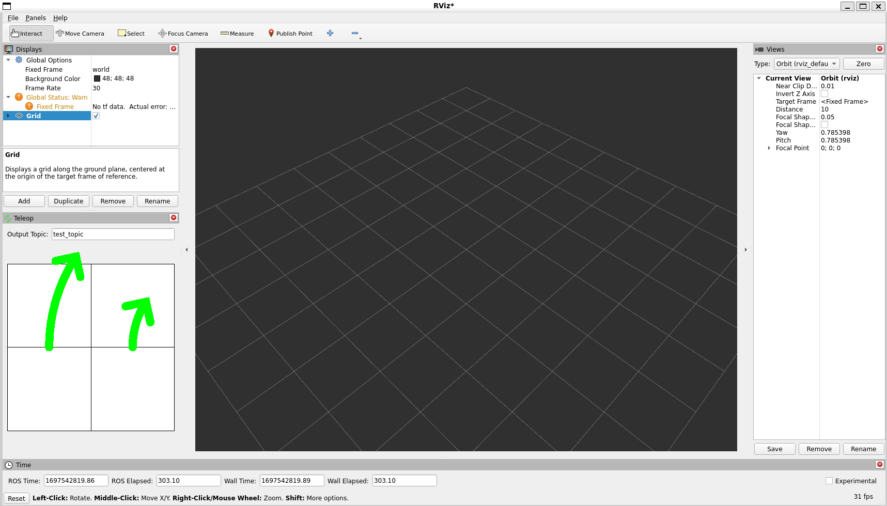
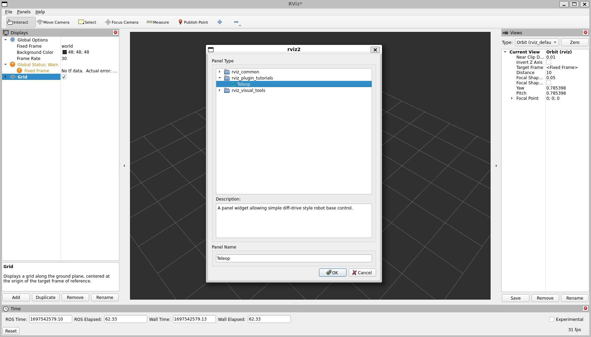

Plugins: New Dockable Panel
===========================

**Goal:** Create a dockable panel plugin for RViz

**Tutorial level:** Intermediate

**Time:** 20 Minutes

.. contents:: Contents
   :depth: 2
   :local:

Backround
---------
A panel in RViz is a GUI widget which can be docked in the main window or floating.
It does not show properties in the “Displays” panel like a Display, but it could show things in the 3D scene.

A panel can be a useful place to put a bunch of application-specific GUI elements.
You could put start and stop buttons for your robot, or other command or control inputs.

RViz has a built-in tool to send a goal pose to a path planner, but it does not have a native way to send velocity commands directly to a robot base controller.
That is what this tutorial shows, a subclass of ``rviz::Panel`` which lets you send velocity commands right to your robot.

| The source code for this tutorial is in the `rviz_plugin_tutorials package <https://github.com/ros-visualization/visualization_tutorials/tree/ros2/rviz_plugin_tutorials>`_.
| Here is what RViz looks like with the new ``Teleop`` panel showing on the left:

Prerequisites
-------------
Before starting this tutorial, you should first complete the previous RViz tutorials

The Code
--------
The code for ``ImuDisplay`` is in these files: `teleop_panel.hpp <https://github.com/ros-visualization/visualization_tutorials/blob/ros2/rviz_plugin_tutorials/src/imu_display.hpp>`_,
`teleop_panel.cpp <https://github.com/ros-visualization/visualization_tutorials/blob/ros2/rviz_plugin_tutorials/src/imu_display.cpp>`_,
`drive_widget.hpp <https://github.com/ros-visualization/visualization_tutorials/blob/ros2/rviz_plugin_tutorials/src/imu_visual.hpp>`_ and
`drive_widget.cpp <https://github.com/ros-visualization/visualization_tutorials/blob/ros2/rviz_plugin_tutorials/src/imu_visual.cpp>`_

teleop_panel.hpp
^^^^^^^^^^^^^^^^
The full source code of ``teleop_panel.hpp`` is here: `teleop_panel.hpp <https://github.com/ros-visualization/visualization_tutorials/blob/ros2/rviz_plugin_tutorials/src/imu_display.hpp>`_

``TeleopPanel`` will show a text-entry field to set the output topic and a 2D control area.
The 2D control area is implemented by the ``DriveWidget class``, and is described there.

.. code-block:: C++

    class TeleopPanel : public rviz_common::Panel
    {

Here we declare our new subclass of ``rviz::Panel``.
Every panel which can be added via the Panels->Add_New_Panel menu is a subclass of ``rviz::Panel``.

.. code-block:: C++

        Q_OBJECT
    public:

This class uses Qt slots and is a subclass of QObject, so it needs the ``Q_OBJECT`` macro.

.. code-block:: C++

    explicit TeleopPanel(QWidget * parent = 0);

``QWidget`` subclass constructors usually take a parent widget parameter (which usually defaults to 0).
At the same time, ``pluginlib::ClassLoader`` creates instances by calling the default constructor (with no arguments).
Taking the parameter and giving a default of 0 lets the default constructor work
and also lets someone using the class for something else to pass in a parent widget as they normally would with Qt.

.. code-block:: C++

    virtual void load(const rviz_common::Config & config);
    virtual void save(rviz_common::Config config) const;

Now we declare overrides of ``rviz::Panel`` functions for saving and loading data from the config file. Here the data is the topic name.

.. code-block:: C++

    public Q_SLOTS:

Next come a couple of public Qt slots.

.. code-block:: C++

    void setVel(float linear_velocity_, float angular_velocity_);

The control area, ``DriveWidget``, sends its output to a Qt signal for ease of re-use, so here we declare a Qt slot to receive it.

.. code-block:: C++

    void setTopic(const QString & topic);

In this example ``setTopic()`` does not get connected to any signal (it is called directly),
but it is easy to define it as a public slot instead of a private function in case it would be useful to some other user.

.. code-block:: C++

    protected Q_SLOTS:

Here we declare some internal slots.

.. code-block:: C++

    void sendVel();

``sendvel()`` publishes the current velocity values to a ROS topic.
Internally this is connected to a timer which calls it 10 times per second.

.. code-block:: C++

    void updateTopic();

``updateTopic()`` reads the topic name from the ``QLineEdit`` and calls ``setTopic()`` with the result.

.. code-block:: C++

    protected:
        DriveWidget * drive_widget_;
        QLineEdit * output_topic_editor_;
        QString output_topic_;

        std::shared_ptr<rclcpp::Node> velocity_node_;
        rclcpp::Publisher<geometry_msgs::msg::Twist>::SharedPtr velocity_publisher_;

        float linear_velocity_;
        float angular_velocity_;

Then we finish up with protected member variables.

* ``drive_widget_``: The control-area widget which turns mouse events into command velocities.
* ``output_topic_editor_``: One-line text editor for entering the outgoing ROS topic name.
* ``output_topic_``:The current name of the output topic.
* ``velocity_node_``, ``velocity_publisher_``: The ROS node and publisher for the command velocity.
* ``linear_velocity_``, ``angular_velocity_``: The latest velocity values from the drive widget.

teleop_panel.cpp
^^^^^^^^^^^^^^^^
The full source code of ``teleop_panelc.cpp`` is here: `src/teleop_panel.cpp <https://github.com/ros-visualization/visualization_tutorials/blob/ros2/rviz_plugin_tutorials/src/imu_display.hpp>`_

Here is the implementation of the ``TeleopPanel`` class. ``TeleopPanel`` has these responsibilities:

* Act as a container for GUI elements ``DriveWidget`` and ``QLineEdit``.
* Publish command velocities 10 times per second (whether 0 or not).
* Saving and restoring internal state from a config file.

.. code-block:: C++

    TeleopPanel::TeleopPanel(QWidget * parent)
    : rviz_common::Panel(parent),
        linear_velocity_(0),
        angular_velocity_(0)
    {

We start with the constructor, doing the standard Qt thing of passing the optional parent argument on to the superclass constructor,
and also zero-ing the velocities we will be publishing.

.. code-block:: C++

    QHBoxLayout * topic_layout = new QHBoxLayout;
    topic_layout->addWidget(new QLabel("Output Topic:"));
    output_topic_editor_ = new QLineEdit;
    topic_layout->addWidget(output_topic_editor_);

Next we lay out the ``output_topic_editor_`` text entry field using a ``QLabel`` and a ``QLineEdit`` in a ``QHBoxLayout``.

.. code-block:: C++

    drive_widget_ = new DriveWidget;

Then create the control widget.

.. code-block:: C++

    QVBoxLayout * layout = new QVBoxLayout;
    layout->addLayout(topic_layout);
    layout->addWidget(drive_widget_);
    setLayout(layout);

Lay out the topic field above the control widget.

.. code-block:: C++

    QTimer * output_timer = new QTimer(this);

Create a timer for sending the output.
Motor controllers want to be reassured frequently that they are doing the right thing,
so we keep re-sending velocities even when they aren't changing.

Here we take advantage of QObject's memory management behavior: since ``this`` is passed to the new ``QTimer`` as its parent,
the ``QTimer`` is deleted by the QObject destructor when this ``TeleopPanel`` object is destroyed.
Therefore we don't need to keep a pointer to the timer.

.. code-block:: C++

    connect(
        drive_widget_, SIGNAL(
        outputVelocity(
            float,
            float)),
        this, SLOT(
        setVel(
            float,
            float)));
    connect(output_topic_editor_, SIGNAL(editingFinished()), this, SLOT(updateTopic()));
    connect(output_timer, SIGNAL(timeout()), this, SLOT(sendVel()));

Next we make signal/slot connections.

.. code-block:: C++

    output_timer->start(100);

Start the timer.

.. code-block:: C++

    drive_widget_->setEnabled(false);

Make the control widget start disabled, since we don't start with an output topic.

.. code-block:: C++

        velocity_node_ = std::make_shared<rclcpp::Node>("teleop_panel_velocity_node");
    }

Create the ``velocity_node_``.

.. code-block:: C++

    void TeleopPanel::setVel(float lin, float ang)
    {
        linear_velocity_ = lin;
        angular_velocity_ = ang;
    }

``setVel()`` is connected to the ``DriveWidget``'s output, which is sent whenever it changes due to a mouse event.
This just records the values it is given. The data doesn't actually get sent until the next timer callback.

.. code-block:: C++

    void TeleopPanel::updateTopic()
    {
        setTopic(output_topic_editor_->text());
    }

Read the topic name from the ``QLineEdit`` and call ``setTopic()`` with the results.
This is connected to ``QLineEdit::editingFinished()`` which fires when the user presses Enter or Tab or otherwise moves focus away.

.. code-block:: C++

    void TeleopPanel::setTopic(const QString & new_topic)
    {

Set the topic name we are publishing to.

.. code-block:: C++

    if (new_topic != output_topic_) {
        output_topic_ = new_topic;

Only take action if the name has changed.

.. code-block:: C++

    if (velocity_publisher_ != NULL) {
        velocity_publisher_.reset();
    }

If a publisher currently exists, destroy it.

.. code-block:: C++

    if (output_topic_ != "") {
        // The call to create_publisher() says we want to publish data on the new topic name.
        velocity_publisher_ = velocity_node_->create_publisher<geometry_msgs::msg::Twist>(
        output_topic_.toStdString(), 1);
    }

If the topic is the empty string, don't publish anything.

.. code-block:: C++

        Q_EMIT configChanged();
    }

``rviz::Panel`` defines the ``configChanged()`` signal.
Emitting it tells RViz that something in this panel has changed that will affect a saved config file.
Ultimately this signal can cause ``QWidget::setWindowModified(true)`` to be called on the top-level ``rviz::VisualizationFrame``,
which causes a little asterisk (“*”) to show in the window's title bar indicating unsaved changes.

.. code-block:: C++

        drive_widget_->setEnabled(output_topic_ != "");
    }

Gray out the control widget when the output topic is empty.

.. code-block:: C++

    void TeleopPanel::sendVel()
    {
        if (rclcpp::ok() && velocity_publisher_ != NULL) {
            geometry_msgs::msg::Twist msg;
            msg.linear.x = linear_velocity_;
            msg.linear.y = 0;
            msg.linear.z = 0;
            msg.angular.x = 0;
            msg.angular.y = 0;
            msg.angular.z = angular_velocity_;
            velocity_publisher_->publish(msg);
        }
    }

Publish the control velocities if ROS is not shutting down and the publisher is ready with a valid topic name.

.. code-block:: C++

    void TeleopPanel::save(rviz_common::Config config) const
    {
        rviz_common::Panel::save(config);
        config.mapSetValue("Topic", output_topic_);
    }

Save all configuration data from this panel to the given Config object.
It is important here that you call ``save()`` on the parent class so the class id and panel name get saved.

.. code-block:: C++

    void TeleopPanel::load(const rviz_common::Config & config)
    {
        rviz_common::Panel::load(config);
        QString topic;
        if (config.mapGetString("Topic", &topic)) {
            output_topic_editor_->setText(topic);
            updateTopic();
        }
    }

    }  // end namespace rviz_plugin_tutorials

Load all configuration data for this panel from the given Config object

.. code-block:: C++

    #include "pluginlib/class_list_macros.hpp"
    PLUGINLIB_EXPORT_CLASS(rviz_plugin_tutorials::TeleopPanel, rviz_common::Panel)

Tell ``pluginlib`` about this class.
Every class which should be loadable by ``pluginlib::ClassLoader`` must have these two lines compiled in its .cpp file, outside of any namespace scope.

drive_widget.hpp
^^^^^^^^^^^^^^^^
The full source code of ``teleop_panel`` is here: `src/drive_widget.hpp <https://github.com/ros-visualization/visualization_tutorials/blob/ros2/rviz_plugin_tutorials/src/imu_display.hpp>`_

``DriveWidget`` implements a control which translates mouse Y values into linear velocities and mouse X values into angular velocities.

.. code-block:: C++

    class DriveWidget : public QWidget
    {
      Q_OBJECT

    public:

For maximum reusability, this class is only responsible for user interaction and display inside its widget.
It does not make any ROS or RViz calls.
It communicates its data to the outside just via Qt signals.

.. code-block:: C++

    explicit DriveWidget(QWidget * parent = 0);

This class is not instantiated by ``pluginlib::ClassLoader``, so the constructor has no restrictions.

.. code-block:: C++

    virtual void paintEvent(QPaintEvent * event);

We override ``QWidget::paintEvent()`` to do custom painting.

.. code-block:: C++

    virtual void mouseMoveEvent(QMouseEvent * event);
    virtual void mousePressEvent(QMouseEvent * event);
    virtual void mouseReleaseEvent(QMouseEvent * event);
    virtual void leaveEvent(QEvent * event);

We override the mouse events and ``leaveEvent()`` to keep track of what the mouse is doing.

.. code-block:: C++

    virtual QSize sizeHint() const {return QSize(150, 150);}

Override ``sizeHint()`` to give the layout managers some idea of a good size for this.

.. code-block:: C++

    Q_SIGNALS:.
      void outputVelocity(float linear, float angular);

We emit ``outputVelocity()`` whenever it changes.

.. code-block:: C++

    protected:
        void sendVelocitiesFromMouse(int x, int y, int width, int height);

``mouseMoveEvent()`` and ``mousePressEvent()`` need the same math to figure the velocities, so I put that in here.

.. code-block:: C++

    void stop();

A function to emit zero velocity.

.. code-block:: C++

        float linear_velocity_;  // In m/s
        float angular_velocity_;  // In radians/s
        float linear_scale_;  // In m/s
        float angular_scale_;  // In radians/s
    };
    // END_TUTORIAL

    }  // end namespace rviz_plugin_tutorials

And finally the member variables.

drive_widget.cpp
^^^^^^^^^^^^^^^^
The full source code of ``teleop_panel`` is here: `src/drive_widget.cpp <https://github.com/ros-visualization/visualization_tutorials/blob/ros2/rviz_plugin_tutorials/src/imu_display.hpp>`_

.. code-block:: C++

    DriveWidget::DriveWidget(QWidget * parent)
    : QWidget(parent),
      linear_velocity_(0.0f),
      angular_velocity_(0.0f),
      linear_scale_(10.0f),
      angular_scale_(2.0f)
    {
    }

The ``DriveWidget`` constructor does the normal Qt thing of passing the parent widget to the superclass constructor, then initializing the member variables.

.. code-block:: C++

    void DriveWidget::paintEvent(QPaintEvent * event)
    {

This ``paintEvent()`` is complex because of the drawing of the two arc-arrows representing wheel motion.
It is not particularly relevant to learning how to create an RViz plugin, so you can skimm over this if you want to.

.. code-block:: C++

    QColor background;
    QColor crosshair;
    if (isEnabled()) {
        background = Qt::white;
        crosshair = Qt::black;
    } else {
        background = Qt::lightGray;
        crosshair = Qt::darkGray;
    }

The background color and crosshair lines are drawn differently depending on whether this widget is enabled or not.
This gives a nice visual indication of whether the control is “live”.

.. code-block:: C++

    int w = width();
    int h = height();
    int size = (( w > h ) ? h : w) - 1;
    int hpad = (w - size) / 2;
    int vpad = (h - size) / 2;

    QPainter painter(this);
    painter.setBrush(background);
    painter.setPen(crosshair);

The main visual is a square, centered in the widget's area.
Here we compute the size of the square and the horizontal and vertical offsets of it.

.. code-block:: C++

    painter.drawRect(QRect(hpad, vpad, size, size));

Draw the background square.

.. code-block:: C++

    painter.drawLine(hpad, height() / 2, hpad + size, height() / 2);
    painter.drawLine(width() / 2, vpad, width() / 2, vpad + size);

Draw a cross-hair inside the square.

.. code-block:: C++

    if (isEnabled() && (angular_velocity_ != 0 || linear_velocity_ != 0)) {
        QPen arrow;
        arrow.setWidth(size / 20);
        arrow.setColor(Qt::green);
        arrow.setCapStyle(Qt::RoundCap);
        arrow.setJoinStyle(Qt::RoundJoin);
        painter.setPen(arrow);

If the widget is enabled and the velocities are not zero,
draw some sweet green arrows showing possible paths that the wheels of a diff-drive robot would take if it stayed at these velocities.

.. code-block:: C++

    const int kStepCount{100};
    QPointF left_track[kStepCount];
    QPointF right_track[kStepCount];

    float half_track_width = static_cast<float>(size) / 4.0f;

    float cx = static_cast<float>(w / 2.0f);
    float cy = static_cast<float>(h / 2.0f);
    left_track[0].setX(cx - half_track_width);
    left_track[0].setY(cy);
    right_track[0].setX(cx + half_track_width);
    right_track[0].setY(cy);
    float angle = M_PI / 2.0f;
    float delta_angle = angular_velocity_ / static_cast<float>(kStepCount);
    float step_dist = linear_velocity_ * static_cast<float>(size) / 2.0f / linear_scale_ /
      static_cast<float>(kStepCount);
    for (int step = 1; step < kStepCount; step++) {
        angle += delta_angle / 2;
        float next_cx = cx + step_dist * cosf(angle);
        float next_cy = cy - step_dist * sinf(angle);
        angle += delta_angle / 2;

        left_track[step].setX(next_cx + half_track_width * cosf(angle + M_PI / 2.0f));
        left_track[step].setY(next_cy - half_track_width * sinf(angle + M_PI / 2.0f));
        right_track[step].setX(next_cx + half_track_width * cosf(angle - M_PI / 2.0f));
        right_track[step].setY(next_cy - half_track_width * sinf(angle - M_PI / 2.0f));

        cx = next_cx;
        cy = next_cy;
    }

This code steps along a central arc defined by the linear and angular velocites.
At each step, it computes where the left and right wheels would be and collects the resulting points in the ``left_track`` and ``right_track`` arrays.

.. code-block:: C++

    painter.drawPolyline(left_track, kStepCount);
    painter.drawPolyline(right_track, kStepCount);

Now the track arrays are filled, so stroke each with a fat green line.

.. code-block:: C++

    int left_arrow_dir = (-step_dist + half_track_width * delta_angle > 0);
    int right_arrow_dir = (-step_dist - half_track_width * delta_angle > 0);

Here we decide which direction each arrowhead will point (forward or backward).
This works by comparing the arc length travelled by the center in one step (``step_dist``)
with the arc length travelled by the wheel (``half_track_width * delta_angle``).

.. code-block:: C++

    arrow.setJoinStyle(Qt::MiterJoin);
    painter.setPen(arrow);

Use ``MiterJoin`` for the arrowheads so we get a nice sharp point.

.. code-block:: C++

            float head_len = size / 8.0;
            QPointF arrow_head[3];
            float x, y;
            if (fabsf(-step_dist + half_track_width * delta_angle) > .01) {
                x = left_track[kStepCount - 1].x();
                y = left_track[kStepCount - 1].y();
                arrow_head[0].setX(x + head_len * cosf(angle + 3.0f * M_PI / 4.0f + left_arrow_dir * M_PI));
                arrow_head[0].setY(y - head_len * sinf(angle + 3.0f * M_PI / 4.0f + left_arrow_dir * M_PI));
                arrow_head[1].setX(x);
                arrow_head[1].setY(y);
                arrow_head[2].setX(x + head_len * cosf(angle - 3.0f * M_PI / 4.0f + left_arrow_dir * M_PI));
                arrow_head[2].setY(y - head_len * sinf(angle - 3.0f * M_PI / 4.0f + left_arrow_dir * M_PI));
                painter.drawPolyline(arrow_head, 3);
            }
            if (fabsf(-step_dist - half_track_width * delta_angle) > .01) {
                x = right_track[kStepCount - 1].x();
                y = right_track[kStepCount - 1].y();
                arrow_head[0].setX(x + head_len * cosf(angle + 3.0f * M_PI / 4.0f + right_arrow_dir * M_PI));
                arrow_head[0].setY(y - head_len * sinf(angle + 3.0f * M_PI / 4.0f + right_arrow_dir * M_PI));
                arrow_head[1].setX(x);
                arrow_head[1].setY(y);
                arrow_head[2].setX(x + head_len * cosf(angle - 3.0f * M_PI / 4.0f + right_arrow_dir * M_PI));
                arrow_head[2].setY(y - head_len * sinf(angle - 3.0f * M_PI / 4.0f + right_arrow_dir * M_PI));
                painter.drawPolyline(arrow_head, 3);
            }
        }
    }

Compute and draw polylines for each arrowhead.
This code could probably be more elegant.

.. code-block:: C++

    void DriveWidget::mouseMoveEvent(QMouseEvent * event)
    {
        sendVelocitiesFromMouse(event->x(), event->y(), width(), height());
    }

Every mouse move event received here sends a velocity because Qt only sends us mouse move events if there was previously a mouse-press event while in the widget.

.. code-block:: C++

    void DriveWidget::mousePressEvent(QMouseEvent * event)
    {
        sendVelocitiesFromMouse(event->x(), event->y(), width(), height());
    }

Mouse-press events should send the velocities too, of course.

.. code-block:: C++

    void DriveWidget::leaveEvent(QEvent * event)
    {
        (void)event;
        stop();
    }

When the mouse leaves the widget but the button is still held down, we don't get the ``leaveEvent()`` because the mouse is “grabbed” (by default from Qt).
However, when the mouse drags out of the widget and then other buttons are pressed (or possibly other window-manager things happen),
we will get a ``leaveEvent()`` but not a ``mouseReleaseEvent()``.
Without catching this event you can have a robot stuck “on” without the user controlling it.

.. code-block:: C++

    void DriveWidget::mouseReleaseEvent(QMouseEvent * event)
    {
        (void)event;
        stop();
    }

The ordinary way to stop: let go of the mouse button

.. code-block:: C++

    void DriveWidget::sendVelocitiesFromMouse(int x, int y, int width, int height)
    {
        int size = (( width > height ) ? height : width );
        int hpad = (width - size) / 2;
        int vpad = (height - size) / 2;

        linear_velocity_ = (1.0 - static_cast<float>(y - vpad) /
            static_cast<float>(size / 2)) * linear_scale_;
        angular_velocity_ = (1.0 - static_cast<float>(x - hpad) /
            static_cast<float>(size / 2)) * angular_scale_;
        Q_EMIT outputVelocity(linear_velocity_, angular_velocity_);

Compute and emit linear and angular velocities based on Y and X mouse positions relative to the central square.

.. code-block:: C++

        update();
    }

``update()`` is a QWidget function which schedules this widget to be repainted the next time through the main event loop.
We need this because the velocities have just changed, so the arrows need to be redrawn to match.

.. code-block:: C++

    void DriveWidget::stop()
    {
        linear_velocity_ = 0.0f;
        angular_velocity_ = 0.0f;
        Q_EMIT outputVelocity(linear_velocity_, angular_velocity_);
        update();
    }

    }  // end namespace rviz_plugin_tutorials

How to stop: emit velocities of 0!

Building the Plugin
-------------------
Simply build the plugin using colcon in the root directory of your workspace

.. code-block:: bash

    colcon build --packages-select rviz_plugin_tutorials

Exporting the Plugin
--------------------
Please see the explanation from the previous tutorial, as it uses the exact same files. :ref:`Exporting a plugin <Exporting_a_plugin>`.

Trying it out
-------------
Once your RViz plugin is compiled and exported, simply run RViz normally.
But make sure to source you workspace in the terminal that starts and runs RViz!

.. code-block:: bash

    ros2 run rviz2 rviz2

Now RViz will use ``pluginlib`` to find all the plugins exported to it.

Add a Teleop panel by opening the “Panels” menu and then “Add New Panel” within that.
This should bring up a Panel class chooser dialog with “Teleop” in it (here it is “rviz_plugin_tutorials”):

If “Teleop” is not in your list of Display Types, look through RViz's console output for error messages relating to plugin loading.
Some common problems are:

* not having a ``plugin_description.xml`` file,
* not exporting it in the ``package.xml`` file, or
* not properly referencing the library file (like ``librviz_plugin_tutorials.so``) from ``plugin_description.xml``.

Once you've added the Teleop panel to RViz,
you just need to enter a topic name to publish the ``geometry_msgs/Twist`` command velocities on.
Once a non-empty string has been entered in the ``Output Topic`` field, the control square area should light up and accept mouse events.
Holding the mouse button down in the control area sends a linear velocity based on the Y position of the mouse relative to the center
and an angular velocity based on the X position of the mouse relative to the center.

Next Steps
----------
This Teleop panel might be useful as it is, since it already sends out command velocities appropriate for a diff-drive robot.
However, there are a few things which might make it more useful:

* Adjustable scaling of the linear and angular velocities.
* Enforced maxima for the velocities.
* An adjustable robot width parameter, so that the curved arrows accurately show the arc a robot would traverse.
* A “strafe” mode (maybe when holding down the Shift key) for robots like the PR2 with (more) holonomic drive ability.