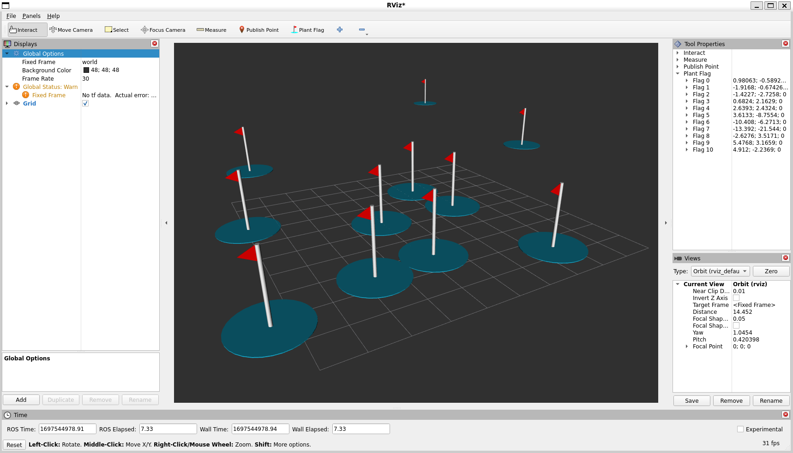
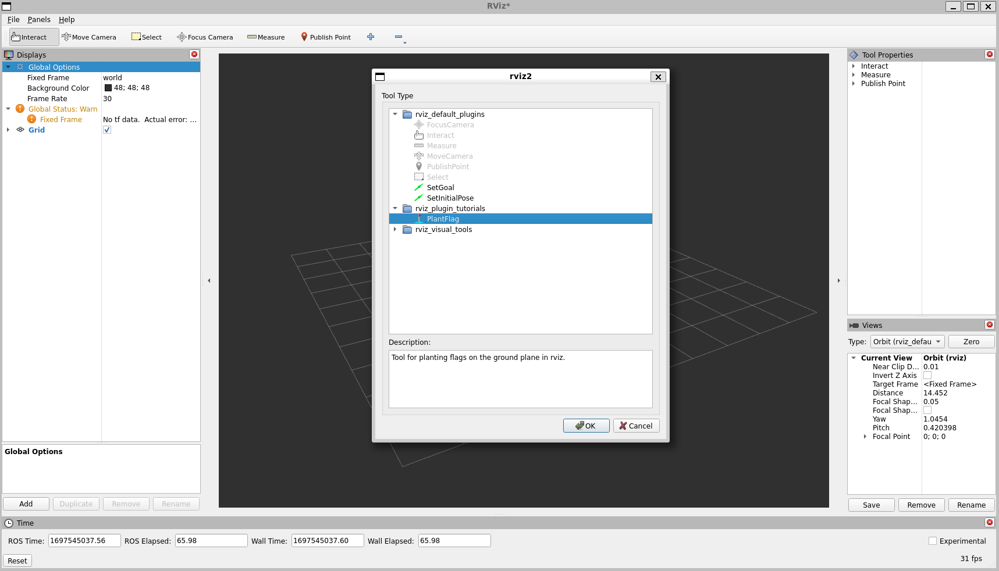

Plugins: New Tool Type
======================

**Goal:** Create a custom tool plugin for RViz

**Tutorial level:** Intermediate

**Time:** 20 Minutes

.. contents:: Contents
   :depth: 2
   :local:

Backround
---------
In RViz, a tool is a class that determines how mouse events interact with the visualizer.
In this example we describe ``PlantFlagTool`` which lets you place “flag” markers in the 3D scene.

| The source code for this tutorial is in the `rviz_plugin_tutorials package <https://github.com/ros-visualization/visualization_tutorials/tree/ros2/rviz_plugin_tutorials>`_.
| Here is an example of what the new ``PlantFlagTool`` can do:

Prerequisites
-------------

The Code
--------
The code for ``ImuDisplay`` is in these files: `plant_flag_tool.hpp <https://github.com/ros-visualization/visualization_tutorials/blob/ros2/rviz_plugin_tutorials/src/plant_flag_tool.hpp>`_,
`plant_flag_tool.cpp <https://github.com/ros-visualization/visualization_tutorials/blob/ros2/rviz_plugin_tutorials/src/plant_flag_tool.cpp>`_.

plant_flag_tool.hpp
^^^^^^^^^^^^^^^^^^^
The full source code of ``plant_flag_tool.hpp`` is here: `src/plant_flag_tool.hpp <https://github.com/ros-visualization/visualization_tutorials/blob/ros2/rviz_plugin_tutorials/src/plant_flag_tool.hpp>`_

.. code-block:: C++

    class PlantFlagTool : public rviz_common::Tool
    {
      Q_OBJECT

    public:

Here we declare our new subclass of ``rviz::Tool``.
Every tool which can be added to the tool bar is a subclass of ``rviz::Tool``.
This class uses Qt slots and is a subclass of QObject, so it needs the ``Q_OBJECT`` macro.

.. code-block:: C++

    virtual void onInitialize();
    virtual void activate();
    virtual void deactivate();

* ``onInitialize()`` is called by the superclass after ``scene_manager_`` and ``context_`` are set. It should be called only once per instantiation. This is where most one-time initialization work should be done.
* ``activate()`` is called when the tool is started by the user, either by clicking on its button in the toolbar or by pressing its hotkey.
* ``deactivate()`` is called when the tool is being turned off because another tool has been chosen.

.. code-block:: C++

    virtual int processMouseEvent(rviz_common::ViewportMouseEvent & event);

``processMouseEvent()`` is sort of the main function of a Tool, because mouse interactions are the point of Tools.

.. code-block:: C++

    private:
        void makeFlag(const Ogre::Vector3 & position);

This is a helper function to create a new flag in the Ogre scene and save its scene node in a list.

.. code-block:: C++

        td::vector<Ogre::SceneNode *> flag_nodes_;
        Ogre::SceneNode * moving_flag_node_;
        std::string flag_resource_;
        rviz_common::properties::VectorProperty * current_flag_property_;
    };
    // END_TUTORIAL

    }  // end namespace rviz_plugin_tutorials

Then we finish up with protected member variables.

plant_flag_tool.cpp
^^^^^^^^^^^^^^^^^^^
The full source code of ``plant_flag_tool.cpp`` is here: `src/plant_flag_tool.cpp <https://github.com/ros-visualization/visualization_tutorials/blob/ros2/rviz_plugin_tutorials/src/plant_flag_tool.cpp>`_

.. code-block:: C++

    PlantFlagTool::PlantFlagTool()
    : moving_flag_node_(NULL),
      current_flag_property_(NULL)
    {
        shortcut_key_ = 'l';
    }

Here we set the ``shortcut_key_`` member variable defined in the superclass to declare which key will activate the tool.

.. code-block:: C++

    PlantFlagTool::~PlantFlagTool()
    {
        for (std::size_t i = 0; i < flag_nodes_.size(); i++) {
            scene_manager_->destroySceneNode(flag_nodes_[i]);
        }
    }

The destructor destroys the Ogre scene nodes for the flags so they disappear from the 3D scene.
The destructor for a Tool subclass is only called when the tool is removed from the toolbar with the “-” button.

.. code-block:: C++

    void PlantFlagTool::onInitialize()
    {
        flag_resource_ = "package://rviz_plugin_tutorials/media/flag.dae";

        if (!rviz_rendering::loadMeshFromResource(flag_resource_)) {
            RCLCPP_ERROR(
            rclcpp::get_logger("plant_flag_tool"),
            "PlantFlagTool: failed to load model resource '%s'.",
            flag_resource_.c_str());
            return;
        }

        moving_flag_node_ = scene_manager_->getRootSceneNode()->createChildSceneNode();
        Ogre::Entity * entity = scene_manager_->createEntity(flag_resource_);
        moving_flag_node_->attachObject(entity);
        moving_flag_node_->setVisible(false);
    }

``onInitialize()`` is called during initial instantiation of the tool object.
At this point the tool has not been activated yet, so any scene objects created should be invisible or disconnected from the scene at this point.

In this case we load a mesh object with the shape and appearance of the flag, create an ``Ogre::SceneNode`` for the moving flag, and then set it invisible.

.. code-block:: C++

    void PlantFlagTool::activate()
    {
        if (moving_flag_node_) {
            moving_flag_node_->setVisible(true);

            current_flag_property_ = new rviz_common::properties::VectorProperty(
            "Flag " + QString::number(flag_nodes_.size()));
            current_flag_property_->setReadOnly(true);
            getPropertyContainer()->addChild(current_flag_property_);
        }
    }

First we set the moving flag node to be visible, then we create an ``rviz::VectorProperty`` to show the user the position of the flag.
Unlike ``rviz::Display``, ``rviz::Tool`` is not a subclass of ``rviz::Property``,
so when we want to add a tool property we need to get the parent container with ``getPropertyContainer()`` and add it to that.

We wouldn't have to set ``current_flag_property_`` to be read-only,
but if it were writable the flag should really change position when the user edits the property.
This is a fine idea, and is possible, but is left as an exercise for the reader.

.. code-block:: C++

    void PlantFlagTool::deactivate()
    {
        if (moving_flag_node_) {
            moving_flag_node_->setVisible(false);
            delete current_flag_property_;
            current_flag_property_ = NULL;
        }
    }

We make the moving flag invisible, then delete the current flag property.
Deleting a property also removes it from its parent property, so that doesn't need to be done in a separate step.
If we didn't delete it here, it would stay in the list of flags when we switch to another tool.

.. code-block:: C++

    int PlantFlagTool::processMouseEvent(rviz_common::ViewportMouseEvent & event)
    {
        if (!moving_flag_node_) {
            return Render;
        }
        auto projection_finder = std::make_shared<rviz_rendering::ViewportProjectionFinder>();
        auto projection = projection_finder->getViewportPointProjectionOnXYPlane(
            event.panel->getRenderWindow(), event.x, event.y);
        Ogre::Vector3 intersection = projection.second;
        if (projection.first) {
            moving_flag_node_->setVisible(true);
            moving_flag_node_->setPosition(intersection);
            current_flag_property_->setVector(intersection);

            if (event.leftDown()) {
                makeFlag(intersection);
                // Drop the reference so that deactivate() won't remove it.
                current_flag_property_ = NULL;
                return Render | Finished;
            }
        } else {
            // If the mouse is not pointing at the ground plane, don't show the flag.
            moving_flag_node_->setVisible(false);
        }
        return Render;
    }

We use the utility function ``rviz::getPointOnPlaneFromWindowXY()`` to see where on the ground plane the user's mouse is pointing,
then move the moving flag to that point and update the ``VectorProperty``.

If this mouse event was a left button press, we want to save the current flag location.
Therefore we make a new flag at the same place and drop the pointer to the ``VectorProperty``.
Dropping the pointer means when the tool is deactivated the VectorProperty won't be deleted, which is what we want.

.. code-block:: C++

    void PlantFlagTool::makeFlag(const Ogre::Vector3 & position)
    {
        Ogre::SceneNode * node = scene_manager_->getRootSceneNode()->createChildSceneNode();
        Ogre::Entity * entity = scene_manager_->createEntity(flag_resource_);
        node->attachObject(entity);
        node->setVisible(true);
        node->setPosition(position);
        flag_nodes_.push_back(node);
    }

This is a helper function to create a new flag in the Ogre scene and save its scene node in a list.

.. code-block:: C++

    void PlantFlagTool::save(rviz_common::Config config) const
    {
        config.mapSetValue("Class", getClassId());

Tools with a fixed set of Property objects representing adjustable parameters are typically just created in the tool's constructor
and added to the Property container (``getPropertyContainer()``).
In that case, the Tool subclass does not need to override ``load()`` and ``save()``
because the default behavior is to read all the Properties in the container from the Config object.

Here however, we have a list of named flag positions of unknown length, so we need to implement ``save()`` and ``load()`` ourselves.

We first save the class ID to the config object so the ``rviz::ToolManager`` will know what to instantiate when the config file is read back in.

.. code-block:: C++

    rviz_common::Config flags_config = config.mapMakeChild("Flags");

The top level of this tool's Config is a map, but our flags should go in a list, since they may or may not have unique keys.
Therefore we make a child of the map (``flags_config``) to store the list.

.. code-block:: C++

    rviz_common::properties::Property * container = getPropertyContainer();
    int num_children = container->numChildren();
    for (int i = 0; i < num_children; i++) {
        rviz_common::properties::Property * position_prop = container->childAt(i);

To read the positions and names of the flags, we loop over the the children of our Property container.

.. code-block:: C++

    rviz_common::Config flag_config = flags_config.listAppendNew();

For each Property, we create a new Config object representing a single flag and append it to the Config list.

.. code-block:: C++

    flag_config.mapSetValue("Name", position_prop->getName());

Into the flag's config we store its name.

.. code-block:: C++

    flag_config.mapSetValue("Name", position_prop->getName());

... and its position

.. code-block:: C++

    void PlantFlagTool::load(const rviz_common::Config & config)
    {

In a tool's ``load()`` function, we don't need to read its class because that has already been read and used to instantiate the object before this can have been called.

.. code-block:: C++

    rviz_common::Config flags_config = config.mapGetChild("Flags");
    int num_flags = flags_config.listLength();
    for (int i = 0; i < num_flags; i++) {
        rviz_common::Config flag_config = flags_config.listChildAt(i);

Here we get the "Flags" sub-config from the tool config and loop over its entries.

.. code-block:: C++

    QString name = "Flag " + QString::number(i + 1);

At this point each ``flag_config`` represents a single flag.

Here we provide a default name in case the name is not in the config file for some reason.

.. code-block:: C++

    flag_config.mapGetString("Name", &name);

Then we use the convenience function ``mapGetString()`` to read the name from flag_config if it is there.
(If no “Name” entry were present it would return false, but we don't care about that because we have already set a default.)

.. code-block:: C++

    rviz_common::properties::VectorProperty * prop =
        new rviz_common::properties::VectorProperty(name);

Given the name we can create an ``rviz::VectorProperty`` to display the position

.. code-block:: C++

    prop->load(flag_config);

Then we just tell the property to read its contents from the config, and we've read all the data.

.. code-block:: C++

            prop->setReadOnly(true);
            getPropertyContainer()->addChild(prop);
            makeFlag(prop->getVector());
        }
    }

We finish each flag by marking it read-only (as discussed above),
adding it to the property container,
and finally making an actual visible flag object in the 3D scene at the correct position.

.. code-block:: C++

    }  // end namespace rviz_plugin_tutorials

    #include "pluginlib/class_list_macros.hpp"
    PLUGINLIB_EXPORT_CLASS(rviz_plugin_tutorials::PlantFlagTool, rviz_common::Tool)

At the end of every plugin class implementation, we end the namespace and then tell ``pluginlib`` about the class.
It is important to do this in global scope, outside our package's namespace.

Building the Plugin
-------------------
Simply build the plugin using colcon in the root directory of your workspace

.. code-block:: bash

    colcon build --packages-select rviz_plugin_tutorials

Exporting the Plugin
--------------------
Please see the explanation from the previous tutorial, as it uses the exact same files. :ref:`Exporting a plugin <Exporting_a_plugin>`.

Trying it out
-------------
Once your RViz plugin is compiled and exported, simply run RViz normally.
But make sure to source you workspace in the terminal that starts and runs RViz!

.. code-block:: bash

    ros2 run rviz2 rviz2

Now RViz will use ``pluginlib`` to find all the plugins exported to it.

Add a PlantFlag tool by clicking on the “+” button in the toolbar and selecting “PlantFlag”
from the list under your plugin package name (here it is “rviz_plugin_tutorials”).

Once “PlantFlag” is in your toolbar, click it or press “l” (the shortcut key) to start planting flags.
Open the “Tool Properties” panel to see the positions of the flags you have planted.

Currently the only way to remove the flags is to delete the PlantFlag tool,
which you do by pressing the “-” (minus sign) button in the toolbar and selecting “PlantFlag”.