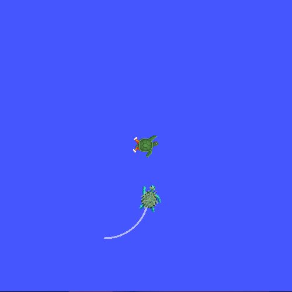

.. redirect-from::

    Tutorials/Tf2/Debugging-Tf2-Problems

.. _DebuggingTf2Problems:

Debugging
=========

**Goal:** Learn how to use a systematic approach for debugging tf2 related problems.

**Tutorial level:** Intermediate

**Time:** 10 minutes

.. contents:: Contents
   :depth: 2
   :local:

Background
----------

This tutorial walks you through the steps to debug a typical tf2 problem.
It will also use many of the tf2 debugging tools, such as ``tf2_echo``, ``tf2_monitor``, and ``view_frames``.
This tutorial assumes you have completed the :doc:`learning tf2 <./Tf2-Main>` tutorials.

Debugging example
-----------------

1 Setting and starting the example
^^^^^^^^^^^^^^^^^^^^^^^^^^^^^^^^^^

For this tutorial we will set up a demo application that has a number of problems.
The goal of this tutorial is to apply a systematic approach to find and tackle these problems.
First, let's create the source file.

Go to the ``learning_tf2_cpp`` package we created in :doc:`tf2 tutorials <./Tf2-Main>`.
Inside the ``src`` directory make a copy of the source file ``turtle_tf2_listener.cpp`` and rename it to ``turtle_tf2_listener_debug.cpp``.

Open the file using your preferred text editor, and change line 67 from

.. code-block:: C++

   std::string toFrameRel = "turtle2";

to

.. code-block:: C++

   std::string toFrameRel = "turtle3";

and change ``lookupTransform()`` call in lines 75-79 from

.. code-block:: C++

   try {
      transformStamped = tf_buffer_->lookupTransform(
        toFrameRel,
        fromFrameRel,
        tf2::TimePointZero);
   } catch (tf2::TransformException & ex) {

to

.. code-block:: C++

   try {
      transformStamped = tf_buffer_->lookupTransform(
        toFrameRel,
        fromFrameRel,
        this->now());
   } catch (tf2::TransformException & ex) {

And save changes to the file.
In order to run this demo, we need to create a launch file ``start_tf2_debug_demo.launch.py`` in the ``launch`` subdirectory of package ``learning_tf2_cpp``:

.. code-block:: python

   from launch import LaunchDescription
   from launch.actions import DeclareLaunchArgument
   from launch.substitutions import LaunchConfiguration

   from launch_ros.actions import Node

   def generate_launch_description():
      return LaunchDescription([
         DeclareLaunchArgument(
            'target_frame', default_value='turtle1',
            description='Target frame name.'
         ),
         Node(
            package='turtlesim',
            executable='turtlesim_node',
            name='sim',
            output='screen'
         ),
         Node(
            package='learning_tf2_cpp',
            executable='turtle_tf2_broadcaster',
            name='broadcaster1',
            parameters=[
                  {'turtlename': 'turtle1'}
            ]
         ),
         Node(
            package='learning_tf2_cpp',
            executable='turtle_tf2_broadcaster',
            name='broadcaster2',
            parameters=[
                  {'turtlename': 'turtle2'}
            ]
         ),
         Node(
            package='learning_tf2_cpp',
            executable='turtle_tf2_listener_debug',
            name='listener_debug',
            parameters=[
                  {'target_frame': LaunchConfiguration('target_frame')}
            ]
         ),
      ])

Don't forget to add the ``turtle_tf2_listener_debug`` executable to the ``CMakeLists.txt`` and build the package.

Now let's run it to see what happens:

.. code-block:: console

   ros2 launch learning_tf2_cpp start_tf2_debug_demo.launch.py

You will now see that the turtlesim came up.
At the same time, if you run the ``turtle_teleop_key`` in another terminal window, you can use the arrow keys to drive the ``turtle1`` around.

.. code-block:: console

   ros2 run turtlesim turtle_teleop_key

You will also notice that there is a second turtle in the lower, left corner.
If the demo would be working correctly, this second turtle should be following the turtle you can command with the arrow keys.
However, it is not the case because we have to solve some problems first.
You should notice the following message:

.. code-block:: console

   [turtle_tf2_listener_debug-4] [INFO] [1630223454.942322623] [listener_debug]: Could not
   transform turtle3 to turtle1: "turtle3" passed to lookupTransform argument target_frame
   does not exist

2 Finding the tf2 request
^^^^^^^^^^^^^^^^^^^^^^^^^

Firstly, we need to find out what exactly we are asking tf2 to do.
Therefore, we go into the part of the code that is using tf2.
Open the ``src/turtle_tf2_listener_debug.cpp`` file, and take a look at line 67:

.. code-block:: C++

   std::string to_frame_rel = "turtle3";

and lines 75-79:

.. code-block:: C++

   try {
      transformStamped = tf_buffer_->lookupTransform(
        toFrameRel,
        fromFrameRel,
        this->now());
   } catch (tf2::TransformException & ex) {

Here we do the actual request to tf2.
The three arguments tell us directly what we are asking tf2: transform from frame ``turtle3`` to frame ``turtle1`` at time ``now``.

Now, let's take a look at why this request to tf2 is failing.

3 Checking the frames
^^^^^^^^^^^^^^^^^^^^^

Firstly, to find out if tf2 knows about our transform between ``turtle3`` and ``turtle1``, we will use ``tf2_echo`` tool.

.. code-block:: console

   ros2 run tf2_ros tf2_echo turtle3 turtle1

The output tells us that frame ``turtle3`` does not exist:

.. code-block:: console

   [INFO] [1630223557.477636052] [tf2_echo]: Waiting for transform turtle3 ->  turtle1:
   Invalid frame ID "turtle3" passed to canTransform argument target_frame - frame does
   not exist

Then what frames do exist?
If you like to get a graphical representation of this, use ``view_frames`` tool.

.. code-block:: console

   ros2 run tf2_tools view_frames

Open the generated ``frames.pdf`` file to see the following output:

.. image:: images/turtlesim_frames.png

So obviously the problem is that we are requesting transform from frame ``turtle3``, which does not exist.
To fix this bug, just replace ``turtle3`` with ``turtle2`` in line 67.

And now stop the running demo, build it, and run it again:

.. code-block:: console

   ros2 launch turtle_tf2 start_debug_demo.launch.py

And right away we run into the next problem:

.. code-block:: console

   [turtle_tf2_listener_debug-4] [INFO] [1630223704.617382464] [listener_debug]: Could not
   transform turtle2 to turtle1: Lookup would require extrapolation into the future. Requested
   time 1630223704.617054 but the latest data is at time 1630223704.616726, when looking up
   transform from frame [turtle1] to frame [turtle2]

4 Checking the timestamp
^^^^^^^^^^^^^^^^^^^^^^^^

Now that we solved the frame name problem, it is time to look at the timestamps.
Remember, we are trying to get the transform between ``turtle2`` and ``turtle1`` at the current time (i.e., ``now``).
To get statistics on the timing, call ``tf2_monitor`` with corresponding frames.

.. code-block:: console

   ros2 run tf2_ros tf2_monitor turtle2 turtle1

The result should look something like this:

.. code-block:: console

   RESULTS: for turtle2 to turtle1
   Chain is: turtle1
   Net delay     avg = 0.00287347: max = 0.0167241

   Frames:
   Frame: turtle1, published by <no authority available>, Average Delay: 0.000295833, Max Delay: 0.000755072

   All Broadcasters:
   Node: <no authority available> 125.246 Hz, Average Delay: 0.000290237 Max Delay: 0.000786781

The key part here is the delay for the chain from ``turtle2`` to ``turtle1``.
The output shows there is an average delay of about 3 milliseconds.
This means that tf2 can only transform between the turtles after 3 milliseconds are passed.
So, if we would be asking tf2 for the transformation between the turtles 3 milliseconds ago instead of ``now``, tf2 would be able to give us an answer sometimes.
Let's test this quickly by changing lines 75-79 to:

.. code-block:: C++

   try {
      transformStamped = tf_buffer_->lookupTransform(
        toFrameRel,
        fromFrameRel,
        this->now() - rclcpp::Duration::from_seconds(0.1));
   } catch (tf2::TransformException & ex) {

In the new code we are asking for the transform between the turtles 100 milliseconds ago.
It is usual to use a longer periods, just to make sure that the transform will arrive.
Stop the demo, build and run:

.. code-block:: console

   ros2 launch turtle_tf2 start_debug_demo.launch.py

And you should finally see the turtle move!

That last fix we made is not really what you want to do, it was just to make sure that was our problem.
The real fix would look like this:

.. code-block:: C++

   try {
      transformStamped = tf_buffer_->lookupTransform(
        toFrameRel,
        fromFrameRel,
        tf2::TimePointZero);
   } catch (tf2::TransformException & ex) {

Or like this:

.. code-block:: C++

   try {
      transformStamped = tf_buffer_->lookupTransform(
        toFrameRel,
        fromFrameRel,
        tf2::TimePoint());
   } catch (tf2::TransformException & ex) {

You can learn more about timeouts in the :doc:`Using time <./Learning-About-Tf2-And-Time-Cpp>` tutorial, and use them as below:

.. code-block:: C++

   try {
      transformStamped = tf_buffer_->lookupTransform(
        toFrameRel,
        fromFrameRel,
        this->now(),
        rclcpp::Duration::from_seconds(0.05));
   } catch (tf2::TransformException & ex) {

Summary
-------

In this tutorial you learned how to use a systematic approach for debugging tf2 related problems.
You also learned how to use tf2 debugging tools, such as ``tf2_echo``, ``tf2_monitor``, and ``view_frames`` to help you debug those tf2 problems.
