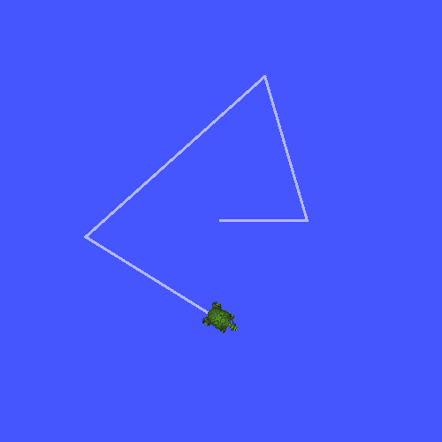

.. redirect-from::

    Tutorials/Tf2/Writing-A-Tf2-Broadcaster-Py

.. _WritingATf2BroadcasterPy:

Writing a broadcaster (Python)
==============================

**Goal:** Learn how to broadcast the state of a robot to tf2.

**Tutorial level:** Intermediate

**Time:** 15 minutes

.. contents:: Contents
   :depth: 2
   :local:

Background
----------

In the next two tutorials we will write the code to reproduce the demo from the :doc:`Introduction to tf2 <./Introduction-To-Tf2>` tutorial.
After that, following tutorials focus on extending the demo with more advanced tf2 features, including the usage of timeouts in transformation lookups and time travel.

Prerequisites
-------------

This tutorial assumes you have a working knowledge of ROS 2 and you have completed the :doc:`Introduction to tf2 tutorial <./Introduction-To-Tf2>`.
In previous tutorials, you learned how to :doc:`create a workspace <../../Beginner-Client-Libraries/Creating-A-Workspace/Creating-A-Workspace>` and :doc:`create a package <../../Beginner-Client-Libraries/Creating-Your-First-ROS2-Package>`.
You also have created the ``learning_tf2_py`` :doc:`package <./Writing-A-Tf2-Static-Broadcaster-Py>`, which is where we will continue working from.

Tasks
-----

1 Write the broadcaster node
^^^^^^^^^^^^^^^^^^^^^^^^^^^^

Let's first create the source files.
Go to the ``learning_tf2_py`` package we created in the previous tutorial.
Inside the ``src/learning_tf2_py/learning_tf2_py`` directory download the example broadcaster code by entering the following command:

.. tabs::

    .. group-tab:: Linux

        .. code-block:: console

            wget https://raw.githubusercontent.com/ros/geometry_tutorials/ros2/turtle_tf2_py/turtle_tf2_py/turtle_tf2_broadcaster.py

    .. group-tab:: macOS

        .. code-block:: console

            wget https://raw.githubusercontent.com/ros/geometry_tutorials/ros2/turtle_tf2_py/turtle_tf2_py/turtle_tf2_broadcaster.py

    .. group-tab:: Windows

        In a Windows command line prompt:

        .. code-block:: console

            curl -sk https://raw.githubusercontent.com/ros/geometry_tutorials/ros2/turtle_tf2_py/turtle_tf2_py/turtle_tf2_broadcaster.py -o turtle_tf2_broadcaster.py

        Or in powershell:

        .. code-block:: console

            curl https://raw.githubusercontent.com/ros/geometry_tutorials/ros2/turtle_tf2_py/turtle_tf2_py/turtle_tf2_broadcaster.py -o turtle_tf2_broadcaster.py

Open the file using your preferred text editor.

.. code-block:: python

    import math

    from geometry_msgs.msg import TransformStamped

    import numpy as np

    import rclpy
    from rclpy.node import Node

    from tf2_ros import TransformBroadcaster

    from turtlesim.msg import Pose

    def quaternion_from_euler(ai, aj, ak):
        ai /= 2.0
        aj /= 2.0
        ak /= 2.0
        ci = math.cos(ai)
        si = math.sin(ai)
        cj = math.cos(aj)
        sj = math.sin(aj)
        ck = math.cos(ak)
        sk = math.sin(ak)
        cc = ci*ck
        cs = ci*sk
        sc = si*ck
        ss = si*sk

        q = np.empty((4, ))
        q[0] = cj*sc - sj*cs
        q[1] = cj*ss + sj*cc
        q[2] = cj*cs - sj*sc
        q[3] = cj*cc + sj*ss

        return q

    class FramePublisher(Node):

        def __init__(self):
            super().__init__('turtle_tf2_frame_publisher')

            # Declare and acquire `turtlename` parameter
            self.turtlename = self.declare_parameter(
              'turtlename', 'turtle').get_parameter_value().string_value

            # Initialize the transform broadcaster
            self.tf_broadcaster = TransformBroadcaster(self)

            # Subscribe to a turtle{1}{2}/pose topic and call handle_turtle_pose
            # callback function on each message
            self.subscription = self.create_subscription(
                Pose,
                f'/{self.turtlename}/pose',
                self.handle_turtle_pose,
                1)
            self.subscription  # prevent unused variable warning

        def handle_turtle_pose(self, msg):
            t = TransformStamped()

            # Read message content and assign it to
            # corresponding tf variables
            t.header.stamp = self.get_clock().now().to_msg()
            t.header.frame_id = 'world'
            t.child_frame_id = self.turtlename

            # Turtle only exists in 2D, thus we get x and y translation
            # coordinates from the message and set the z coordinate to 0
            t.transform.translation.x = msg.x
            t.transform.translation.y = msg.y
            t.transform.translation.z = 0.0

            # For the same reason, turtle can only rotate around one axis
            # and this why we set rotation in x and y to 0 and obtain
            # rotation in z axis from the message
            q = quaternion_from_euler(0, 0, msg.theta)
            t.transform.rotation.x = q[0]
            t.transform.rotation.y = q[1]
            t.transform.rotation.z = q[2]
            t.transform.rotation.w = q[3]

            # Send the transformation
            self.tf_broadcaster.sendTransform(t)

    def main():
        rclpy.init()
        node = FramePublisher()
        try:
            rclpy.spin(node)
        except KeyboardInterrupt:
            pass

        rclpy.shutdown()

1.1 Examine the code
~~~~~~~~~~~~~~~~~~~~

Now, let's take a look at the code that is relevant to publishing the turtle pose to tf2.
Firstly, we define and acquire a single parameter ``turtlename``, which specifies a turtle name, e.g. ``turtle1`` or ``turtle2``.

.. code-block:: python

    self.turtlename = self.declare_parameter(
      'turtlename', 'turtle').get_parameter_value().string_value

Afterward, the node subscribes to topic ``turtleX/pose`` and runs function ``handle_turtle_pose`` on every incoming message.

.. code-block:: python

     self .subscription = self.create_subscription(
         Pose,
         f'/{self.turtlename}/pose',
         self.handle_turtle_pose,
         1)

Now, we create a ``TransformStamped`` object and give it the appropriate metadata.

#. We need to give the transform being published a timestamp, and we'll just stamp it with the current time by calling ``self.get_clock().now()``. This will return the current time used by the ``Node``.

#. Then we need to set the name of the parent frame of the link we're creating, in this case ``world``.

#. Finally, we need to set the name of the child node of the link we're creating, in this case this is the name of the turtle itself.

The handler function for the turtle pose message broadcasts this turtle's translation and rotation, and publishes it as a transform from frame ``world`` to frame ``turtleX``.

.. code-block:: python

    t = TransformStamped()

    # Read message content and assign it to
    # corresponding tf variables
    t.header.stamp = self.get_clock().now().to_msg()
    t.header.frame_id = 'world'
    t.child_frame_id = self.turtlename

Here we copy the information from the 3D turtle pose into the 3D transform.

.. code-block:: python

    # Turtle only exists in 2D, thus we get x and y translation
    # coordinates from the message and set the z coordinate to 0
    t.transform.translation.x = msg.x
    t.transform.translation.y = msg.y
    t.transform.translation.z = 0.0

    # For the same reason, turtle can only rotate around one axis
    # and this why we set rotation in x and y to 0 and obtain
    # rotation in z axis from the message
    q = quaternion_from_euler(0, 0, msg.theta)
    t.transform.rotation.x = q[0]
    t.transform.rotation.y = q[1]
    t.transform.rotation.z = q[2]
    t.transform.rotation.w = q[3]

Finally we take the transform that we constructed and pass it to the ``sendTransform`` method of the ``TransformBroadcaster`` that will take care of broadcasting.

.. code-block:: python

    # Send the transformation
    self.tf_broadcaster.sendTransform(t)

.. note::

    You can also publish static transforms with the same pattern by instantiating a ``tf2_ros.StaticTransformBroadcaster`` instead of a ``tf2_ros.TransformBroadcaster``.
    The static transforms will be published on the ``/tf_static`` topic and will be sent only when required, not periodically.
    For more details see :doc:`here <./Writing-A-Tf2-Static-Broadcaster-Py>`.

1.2 Add an entry point
~~~~~~~~~~~~~~~~~~~~~~

To allow the ``ros2 run`` command to run your node, you must add the entry point
to ``setup.py`` (located in the ``src/learning_tf2_py`` directory).

Finally, add the following line between the ``'console_scripts':`` brackets:

.. code-block:: python

    'turtle_tf2_broadcaster = learning_tf2_py.turtle_tf2_broadcaster:main',

2 Write the launch file
^^^^^^^^^^^^^^^^^^^^^^^

Now create a launch file for this demo.
With your text editor, create a new file called ``turtle_tf2_demo.launch.py`` in the ``launch`` folder, and add the following lines:

.. code-block:: python

    from launch import LaunchDescription
    from launch_ros.actions import Node

    def generate_launch_description():
        return LaunchDescription([
            Node(
                package='turtlesim',
                executable='turtlesim_node',
                name='sim'
            ),
            Node(
                package='learning_tf2_py',
                executable='turtle_tf2_broadcaster',
                name='broadcaster1',
                parameters=[
                    {'turtlename': 'turtle1'}
                ]
            ),
        ])

2.1 Examine the code
~~~~~~~~~~~~~~~~~~~~

First we import required modules from the ``launch`` and ``launch_ros`` packages.
It should be noted that ``launch`` is a generic launching framework (not ROS 2 specific) and ``launch_ros`` has ROS 2 specific things, like nodes that we import here.

.. code-block:: python

    from launch import LaunchDescription
    from launch_ros.actions import Node

Now we run our nodes that start the turtlesim simulation and broadcast ``turtle1`` state to the tf2 using our ``turtle_tf2_broadcaster`` node.

.. code-block:: python

    Node(
        package='turtlesim',
        executable='turtlesim_node',
        name='sim'
    ),
    Node(
        package='learning_tf2_py',
        executable='turtle_tf2_broadcaster',
        name='broadcaster1',
        parameters=[
            {'turtlename': 'turtle1'}
        ]
    ),

2.2 Add dependencies
~~~~~~~~~~~~~~~~~~~~

Navigate one level back to the ``src/learning_tf2_py`` directory, where the ``setup.py``, ``setup.cfg``, and ``package.xml`` files are located.

Open ``package.xml`` with your text editor.
Add the following dependencies corresponding to your launch file's import statements:

.. code-block:: xml

    <exec_depend>launch</exec_depend>
    <exec_depend>launch_ros</exec_depend>

This declares the additional required ``launch`` and ``launch_ros`` dependencies when its code is executed.

Make sure to save the file.

2.3 Update setup.py
~~~~~~~~~~~~~~~~~~~

Reopen ``setup.py`` and add the line so that the launch files from the ``launch/`` folder would be installed.
The ``data_files`` field should now look like this:

.. code-block:: python

    data_files=[
        ...
        (os.path.join('share', package_name, 'launch'), glob(os.path.join('launch', '*launch.[pxy][yma]*'))),
    ],

Also add the appropriate imports at the top of the file:

.. code-block:: python

    import os
    from glob import glob

You can learn more about creating launch files in :doc:`this tutorial <../Launch/Creating-Launch-Files>`.

3 Build
^^^^^^^

Run ``rosdep`` in the root of your workspace to check for missing dependencies.

.. tabs::

   .. group-tab:: Linux

      .. code-block:: console

          rosdep install -i --from-path src --rosdistro {DISTRO} -y

   .. group-tab:: macOS

        rosdep only runs on Linux, so you will need to install ``geometry_msgs`` and ``turtlesim`` dependencies yourself

   .. group-tab:: Windows

        rosdep only runs on Linux, so you will need to install ``geometry_msgs`` and ``turtlesim`` dependencies yourself

Still in the root of your workspace, build your package:

.. tabs::

  .. group-tab:: Linux

    .. code-block:: console

        colcon build --packages-select learning_tf2_py

  .. group-tab:: macOS

    .. code-block:: console

        colcon build --packages-select learning_tf2_py

  .. group-tab:: Windows

    .. code-block:: console

        colcon build --merge-install --packages-select learning_tf2_py

Open a new terminal, navigate to the root of your workspace, and source the setup files:

.. tabs::

  .. group-tab:: Linux

    .. code-block:: console

        . install/setup.bash

  .. group-tab:: macOS

    .. code-block:: console

        . install/setup.bash

  .. group-tab:: Windows

    .. code-block:: console

        # CMD
        call install\setup.bat

        # Powershell
        .\install\setup.ps1

4 Run
^^^^^

Now run the launch file that will start the turtlesim simulation node and ``turtle_tf2_broadcaster`` node:

.. code-block:: console

    ros2 launch learning_tf2_py turtle_tf2_demo.launch.py

In the second terminal window type the following command:

.. code-block:: console

    ros2 run turtlesim turtle_teleop_key

You will now see that the turtlesim simulation have started with one turtle that you can control.

Now, use the ``tf2_echo`` tool to check if the turtle pose is actually getting broadcast to tf2:

.. code-block:: console

    ros2 run tf2_ros tf2_echo world turtle1

This should show you the pose of the first turtle.
Drive around the turtle using the arrow keys (make sure your ``turtle_teleop_key`` terminal window is active, not your simulator window).
In your console output you will see something similar to this:

.. code-block:: console

    At time 1625137663.912474878
    - Translation: [5.276, 7.930, 0.000]
    - Rotation: in Quaternion [0.000, 0.000, 0.934, -0.357]
    At time 1625137664.950813527
    - Translation: [3.750, 6.563, 0.000]
    - Rotation: in Quaternion [0.000, 0.000, 0.934, -0.357]
    At time 1625137665.906280726
    - Translation: [2.320, 5.282, 0.000]
    - Rotation: in Quaternion [0.000, 0.000, 0.934, -0.357]
    At time 1625137666.850775673
    - Translation: [2.153, 5.133, 0.000]
    - Rotation: in Quaternion [0.000, 0.000, -0.365, 0.931]

If you run ``tf2_echo`` for the transform between the ``world`` and ``turtle2``, you should not see a transform, because the second turtle is not there yet.
However, as soon as we add the second turtle in the next tutorial, the pose of ``turtle2`` will be broadcast to tf2.

Summary
-------

In this tutorial you learned how to broadcast the pose of the robot (position and orientation of the turtle) to tf2 and how to use the ``tf2_echo`` tool.
To actually use the transforms broadcasted to tf2, you should move on to the next tutorial about creating a :doc:`tf2 listener <./Writing-A-Tf2-Listener-Py>`.
