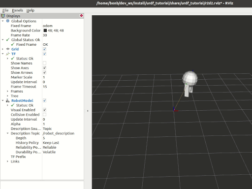

.. redirect-from::

    Tutorials/URDF/Using-URDF-with-Robot-State-Publisher

.. _URDFPlusRSP:

Using URDF with ``robot_state_publisher``
=========================================

**Goal:** Simulate a walking robot modeled in URDF and view it in Rviz.

**Tutorial level:** Intermediate

**Time:** 15 minutes

.. contents:: Contents
   :depth: 2
   :local:

Background
----------

This tutorial will show you how to model a walking robot, publish the state as a tf2 message and view the simulation in Rviz.
First, we create the URDF model describing the robot assembly.
Next we write a node which simulates the motion and publishes the JointState and transforms.
We then use ``robot_state_publisher`` to publish the entire robot state to ``/tf2``.

Prerequisites
-------------

- `rviz2 <https://index.ros.org/p/rviz2/>`__

As always, don’t forget to source ROS 2 in :doc:`every new terminal you open <../../Beginner-CLI-Tools/Configuring-ROS2-Environment>`.

Tasks
-----

1 Create a package
^^^^^^^^^^^^^^^^^^
Create the directory:

.. tabs::

  .. group-tab:: Linux

    .. code-block:: console

      mkdir -p second_ros2_ws/src

  .. group-tab:: macOS

    .. code-block:: console

      mkdir -p second_ros2_ws/src

  .. group-tab:: Windows

    .. code-block:: console

      md second_ros2_ws/src

Then create the package:

.. code-block:: console

    cd second_ros2_ws/src
    ros2 pkg create --build-type ament_python --license Apache-2.0 urdf_tutorial_r2d2 --dependencies rclpy
    cd urdf_tutorial_r2d2

You should now see a ``urdf_tutorial_r2d2`` folder.
Next you will make several changes to it.

2 Create the URDF File
^^^^^^^^^^^^^^^^^^^^^^

Create the directory where we will store some assets:

.. tabs::

  .. group-tab:: Linux

    .. code-block:: console

      mkdir -p urdf

  .. group-tab:: macOS

    .. code-block:: console

      mkdir -p urdf

  .. group-tab:: Windows

    .. code-block:: console

      md urdf

Download the :download:`URDF file <documents/r2d2.urdf.xml>` and save it as ``second_ros2_ws/src/urdf_tutorial_r2d2/urdf/r2d2.urdf.xml``.
Download the :download:`Rviz configuration file <documents/r2d2.rviz>` and save it as ``second_ros2_ws/src/urdf_tutorial_r2d2/urdf/r2d2.rviz``.

3 Publish the state
^^^^^^^^^^^^^^^^^^^

Now we need a method for specifying what state the robot is in.
To do this, we must specify all three joints and the overall odometry.

Fire up your favorite editor and paste the following code into ``second_ros2_ws/src/urdf_tutorial_r2d2/urdf_tutorial_r2d2/state_publisher.py``

.. code-block:: python

  from math import sin, cos, pi
  import rclpy
  from rclpy.executors import ExternalShutdownException
  from rclpy.node import Node
  from rclpy.qos import QoSProfile
  from geometry_msgs.msg import Quaternion
  from sensor_msgs.msg import JointState
  from tf2_ros import TransformBroadcaster, TransformStamped

  class StatePublisher(Node):

      def __init__(self):
          super().__init__('state_publisher')

          qos_profile = QoSProfile(depth=10)
          self.joint_pub = self.create_publisher(JointState, 'joint_states', qos_profile)
          self.broadcaster = TransformBroadcaster(self, qos=qos_profile)
          self.timer = self.create_timer(1/30, self.update)

          self.degree = pi / 180.0

          # robot state
          self.tilt = 0.
          self.tinc = self.degree
          self.swivel = 0.
          self.angle = 0.
          self.height = 0.
          self.hinc = 0.005

          # message declarations
          self.odom_trans = TransformStamped()
          self.odom_trans.header.frame_id = 'odom'
          self.odom_trans.child_frame_id = 'axis'
          self.joint_state = JointState()

          self.get_logger().info("{0} started".format(self.get_name()))

      def update(self):
          # update joint_state
          now = self.get_clock().now()
          self.joint_state.header.stamp = now.to_msg()
          self.joint_state.name = ['swivel', 'tilt', 'periscope']
          self.joint_state.position = [self.swivel, self.tilt, self.height]

          # update transform
          # (moving in a circle with radius=2)
          self.odom_trans.header.stamp = now.to_msg()
          self.odom_trans.transform.translation.x = cos(self.angle)*2
          self.odom_trans.transform.translation.y = sin(self.angle)*2
          self.odom_trans.transform.translation.z = 0.7
          self.odom_trans.transform.rotation = \
              euler_to_quaternion(0, 0, self.angle + pi/2) # roll,pitch,yaw

          # send the joint state and transform
          self.joint_pub.publish(self.joint_state)
          self.broadcaster.sendTransform(self.odom_trans)

          # Create new robot state
          self.tilt += self.tinc
          if self.tilt < -0.5 or self.tilt > 0.0:
              self.tinc *= -1
          self.height += self.hinc
          if self.height > 0.2 or self.height < 0.0:
              self.hinc *= -1
          self.swivel += self.degree
          self.angle += self.degree/4

  def euler_to_quaternion(roll, pitch, yaw):
      qx = sin(roll/2) * cos(pitch/2) * cos(yaw/2) - cos(roll/2) * sin(pitch/2) * sin(yaw/2)
      qy = cos(roll/2) * sin(pitch/2) * cos(yaw/2) + sin(roll/2) * cos(pitch/2) * sin(yaw/2)
      qz = cos(roll/2) * cos(pitch/2) * sin(yaw/2) - sin(roll/2) * sin(pitch/2) * cos(yaw/2)
      qw = cos(roll/2) * cos(pitch/2) * cos(yaw/2) + sin(roll/2) * sin(pitch/2) * sin(yaw/2)
      return Quaternion(x=qx, y=qy, z=qz, w=qw)

  def main():
      try:
          with rclpy.init():
              node = StatePublisher()
              rclpy.spin(node)
      except (KeyboardInterrupt, ExternalShutdownException):
          pass

  if __name__ == '__main__':
      main()

4 Create a launch file
^^^^^^^^^^^^^^^^^^^^^^

Create a new ``second_ros2_ws/src/urdf_tutorial_r2d2/launch`` folder.
Open your editor and paste the following code, saving it as ``second_ros2_ws/src/urdf_tutorial_r2d2/launch/demo_launch.py``

.. code-block:: python

  import os
  from ament_index_python.packages import get_package_share_directory
  from launch import LaunchDescription
  from launch.actions import DeclareLaunchArgument
  from launch.substitutions import LaunchConfiguration
  from launch_ros.actions import Node

  def generate_launch_description():

      use_sim_time = LaunchConfiguration('use_sim_time', default='false')

      urdf_file_name = 'r2d2.urdf.xml'
      urdf = os.path.join(
          get_package_share_directory('urdf_tutorial_r2d2'),
          urdf_file_name)
      with open(urdf, 'r') as infp:
          robot_desc = infp.read()

      return LaunchDescription([
          DeclareLaunchArgument(
              'use_sim_time',
              default_value='false',
              description='Use simulation (Gazebo) clock if true'),
          Node(
              package='robot_state_publisher',
              executable='robot_state_publisher',
              name='robot_state_publisher',
              output='screen',
              parameters=[{'use_sim_time': use_sim_time, 'robot_description': robot_desc}],
              arguments=[urdf]),
          Node(
              package='urdf_tutorial_r2d2',
              executable='state_publisher',
              name='state_publisher',
              output='screen'),
      ])

5 Edit the setup.py file
^^^^^^^^^^^^^^^^^^^^^^^^

You must tell the **colcon** build tool how to install your Python package.
Edit the ``second_ros2_ws/src/urdf_tutorial_r2d2/setup.py`` file as follows:

- include these import statements

.. code-block:: python

  import os
  from glob import glob
  from setuptools import setup
  from setuptools import find_packages

- append these 2 lines inside ``data_files``

.. code-block:: python

  data_files=[
    ...
    (os.path.join('share', package_name, 'launch'), glob(os.path.join('launch', '*launch.[pxy][yma]*'))),
    (os.path.join('share', package_name), glob('urdf/*')),
  ],

- modify the ``entry_points`` table so you can later run 'state_publisher' from a console

.. code-block:: python

        'console_scripts': [
            'state_publisher = urdf_tutorial_r2d2.state_publisher:main'
        ],

Save the ``setup.py`` file with your changes.

6 Install the package
^^^^^^^^^^^^^^^^^^^^^
.. code-block:: console

    cd second_ros2_ws
    colcon build --symlink-install --packages-select urdf_tutorial_r2d2

Source the setup files:

.. tabs::

  .. group-tab:: Linux

    .. code-block:: console

      source install/setup.bash

  .. group-tab:: macOS

    .. code-block:: console

      source install/setup.bash

  .. group-tab:: Windows

    .. code-block:: console

      call install/setup.bat

7 View the results
^^^^^^^^^^^^^^^^^^

Launch the package

.. code-block:: console

  ros2 launch urdf_tutorial_r2d2 demo_launch.py

Open a new terminal, the run Rviz using

.. code-block:: console

  rviz2 -d second_ros2_ws/install/urdf_tutorial_r2d2/share/urdf_tutorial_r2d2/r2d2.rviz

See the `User Guide <http://wiki.ros.org/rviz/UserGuide>`__ for details on how to use Rviz.

Summary
-------

You created a ``JointState`` publisher node and coupled it with ``robot_state_publisher`` to simulate a walking robot.
The code used in these examples is originally from `here <https://github.com/benbongalon/ros2-migration/tree/master/urdf_tutorial>`__.

Credit is given to the authors of this
`ROS 1 tutorial <http://wiki.ros.org/urdf/Tutorials/Using%20urdf%20with%20robot_state_publisher>`__
from which some content was reused.
