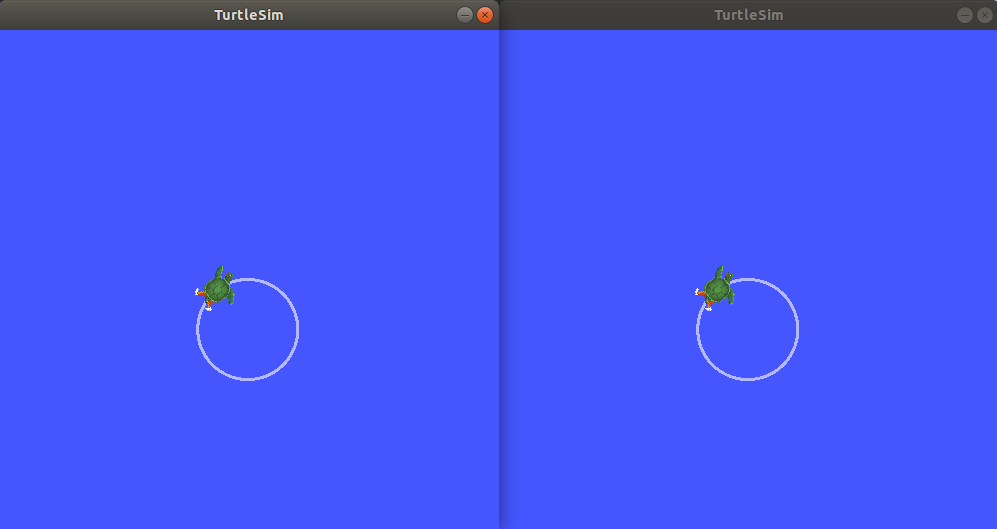
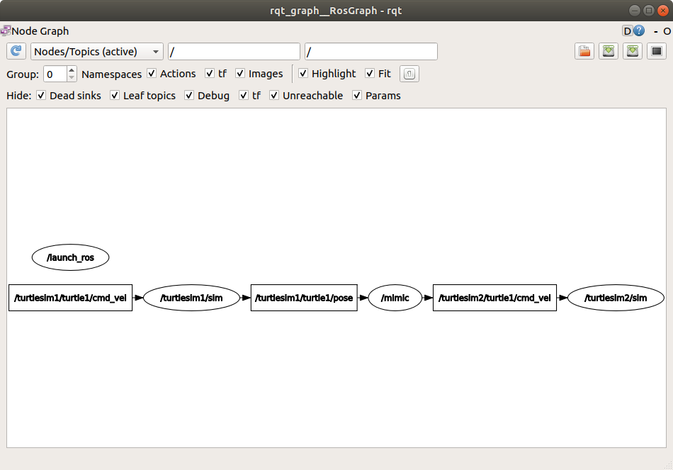

.. _ROS2Launch:

Creating a launch file
======================

**Goal:** Create a launch file to run a complex ROS 2 system.

**Tutorial level:** Beginner

**Time:** 10 minutes

.. contents:: Contents
   :depth: 2
   :local:

Background
----------

In the tutorials up until now, you have been opening new terminals for every new node you run.
As you create more complex systems with more and more nodes running simultaneously, opening terminals and reentering configuration details becomes tedious.

Launch files allow you to start up and configure a number of executables containing ROS 2 nodes simultaneously.

Running a single launch file with the ``ros2 launch`` command will start up your entire system - all nodes and their configurations - at once.

Prerequisites
-------------

This tutorial uses the :ref:`rqt_graph and turtlesim <Turtlesim>` packages.

You will also need to use a text editor of your preference.

As always, don’t forget to source ROS 2 in :ref:`every new terminal you open <ConfigROS2>`.

Tasks
-----

1 Setup
^^^^^^^

Create a new directory to store your launch file:

.. code-block:: console

  mkdir launch

Create a launch file named ``turtlesim_mimic_launch.py`` by entering the following command in the terminal:

.. tabs::

   .. group-tab:: Linux

      .. code-block:: console

        touch launch/turtlesim_mimic_launch.py

   .. group-tab:: macOS

      .. code-block:: console

        touch launch/turtlesim_mimic_launch.py

   .. group-tab:: Windows

      .. code-block:: console

        type nul > launch/turtlesim_mimic_launch.py

You can also go into your system’s file directory using the GUI and create a new file that way.

Open the new file in your preferred text editor.

2 Write the launch file
^^^^^^^^^^^^^^^^^^^^^^^

Let’s put together a ROS 2 launch file using the ``turtlesim`` package and its executables.

Copy and paste the complete code into the ``turtlesim_mimic_launch.py`` file:

.. code-block:: python

    from launch import LaunchDescription
    from launch_ros.actions import Node

    def generate_launch_description():
        return LaunchDescription([
            Node(
                package='turtlesim',
                namespace='turtlesim1',
                executable='turtlesim_node',
                name='sim'
            ),
            Node(
                package='turtlesim',
                namespace='turtlesim2',
                executable='turtlesim_node',
                name='sim'
            ),
            Node(
                package='turtlesim',
                executable='mimic',
                name='mimic',
                remappings=[
                    ('/input/pose', '/turtlesim1/turtle1/pose'),
                    ('/output/cmd_vel', '/turtlesim2/turtle1/cmd_vel'),
                ]
            )
        ])

2.1 Examine the launch file
~~~~~~~~~~~~~~~~~~~~~~~~~~~

These import statements pull in some Python ``launch`` modules.

.. code-block:: python

    from launch import LaunchDescription
    from launch_ros.actions import Node

Next, the launch description itself begins:

.. code-block:: python

   def generate_launch_description():
      return LaunchDescription([

      ])

Within the ``LaunchDescription`` is a system of three nodes, all from the ``turtlesim`` package.
The goal of the system is to launch two turtlesim windows, and have one turtle mimic the movements of the other.

The first two actions in the launch description launch two turtlesim windows:

.. code-block:: python

       Node(
           package='turtlesim',
           namespace='turtlesim1',
           executable='turtlesim_node',
           name='sim'
       ),
       Node(
           package='turtlesim',
           namespace='turtlesim2',
           executable='turtlesim_node',
           name='sim'
       ),

Note the only difference between the two nodes is their namespace values.
Unique namespaces allow the system to start two simulators without node name nor topic name conflicts.

Both turtles in this system receive commands over the same topic and publish their pose over the same topic.
Without unique namespaces, there would be no way to distinguish between messages meant for one turtle or the other.

The final node is also from the ``turtlesim`` package, but a different executable: ``mimic``.

.. code-block:: python

      Node(
          package='turtlesim',
          executable='mimic',
          name='mimic',
          remappings=[
            ('/input/pose', '/turtlesim1/turtle1/pose'),
            ('/output/cmd_vel', '/turtlesim2/turtle1/cmd_vel'),
          ]
      )

This node has added configuration details in the form of remappings.

``mimic``'s ``/input/pose`` topic is remapped to ``/turtlesim1/turtle1/pose`` and it's ``/output/cmd_vel`` topic to ``/turtlesim2/turtle1/cmd_vel``.
This means ``mimic`` will subscribe to ``/turtlesim1/sim``'s pose topic and republish it for ``/turtlesim2/sim``'s velocity command topic to subscribe to.
In other words, ``turtlesim2`` will mimic ``turtlesim1``'s movements.

3 ros2 launch
^^^^^^^^^^^^^

To launch ``turtlesim_mimic_launch.py``, enter into the directory you created earlier and run the following command:

.. code-block:: console

  cd launch
  ros2 launch turtlesim_mimic_launch.py

.. note::

  It is possible to launch a launch file directly (as we do above), or provided by a package.
  When it is provided by a package, the syntax is:

  .. code-block:: console

      ros2 launch <package_name> <launch_file_name>

  You will learn more about :ref:`creating packages <CreatePkg>` in a later tutorial.

Two turtlesim windows will open, and you will see the following ``[INFO]`` messages telling you which nodes your launch file has started:

.. code-block:: console

  [INFO] [launch]: Default logging verbosity is set to INFO
  [INFO] [turtlesim_node-1]: process started with pid [11714]
  [INFO] [turtlesim_node-2]: process started with pid [11715]
  [INFO] [mimic-3]: process started with pid [11716]

To see the system in action, open a new terminal and run the ``ros2 topic pub`` command on the ``/turtlesim1/turtle1/cmd_vel`` topic to get the first turtle moving:

.. code-block:: console

  ros2 topic pub -r 1 /turtlesim1/turtle1/cmd_vel geometry_msgs/msg/Twist "{linear: {x: 2.0, y: 0.0, z: 0.0}, angular: {x: 0.0, y: 0.0, z: -1.8}}"

You will see both turtles following the same path.

4 Introspect the system with rqt_graph
^^^^^^^^^^^^^^^^^^^^^^^^^^^^^^^^^^^^^^

While the system is still running, open a new terminal and run ``rqt_graph`` to get a better idea of the relationship between the nodes in your launch file.

Run the command:

.. code-block:: console

  rqt_graph

A hidden node (the ``ros2 topic pub`` command you ran) is publishing data to the ``/turtlesim1/turtle1/cmd_vel`` topic on the left, which the ``/turtlesim1/sim`` node is subscribed to.
The rest of the graph shows what was described earlier: ``mimic`` is subscribed to ``/turtlesim1/sim``'s pose topic, and publishes to ``/turtlesim2/sim``'s velocity command topic.

Summary
-------

Launch files simplify running complex systems with many nodes and specific configuration details.
You can create launch files using Python, and run them using the ``ros2 launch`` command.

Next steps
----------

In the next tutorial, :ref:`ROS2Bag`, you'll learn about another helpful tool, ``ros2bag``.
