.. redirect-from::

    Tutorials/Building-ROS2-Package-with-eclipse-2021-06

Building a package with Eclipse 2021-06
=======================================

.. contents:: Table of Contents
   :depth: 2
   :local:

You cannot create a ROS 2 package with eclipse, you need to create it with commandline tools.
Follow the :doc:`Create a package <../Beginner-Client-Libraries/Creating-Your-First-ROS2-Package>` tutorial.

After you created your project, you can edit the source code and build it with eclipse.

We start eclipse and select a eclipse-workspace.

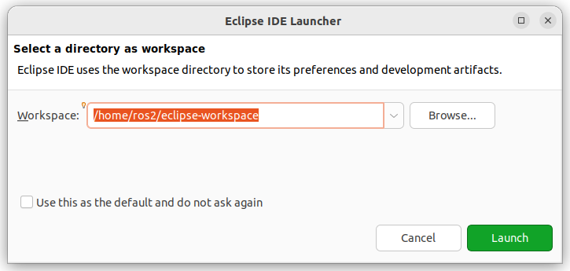

We create a C++ project

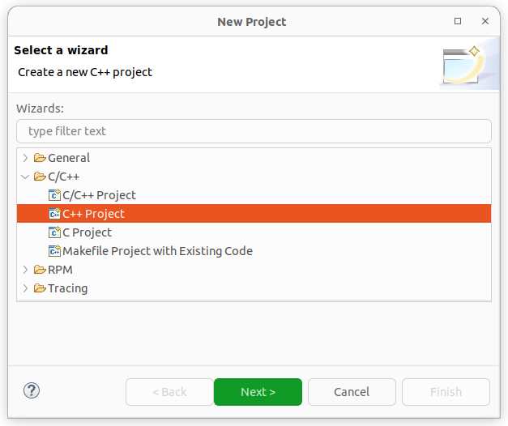

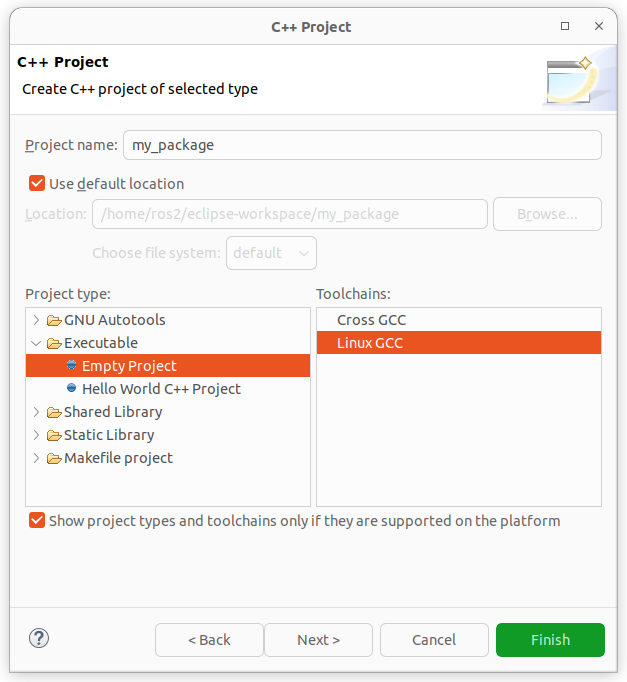

We see that we got C++ includes.

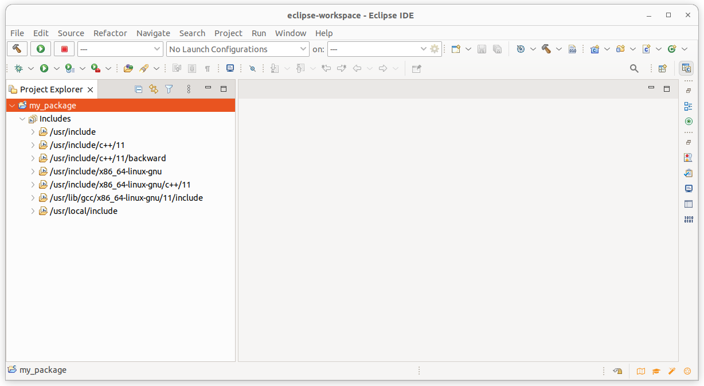

We now import our ROS 2 project. The code is still in the old place.

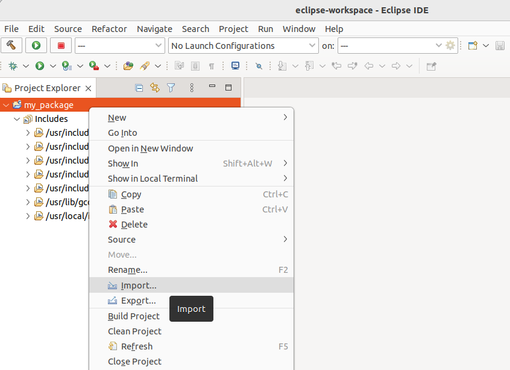

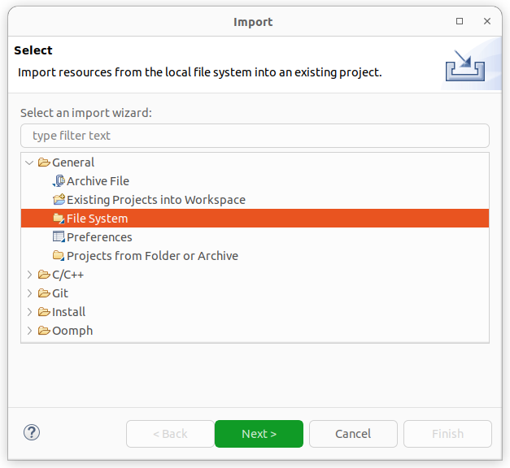

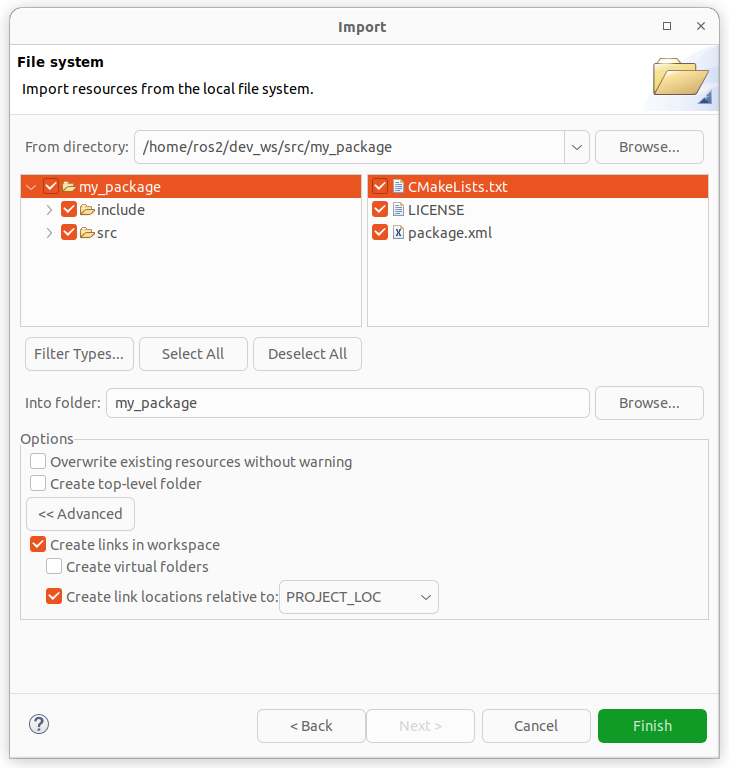

We see in the source code that the C++ includes got resolved but not the ROS 2 ones.

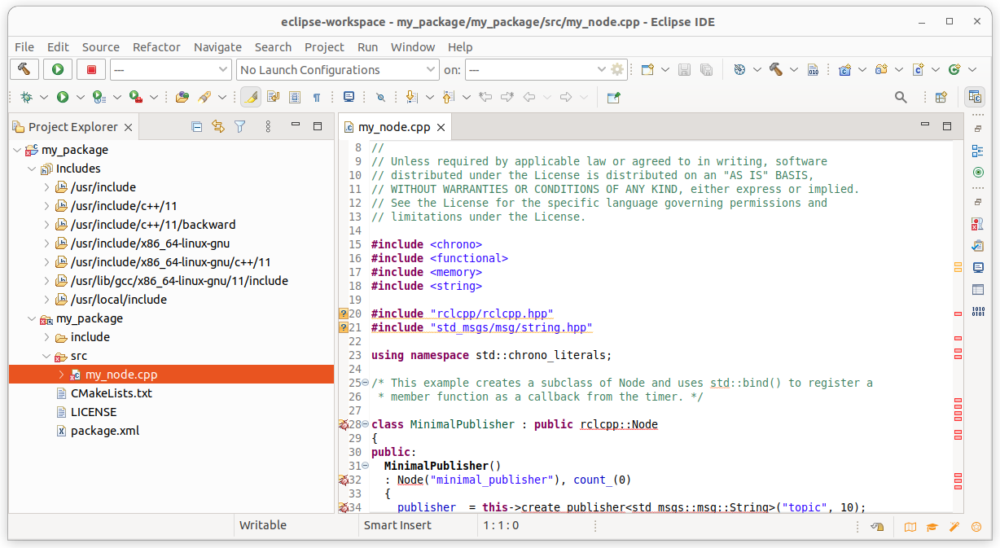

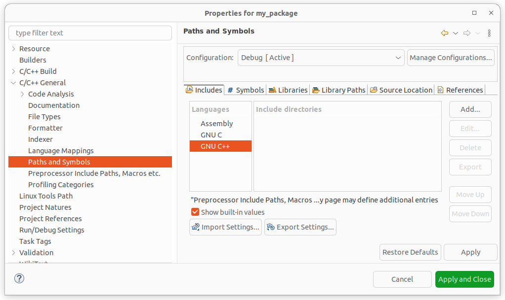

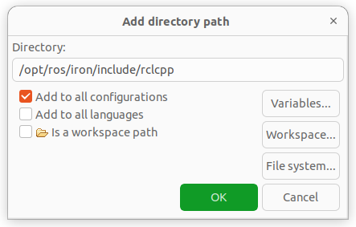

We now see that the ROS 2 includes got resolved too.

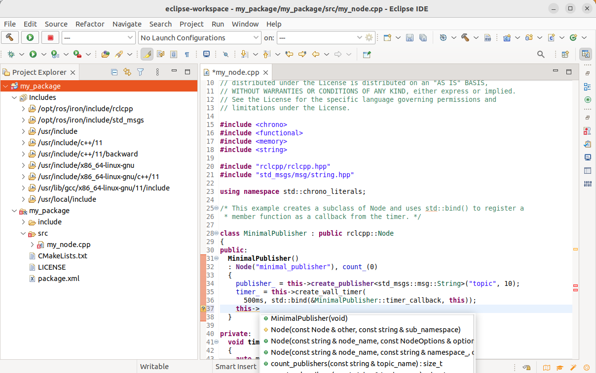

Adding Builder colcon, so that we can build with right-click on project and "Build project".

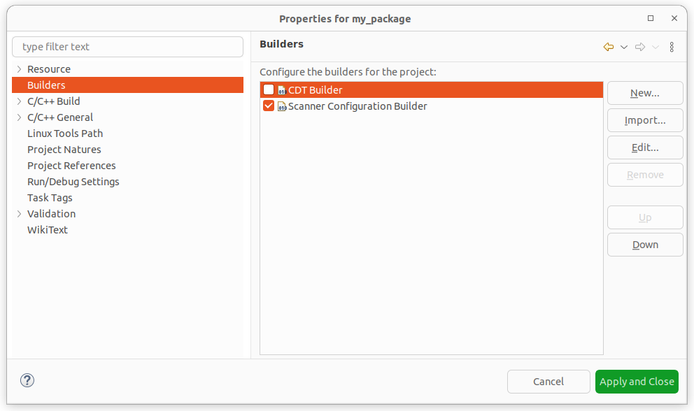

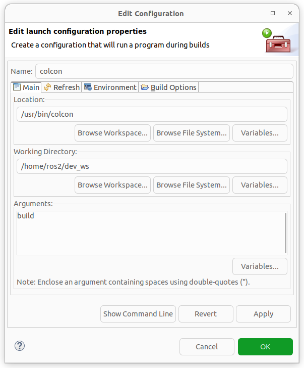

With PYTHONPATH you can also build python projects.

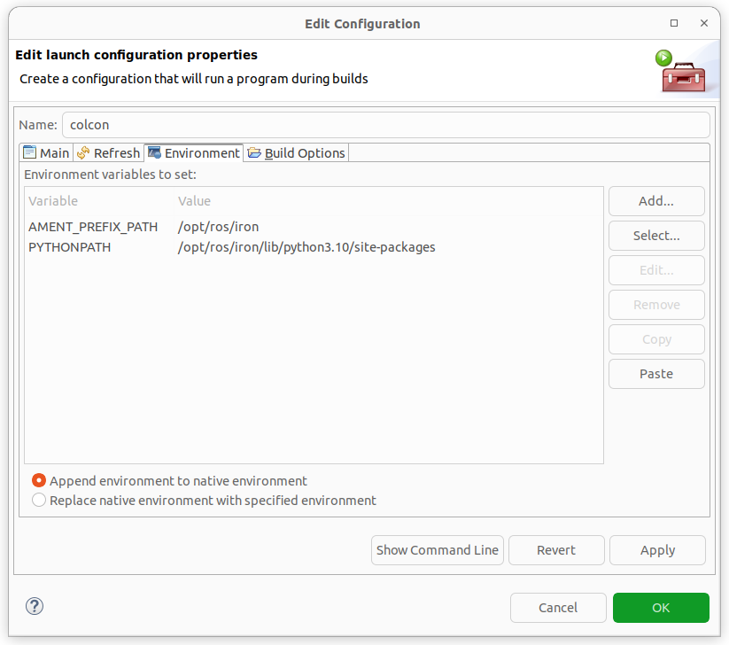

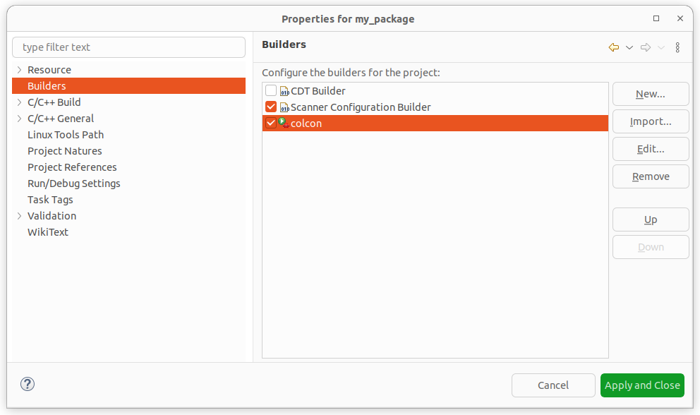

Right-click on the project and select "Build Project".

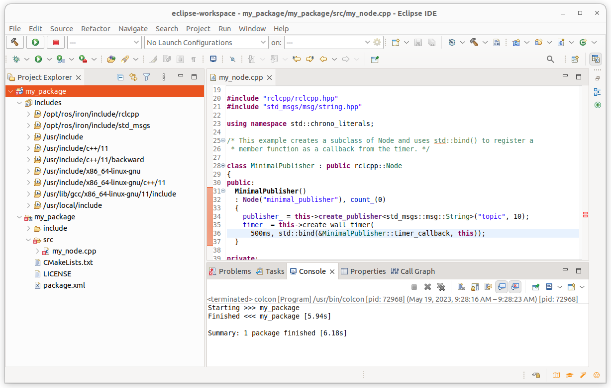
