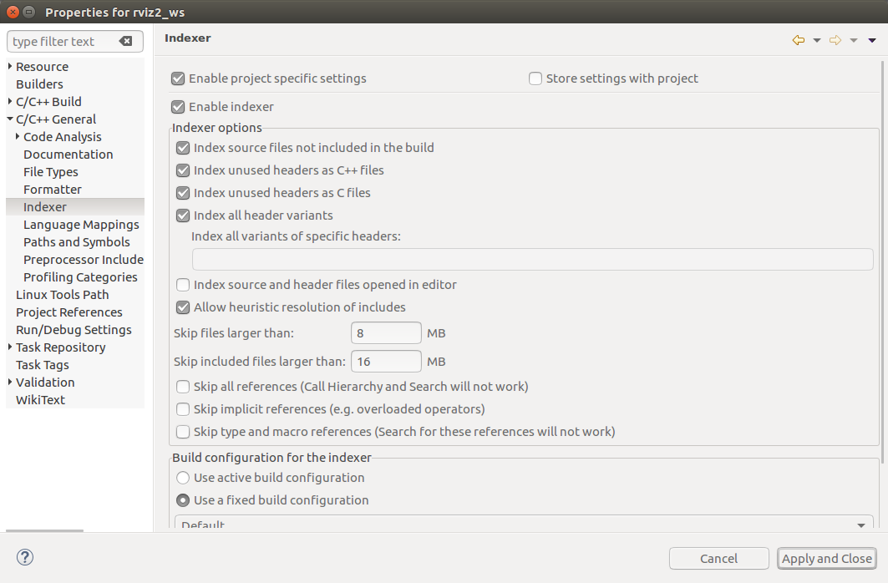

.. redirect-from::

    Eclipse-Oxygen-with-ROS-2-and-rviz2
    Tutorials/Eclipse-Oxygen-with-ROS-2-and-rviz2

Using Eclipse Oxygen with ``rviz2`` [community-contributed]
===========================================================

.. contents:: Table of Contents
   :depth: 1
   :local:

Setup
-----

This tutorial assumes Eclipse Oxygen, git, and Egit (http://www.eclipse.org/egit/download/) are already installed.

Throughout the tutorial we name the eclipse workspace the same name as the ros2 package, but this is not required.

HINT: We use nested projects and one Eclipse Workspace for each ROS-2 package.

.. image:: images/eclipse-oxygen-01.png

Create a C++ Project.

.. image:: images/eclipse-oxygen-03.png

Choose the ROS 2 package name as the Project Name.
Choose a Makefile Project and Other Toolchain.

Click on Finish

Our project should be shown in the "Project Explorer".

Inside our Project create a folder called "src".

.. image:: images/eclipse-oxygen-07.png

Import a git repository.

.. image:: images/eclipse-oxygen-08.png

Put in the repository URL.

IMPORTANT: Use the source folder of the project we created before as the destination folder.

HINT: If you ran into problems choosing the destination folder path, the Eclipse Dialog needs a name in the name field.

.. image:: images/eclipse-oxygen-10.png

Import using the new project wizard.

.. image:: images/eclipse-oxygen-11.png

Create a General->Project.

Use the git repository name as the project name.
IMPORTANT: Use the folder we cloned the git repository in as the "Location".

.. image:: images/eclipse-oxygen-13.png

The git project and the new project should be visible in the Project Explorer view.
The same files are listed multiple times, but only one project is linked with Egit.

Repeat this procedure again.
Import git repository pluginlib.

IMPORTANT: Use a folder inside the source folder as "Destination->Directory".

IMPORTANT: Use the folder we cloned the git repository in as the location for the new project.

.. image:: images/eclipse-oxygen-17.png

Run the same procedure with the tinyxml2_vendor git repository.

IMPORTANT: Again use a folder inside the source folder.

.. image:: images/eclipse-oxygen-19.png

IMPORTANT: Use the location of the folder we cloned as the new project folder.

.. image:: images/eclipse-oxygen-20.png

Now all four Projects should be visible in the Project Explorer view.

Clicking in the top right cornder for the Project Explorer view allows us to change the Project Presentation to Hierarchical view.
Now it looks like a ROS-2 project as it is on the hard drive.
But this view loses the linkage to Egit, so use the Flat Project Presentation.
The Egit linkage is good if you want to see e.g. which author wrote which code-line, etc.

Go to "C/C++ build"-section and put "ament" into "Build command".

.. image:: images/eclipse-oxygen-23.png

Go to "Behavior" tab and unselect "clean" and put "build" into Build textbox.

Before "Build project" will work, we need to close Eclipse.
Open a shell and source the ROS-2 setup.bash file, then cd into the directory of the eclipse project (here: /home/ubu/rviz2_ws/rviz2_ws) and start Eclipse from inside this directory.

Now code completion, egit annotations, eclipse C/C++ Tools, etc. should all work.

.. image:: images/eclipse-oxygen-26.png

Eclipse-indexer
---------------

Opening the main.cpp of rviz2 may show a lot of "unresolved inclusion" warnings.
To fix this, go to Project->Properties->C++ General->Path and Symbols.
Click on the "References" tab and select "ros2_ws".

.. image:: images/eclipse-oxygen-27.png

Go to C/C++-General->Path-and-Symbols, click on the "Source locations" tab and click on "Link folder".
Choose the location of qt5 includes.

The next image should be shown.
It is a good idea to add excludes to the source locations, so that some directories (like "Build" and "Install") don't get indexed.

Go to C++General->Preprocessor includes, select "CDT GCC Built in compiler settings [Shared]" and enter in the "command to get compiler specs" text box the following:

.. code-block:: bash

   -std=c++14

.. image:: images/eclipse-oxygen-30.png

Go to "C/C++-General->Indexer" and select the following in the image.
E.g "index unused headers as c files" to resolve e.g. QApplication, because the QApplication headers content is only "#include "qapplication.h".

After running the indexer (which happens later, so you will see this also later), you can see what it added

.. image:: images/eclipse-oxygen-32.png

After that right-click on the rviz2 project and select "Indexer->Rebuild", which will start rebuilding the index (there is an icon in the lower right showing progress).
Once the index is finished rebuilding, it should be able to resolve all includes.

.. image:: images/eclipse-oxygen-33.png

Debugging with eclipse
----------------------

Go to "C/C++-Build" and add to the build command:

.. code-block:: bash

   -DCMAKE_BUILD_TYPE=Debug

Then in eclipse go to "Run->Debug Configurations" and add the following and click on "Debug".

