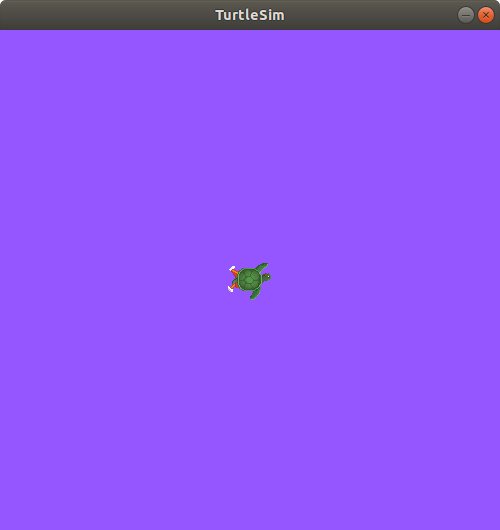

.. _ROS2Params:

Understanding ROS 2 parameters
==============================

**Goal:** Learn how to get, set, save and reload parameters in ROS 2.

**Tutorial level:** Beginner

**Time:** 5 minutes

.. contents:: Contents
   :depth: 2
   :local:

Background
----------

A parameter is a configuration value of a node.
You can think of parameters as node settings.
A node can store parameters as integers, floats, booleans, strings and lists.
In ROS 2, each node maintains its own parameters.
All parameters are dynamically reconfigurable, and built off of :ref:`ROS 2 services <ROS2Services>`.

Prerequisites
-------------

This tutorial uses the :ref:`turtlesim package <Turtlesim>`.

As always, don’t forget to source ROS 2 in :ref:`every new terminal you open <ConfigROS2>`.

Tasks
-----

1 Setup
^^^^^^^

Start up the two turtlesim nodes, ``/turtlesim`` and ``/teleop_turtle``.

Open a new terminal and run:

.. code-block:: console

    ros2 run turtlesim turtlesim_node

Open another terminal and run:

.. code-block:: console

    ros2 run turtlesim turtle_teleop_key

2 ros2 param list
^^^^^^^^^^^^^^^^^

To see the parameters belonging to your nodes, open a new terminal and enter the command:

.. code-block:: console

    ros2 param list

You will see the node subnamespaces, ``/teleop_turtle`` and ``/turtlesim``, followed by each node’s parameters:

.. code-block:: console

  /teleop_turtle:
    scale_angular
    scale_linear
    use_sim_time
  /turtlesim:
    background_b
    background_g
    background_r
    use_sim_time

Every node has the parameter ``use_sim_time``; it’s not unique to turtlesim.

Based on their names, it looks like ``/turtlesim``'s parameters determine the background color of the turtlesim window using RGB color values.

To be certain of a parameter type, you can use ``ros2 param get``.

3 ros2 param get
^^^^^^^^^^^^^^^^

To get the current value of a parameter, use the command:

.. code-block:: console

    ros2 param get <node_name> <parameter_name>

Let’s find out the current value of ``/turtlesim``’s parameter ``background_g``:

.. code-block:: console

    ros2 param get /turtlesim background_g

Which will return the value:

.. code-block:: console

    Integer value is: 86

Now you know ``background_g`` holds an integer value.

If you run the same command on ``background_r`` and ``background_b``, you will get the values ``69`` and ``255``, respectively.

4 ros2 param set
^^^^^^^^^^^^^^^^

To change a parameter's value at runtime, use the command:

.. code-block:: console

    ros2 param set <node_name> <parameter_name> <value>

Let’s change ``/turtlesim``’s background color:

.. code-block:: console

    ros2 param set /turtlesim background_r 150

Your terminal should return the message:

.. code-block:: console

  Set parameter successful

And the background of your turtlesim window should change colors:

Setting parameters with the ``set`` command will only change them in your current session, not permanently.
However, you can save your settings changes and reload them next time you start a node.

5 ros2 param dump
^^^^^^^^^^^^^^^^^

You can “dump” all of a node’s current parameter values into a file to save for later using the command:

.. code-block:: console

  ros2 param dump <node_name>

To save your current configuration of ``/turtlesim``’s parameters, enter the command:

.. code-block:: console

  ros2 param dump /turtlesim

Your terminal will return the message:

.. code-block:: console

  Saving to:  ./turtlesim.yaml

You will find a new file in the directory your workspace is running in.
If you open this file, you’ll see the following contents:

.. code-block:: YAML

  turtlesim:
    ros__parameters:
      background_b: 255
      background_g: 86
      background_r: 150
      use_sim_time: false

Dumping parameters comes in handy if you want to reload the node with the same parameters in the future.

6 Load parameter file
^^^^^^^^^^^^^^^^^^^^^

To start the same node using your saved parameter values, use:

.. code-block:: console

  ros2 run <package_name> <executable_name> --ros-args --params-file <file_name>

This is the same command you always use to start turtlesim, with the added flags ``--ros-args`` and ``--params-file``, followed by the file you want to load.

Stop your running turtlesim node so you can try reloading it with your saved parameters, using:

.. code-block:: console

  ros2 run turtlesim turtlesim_node --ros-args --params-file ./turtlesim.yaml

The turtlesim window should appear as usual, but with the purple background you set earlier.

Summary
-------

Nodes have parameters to define their default configuration values.
You can ``get`` and ``set`` parameter values from the command line.
You can also save parameter settings to reload in a new session.

Next steps
----------

Jumping back to ROS 2 communication methods, in the next tutorial you'll learn about :ref:`actions <ROS2Actions>`.
