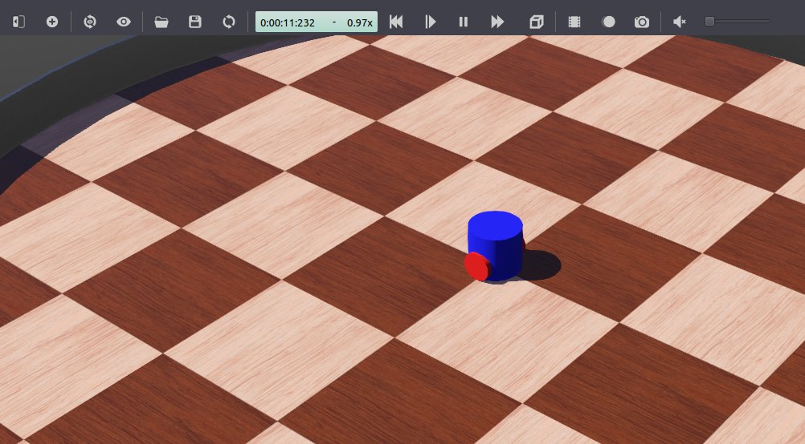

.. _Simulators:

Creating a Robot Simulation (Webots)
====================================

**Goal:** Install and discover the Webots simulator with the webots_ros2 package.

**Tutorial level:** Advanced

**Time:** 20 minutes

.. contents:: Contents
   :depth: 2
   :local:

Background
----------

Webots is a robot simulator that can be used with ROS 2.
Unlike turtlesim, it provides physics-based models for robots, sensors, actuators and objects.
This provides realistic simulation results that should match the behaviors observed in the real world.
Hence, what you get in simulation is very close to what you will observe when transferring your ROS 2 controllers to a real robot.

webots_ros2 is a package offering an interface between ROS2 and Webots with the help of the sub-package webots_ros2_driver that you will use in this tutorial.
There is also some other sub-packages containing examples with different robots such as the TurtleBot 3 you may find on the :doc:`../../Tutorials` page under the ``Demos`` section.

This tutorial will introduce you how to create your first simulation by modeling your robot and implementing a Python plugin derived from webots_ros2_driver.

Prerequisites
-------------

Precedent tutorials
^^^^^^^^^^^^^^^^^^^

This tutorial assume you followed the tutorials :doc:`../Creating-Your-First-ROS2-Package` and :doc:`../Launch-Files/Using-ROS2-Launch-For-Large-Projects`.

Install Webots
^^^^^^^^^^^^^^

Go on the `Webots Github release page <https://github.com/cyberbotics/webots/releases/latest>`_ to download the Debian package and then run the following command, ``VERSION`` being the version of Webots you downloaded:

.. code-block:: bash

        sudo apt install ./webots_VERSION_amd64.deb

Install webots_ros2
^^^^^^^^^^^^^^^^^^^

You can simply install webots_ros2 with this command:

.. code-block:: bash

        sudo apt-get install ros-{DISTRO}-webots-ros2

Tasks
-----

1 Create the structure of your package
^^^^^^^^^^^^^^^^^^^^^^^^^^^^^^^^^^^^^^

To be able to customize your simulation with ROS2 you will organize the code with a custom package.
Start by creating a new package named ``my_package``.

.. code-block:: console

        ros2 pkg create --build-type ament_python --node-name my_robot_driver my_package

The option ``--node-name my_robot_driver`` is here to create a file you will modify later.
Now create new ``launch`` and ``worlds`` directories inside your ``my_package`` folder.
You should end with the following folder structure:

.. code-block:: console

          src
          └── my_package
              ├── launch
              ├── my_package
              │   ├── __init__.py
              │   └── my_robot_driver.py
              ├── resource
              │   └── my_package
              ├── test
              │   ├── test_copyright.py
              │   ├── test_flake8.py
              │   └── test_pep257.py
              ├── worlds
              ├── package.xml
              ├── setup.cfg
              └── setup.py

2 Create the simulation world in Webots
^^^^^^^^^^^^^^^^^^^^^^^^^^^^^^^^^^^^^^^

Simulations in Webots rely on world files containing objects called ``nodes`` (different from the standard ROS node).
You will need a world file with a robot to launch your simulation.
Please go on this `page <https://github.com/cyberbotics/webots_ros2/wiki/Tutorial-Create-Webots-Robot>`_ to learn how to create your own robot or download a premade one.
The robot will be saved in a world file with the extension ``.wbt``.
Be sure to save this world file in the folder ``my_package/worlds/`` with the name ``my_world.wbt``.

Here is what you should see if you open ``my_world.wbt`` in Webots (**File** > **Open World**).

3 Prepare the package.xml file
^^^^^^^^^^^^^^^^^^^^^^^^^^^^^^

In the ``<package format="3">`` balise add the following:

.. literalinclude:: Code/package.xml
    :language: xml
    :lines: 10-12

We will need them for your plugin ``my_robot_driver.py``.

4 Create the my_robot_webots.urdf file
^^^^^^^^^^^^^^^^^^^^^^^^^^^^^^^^^^^^^^

In this task you will create the urdf file to add the python plugin ``my_robot_driver.py``.
The ``webots_ros2_driver`` ROS node will be able to detect it and launch it.

In ``my_package/resource`` folder create a file named ``my_robot_webots.urdf`` with this code:

.. literalinclude:: Code/my_robot_webots.urdf
    :language: xml

5 Change the my_robot_driver.py file
^^^^^^^^^^^^^^^^^^^^^^^^^^^^^^^^^^^^

Go the file ``my_package/my_package/my_robot_driver.py`` and replace the code inside with:

.. literalinclude:: Code/my_robot_driver.py
    :language: python

This code is composed of three parts:

.. literalinclude:: Code/my_robot_driver.py
    :language: python
    :lines: 11-27

This is the counterpart of ``def __init__(self):`` in a traditional ROS node.
Here you will get the reference of the robot as a ``Supervisor`` instance.
It allows you to access the standard Webots API (see this `page <https://cyberbotics.com/doc/reference/supervisor>`_).
Next the code get the reference of the motors and initialize them.
Finally a node is created to register a callback to a topic ``/cmd_vel``.

.. literalinclude:: Code/my_robot_driver.py
    :language: python
    :lines: 29-30

This callback function will simply register the last command recieved.

.. literalinclude:: Code/my_robot_driver.py
    :language: python
    :lines: 32-53

This function is called every step of the simulation.
If a non null command is in memory then motors commands will be computed and applied.
If the command ``X`` is negative, the robot will turn in place.
Otherwise it will have one wheel at ``MAX_SPEED`` and slow down the other to turn in case the command ``Y`` is not null.

6 Modify the setup.py file
^^^^^^^^^^^^^^^^^^^^^^^^^^^

In this task you will modify the setup.py file to include the extra files you added.

Replace the code inside with the following code:

.. literalinclude:: Code/setup.py
    :language: python

This primarly modificate the code in two places.

.. literalinclude:: Code/setup.py
    :language: python
    :lines: 4-15

Here you will declare in the ``data_files`` variable your new extra files like ``my_world.wbt`` or ``my_robot_webots.urdf``.

.. literalinclude:: Code/setup.py
    :language: python
    :lines: 23-28

In ``entry_points`` a Webots specific part is added.

7 Create the launch file
^^^^^^^^^^^^^^^^^^^^^^^^

In this task you will create the launch file to easily launch Webots and your ROS controller in a single command.

In ``my_package/launch`` folder create a file named ``robot_launch.py`` with the following code:

.. literalinclude:: Code/robot_launch.py
    :language: python

The code is explained as the following:

.. literalinclude:: Code/robot_launch.py
    :language: python
    :lines: 14-16

The ``WebotsLauncher`` is a Webots custom action that allows you to start a Webots simulation instance.
It searches for the Webots installation in the path specified by the ``WEBOTS_HOME`` environment variable and default installation paths.
The accepted arguments are:

* ``world`` (str): Path to the world to launch.
* ``gui`` (bool): Whether to display GUI or not.
* ``mode`` (str): Can be ``pause``, ``realtime``, or ``fast``.

.. literalinclude:: Code/robot_launch.py
    :language: python
    :lines: 18-25

The node which interacts with a robot in the Webots simulation is located in the ``webots_ros2_driver`` package under name ``driver``.
It is necessary to run such a node for each robot in the simulation.
Typically, you provide it the ``robot_description`` parameters from a URDF file containing for this tutorial the Python plugin ``my_robot_driver.py``.

.. literalinclude:: Code/robot_launch.py
    :language: python
    :lines: 27-36

The code here is standard to simply start the two nodes and in case Webots is closed the other node ``my_robot_driver`` will also be shut down.

8 Test the code
^^^^^^^^^^^^^^^

From a terminal in your ROS2 working directory run:

.. code-block:: bash

            colcon build
            source install/local_setup.bash
            ros2 launch my_package robot_launch.py

in order to launch the simulation.
Then open a second terminal to send a command and run:

.. code-block:: bash

            ros2 topic pub /cmd_vel geometry_msgs/Twist  '{linear:  {x: 0.1, y: 0.0, z: 0.0}, angular: {x: 0.0,y: 0.0,z: 0.0}}'

Your robot is now moving forward!

.. image:: Image/Step_25.png

9 Going further
^^^^^^^^^^^^^^^^

Your robot is now able to blindly follow your orders but it will be better if it was not colliding in the wall with the previous command after some time.

.. image:: Image/Step_26.png

You will now use the sensors of your robot to detect obstacles.

10 Updating package.xml and my_robot_webots.urdf
^^^^^^^^^^^^^^^^^^^^^^^^^^^^^^^^^^^^^^^^^^^^^^^^

We will have to modify those files in order to make the sensors work.

Replace ``<exec_depend>geometry_msgs</exec_depend>`` by ``<exec_depend>sensor_msgs</exec_depend>`` in ``package.xml``.

Then in the file ``my_robot_webots.urdf`` add the following inside the ``<webots>`` tag:

.. literalinclude:: Code/my_robot_webots_sensor.urdf
    :language: xml
    :lines: 3-18

The ROS2 interface will then look for the **DistanceSensor** nodes, using the standard parameters in the ``<ros>`` it will activate them and use the given names for naming the corresponding topics.

11 Updating my_robot_driver.py
^^^^^^^^^^^^^^^^^^^^^^^^^^^^^^

Return to the file ``my_package/my_package/my_robot_driver.py`` and replace the code inside with:

.. literalinclude:: Code/my_robot_driver_sensor.py
    :language: python

This code will be sufficient to make the robot move and avoid obstacles.

.. literalinclude:: Code/my_robot_driver_sensor.py
    :language: python
    :lines: 22-23

Now the node will subscribe to the topics of the two sensors.

.. literalinclude:: Code/my_robot_driver_sensor.py
    :language: python
    :lines: 25-29

This two callback functions will simply register the last measurement recieved for each sensor.

.. literalinclude:: Code/my_robot_driver_sensor.py
    :language: python
    :lines: 31-45

In case there is an obstacle on the right the robot will turn in place.
In case the obstacle is on the left the robot will turn on the right.
Otherwise it will go forward.

12 Test the obstacle avoidance code
^^^^^^^^^^^^^^^^^^^^^^^^^^^^^^^^^^^

From a terminal in your ROS2 working directory run:

.. code-block:: bash

            colcon build
            source install/local_setup.bash
            ros2 launch my_package robot_launch.py

First your robot will go forward and then it will turn clockwise in the circle arena.

.. image:: Image/Robot_clock_wise.png

Summary
-------

In this tutorial, you created a simulation with Webots, modeled your own robot and implemented a Python plugin to use its motors and sensors.

Next steps
----------

You might want to improve the plugin as you will do with a standard ROS node or create new nodes.
Taking example on those previous tutorials will be a good starting point:

* :doc:`../Ros2bag/Recording-A-Bag-From-Your-Own-Node-Python`.

* :doc:`../Tf2/Tf2-Main`.

Related content
---------------

In order to build more complex robot you can refer to the official `User Guide <https://cyberbotics.com/doc/guide/index>`_ and `Reference Manual <https://cyberbotics.com/doc/reference/index>`_ pages of Webots.
