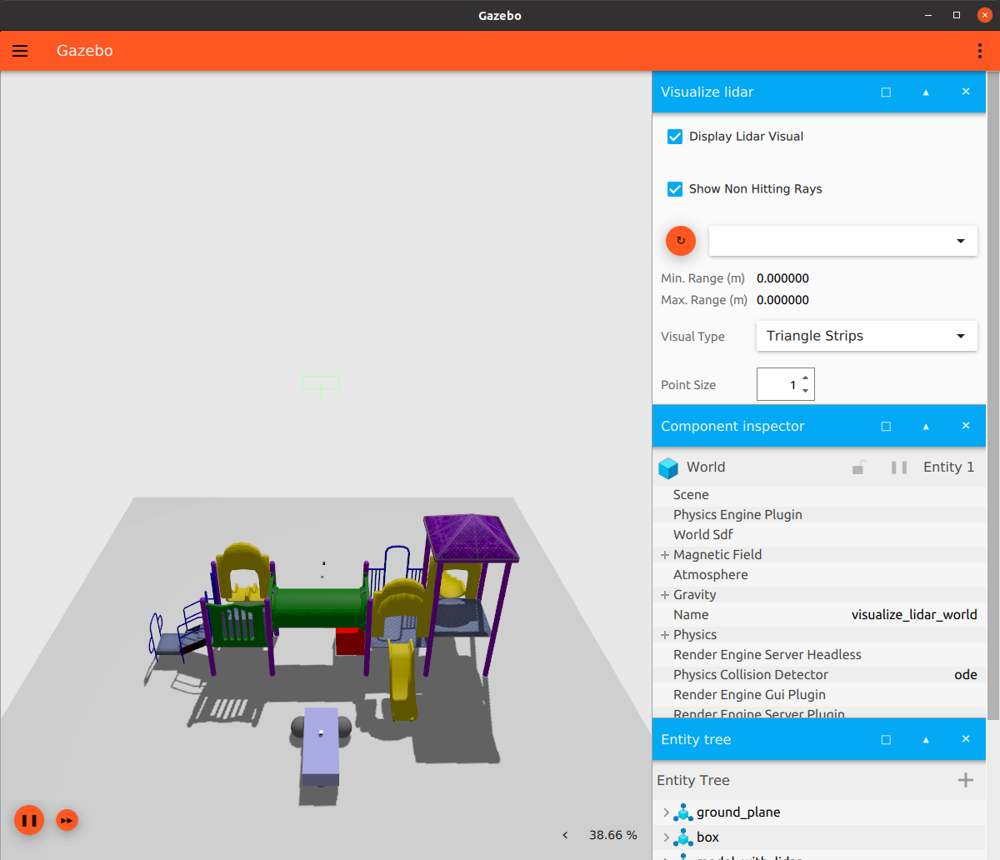
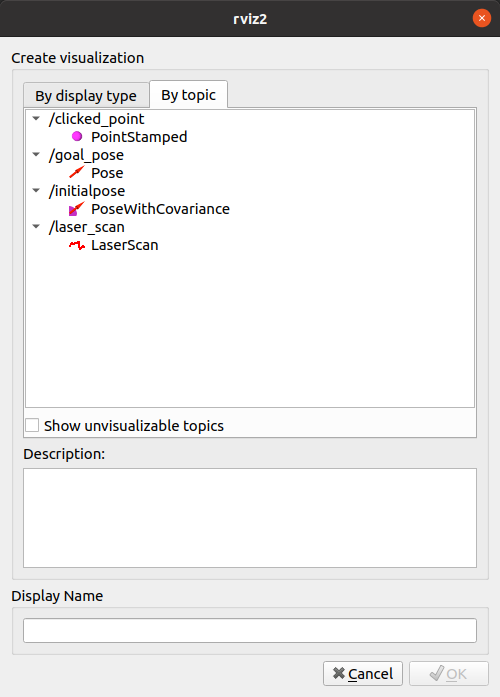
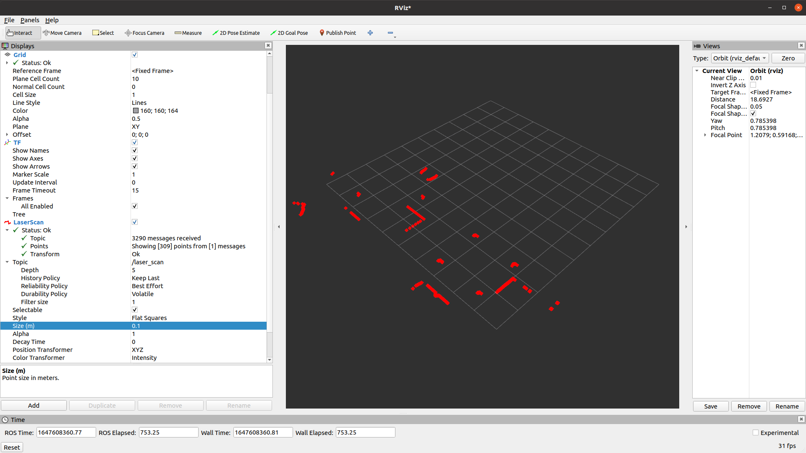

.. _SimulatorsIgnition:

Setting-up a Robot Simulation (Ignition Gazebo)
===============================================

**Goal:** Launch a Simulation with Ignition Gazebo and ROS 2

**Tutorial level:** Medium

**Time:** 20 minutes

.. contents:: Contents
   :depth: 2
   :local:

Prerequisites
-------------

First at all you should install ROS 2 and Ignition Gazebo. You have two options:

 * Install from deb packages. To check which versions are available from deb packages please check this `table <https://github.com/ignitionrobotics/ros_ign)>`__
 * Compile from sources:
    * `ROS 2 install instructions <https://docs.ros.org/>`__
    * `Ignition install instructions <https://ignitionrobotics.org/docs>`__

Tasks
-----

1 Launch the simulation
^^^^^^^^^^^^^^^^^^^^^^^

In this demo we are going to simulate in Ignition Gazebo a simple diff drive robot.
We are going to use one of the world defined in the Ignition Gazebo examples called
`visualize_lidar.sdf <https://github.com/ignitionrobotics/ign-gazebo/blob/main/examples/worlds/visualize_lidar.sdf>`__.
To run this example you should execute in a terminal:


.. tabs::

   .. group-tab:: Linux

      .. code-block:: console

        ign gazebo -v 4 -r visualize_lidar.sdf



When the simulation is running we can check with the ``ign`` command line tool the topics provided by Ignition Gazebo:

.. tabs::

   .. group-tab:: Linux

      .. code-block:: console

        ign topic -l
        /clock
        /gazebo/resource_paths
        /gui/camera/pose
        /gui/record_video/stats
        /model/vehicle_blue/odometry
        /model/vehicle_blue/tf
        /stats
        /world/diff_drive/clock
        /world/diff_drive/dynamic_pose/info
        /world/diff_drive/pose/info
        /world/diff_drive/scene/deletion
        /world/diff_drive/scene/info
        /world/diff_drive/state
        /world/diff_drive/stats

But if we try to run ``ros2 topic list`` the output should be free of any robot topic.
Because we didn't launch any ROS 2 node yet.

.. tabs::

   .. group-tab:: Linux

      .. code-block:: console

        ros2 topic list
        /parameter_events
        /rosout

2 Configuring ROS 2
^^^^^^^^^^^^^^^^^^^

To be able to communicate our simulation with ROS 2 we need to use a package called ``ros_ign_bridge``. This package provides
a network bridge which enables the exchange of messages between ROS 2 and Ignition Transport. You can install this package typing:

.. tabs::

   .. group-tab:: Linux

      .. code-block:: console

        sudo apt-get install ros-<ROS_DISTRO>-ros-ign-bridge

At this point we are ready to launch a bridge from ROS to Ignition. In particular we are going to create a bridge for the topic
``/model/vehicle_blue/cmd_vel``

.. tabs::

   .. group-tab:: Linux

      .. code-block:: console

        source /opt/ros/<ROS_DISTRO>/setup.bash
        ros2 run ros_ign_bridge parameter_bridge /model/vehicle_blue/cmd_vel@geometry_msgs/msg/Twist]ignition.msgs.Twist

To check more details about the ```ros_ign_bridge`` please check this [README](https://github.com/ignitionrobotics/ros_ign/tree/ros2/ros_ign_bridge).

Once the bridge is running the robot is able to follow your motor commands.
For this matter we have two options:

* Send a command to the topic using ``ros2 topic pub``

 .. tabs::

    .. group-tab:: Linux

       .. code-block:: console

        ros2 topic pub /model/vehicle_blue/cmd_vel geometry_msgs/Twist  "linear: { x: 0.1 }"

* ``teleop_twist_keyboard`` package. This node takes keypresses from the keyboard and publishes them as Twist messages. You can install it typing:

 .. tabs::

    .. group-tab:: Linux

       .. code-block:: console

        sudo apt-get install ros-<ROS_DISTRO>-teleop-twist-keyboard

The default topic where ``teleop_twist_keyboard`` is publishing Twist messages is ``/cmd_vel`` but we can remap this
topic to make use of the topic used in the bridge:

.. tabs::

   .. group-tab:: Linux

      .. code-block:: console

        source /opt/ros/<ROS_DISTRO>/setup.bash
        ros2 run teleop_twist_keyboard teleop_twist_keyboard --ros-args -r /cmd_vel:=/model/vehicle_blue/cmd_vel

        This node takes keypresses from the keyboard and publishes them
        as Twist messages. It works best with a US keyboard layout.
        ---------------------------
        Moving around:
           u    i    o
           j    k    l
           m    ,    .

        For Holonomic mode (strafing), hold down the shift key:
        ---------------------------
           U    I    O
           J    K    L
           M    <    >

        t : up (+z)
        b : down (-z)

        anything else : stop

        q/z : increase/decrease max speeds by 10%
        w/x : increase/decrease only linear speed by 10%
        e/c : increase/decrease only angular speed by 10%

        CTRL-C to quit

        currently:	speed 0.5	turn 1.0

3 Visualizing lidar data in ROS 2
^^^^^^^^^^^^^^^^^^^^^^^^^^^^^^^^^

The diff drive robot has a lidar. To send the data generated by Ignition to ROS 2, we need to launch another bridge.
In the case the data from the lidar is provided in the Ignition Transport topic ``/lidar2``. In this case we are going to remap the
topic in the bridge. This topic will be available under the topic ``/lidar_scan``

.. tabs::

   .. group-tab:: Linux

      .. code-block:: console

        source /opt/ros/<ROS_DISTRO>/setup.bash
        ros2 run ros_ign_bridge parameter_bridge /lidar2@sensor_msgs/msg/LaserScan[ignition.msgs.LaserScan --ros-args -r /lidar2:=/laser_scan

To visualize the data from the lidar in ROS 2 we can use RVIZ2

.. tabs::

   .. group-tab:: Linux

      .. code-block:: console

        source /opt/ros/<ROS_DISTRO>/setup.bash
        rviz2

Then we need to configure the ``fixed frame``:

.. image:: Image/fixed_frame.png

And then click in the button "Add" to include a display to visualize the lidar:



Now you should see the data from the lidar in RVIZ2:



Summary
-------

In this tutorial, you launch a robot simulation with Ignition Gazebo, launch bridges with actuators and sensors, visualize data from a sensor and move a diff drive robot.
