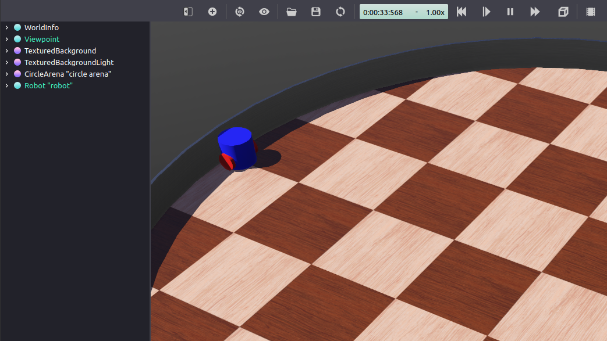

.. _Simulators:

Setting-up a Robot Simulation (Webots)
======================================

**Goal:** Setup a robot simulation and control it from ROS 2.

**Tutorial level:** Advanced

**Time:** 20 minutes

.. contents:: Contents
   :depth: 2
   :local:

Background
----------

Webots is a robot simulator that can be used with ROS 2.
Unlike turtlesim, it provides physics-based models for robots, sensors, actuators and objects.
This provides realistic simulation results that should match the behaviors observed in the real world.
Hence, what you get in simulation is very close to what you will observe when transferring your ROS 2 controllers to a real robot.

webots_ros2 is a package offering an interface between ROS2 and Webots with the help of the sub-package webots_ros2_driver that you will use in this tutorial.
There are also some other sub-packages containing demos with different robots such as the TurtleBot3.
Such demos are detailed in the :doc:`../../Tutorials` page under the ``Demos`` section.

This tutorial will introduce you how to create your first simulation by using a custom robot and implementing a Python plugin derived from webots_ros2_driver.

Prerequisites
-------------

Previous tutorials
^^^^^^^^^^^^^^^^^^

This tutorial assumes you followed the tutorials :doc:`../Creating-Your-First-ROS2-Package` and :doc:`../Launch-Files/Using-ROS2-Launch-For-Large-Projects`.

Install Webots
^^^^^^^^^^^^^^

Webots will be automatically installed when you will run the launcher in task ``8``.

.. note::

    If you want to install Webots you can `download the Debian package <https://github.com/cyberbotics/webots/releases/latest>`_.

Install webots_ros2
^^^^^^^^^^^^^^^^^^^

You can simply install webots_ros2 with this command:

.. code-block:: bash

        sudo apt-get install ros-{DISTRO}-webots-ros2

Tasks
-----

1 Create the structure of your package
^^^^^^^^^^^^^^^^^^^^^^^^^^^^^^^^^^^^^^

To be able to customize your simulation with ROS2 you will organize the code with a custom package.
Start by creating a new package named ``my_package`` from the ``src`` folder of your ROS2 workspace.

.. code-block:: console

        cd ~/ros2_ws/src
        ros2 pkg create --build-type ament_python --node-name my_robot_driver my_package

The option ``--node-name my_robot_driver`` is here to create a file you will modify later.
Now create new ``launch`` and ``worlds`` directories inside your ``my_package`` folder.

.. code-block:: console

        cd my_package
        mkdir launch/ worlds/

You should end with the following folder structure:

.. code-block:: console

          src
          └── my_package
              ├── launch
              ├── my_package
              │   ├── __init__.py
              │   └── my_robot_driver.py
              ├── resource
              │   └── my_package
              ├── test
              │   ├── test_copyright.py
              │   ├── test_flake8.py
              │   └── test_pep257.py
              ├── worlds
              ├── package.xml
              ├── setup.cfg
              └── setup.py

2 Setup the simulation world in Webots
^^^^^^^^^^^^^^^^^^^^^^^^^^^^^^^^^^^^^^

Simulations in Webots rely on world files containing objects called ``nodes`` (different from the standard ROS node).
You will need a world file with a robot to launch your simulation.
Please `download this world file <https://github.com/cyberbotics/webots_ros2/wiki/assets/tutorialCreateWebotsRobot/my_world.zip>`_ and extract it in the folder ``my_package/worlds/``.
A custom robot is already modeled in this world ``my_world.wbt``.

3 Prepare the package.xml file
^^^^^^^^^^^^^^^^^^^^^^^^^^^^^^

In the ``<package format="3">`` balise add the following:

.. literalinclude:: Code/package.xml
    :language: xml
    :lines: 10-12

You will need them for your plugin ``my_robot_driver.py``.

4 Create the my_robot_webots.urdf file
^^^^^^^^^^^^^^^^^^^^^^^^^^^^^^^^^^^^^^

In this task you will create the URDF file to add the python plugin ``my_robot_driver.py``.
The ``webots_ros2_driver`` ROS node will be able to detect it and launch it.

In ``my_package/resource`` folder create a file named ``my_robot_webots.urdf`` with this code:

.. literalinclude:: Code/my_robot_webots.urdf
    :language: xml

With this URDF file Webots will only parse ROS 2 configuration like this plugin but it will not parse link/joint descriptions
(but this can be done with this `tool <https://github.com/cyberbotics/urdf2webots>`_ to convert an URDF file to the native format ``PROTO`` of Webots).

5 Change the my_robot_driver.py file
^^^^^^^^^^^^^^^^^^^^^^^^^^^^^^^^^^^^

Go to the file ``my_package/my_robot_driver.py`` and replace the code inside with:

.. literalinclude:: Code/my_robot_driver.py
    :language: python

The class is composed of three parts:

.. literalinclude:: Code/my_robot_driver.py
    :language: python
    :lines: 11-27

This is the counterpart of ``def __init__(self):`` in a traditional ROS node.
Here you will get the reference of the robot as a ``Supervisor`` instance.
It allows you to access the standard Webots API (see this `page <https://cyberbotics.com/doc/reference/supervisor>`_).
Next the code get the reference of the motors and initialize them.
Finally a node is created to register a callback to a topic ``/cmd_vel``.

.. literalinclude:: Code/my_robot_driver.py
    :language: python
    :lines: 29-30

This callback function will simply register the last command recieved.

.. literalinclude:: Code/my_robot_driver.py
    :language: python
    :lines: 32-53

This function is called every step of the simulation.
If a non null command is in ``self.__target_twist`` then motors commands will be computed and applied.
If the command ``X`` is negative, the robot will turn in place.
Otherwise it will have one wheel at ``MAX_SPEED`` and slow down the other to turn in case the command ``Y`` is not null.

.. note::

    The purpose of this code is only to show a simple example.
    In fact you could avoid the use of this python plugin by using another sub-package ``webots_ros2_control`` that will ease the control of a differential wheeled robot.

6 Modify the setup.py file
^^^^^^^^^^^^^^^^^^^^^^^^^^^

In this task you will modify the setup.py file to include the extra files you added.

Go to the file ``my_package/setup.py`` and replace the code inside with:

.. literalinclude:: Code/setup.py
    :language: python

This primarly modificates two parts of the code.
In this part you declared in the ``data_files`` variable your new extra files like ``my_world.wbt`` or ``my_robot_webots.urdf``.

.. literalinclude:: Code/setup.py
    :language: python
    :lines: 4-15

And in the second part you added in ``entry_points`` a Webots specific part.

.. literalinclude:: Code/setup.py
    :language: python
    :lines: 23-28

7 Create the launch file
^^^^^^^^^^^^^^^^^^^^^^^^

In this task. you will create the launch file to easily launch Webots and your ROS controller in a single command.

In ``my_package/launch`` folder create a file named ``robot_launch.py`` with this code:

.. literalinclude:: Code/robot_launch.py
    :language: python

The code is explained as the following:

.. literalinclude:: Code/robot_launch.py
    :language: python
    :lines: 14-16

The ``WebotsLauncher`` is a Webots custom action that allows you to start a Webots simulation instance.
It searches for the Webots installation in the path specified by the ``WEBOTS_HOME`` environment variable and default installation paths.

.. literalinclude:: Code/robot_launch.py
    :language: python
    :lines: 18-25

The node which interacts with a robot in the Webots simulation is located in the ``webots_ros2_driver`` package under name ``driver``.
It is necessary to run such a node for each robot in the simulation.
Typically, you provide it the ``robot_description`` parameters from a URDF file containing for this tutorial the Python plugin ``my_robot_driver.py``.

.. literalinclude:: Code/robot_launch.py
    :language: python
    :lines: 27-36

The code above is used to start the two nodes and in case Webots is closed the other node ``my_robot_driver`` will also be shut down.

8 Test the code
^^^^^^^^^^^^^^^

From a terminal in your ROS2 workspace run:

.. code-block:: bash

            colcon build
            source install/local_setup.bash
            ros2 launch my_package robot_launch.py

in order to launch the simulation.
Then open a second terminal to send a command and run:

.. code-block:: bash

            ros2 topic pub /cmd_vel geometry_msgs/Twist  '{linear:  {x: 0.1, y: 0.0, z: 0.0}, angular: {x: 0.0, y: 0.0, z: 0.0}}'

Your robot is now moving forward!

.. image:: Image/Step_25.png

Your robot is now able to blindly follow your orders but it will be better if it was not colliding in the wall with the previous command after some time.

You will now use the sensors of your robot to detect obstacles.

9 Updating package.xml and my_robot_webots.urdf
^^^^^^^^^^^^^^^^^^^^^^^^^^^^^^^^^^^^^^^^^^^^^^^^

You will start by modify these two files in order to enable the sensors.
Go to your file ``package.xml`` and in the ``<package format="3">`` balise add the following:

.. literalinclude:: Code/package_sensor.xml
    :language: xml
    :lines: 11

Then in the file ``my_robot_webots.urdf`` add the following inside the ``<webots>`` tag:

.. literalinclude:: Code/my_robot_webots_sensor.urdf
    :language: xml
    :lines: 3-18

The ROS2 interface will use the standard parameters in the ``<ros>`` tags to enable the **DistanceSensor** nodes and name their topics.

10 Creating a ROS node to avoid obstacle
^^^^^^^^^^^^^^^^^^^^^^^^^^^^^^^^^^^^^^^^

Your robot will use a standard ROS node in order to detect the wall and send commands to avoid it.
In ``my_package/my_package/`` folder create a file named ``obstacle_avoider.py`` with this code:

.. literalinclude:: Code/obstacle_avoider.py
    :language: python

This node will create a publisher for the command and subscribe to the sensors topics here:

.. literalinclude:: Code/obstacle_avoider.py
    :language: python
    :lines: 14-17

When a measure is recieved from the left sensor it will be saved:

.. literalinclude:: Code/obstacle_avoider.py
    :language: python
    :lines: 19-20

Finally, a command will be sent to the topic ``/cmd_vel`` in case any of the two sensors has detected an obstacle.
If the right sensor detects an obstacle, ``command_message`` will make the robot turn in place clockwise.
Otherwise, if only the left sensor detects an obstacle, ``command_message`` will make the robot move forward on the right.

.. literalinclude:: Code/obstacle_avoider.py
    :language: python
    :lines: 22-37

11 Updating setup.py and robot_launch.py
^^^^^^^^^^^^^^^^^^^^^^^^^^^^^^^^^^^^^^^^

You have to modify these two other files to launch your new node.
Go to the file ``setup.py`` and replace ``'console_scripts'`` with:

.. literalinclude:: Code/setup_sensor.py
    :language: python
    :lines: 24-26

This will add an entry point for the ``obstacle_avoider`` node.

Go to the file ``robot_launch.py`` and replace ``def generate_launch_description():`` with:

.. literalinclude:: Code/robot_launch_sensor.py
    :language: python
    :lines: 10-42

This will create an ``obstacle_avoider`` node that will be included in the ``LaunchDescription``.

12 Test the obstacle avoidance code
^^^^^^^^^^^^^^^^^^^^^^^^^^^^^^^^^^^

Repeat the same commands as in tasks ``8`` to test your code.
From a terminal in your ROS2 workspace run:

.. code-block:: bash

            colcon build
            source install/local_setup.bash
            ros2 launch my_package robot_launch.py

Then open a second terminal to send a command and run:

.. code-block:: bash

            ros2 topic pub /cmd_vel geometry_msgs/Twist  '{linear:  {x: 0.1, y: 0.0, z: 0.0}, angular: {x: 0.0, y: 0.0, z: 0.0}}'

Your robot will go forward and before hitting the wall it will turn clockwise.

.. image:: Image/Robot_clock_wise.png

Summary
-------

In this tutorial, you set up a simulation with Webots, used a custom robot and implemented a Python plugin to use its motors and sensors.

Next steps
----------

You might want to improve the plugin as you will do with a standard ROS node or create new nodes.
Taking example on those previous tutorials will be a good starting point:

* :doc:`../Ros2bag/Recording-A-Bag-From-Your-Own-Node-Python`.

* :doc:`../Tf2/Tf2-Main`.

Related content
---------------

In case you want to learn how to create your own robot, you can check this `tutorial <https://github.com/cyberbotics/webots_ros2/wiki/Tutorial-Create-Webots-Robot>`_.
