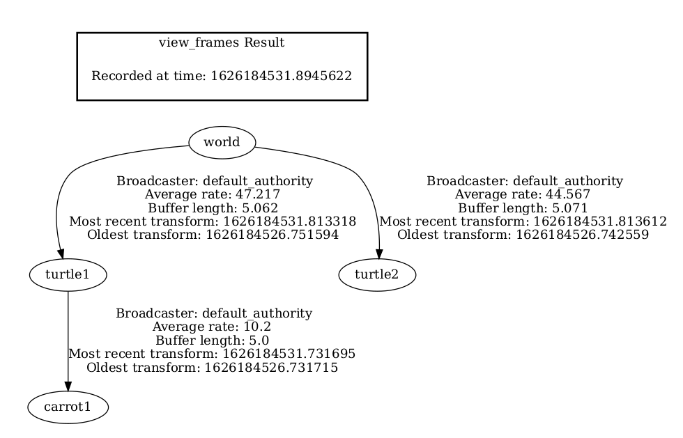
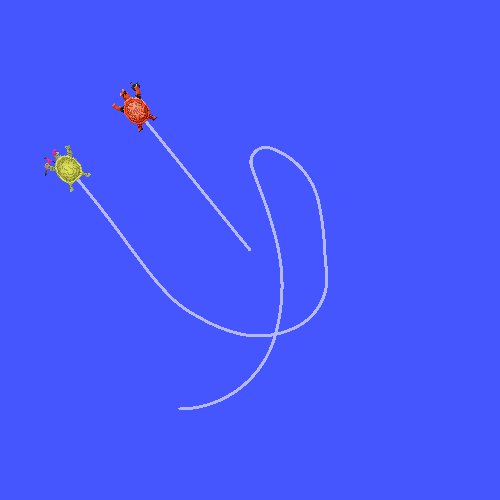
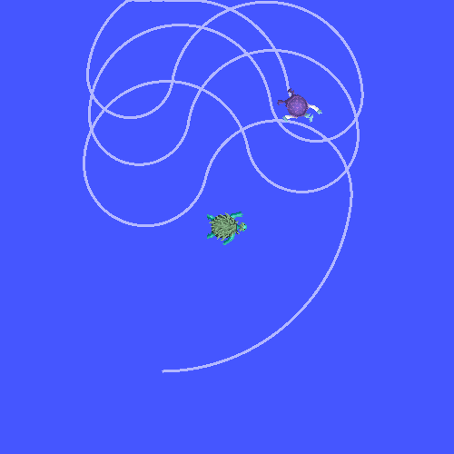

.. _AddingAFramePy:

Adding a frame (Python)
=======================

**Goal:** Learn how to to add an extra frame to tf2.

**Tutorial level:** Intermediate

**Time:** 15 minutes

.. contents:: Contents
   :depth: 3
   :local:

Background
----------

In previous tutorials, we recreated the turtle demo by writing a :ref:`tf2 broadcaster <WritingATf2BroadcasterPy>` and a :ref:`tf2 listener <WritingATf2ListenerPy>`.
This tutorial will teach you how to add extra fixed and dynamic frames to the transformation tree.
In fact, adding a frame in tf2 is very similar to creating the tf2 broadcaster, but this example will show you some additional features of tf2.

For many tasks related to transformations, it is easier to think inside a local frame.
For example, it is easiest to reason about laser scan measurements in a frame at the center of the laser scanner.
tf2 allows you to define a local frame for each sensor, link, or joint in your system.
When transforming from one frame to another, tf2 will take care of all the hidden intermediate frame transformations that are introduced.

tf2 tree
--------

tf2 builds up a tree structure of frames and, thus, does not allow a closed loop in the frame structure.
This means that a frame only has one single parent, but it can have multiple children.
Currently, our tf2 tree contains three frames: ``world``, ``turtle1`` and ``turtle2``.
The two turtle frames are children of the ``world`` frame.
If we want to add a new frame to tf2, one of the three existing frames needs to be the parent frame, and the new one will become its child frame.

.. image:: images/turtlesim_frames.png

Tasks
-----

1 Write the fixed frame broadcaster
^^^^^^^^^^^^^^^^^^^^^^^^^^^^^^^^^^^

In our turtle example, we'll add a new frame ``carrot1``, which will be the child of the ``turtle1``.
This frame will serve as the goal for the second turtle.

Let's first create the source files. Go to the ``learning_tf2_py`` package we created in the previous tutorials.
Download the fixed frame broadcaster code by entering the following command:

.. tabs::

   .. group-tab:: Linux

      .. code-block:: console

         wget https://raw.githubusercontent.com/ros/geometry_tutorials/ros2/turtle_tf2_py/turtle_tf2_py/fixed_frame_tf2_broadcaster.py

   .. group-tab:: macOS

      .. code-block:: console

         wget https://raw.githubusercontent.com/ros/geometry_tutorials/ros2/turtle_tf2_py/turtle_tf2_py/fixed_frame_tf2_broadcaster.py

   .. group-tab:: Windows

      In a Windows command line prompt:

      .. code-block:: console

         curl -sk https://raw.githubusercontent.com/ros/geometry_tutorials/ros2/turtle_tf2_py/turtle_tf2_py/fixed_frame_tf2_broadcaster.py -o fixed_frame_tf2_broadcaster.py

      Or in powershell:

      .. code-block:: console

         curl https://raw.githubusercontent.com/ros/geometry_tutorials/ros2/turtle_tf2_py/turtle_tf2_py/fixed_frame_tf2_broadcaster.py -o fixed_frame_tf2_broadcaster.py

Now open the file called ``fixed_frame_tf2_broadcaster.py``.

.. code-block:: python

   from geometry_msgs.msg import TransformStamped

   import rclpy
   from rclpy.node import Node

   from tf2_ros import TransformBroadcaster

   class FixedFrameBroadcaster(Node):

      def __init__(self):
         super().__init__('fixed_frame_tf2_broadcaster')
         self.br = TransformBroadcaster(self)
         self.timer = self.create_timer(0.1, self.broadcast_timer_callback)

      def broadcast_timer_callback(self):
         t = TransformStamped()
         t.header.stamp = self.get_clock().now().to_msg()
         t.header.frame_id = 'turtle1'
         t.child_frame_id = 'carrot1'
         t.transform.translation.x = 0.0
         t.transform.translation.y = 2.0
         t.transform.translation.z = 0.0
         t.transform.rotation.x = 0.0
         t.transform.rotation.y = 0.0
         t.transform.rotation.z = 0.0
         t.transform.rotation.w = 1.0

         self.br.sendTransform(t)

   def main():
      rclpy.init()
      node = FixedFrameBroadcaster()
      try:
         rclpy.spin(node)
      except KeyboardInterrupt:
         pass

      rclpy.shutdown()

Don't forget to add the node to the ``setup.py``.
The code is very similar to the tf2 broadcaster tutorial example and the only difference is that the transform here does not change over time.

1.1 Examine the code
~~~~~~~~~~~~~~~~~~~~

Let's take a look at the key lines in this piece of code.
Here we create a new transform, from the parent ``turtle1`` to the new child ``carrot1``.
The ``carrot1`` frame is 2 meters offset in y axis in terms of the ``turtle1`` frame.

.. code-block:: python

   t = TransformStamped()
   t.header.stamp = self.get_clock().now().to_msg()
   t.header.frame_id = 'turtle1'
   t.child_frame_id = 'carrot1'
   t.transform.translation.x = 0.0
   t.transform.translation.y = 2.0
   t.transform.translation.z = 0.0

1.2 Write the launch file
~~~~~~~~~~~~~~~~~~~~~~~~~

Now let's create a launch file for this example.
With your text editor, create a new file called ``turtle_tf2_fixed_frame_demo.launch.py``, and add the following lines:

.. code-block:: python

   import os

   from ament_index_python.packages import get_package_share_directory

   from launch import LaunchDescription
   from launch.actions import IncludeLaunchDescription
   from launch.launch_description_sources import PythonLaunchDescriptionSource

   from launch_ros.actions import Node

   def generate_launch_description():
      demo_nodes = IncludeLaunchDescription(
         PythonLaunchDescriptionSource([os.path.join(
               get_package_share_directory('learning_tf2_py'), 'launch'),
               '/turtle_tf2_demo.launch.py']),
         )

      return LaunchDescription([
         demo_nodes,
         Node(
               package='learning_tf2_py',
               executable='fixed_frame_tf2_broadcaster',
               name='fixed_broadcaster',
         ),
      ])

This launch file imports the required packages and then creates a ``demo_nodes`` variable that will store nodes that we created in the previous tutorial's launch file.

The last part of the code will add our fixed ``carrot1`` frame to the turtlesim world using our ``fixed_frame_tf2_broadcaster`` node.

.. code-block:: python

   Node(
      package='learning_tf2_py',
      executable='fixed_frame_tf2_broadcaster',
      name='fixed_broadcaster',
   ),

1.3 Build and run
~~~~~~~~~~~~~~~~~

Rebuild the package and start the turtle broadcaster demo:

.. code-block:: console

   ros2 launch learning_tf2_py turtle_tf2_fixed_frame_demo.launch.py

You should notice that the new ``carrot1`` frame appeared in the transformation tree.

1.4 Checking the results
~~~~~~~~~~~~~~~~~~~~~~~~

If you drive the first turtle around, you should notice that the behavior didn't change from the previous tutorial, even though we added a new frame.
That's because adding an extra frame does not affect the other frames and our listener is still using the previously defined frames.

Therefore if we want our second turtle to follow the carrot instead of the first turtle, we need to change value of the ``target_frame``.
This can be done two ways.
One way is to pass the ``target_frame`` argument to the launch file directly from the console:

.. code-block:: console

   ros2 launch learning_tf2_py turtle_tf2_fixed_frame_demo.launch.py target_frame:=carrot1

The second way is to update the launch file.
To do so, open the ``turtle_tf2_fixed_frame_demo.launch.py`` file, and add the ``'target_frame': 'carrot1'`` parameter via ``launch_arguments`` argument.

.. code-block:: python

   def generate_launch_description():
      demo_nodes = IncludeLaunchDescription(
         ...,
         launch_arguments={'target_frame': 'carrot1'}.items(),
         )

Now just rebuild the package, restart the ``turtle_tf2_fixed_frame_demo.launch.py``, and you'll see the second turtle following the carrot instead of the first turtle!

2 Write the dynamic frame broadcaster
^^^^^^^^^^^^^^^^^^^^^^^^^^^^^^^^^^^^^

The extra frame we published in this tutorial is a fixed frame that doesn't change over time in relation to the parent frame.
However, if you want to publish a moving frame you can code the broadcaster to change the frame over time.
Let's change our ``carrot1`` frame so that it changes relative to ``turtle1`` frame over time.
Now download the dynamic frame broadcaster code by entering the following command:

.. tabs::

   .. group-tab:: Linux

      .. code-block:: console

         wget https://raw.githubusercontent.com/ros/geometry_tutorials/ros2/turtle_tf2_py/turtle_tf2_py/dynamic_frame_tf2_broadcaster.py

   .. group-tab:: macOS

      .. code-block:: console

         wget https://raw.githubusercontent.com/ros/geometry_tutorials/ros2/turtle_tf2_py/turtle_tf2_py/dynamic_frame_tf2_broadcaster.py

   .. group-tab:: Windows

      In a Windows command line prompt:

      .. code-block:: console

         curl -sk https://raw.githubusercontent.com/ros/geometry_tutorials/ros2/turtle_tf2_py/turtle_tf2_py/dynamic_frame_tf2_broadcaster.py -o dynamic_frame_tf2_broadcaster.py

      Or in powershell:

      .. code-block:: console

         curl https://raw.githubusercontent.com/ros/geometry_tutorials/ros2/turtle_tf2_py/turtle_tf2_py/dynamic_frame_tf2_broadcaster.py -o dynamic_frame_tf2_broadcaster.py

Now open the file called ``dynamic_frame_tf2_broadcaster.py``:

.. code-block:: python

   import math

   from geometry_msgs.msg import TransformStamped

   import rclpy
   from rclpy.node import Node

   from tf2_ros import TransformBroadcaster

   class DynamicFrameBroadcaster(Node):

      def __init__(self):
         super().__init__('dynamic_frame_tf2_broadcaster')
         self.br = TransformBroadcaster(self)
         self.timer = self.create_timer(0.1, self.broadcast_timer_callback)

      def broadcast_timer_callback(self):
         seconds, _ = self.get_clock().now().seconds_nanoseconds()
         x = seconds * math.pi

         t = TransformStamped()
         t.header.stamp = self.get_clock().now().to_msg()
         t.header.frame_id = 'turtle1'
         t.child_frame_id = 'carrot1'
         t.transform.translation.x = 10 * math.sin(x)
         t.transform.translation.y = 10 * math.cos(x)
         t.transform.translation.z = 0.0
         t.transform.rotation.x = 0.0
         t.transform.rotation.y = 0.0
         t.transform.rotation.z = 0.0
         t.transform.rotation.w = 1.0

         self.br.sendTransform(t)

   def main():
      rclpy.init()
      node = DynamicFrameBroadcaster()
      try:
         rclpy.spin(node)
      except KeyboardInterrupt:
         pass

      rclpy.shutdown()

2.1 Examine the code
~~~~~~~~~~~~~~~~~~~~

Instead of a fixed definition of our x and y offsets, we are using the ``sin()`` and ``cos()`` functions on the current time so that the offset of ``carrot1`` is constantly changing.

.. code-block:: python

   seconds, _ = self.get_clock().now().seconds_nanoseconds()
   x = seconds * math.pi
   ...
   t.transform.translation.x = 10 * math.sin(x)
   t.transform.translation.y = 10 * math.cos(x)

2.2 Write the launch file
~~~~~~~~~~~~~~~~~~~~~~~~~

To test this code, create a new launch file ``turtle_tf2_dynamic_frame_demo.launch.py`` and paste the following code:

.. code-block:: python

   import os

   from ament_index_python.packages import get_package_share_directory

   from launch import LaunchDescription
   from launch.actions import IncludeLaunchDescription
   from launch.launch_description_sources import PythonLaunchDescriptionSource

   from launch_ros.actions import Node

   def generate_launch_description():
      demo_nodes = IncludeLaunchDescription(
         PythonLaunchDescriptionSource([os.path.join(
               get_package_share_directory('learning_tf2_py'), 'launch'),
               '/turtle_tf2_demo.launch.py']),
         launch_arguments={'target_frame': 'carrot1'}.items(),
         )

      return LaunchDescription([
         demo_nodes,
         Node(
               package='learning_tf2_py',
               executable='dynamic_frame_tf2_broadcaster',
               name='dynamic_broadcaster',
         ),
      ])

2.3 Build and run
~~~~~~~~~~~~~~~~~

Rebuild the package, and start the ``turtle_tf2_dynamic_frame_demo.launch.py`` launch file, and now you’ll see that the second turtle is following the carrot's position that is constantly changing.

Summary
-------

In this tutorial, you learned about the tf2 transformation tree, its structure, and its features.
You also learned that it is easiest to think inside a local frame, and learned to add extra fixed and dynamic frames for that local frame.
