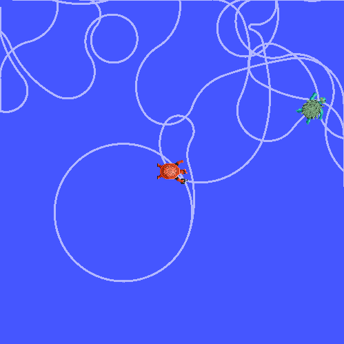

.. _TimeTravelWithTf2Cpp:

Time travel with tf2 (C++)
==========================

**Goal:** Learn about advanced time travel features of tf2.

**Tutorial level:** Advanced

**Time:** 10 minutes

.. contents:: Contents
   :depth: 2
   :local:

Background
----------

In the previous tutorial, we discussed the :ref:`basics of tf2 and time <LearningAboutTf2AndTimeCpp>`.
This tutorial will take us one step further and expose a powerful tf2 trick: the time travel.
In short, one of the key features of tf2 library is that it is able to transform data in time as well as in space.

This tf2 time travel feature can be useful for various tasks, like monitoring the state of the robot for long period of time or building a follower robot that will follow the "steps" of the leader.
We will use that time travel feature to look up for the transforms back in time and program the ``turtle2`` follow 5 seconds behind the ``carrot1``.

Time travel
-----------

First, let's go back to where we ended in the previous tutorial `Learning about tf2 and time <LearningAboutTf2AndTimeCpp>`.
Go to your ``learning_tf2_cpp`` package.

Now, instead of making the second turtle go to where the carrot is now, we will make the second turtle go to where the first carrot was 5 seconds ago.
Edit the ``lookup_transform()`` call in ``turtle_tf2_listener.cpp`` file to:

.. code-block:: C++

    when = self.get_clock().now() - rclpy.time.Duration(seconds=5.0)
    trans = self._tf_buffer.lookup_transform(
        to_frame_rel,
        from_frame_rel,
        when,
        timeout=Duration(seconds=1.0))

Now if you run this, during the first 5 seconds, the second turtle would not know where to go because we do not yet have a 5-second history of the first turtle.
But what after these 5 seconds? Let's just give it a try:

.. code-block:: console

    ros2 launch learning_tf2_cpp turtle_tf2_demo.launch.py

You should now notice that your turtle is driving around uncontrollably like in this screenshot. Let's try to understand reason behind that behavior.

#. In our code we asked tf2 the following question: "What was the pose of ``carrot1`` 5 seconds ago, relative to ``turtle2`` 5 seconds ago?". This means we are controlling the second turtle based on where it was 5 seconds ago as well as where the first turtle was 5 seconds ago.

#. However, what we really want to ask is: "What was the pose of ``carrot1`` 5 seconds ago, relative to the current position of the ``turtle2``?".

Advanced API for lookup_transform
---------------------------------

To ask the tf2 that particular question, we will use an advanced API that gives us the power to say explicitly when to acquire the specified transformations.
This is done by calling the ``lookup_transform_full`` method with additional parameters.
Your code now would look like this:

.. code-block:: C++

    when = self.get_clock().now() - rclpy.time.Duration(seconds=5.0)
    trans = self._tf_buffer.lookup_transform_full(
            target_frame=to_frame_rel,
            target_time=rclpy.time.Time(),
            source_frame=from_frame_rel,
            source_time=when,
            fixed_frame='world',
            timeout=Duration(seconds=1.0))

The advanced API for ``lookup_transform_full()`` takes six arguments:

#. Target frame

#. The time to transform to

#. Source frame

#. The time at which source frame will be evaluated

#. The time at which we want to transform

#. Frame that does not change over time, in this case the ``world`` frame

#. Time to wait for the target frame to become available

To sum up, tf2 does the following in the background.
In the past, it computes the transform from the ``carrot1`` to the ``world``.
In the ``world`` frame, tf2 time travels from the past to now.
And at the current time, tf2 computes the transform from the ``world`` to the ``turtle2``.

Checking the results
--------------------

Let's run the simulation again, this time with the advanced time-travel API:

.. code-block:: console

    ros2 launch learning_tf2_cpp turtle_tf2_demo.launch.py

.. image:: turtlesim_delay2.png

And yes, the second turtle is directed to where the first carrot was 5 seconds ago!

Summary
-------

In this tutorial, you have seen one of the advanced features of tf2.
You learned that tf2 can transform data in time and learned how to do that with turtlesim example.
tf2 allowed you to go back in time and make frame transformations between old and current states of turtles by using the advanced ``lookup_transform_full`` API.
