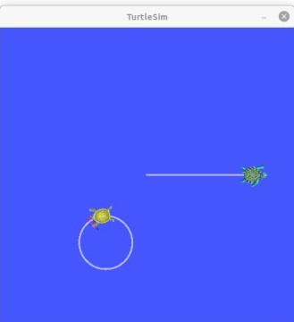

.. _UsingStampedDatatypesWithTf2RosMessageFilter:

Using stamped datatypes with tf2_ros::MessageFilter
===================================================

**Goal:** Learn how to use tf2_ros::MessageFilter to process stamped datatypes.

**Tutorial level:** Intermediate

**Time:** 10 minutes

.. contents:: Contents
   :depth: 3
   :local:

Background
----------

This tutorial explains how to use sensor data with tf2. Some real-world examples of sensor data are:

    * cameras, both mono and stereo

    * laser scans

Suppose that a new turtle named ``turtle3`` is created and it doesn't have good odometry, but there is an overhead camera tracking its position and publishing it as a ``PointStamped`` message in relation to the ``world`` frame.

``turtle1`` wants to know where ``turtle3`` is compared to itself.

To do this ``turtle1`` must listen to the topic where ``turtle3``'s pose is being published, wait until transforms into the desired frame are ready, and then do it's operations. To make this easier the ``tf2_ros::MessageFilter`` is very useful. The ``tf2_ros::MessageFilter`` will take a subscription to any ROS 2 message with a header and cache it until it is possible to transform it into the target frame.

Setting the example
-------------------

1 Write the broadcaster node of PointStamped messages
^^^^^^^^^^^^^^^^^^^^^^^^^^^^^^^^^^^^^^^^^^^^^^^^^^^^^

For this tutorial we will set up a demo application which has a node (in Python) to broadcast the ``PointStamped`` messages of ``turtle3``.

First, let's create the source file.

Go to the ``learning_tf2_py`` :ref:`package <WritingATf2StaticBroadcasterPy>` we created in the previous tutorial.
Inside the ``src/learning_tf2_py/learning_tf2_py`` directory download the example sensor message broadcaster code by entering the following command:

.. tabs::

    .. group-tab:: Linux

        .. code-block:: console

            wget https://raw.githubusercontent.com/ros/geometry_tutorials/ros2/turtle_tf2_py/turtle_tf2_py/turtle_tf2_message_broadcaster.py

    .. group-tab:: macOS

        .. code-block:: console

            wget https://raw.githubusercontent.com/ros/geometry_tutorials/ros2/turtle_tf2_py/turtle_tf2_py/turtle_tf2_message_broadcaster.py

    .. group-tab:: Windows

        In a Windows command line prompt:

        .. code-block:: console

                curl -sk https://raw.githubusercontent.com/ros/geometry_tutorials/ros2/turtle_tf2_py/turtle_tf2_py/turtle_tf2_message_broadcaster.py -o turtle_tf2_message_broadcaster.py

        Or in powershell:

        .. code-block:: console

                curl https://raw.githubusercontent.com/ros/geometry_tutorials/ros2/turtle_tf2_py/turtle_tf2_py/turtle_tf2_message_broadcaster.py -o turtle_tf2_message_broadcaster.py

Open the file using your preferred text editor.

.. code-block:: python

   # Copyright 2021 Open Source Robotics Foundation, Inc.
   #
   # Licensed under the Apache License, Version 2.0 (the "License");
   # you may not use this file except in compliance with the License.
   # You may obtain a copy of the License at
   #
   #     http://www.apache.org/licenses/LICENSE-2.0
   #
   # Unless required by applicable law or agreed to in writing, software
   # distributed under the License is distributed on an "AS IS" BASIS,
   # WITHOUT WARRANTIES OR CONDITIONS OF ANY KIND, either express or implied.
   # See the License for the specific language governing permissions and
   # limitations under the License.

   from geometry_msgs.msg import PointStamped
   from geometry_msgs.msg import Twist

   import rclpy
   from rclpy.node import Node

   from turtlesim.msg import Pose
   from turtlesim.srv import Spawn

   class PointPublisher(Node):

       def __init__(self):
           super().__init__('turtle_tf2_message_broadcaster')

           self.client = self.create_client(Spawn, 'spawn')
           while not self.client.wait_for_service(timeout_sec=1.0):
               self.get_logger().info('service not available, waiting again...')
           request = Spawn.Request()
           request.name = 'turtle3'
           request.x = float(4)
           request.y = float(2)
           request.theta = float(0)
           self.client.call_async(request)

           self.vel_pub = self.create_publisher(Twist, '/turtle3/cmd_vel', 1)
           self.sub = self.create_subscription(Pose, '/turtle3/pose', self.handle_turtle_pose, 1)
           self.pub = self.create_publisher(PointStamped, '/turtle3/turtle_point_stamped', 1)

       def handle_turtle_pose(self, msg):
           vel_msg = Twist()
           vel_msg.linear.x = 1.0
           vel_msg.angular.z = 1.0
           self.vel_pub.publish(vel_msg)

           ps = PointStamped()
           ps.header.stamp = self.get_clock().now().to_msg()
           ps.header.frame_id = 'world'
           ps.point.x = msg.x
           ps.point.y = msg.y
           ps.point.z = 0.0
           self.pub.publish(ps)

   def main():
       rclpy.init()
       node = PointPublisher()
       try:
           rclpy.spin(node)
       except KeyboardInterrupt:
           pass
       rclpy.shutdown()

1.1 Examine the code
~~~~~~~~~~~~~~~~~~~~

Now let's take a look at the code.
Firstly, we spawn the ``turtle3`` by asynchronously calling the ``Spawn`` service of ``turtlesim``, and initialize its position at (4, 2, 0).

.. code-block:: python

    self.client = self.create_client(Spawn, 'spawn')
    while not self.client.wait_for_service(timeout_sec=1.0):
        self.get_logger().info('service not available, waiting again...')
    request = Spawn.Request()
    request.name = 'turtle3'
    request.x = float(4)
    request.y = float(2)
    request.theta = float(0)
    self.client.call_async(request)

Afterward, the node publishes the topic ``turtle3/cmd_vel`` and topic ``turtle3/turtle_point_stamped``, and subscribes to topic ``turtle3/pose`` and runs callback function ``handle_turtle_pose`` on every incoming message.

.. code-block:: python

    self.vel_pub = self.create_publisher(Twist, '/turtle3/cmd_vel', 1) 
    self.sub = self.create_subscription(Pose, '/turtle3/pose', self.handle_turtle_pose, 1) 
    self.pub = self.create_publisher(PointStamped, '/turtle3/turtle_point_stamped', 1)

Finally, in the callback function ``handle_turtle_pose``, we initialize the ``Twist`` messages of ``turtle3`` and publish them, which will make the ``turtle3`` moving along a circle, then we fill up the ``PointStamped`` messages of ``turtle3`` with incoming ``Pose`` messages of itself and publish it.

.. code-block:: python

    vel_msg = Twist()
    vel_msg.linear.x = 1.0
    vel_msg.angular.z = 1.0
    self.vel_pub.publish(vel_msg) 
    
    ps = PointStamped()
    ps.header.stamp = self.get_clock().now().to_msg()
    ps.header.frame_id = 'world'
    ps.point.x = msg.x
    ps.point.y = msg.y
    ps.point.z = 0.0
    self.pub.publish(ps)

1.2 Write the launch file
~~~~~~~~~~~~~~~~~~~~~~~~~

In order to run this demo, we need to create a launch file ``turtle_tf2_sensor_message.launch.py`` in the ``launch`` subdirectory of package ``learning_tf2_py``:

.. code-block:: python

   # Copyright 2021 Open Source Robotics Foundation, Inc.
   #
   # Licensed under the Apache License, Version 2.0 (the "License");
   # you may not use this file except in compliance with the License.
   # You may obtain a copy of the License at
   #
   #     http://www.apache.org/licenses/LICENSE-2.0
   #
   # Unless required by applicable law or agreed to in writing, software
   # distributed under the License is distributed on an "AS IS" BASIS,
   # WITHOUT WARRANTIES OR CONDITIONS OF ANY KIND, either express or implied.
   # See the License for the specific language governing permissions and
   # limitations under the License.

   from launch import LaunchDescription
   from launch.actions import DeclareLaunchArgument
   from launch_ros.actions import Node

   def generate_launch_description():
       return LaunchDescription([
           DeclareLaunchArgument(
               'target_frame', default_value='turtle1',
               description='Target frame name.'
           ),
           Node(
               package='turtlesim',
               executable='turtlesim_node',
               name='sim',
               output='screen'
           ),
           Node(
               package='turtle_tf2_py',
               executable='turtle_tf2_broadcaster',
               name='broadcaster1',
               parameters=[
                   {'turtlename': 'turtle1'}
               ]
           ),
           Node(
               package='turtle_tf2_py',
               executable='turtle_tf2_broadcaster',
               name='broadcaster2',
               parameters=[
                   {'turtlename': 'turtle3'}
               ]
           ),
           Node(
               package='turtle_tf2_py',
               executable='turtle_tf2_message_broadcaster',
               name='message_broadcaster',
           ),
       ])

1.3 Add an entry point and build the pakcage
~~~~~~~~~~~~~~~~~~~~~~~~~~~~~~~~~~~~~~~~~~~~

Don't forget to add the executable in the ``setup.py`` file of the package:

.. code-block:: python

    'console_scripts': [
        'turtle_tf2_msg_broadcaster = learning_tf2_py.turtle_tf2_message_broadcaster:main',
    ],

And then we can build the package:

.. tabs::

  .. group-tab:: Linux

    .. code-block:: console

      colcon build --packages-select learning_tf2_py

  .. group-tab:: macOS

    .. code-block:: console

      colcon build --packages-select learning_tf2_py

  .. group-tab:: Windows

    .. code-block:: console

      colcon build --merge-install --packages-select learning_tf2_py

2 Writing the message filter/listener node
^^^^^^^^^^^^^^^^^^^^^^^^^^^^^^^^^^^^^^^^^^

Now, to get the streaming ``PointStamped`` data of ``turtle3`` in the frame of ``turtle1`` reliably, we will use the following code:

.. code-block:: C++

   // Copyright 2021 Open Source Robotics Foundation, Inc.
   //
   // Licensed under the Apache License, Version 2.0 (the "License");
   // you may not use this file except in compliance with the License.
   // You may obtain a copy of the License at
   //
   //     http://www.apache.org/licenses/LICENSE-2.0
   //
   // Unless required by applicable law or agreed to in writing, software
   // distributed under the License is distributed on an "AS IS" BASIS,
   // WITHOUT WARRANTIES OR CONDITIONS OF ANY KIND, either express or implied.
   // See the License for the specific language governing permissions and
   // limitations under the License.

   #include <rclcpp/rclcpp.hpp>
   #include <geometry_msgs/msg/point_stamped.hpp>
   
   #include <tf2_ros/transform_listener.h>
   #include <tf2_ros/message_filter.h>
   #include <tf2_ros/buffer.h>
   #include <tf2_ros/create_timer_ros.h>
   #include <tf2_geometry_msgs/tf2_geometry_msgs.hpp>
   #include <message_filters/subscriber.h>
   
   #include <chrono>
   #include <memory>
   #include <string>
   
   using std::placeholders::_1;
   using namespace std::chrono_literals;
   
   
   class PoseDrawer : public rclcpp::Node
   {
   public:
     PoseDrawer()
     : Node("turtle_tf2_pose_drawer")
     {
       auto node = rclcpp::Node::make_shared("tf2_ros_message_filter");
       auto create_timer_interface = std::make_shared<tf2_ros::CreateTimerROS>(
         node->get_node_base_interface(),
         node->get_node_timers_interface());  
       typedef std::chrono::duration<int> seconds_type;
       seconds_type buffer_timeout(1);
       
       // Declare and acquire `target_frame` parameter
       this->declare_parameter<std::string>("target_frame", "turtle1");
       this->get_parameter("target_frame", target_frame_);

       rclcpp::Clock::SharedPtr clock = std::make_shared<rclcpp::Clock>(RCL_SYSTEM_TIME);
       tf2_buffer_ = std::make_shared<tf2_ros::Buffer>(node->get_clock());
       tf2_buffer_->setCreateTimerInterface(create_timer_interface);
       tf2_listener_ =
         std::make_shared<tf2_ros::TransformListener>(*tf2_buffer_);
       point_sub_.subscribe(this, "/turtle3/turtle_point_stamped");
       tf2_filter_ = std::make_shared<tf2_ros::MessageFilter<geometry_msgs::msg::PointStamped>>(
         point_sub_, *tf2_buffer_, target_frame_, 10, node, buffer_timeout); 
       tf2_filter_->registerCallback(&PoseDrawer::msgCallback, this);
     }  

   //  Callback to register with tf2_ros::MessageFilter to be called when transforms are available

   private:
     void msgCallback(const geometry_msgs::msg::PointStamped::SharedPtr point_ptr)
     {
       geometry_msgs::msg::PointStamped point_out;
       try {
         tf2_buffer_->transform(*point_ptr, point_out, target_frame_);
         RCLCPP_INFO(
           this->get_logger(), "point of turtle 3 in frame of turtle 1 Position(x:%f y:%f z:%f)\n", 
           point_out.point.x,
           point_out.point.y,
           point_out.point.z);
       } catch(tf2::TransformException & ex) {
         RCLCPP_WARN(
           this->get_logger(), "Failure %s\n", ex.what()); //Print exception which was caught
       }    
     }
     std::string target_frame_;
     std::shared_ptr<tf2_ros::Buffer> tf2_buffer_;
     std::shared_ptr<tf2_ros::TransformListener> tf2_listener_;  
     message_filters::Subscriber<geometry_msgs::msg::PointStamped> point_sub_;
     std::shared_ptr<tf2_ros::MessageFilter<geometry_msgs::msg::PointStamped>> tf2_filter_;
   };

   int main(int argc, char * argv[])
   {
     rclcpp::init(argc, argv);
     rclcpp::spin(std::make_shared<PoseDrawer>());
     rclcpp::shutdown();
     return 0;
   }

You can download this code directly from file ``turtle_tf2_message_filter.cpp`` in the ``src`` subdirectory of the ``learning_tf2_cpp`` :ref:`package <WritingATf2StaticBroadcasterCpp>`.

2.1 Examine the code
~~~~~~~~~~~~~~~~~~~~

Firstly, you must include the ``tf2_ros::MessageFilter`` headers from the ``tf2_ros`` package. As well as the previously used ``tf2`` and ``ros2`` related headers.

.. code-block:: C++

   #include <rclcpp/rclcpp.hpp>
   #include <geometry_msgs/msg/point_stamped.hpp>
   
   #include <tf2_ros/transform_listener.h>
   #include <tf2_ros/message_filter.h>
   #include <tf2_ros/buffer.h>
   #include <tf2_ros/create_timer_ros.h>
   #include <tf2_geometry_msgs/tf2_geometry_msgs.hpp>
   #include <message_filters/subscriber.h>
   

Secondly, the persistent data. There need to be persistent instances of ``tf2_ros::Buffer``, ``tf2_ros::TransformListener`` and ``tf2_ros::MessageFilter``.

.. code-block:: C++

   std::string target_frame_;
   std::shared_ptr<tf2_ros::Buffer> tf2_buffer_;
   std::shared_ptr<tf2_ros::TransformListener> tf2_listener_;  
   message_filters::Subscriber<geometry_msgs::msg::PointStamped> point_sub_;
   std::shared_ptr<tf2_ros::MessageFilter<geometry_msgs::msg::PointStamped>> tf2_filter_;

Thirdly, the constructor. When starting up the ROS 2 ``message_filters::Subscriber`` must be initialized with the topic. And the ``tf2_ros::MessageFilter`` must be initialized with that ``Subscriber`` object. The other arguments of note in the ``MessageFilter`` constructor are the ``target_frame`` and callback function. The target frame is the frame into which it will make sure ``canTransform`` will succeed. And the callback function is the function which will be called when the data is ready.

.. code-block:: C++

   PoseDrawer()
   : Node("turtle_tf2_pose_drawer")
   {
     auto node = rclcpp::Node::make_shared("tf2_ros_message_filter");
     auto create_timer_interface = std::make_shared<tf2_ros::CreateTimerROS>(
       node->get_node_base_interface(),
       node->get_node_timers_interface());  
     typedef std::chrono::duration<int> seconds_type;
     seconds_type buffer_timeout(1);
       
     // Declare and acquire `target_frame` parameter
     this->declare_parameter<std::string>("target_frame", "turtle1");
     this->get_parameter("target_frame", target_frame_);

     rclcpp::Clock::SharedPtr clock = std::make_shared<rclcpp::Clock>(RCL_SYSTEM_TIME);
     tf2_buffer_ = std::make_shared<tf2_ros::Buffer>(node->get_clock());
     tf2_buffer_->setCreateTimerInterface(create_timer_interface);
     tf2_listener_ =
       std::make_shared<tf2_ros::TransformListener>(*tf2_buffer_);
     point_sub_.subscribe(this, "/turtle3/turtle_point_stamped");
     tf2_filter_ = std::make_shared<tf2_ros::MessageFilter<geometry_msgs::msg::PointStamped>>(
       point_sub_, *tf2_buffer_, target_frame_, 10, node, buffer_timeout); 
     tf2_filter_->registerCallback(&PoseDrawer::msgCallback, this);
   }  

And lastly, the callback method. Once the data is ready, just call ``tf2_buffer_->transform`` and print to screen for the tutorial.

.. code-block:: C++

   //  Callback to register with tf2_ros::MessageFilter to be called when transforms are available
   private:
     void msgCallback(const geometry_msgs::msg::PointStamped::SharedPtr point_ptr)
     {
       geometry_msgs::msg::PointStamped point_out;
       try {
         tf2_buffer_->transform(*point_ptr, point_out, target_frame_);
         RCLCPP_INFO(
           this->get_logger(), "point of turtle 3 in frame of turtle 1 Position(x:%f y:%f z:%f)\n", 
           point_out.point.x,
           point_out.point.y,
           point_out.point.z);
       } catch(tf2::TransformException & ex) {
         RCLCPP_WARN(
           this->get_logger(), "Failure %s\n", ex.what()); //Print exception which was caught
       }    
     }

2.2 Build the package
~~~~~~~~~~~~~~~~~~~~~

Before building the package ``learning_tf2_cpp``, please add two another dependencies in the ``package.xml`` file of this package:

.. code-block:: xml

   <depend>tf2_geometry_msgs</depend>
   <depend>message_filters</depend>
 
And in the ``CMakeLists.txt`` file, add two lines below the existing dependencies:

.. code-block:: console

   find_package(tf2_geometry_msgs REQUIRED)
   find_package(message_filters REQUIRED)

After that, add the executable and name it ``turtle_tf2_message_filter``, which you'll use later with ``ros2 run``.

.. code-block:: console

   add_executable(turtle_tf2_message_filter src/turtle_tf2_message_filter.cpp)
   ament_target_dependencies(      
     geometry_msgs
     rclcpp
     tf2
     tf2_ros
     tf2_geometry_msgs
     message_filters
   )

Finally, add the ``install(TARGETS…)`` section so ``ros2 run`` can find your executable:

.. code-block:: console

   install(TARGETS
     turtle_tf2_message_filter
     DESTINATION lib/${PROJECT_NAME})

Now open a new terminal, navigate to the root of your workspace, and rebuild the package with command:

.. tabs::

   .. group-tab:: Linux

      .. code-block:: console

         colcon build --packages-select learning_tf2_cpp

   .. group-tab:: macOS

      .. code-block:: console

         colcon build --packages-select learning_tf2_cpp

   .. group-tab:: Windows

      .. code-block:: console

         colcon build --merge-install --packages-select learning_tf2_cpp

         

Running and results
-------------------

First we need to run several nodes (including the broadcaster node of PointStamped messages) by launching the launch file ``turtle_tf2_sensor_message.launch.py``:

.. code-block:: console

   ros2 launch learning_tf2_py turtle_tf2_sensor_message.launch.py

This will bring up the ``turtlesim`` window with two turtles, where ``turtle3`` is moving along a circle, while ``turtle1`` isn't moving at first. But you can run the ``turtle_teleop_key`` node in another terminal to drive ``turtle1`` to move:

.. code-block:: console

   ros2 run turtlesim turtle_teleop_key

Now if you echo the topic ``turtle3/turtle_point_stamped``:

.. code-block:: console

   ros2 topic echo /turtle3/turtle_point_stamped

Then there will have outputs like this:

.. code-block:: console

   header:
     stamp:
       sec: 1629877510
       nanosec: 902607040
     frame_id: world
   point:
     x: 4.989276885986328
     y: 3.073937177658081
     z: 0.0
   ---
   header:
     stamp:
       sec: 1629877510
       nanosec: 918389395
     frame_id: world
   point:
     x: 4.987966060638428
     y: 3.089883327484131
     z: 0.0
   ---
   header:
     stamp:
       sec: 1629877510
       nanosec: 934186680
     frame_id: world
   point:
     x: 4.986400127410889
     y: 3.105806589126587
     z: 0.0
   ---

When the demo is running, open another terminal and run the message filter/listener node:

.. code-block:: console

   ros2 run learning_tf2_cpp turtle_tf2_message_filter

If it's running right you should see streaming data like this:

.. code-block:: console

   [INFO] [1630016162.006173900] [turtle_tf2_pose_drawer]: point of turtle 3 in frame of turtle 1 Position(x:-6.493231 y:-2.961614 z:0.000000)

   [INFO] [1630016162.006291983] [turtle_tf2_pose_drawer]: point of turtle 3 in frame of turtle 1 Position(x:-6.472169 y:-3.004742 z:0.000000)

   [INFO] [1630016162.006326234] [turtle_tf2_pose_drawer]: point of turtle 3 in frame of turtle 1 Position(x:-6.479420 y:-2.990479 z:0.000000)

   [INFO] [1630016162.006355644] [turtle_tf2_pose_drawer]: point of turtle 3 in frame of turtle 1 Position(x:-6.486441 y:-2.976102 z:0.000000)

Summary
-------

In this tutorial you learned how to use sensor data/messages in tf2. Specifically speaking, you learned how to publish PointStamped messages on a topic, and how to listen to the topic and transform the frame of PointStamped messages with tf2_ros::MessageFilter.